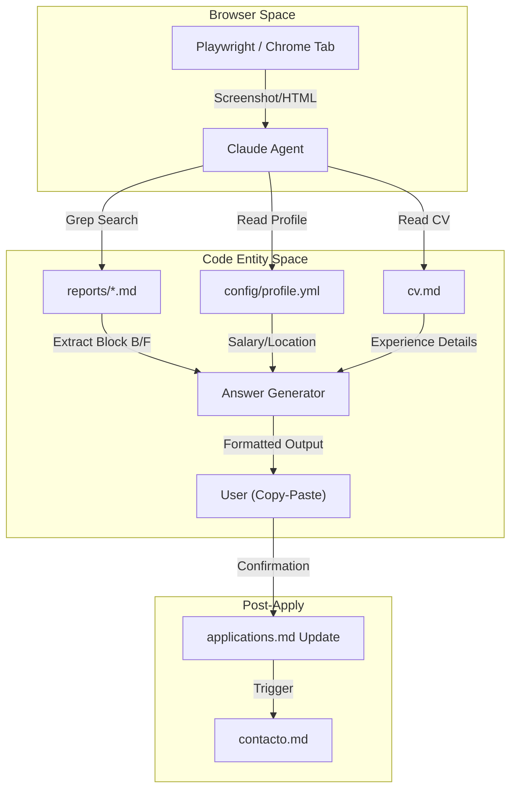
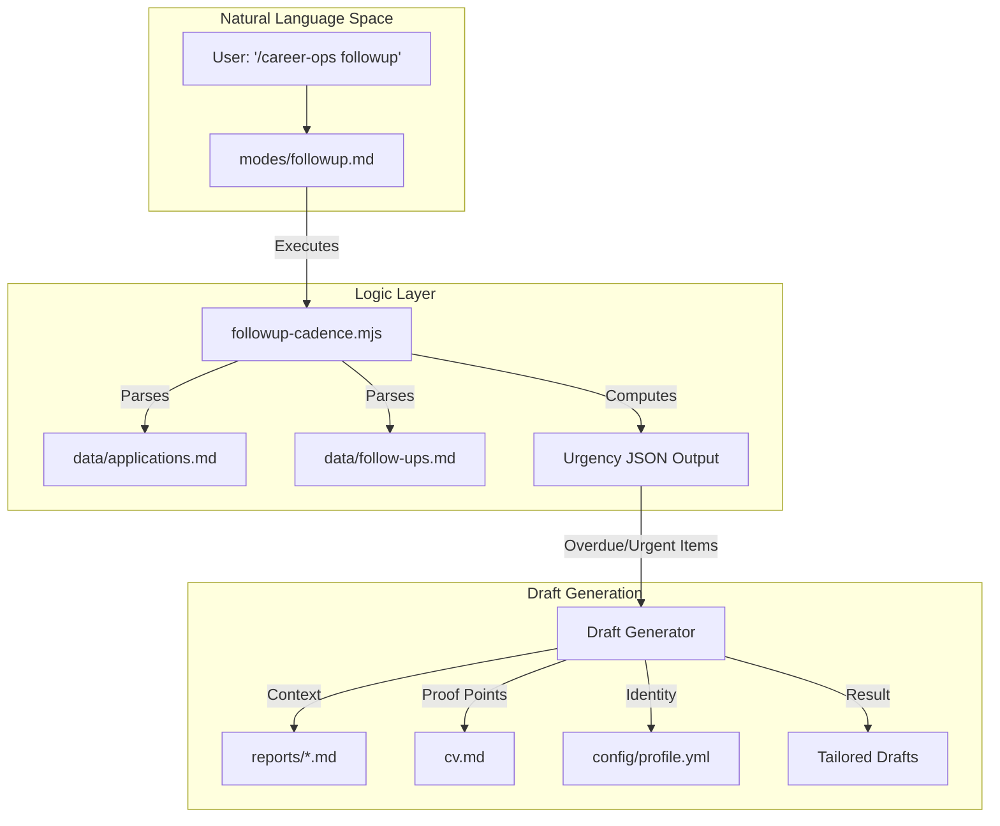

# Application & Outreach Modes (apply, contacto, tracker, followup)

Relevant source files

The following files were used as context for generating this wiki page:

- [.agents/skills/career-ops/SKILL.md](.agents/skills/career-ops/SKILL.md)
- [.claude/skills/career-ops/SKILL.md](.claude/skills/career-ops/SKILL.md)
- [analyze-patterns.mjs](analyze-patterns.mjs)
- [docs/SETUP.md](docs/SETUP.md)
- [followup-cadence.mjs](followup-cadence.mjs)
- [modes/apply.md](modes/apply.md)
- [modes/batch.md](modes/batch.md)
- [modes/contacto.md](modes/contacto.md)
- [modes/followup.md](modes/followup.md)
- [modes/patterns.md](modes/patterns.md)
- [modes/pipeline.md](modes/pipeline.md)
- [modes/tracker.md](modes/tracker.md)

This section covers the interactive and operational modes of Career-Ops that bridge the gap between job evaluation and active job seeking. These modes facilitate filling out complex application forms, generating high-impact LinkedIn outreach messages, managing the application lifecycle, and maintaining a timed follow-up cadence.

## 1. Application Assistant (`apply.md`)

The `apply` mode is an interactive assistant designed to help candidates fill out job application forms in real-time. It leverages the context generated during the evaluation phase (Blocks A-F) to provide personalized, high-quality answers for form fields.

### Workflow and Implementation
The assistant follows a structured pipeline to ensure consistency between the evaluated job description and the actual form being filled.

1.  **Detection**: Claude uses Playwright to read the active Chrome tab (URL, title, and content) or processes a screenshot/text provided by the user [modes/apply.md:12-13](), [modes/apply.md:23-30]().
2.  **Context Matching**: The system extracts the company name and role title to search for existing reports in the `reports/` directory using a case-insensitive grep [modes/apply.md:32-36]().
3.  **Drift Detection**: It compares the role on the screen with the one in the report. If they differ, it prompts the user to either adapt the answers or re-run the full evaluation pipeline [modes/apply.md:40-47]().
4.  **Field Analysis**: It identifies form elements including free-text fields (cover letters), dropdowns (work authorization), Yes/No questions, and salary expectations [modes/apply.md:48-55]().
5.  **Response Generation**: Answers are synthesized using proof points from Block B, STAR stories from Block F, and any existing draft answers in "Section G" of the report [modes/apply.md:61-69]().

### Data Flow: Apply Mode
The following diagram illustrates how `apply.md` interacts with the filesystem and the browser.

**Diagram: Apply Mode Context Integration**

Sources: [modes/apply.md:12-21](), [modes/apply.md:32-39](), [modes/apply.md:61-71]()

---

## 2. LinkedIn Outreach (`contacto.md`)

The `contacto` mode (LinkedIn Power Move) generates ultra-concise, 300-character connection requests. It avoids "corporate-speak" in favor of a "hook-proof-proposal" framework.

### Generation Framework
The mode follows a strict 3-sentence structure to fit within LinkedIn's character limits [modes/contacto.md:47-53]():
*   **Sentence 1 (The Hook)**: A specific observation about the company's challenges or team-specific hooks [modes/contacto.md:25]().
*   **Sentence 2 (The Proof)**: A quantifiable achievement or direct fit criteria from the candidate's CV [modes/contacto.md:21](), [modes/contacto.md:26]().
*   **Sentence 3 (The Proposal/CTA)**: A low-pressure request for a chat or offer to share the CV [modes/contacto.md:22](), [modes/contacto.md:27]().

### Target Identification
The agent uses `WebSearch` to identify specific individuals within the target company [modes/contacto.md:3-7]():
1.  **Hiring Manager**: The person leading the hiring team.
2.  **Recruiter**: Talent acquisition or sourcing professionals.
3.  **Peers**: 2-3 individuals in similar roles for "bottom-up" networking/referrals.
4.  **Interviewer**: Researching specific interviewers for scheduled sessions.

Sources: [modes/contacto.md:1-54]()

---

## 3. Application Tracker (`tracker.md`)

The `tracker` mode provides a CLI-based view and management interface for the `data/applications.md` flat-file database. It allows users to view their pipeline status and manually update application stages.

### Application State Machine
The tracker enforces a canonical set of states to ensure data integrity across the dashboard and evaluation scripts.

| State | Description |
| :--- | :--- |
| `Evaluada` | Initial state after `oferta` or `batch` processing. |
| `Aplicado` | Form submitted to the company. |
| `Respondido` | Inbound contact received from the recruiter/company. |
| `Contacto` | Outbound outreach (LinkedIn) performed. |
| `Entrevista` | Active interview process. |
| `Oferta` | Final offer received. |
| `Rechazada` | Candidate rejected by the company. |
| `Descartada` | Candidate decided not to proceed. |

Sources: [modes/tracker.md:10-14]()

### Data Structure and Statistics
The tracker reads the Markdown table in `data/applications.md` which follows an 8-column schema: `| # | Fecha | Empresa | Rol | Score | Estado | PDF | Report |` [modes/tracker.md:5-8]().

When invoked, the mode calculates real-time statistics including [modes/tracker.md:18-24]():
*   Total application count and breakdown by status.
*   Average match score across the pipeline.
*   Completion percentage for generated PDFs and Reports.

Sources: [modes/tracker.md:1-24]()

---

## 4. Follow-up Cadence (`followup.md`)

The `followup` mode manages the post-application communication cycle. It uses the `followup-cadence.mjs` script to identify overdue interactions and generate tailored drafts.

### Cadence Logic and Urgency
The system calculates urgency based on the application status and time elapsed since the last action [followup-cadence.mjs:32-40]():
*   **Applied**: First follow-up after 7 days, subsequent every 7 days (max 2) [followup-cadence.mjs:157-162]().
*   **Responded**: Urgent reply within 1 day, then every 3 days [followup-cadence.mjs:163-167]().
*   **Interview**: Thank-you note within 1 day, then every 3 days [followup-cadence.mjs:168-171]().

### Implementation and Data Flow
The mode orchestrates several data sources to generate high-context drafts without generic "circling back" language [modes/followup.md:68-71]().

**Diagram: Follow-up Cadence Engine**

### Recording History
Once a user confirms a follow-up has been sent, the agent appends a record to `data/follow-ups.md` [modes/followup.md:126-147](). This file tracks the application number, date, company, channel (Email/LinkedIn), and the specific contact reached [modes/followup.md:131-136]().

Sources: [modes/followup.md:1-174](), [followup-cadence.mjs:1-191]()

---

## 5. Rejection Pattern Analysis (`patterns.md`)

The `patterns` mode uses `analyze-patterns.mjs` to surface actionable insights from past application outcomes, identifying where effort is being wasted and where it is yielding results.

### Analysis Logic
The `analyze-patterns.mjs` script parses `data/applications.md` and all linked reports to extract dimensions such as archetype, seniority, remote policy, and scores [analyze-patterns.mjs:5-12](). It classifies outcomes into positive, negative, self-filtered, or pending [analyze-patterns.mjs:53-60]().

Key features include:
*   **Funnel Analysis**: Tracking conversion rates through each status stage [modes/patterns.md:37]().
*   **Score Thresholds**: Determining the minimum score below which no positive outcomes occur [modes/patterns.md:101-104]().
*   **Blocker Detection**: Identifying recurring reasons for rejection like geo-restrictions or tech stack gaps [modes/patterns.md:88-91]().

### Automated Recommendations
After analysis, the agent can automatically apply recommendations, such as updating `portals.yml` to filter out specific geo-restricted roles or adjusting archetype targeting in `config/profile.yml` [modes/patterns.md:129-144]().

Sources: [modes/patterns.md:1-155](), [analyze-patterns.mjs:1-170]()
