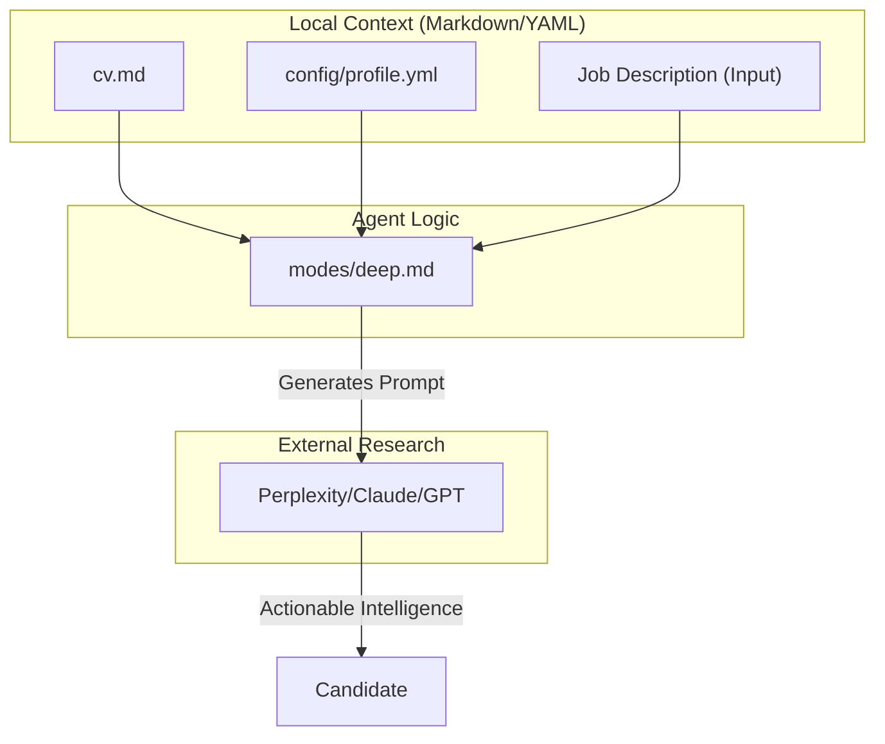
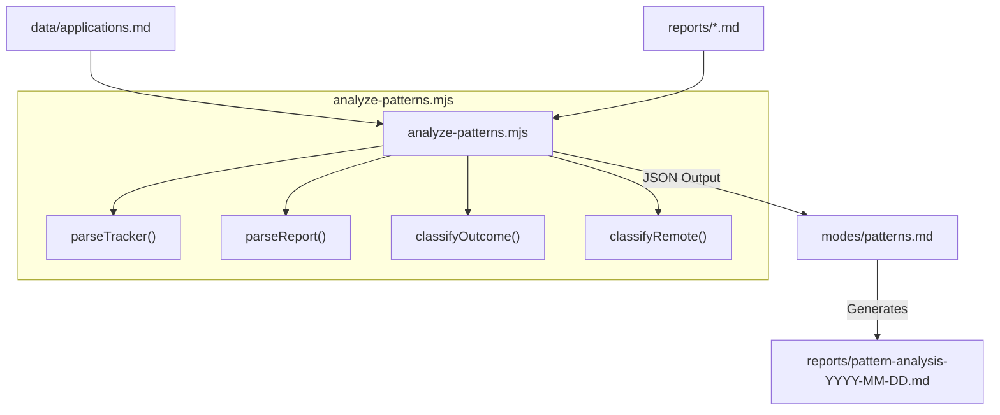
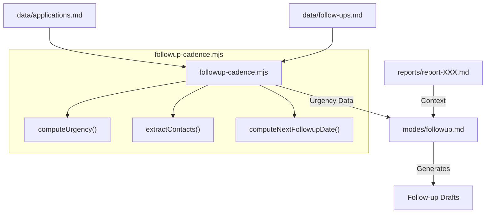

# Career Development Modes (deep, training, project, patterns)

Relevant source files

The following files were used as context for generating this wiki page:

- [.agents/skills/career-ops/SKILL.md](.agents/skills/career-ops/SKILL.md)
- [.claude/skills/career-ops/SKILL.md](.claude/skills/career-ops/SKILL.md)
- [analyze-patterns.mjs](analyze-patterns.mjs)
- [followup-cadence.mjs](followup-cadence.mjs)
- [modes/deep.md](modes/deep.md)
- [modes/followup.md](modes/followup.md)
- [modes/patterns.md](modes/patterns.md)
- [modes/project.md](modes/project.md)
- [modes/training.md](modes/training.md)

This section details the auxiliary career development modes within the `modes/` directory. While the core evaluation modes focus on job offers, these modes assist the candidate in preparing for interviews, evaluating professional development opportunities, scoring side projects, performing high-level meta-analysis of their job search performance, and managing follow-up cadences.

## Overview of Development Modes

The development modes provide a structured framework for long-term career growth and short-term interview success. They leverage the candidate's profile and CV to provide personalized advice and data-driven insights.

| Mode | File | Purpose |
|:---|:---|:---|
| `deep` | [modes/deep.md:1-1]() | Generates a deep research prompt for company intelligence. |
| `training` | [modes/training.md:1-1]() | Evaluates the ROI of courses, certifications, and training. |
| `project` | [modes/project.md:1-1]() | Scores side project ideas based on hiring signal and feasibility. |
| `patterns` | [modes/patterns.md:1-1]() | Analyzes rejection patterns and conversion funnels via `analyze-patterns.mjs`. |
| `followup` | [modes/followup.md:1-1]() | Tracks follow-up cadence and generates tailored drafts via `followup-cadence.mjs`. |

---

## Deep Research Mode (`deep.md`)

The `deep` mode generates a structured, multi-dimensional prompt designed for use with high-reasoning LLMs (Perplexity, Claude, or ChatGPT) to perform company intelligence gathering before an interview [modes/deep.md:22-25]().

### Research Dimensions
The generated prompt covers six critical axes to ensure the candidate is better informed than the average applicant:

1.  **AI Strategy**: Analysis of the company's AI stack, engineering blog, and published research [modes/deep.md:29-33]().
2.  **Recent Movements**: Tracking funding, leadership changes, and product launches from the last 6 months [modes/deep.md:35-39]().
3.  **Engineering Culture**: Technical specifics like deployment cadence, repository structure (mono vs. multi), and remote-work policies [modes/deep.md:41-46]().
4.  **Scaling Challenges**: Identifying potential pain points in reliability, cost, or latency mentioned in reviews [modes/deep.md:48-52]().
5.  **Competitors and Differentiation**: Understanding the company's differentiation and market positioning [modes/deep.md:54-57]().
6.  **Candidate Angle**: Personalized mapping of the candidate's `cv.md` and `profile.yml` to the company's specific needs [modes/deep.md:59-64]().

### Language Resolution
This mode overrides the standard "language of the JD" rule. It resolves output language based on:
1. User prompt language [modes/deep.md:10-12]().
2. `config/profile.yml` locale settings [modes/deep.md:13-14]().
3. JD language as a last resort [modes/deep.md:15-16]().

**Deep Research Prompt Synthesis**

**Sources:** [modes/deep.md:1-68](), [.claude/skills/career-ops/SKILL.md:82-85]()

---

## Training Evaluation Mode (`training.md`)

The `training` mode assesses professional development opportunities. It prevents "tutorial hell" by forcing an evaluation of opportunity cost and recruiter signal [modes/training.md:3-12]().

### Evaluation Dimensions
Every training request is scored across six dimensions:
*   **North Star Alignment**: Does this move the candidate closer to their target role? [modes/training.md:7-7]()
*   **Recruiter Signal**: What is the perceived value to a Hiring Manager? [modes/training.md:8-8]()
*   **Opportunity Cost**: What other activities are being sacrificed? [modes/training.md:10-10]()
*   **Portfolio Deliverable**: Does the course result in a demonstrable artifact? [modes/training.md:12-12]()

### Decision Logic
The agent returns one of three verdicts:
1.  **HACER (DO)**: Includes a 4-12 week plan with weekly deliverables [modes/training.md:16-16]().
2.  **NO HACER (DON'T DO)**: Provides a superior alternative [modes/training.md:17-17]().
3.  **HACER CON TIMEBOX**: A condensed plan focusing only on essentials [modes/training.md:18-18]().

**Sources:** [modes/training.md:1-28]()

---

## Project Portfolio Evaluator (`project.md`)

The `project` mode is a scoring engine for side projects. It uses a weighted multi-criteria decision analysis (MCDA) to determine if a project is worth the engineering effort [modes/project.md:6-15]().

### Scoring Rubric
| Dimension | Weight | Criteria for 5/5 |
|:---|:---|:---|
| Target Role Signal | 25% | Directly demonstrates skills required by target JDs [modes/project.md:10-10]() |
| Uniqueness | 20% | Novel implementation; not a standard "todo" app [modes/project.md:11-11]() |
| Demo-ability | 20% | Can be demonstrated live in under 2 minutes [modes/project.md:12-12]() |
| Metric Potential | 15% | Clear metrics (latency, cost, accuracy) [modes/project.md:13-13]() |
| Time to MVP | 10% | Achievable within 1 week [modes/project.md:14-14]() |
| STAR Story Potential | 10% | Rich in trade-offs and technical decisions [modes/project.md:15-15]() |

### The "Interview Pack" Requirement
For any project approved with a **BUILD** verdict, the system mandates three artifacts:
1.  **One-pager**: Architecture and evaluation plan [modes/project.md:20-20]().
2.  **Demo**: Live URL or 2-minute walkthrough [modes/project.md:21-21]().
3.  **Postmortem**: Analysis of failures and mitigations [modes/project.md:22-22]().

**Sources:** [modes/project.md:1-34]()

---

## Pattern Analysis Mode (`patterns.md`)

The `patterns` mode uses the `analyze-patterns.mjs` script to identify systemic issues in the candidate's application strategy [modes/patterns.md:1-5](). It requires at least 5 tracked applications with outcomes beyond "Evaluated" to run [modes/patterns.md:17-20]().

### Technical Implementation
The analysis logic is encapsulated in `analyze-patterns.mjs`, which parses the application tracker and associated report files [analyze-patterns.mjs:3-7]().

1.  **Data Ingestion**: `parseTracker()` reads `data/applications.md` [analyze-patterns.mjs:62-79]().
2.  **Report Parsing**: `parseReport()` extracts archetype, seniority, remote policy, scores, and tech gaps from Markdown files in `reports/` [analyze-patterns.mjs:82-169]().
3.  **Outcome Classification**: Statuses are normalized and classified into `positive`, `negative`, `self_filtered`, or `pending` [analyze-patterns.mjs:53-59]().
4.  **Bucket Analysis**: Data is grouped by remote policy (e.g., `geo-restricted`, `global remote`) [analyze-patterns.mjs:172-180]() and archetype conversion rates.

**Rejection Pattern Analysis Pipeline**

**Sources:** [modes/patterns.md:1-155](), [analyze-patterns.mjs:1-180]()

---

## Follow-up Cadence Mode (`followup.md`)

The `followup` mode manages post-application communication. It uses `followup-cadence.mjs` to calculate when to contact companies based on status [modes/followup.md:3-5]().

### Cadence Logic
The system applies specific intervals defined in the script [followup-cadence.mjs:33-40]():
*   **Applied**: First follow-up after 7 days, subsequent every 7 days (max 2) [followup-cadence.mjs:177-182]().
*   **Responded**: Initial reply within 1 day, subsequent every 3 days [followup-cadence.mjs:183-186]().
*   **Interview**: Thank-you note within 1 day [followup-cadence.mjs:187-189]().

### Data flow: Follow-up Generation
The agent synthesizes the cadence data with the original job report to create personalized drafts.

**Follow-up Generation Logic**

**Sources:** [modes/followup.md:1-174](), [followup-cadence.mjs:1-205]()
