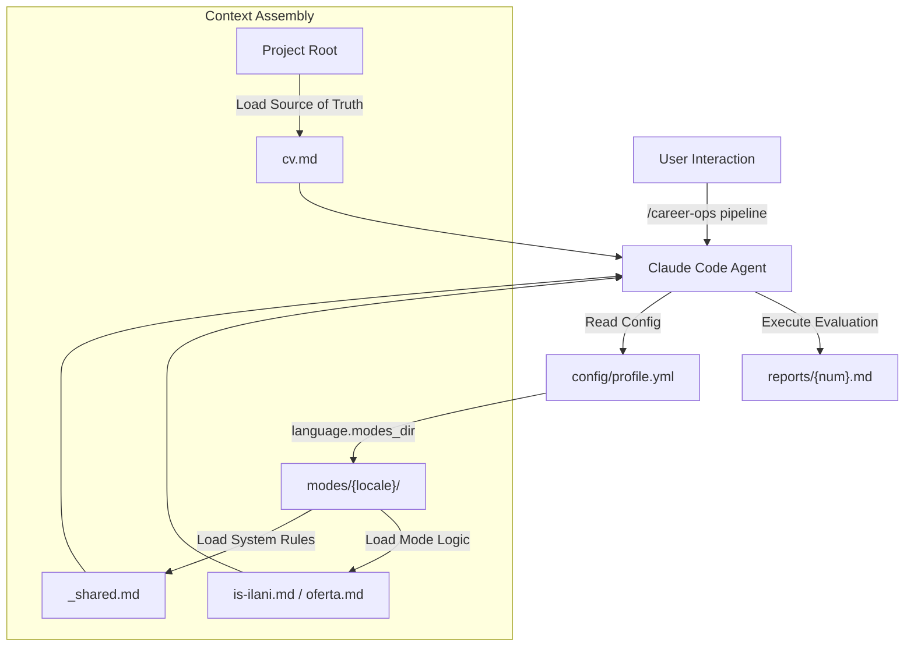
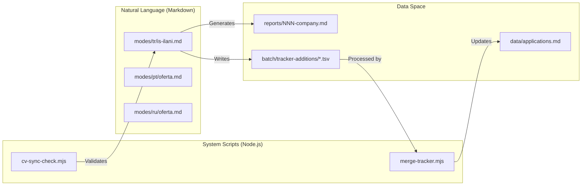

# Internationalization (i18n Modes)

Relevant source files

The following files were used as context for generating this wiki page:

- [AGENTS.md](AGENTS.md)
- [modes/de/README.md](modes/de/README.md)
- [modes/de/_shared.md](modes/de/_shared.md)
- [modes/de/angebot.md](modes/de/angebot.md)
- [modes/de/bewerben.md](modes/de/bewerben.md)
- [modes/de/pipeline.md](modes/de/pipeline.md)
- [modes/fr/README.md](modes/fr/README.md)
- [modes/fr/_shared.md](modes/fr/_shared.md)
- [modes/fr/offre.md](modes/fr/offre.md)
- [modes/fr/pipeline.md](modes/fr/pipeline.md)
- [modes/fr/postuler.md](modes/fr/postuler.md)
- [modes/ja/README.md](modes/ja/README.md)
- [modes/ja/_shared.md](modes/ja/_shared.md)
- [modes/ja/kyujin.md](modes/ja/kyujin.md)
- [modes/ja/oubo.md](modes/ja/oubo.md)
- [modes/ja/pipeline.md](modes/ja/pipeline.md)
- [modes/pt/README.md](modes/pt/README.md)
- [modes/pt/_shared.md](modes/pt/_shared.md)
- [modes/pt/aplicar.md](modes/pt/aplicar.md)
- [modes/pt/oferta.md](modes/pt/oferta.md)
- [modes/pt/pipeline.md](modes/pt/pipeline.md)
- [modes/ru/README.md](modes/ru/README.md)
- [modes/ru/_shared.md](modes/ru/_shared.md)
- [modes/ru/apply.md](modes/ru/apply.md)
- [modes/ru/interview-prep.md](modes/ru/interview-prep.md)
- [modes/ru/oferta.md](modes/ru/oferta.md)
- [modes/ru/pipeline.md](modes/ru/pipeline.md)
- [modes/tr/README.md](modes/tr/README.md)
- [modes/tr/_shared.md](modes/tr/_shared.md)
- [modes/tr/basvuru.md](modes/tr/basvuru.md)
- [modes/tr/is-ilani.md](modes/tr/is-ilani.md)
- [modes/tr/pipeline.md](modes/tr/pipeline.md)

The `career-ops` system provides localized agent behaviors through the `modes/` subdirectories. These internationalization (i18n) modes adapt the core evaluation and application logic to specific regional job markets, legal frameworks, and linguistic conventions. Instead of a simple translation, each locale modifies the **Evaluation (A-G)** and **Application** workflows to account for regional compensation structures (e.g., Turkish SGK, Brazilian CLT vs PJ), employment types, and cultural interviewing norms.

## Implementation Architecture

The i18n system functions as a set of specialized "skills" that the AI agent loads based on user configuration. While core scripts like `merge-tracker.mjs` remain language-agnostic, the prompts that drive the AI's decision-making are swapped for localized versions.

### Localized Mode Mapping

| Locale | Directory | Key Mode File (Evaluation) | Key Mode File (Application) | Market Focus |
| :--- | :--- | :--- | :--- | :--- |
| **Turkish** | `modes/tr/` | `is-ilani.md` | `basvuru.md` | Turkey (Kariyer.net, Yenibiris.com) |
| **Russian** | `modes/ru/` | `oferta.md` | `apply.md` | CIS/RU (hh.ru, Habr) |
| **Japanese** | `modes/ja/` | `kyujin.md` | `oubo.md` | Japan (Wantedly, Green, BizReach) |
| **Portuguese** | `modes/pt/` | `oferta.md` | `aplicar.md` | Brazil (Gupy, Greenhouse BR) |
| **French** | `modes/fr/` | `offre.md` | `postuler.md` | France / Francophone markets |
| **German** | `modes/de/` | `angebot.md` | `bewerben.md` | DACH (Xing, LinkedIn DE) |

Sources: [modes/tr/README.md:42-49](), [modes/pt/README.md:48-55](), [modes/ru/README.md:42-49]()

### System Data Flow: Locale Activation

The system resolves the active mode directory through a hierarchy of configuration. Users can set a permanent locale in `config/profile.yml` or trigger it per session via natural language instructions to the agent.

**Title: Mode Selection and Context Injection**

Sources: [modes/tr/README.md:18-40](), [modes/pt/README.md:18-44](), [AGENTS.md:74-81]()

---

## Market-Specific Adaptations

### 1. Turkish Market (modes/tr/)
The Turkish modes focus on the high-inflation environment and specific labor laws (No. 4857).

*   **Legal Framework**: Includes checks for **SGK** (Social Security), **Kıdem tazminatı** (Severance), and **İhbar süresi** (Notice period) [modes/tr/README.md:53-65]().
*   **Compensation**: Evaluates **TÜFE** (inflation) based salary adjustments, net vs. gross calculations, and "Yemek kartı" (Meal cards like Sodexo/Multinet) [modes/tr/is-ilani.md:56-61]().
*   **Portal Integration**: Optimized for `Kariyer.net` and `Yenibiris.com` using Playwright [modes/tr/pipeline.md:42-46]().

### 2. Russian Market (modes/ru/)
The Russian modes prioritize the distinction between **Gross vs Net** salaries and the specific legal protections of the **Labor Code (TK RF)**.

*   **Compensation Logic**: Automatically calculates net income (`net ≈ gross × 0.87`) and evaluates stability based on contract type (TK RF vs. GPH vs. Self-employed) [modes/ru/_shared.md:114-126]().
*   **Interviewing**: Adapts the STAR+R framework into Russian and includes "Bar-raiser" round preparation for top-tier RU tech firms [modes/ru/_shared.md:89-104]().

### 3. Portuguese/Brazilian Market (modes/pt/)
The Brazilian modes adapt to the "CLT vs PJ" (Formal vs. Contractor) negotiation landscape.

*   **Benefits Evaluation**: Includes mandatory local benefits like **FGTS**, 13th salary, and **PLR** (Profit sharing) in the scoring model [modes/pt/oferta.md:56-62]().
*   **Terminology**: Uses "Português tech" (e.g., using "Pipeline" instead of literal translations) to match local engineering culture [modes/pt/README.md:70-71]().

---

## Technical Configuration & Rules

### The _shared.md Contract
Every locale directory contains a `_shared.md` file. This is a system-level file that the agent **must** read before any evaluation. It defines:
1.  **North Star Archetypes**: Localized definitions of roles (e.g., AI Platform/LLMOps vs. Backend-разработчик) [modes/ru/_shared.md:38-62]().
2.  **Scoring Interpretation**: Market-specific salary quartiles and culture signals [modes/tr/_shared.md:28-44]().
3.  **Posting Legitimacy (Block G)**: Criteria for identifying "Ghost Jobs" based on posting age and technical specificity [modes/tr/_shared.md:45-72]().

### Localized Evaluation Block Structure (A-G)
Regardless of language, the modes maintain the canonical structure to ensure compatibility with the dashboard and `merge-tracker.mjs`.

| Block | Turkish (`is-ilani.md`) | Portuguese (`oferta.md`) | Purpose |
| :--- | :--- | :--- | :--- |
| **A** | Rol Özeti | Resumo da Vaga | Role Summary & Metadata |
| **B** | CV Eşleştirmesi | Match com o Currículo | Skill alignment & gap analysis |
| **C** | Seviye ve Strateji | Nível e Estratégia | Seniority positioning |
| **D** | Maaş ve Piyasa | Remuneração e Demanda | Market rate benchmarking |
| **E** | Kişiselleştirme Planı | Plano de Personalização | CV/LinkedIn update plan |
| **F** | Mülakat Hazırlığı | Plano de Entrevistas | STAR+R story mapping |
| **G** | İlan Meşruiyeti | (Optional/Integrated) | Posting Legitimacy check |

Sources: [modes/tr/is-ilani.md:12-93](), [modes/pt/oferta.md:12-95]()

### Entity Mapping: Mode Files to Logic

**Title: Natural Language Space to Code Entity Mapping**

Sources: [modes/tr/is-ilani.md:100-168](), [modes/pt/oferta.md:100-167]()

## Usage Guidelines for Technical Contributors

1.  **Linguistic Consistency**: Modes use "Natural Technical Language." Commands and tool names (e.g., `Playwright`, `WebSearch`, `WebFetch`) must **never** be translated [modes/tr/README.md:69-76](), [modes/pt/README.md:63-69]().
2.  **TSV Data Integrity**: Even in localized modes, the `merge-tracker.mjs` script expects status values in English (e.g., `Evaluated`, `Applied`, `Interview`) to maintain dashboard compatibility [modes/tr/README.md:73-73](), [modes/pt/README.md:67-67]().
3.  **Evaluation Thresholds**: All modes must respect the ethical threshold. Scores below **3.5/5** are generally recommended against, and scores below **4.0** are considered "not ideal" [modes/tr/_shared.md:39-43](), [modes/pt/_shared.md:39-43]().

Sources: [modes/tr/README.md:1-119](), [modes/pt/README.md:1-112](), [modes/ru/README.md:1-49](), [modes/tr/_shared.md:1-72](), [modes/pt/_shared.md:1-125]()
