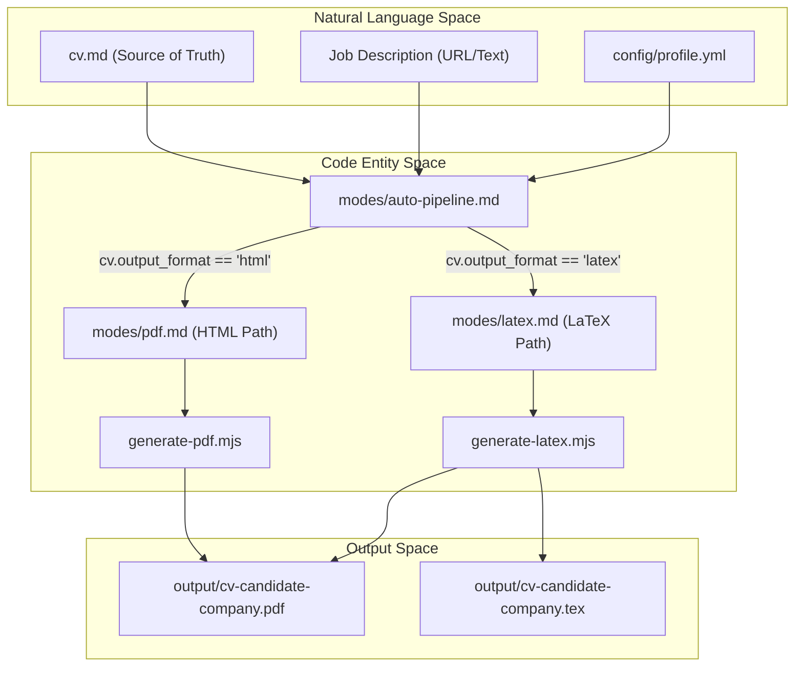
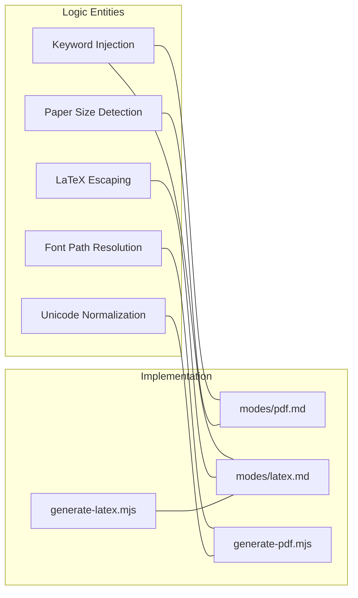

# PDF & LaTeX Generation Engine

Relevant source files

The following files were used as context for generating this wiki page:

- [config/profile.example.yml](config/profile.example.yml)
- [examples/ats-normalization-test.md](examples/ats-normalization-test.md)
- [generate-latex.mjs](generate-latex.mjs)
- [generate-pdf.mjs](generate-pdf.mjs)
- [modes/_shared.md](modes/_shared.md)
- [modes/auto-pipeline.md](modes/auto-pipeline.md)
- [modes/latex.md](modes/latex.md)
- [modes/pdf.md](modes/pdf.md)
- [templates/cv-template.html](templates/cv-template.html)
- [templates/cv-template.tex](templates/cv-template.tex)

The **PDF & LaTeX Generation Engine** is a specialized subsystem designed to transform a Markdown-based CV source of truth into an ATS-optimized, professionally designed document. It supports two primary output paths: a high-fidelity HTML-to-PDF pipeline using headless browser rendering, and a structured LaTeX-to-PDF pipeline for academic or Overleaf-compatible exports.

### System Overview

The engine follows a linear pipeline that begins with the raw `cv.md` and ends with a rendered PDF file. The choice of pipeline is governed by the `cv.output_format` setting in `config/profile.yml` [config/profile.example.yml:70]().

#### Generation Pipeline
1.  **Context Ingestion**: Loads the base `cv.md`, `config/profile.yml`, and the target Job Description (JD) [modes/pdf.md:5-6](), [modes/latex.md:7-9]().
2.  **AI Adaptation**: Extracts 15-20 keywords from the JD and reorders experience bullets based on relevance [modes/pdf.md:7-15](), [modes/latex.md:10-15]().
3.  **Regional Formatting**: Detects company location to set paper size (`letter` for US/Canada, `a4` elsewhere) [modes/pdf.md:9-11]().
4.  **Template Synthesis**: Populates either `templates/cv-template.html` or `templates/cv-template.tex` with personalized content [modes/pdf.md:18-19](), [modes/latex.md:17-18]().
5.  **ATS Normalization**: For HTML, the script cleans Unicode characters (smart quotes, em-dashes) [generate-pdf.mjs:25-33](). For LaTeX, the system enforces machine-readability via `\pdfgentounicode=1` [templates/cv-template.tex:45]().
6.  **Rendering**: Executes `generate-pdf.mjs` (via Playwright) or `generate-latex.mjs` (via Tectonic/pdfLaTeX) to produce the final document [modes/pdf.md:21](), [modes/latex.md:19]().

#### Data Flow: From Source to Output
The following diagram illustrates how natural language CV data is processed by code entities into the final PDF.

**CV Transformation Flow**

Sources: [modes/auto-pipeline.md:30-34](), [modes/pdf.md:1-21](), [modes/latex.md:1-20]()

---

### Core Components

The engine is divided into three main functional areas.

#### CV HTML Template & Fonts
The default system uses a single-column, ATS-optimized layout defined in `templates/cv-template.html` [modes/pdf.md:26](). It utilizes a CSS design system based on **Space Grotesk** for headings and **DM Sans** for body text [templates/cv-template.html:8-42](). The template relies on a placeholder system (e.g., `{{NAME}}`, `{{SUMMARY_TEXT}}`) that the AI agent fills during the adaptation phase [modes/pdf.md:66-93]().

For details, see [CV HTML Template & Fonts](#3.1).

#### generate-pdf.mjs Script
This Node.js utility renders the HTML template into a PDF. It uses `playwright` to launch a headless Chromium instance [generate-pdf.mjs:136](), injects absolute `file://` URLs for self-hosted fonts [generate-pdf.mjs:112-125](), and renders the page with specific print settings such as 0.6in margins [generate-pdf.mjs:153-158](). It includes a `normalizeTextForATS` function to convert problematic Unicode characters into ASCII-safe equivalents [generate-pdf.mjs:34-75]().

For details, see [generate-pdf.mjs Script](#3.2).

#### LaTeX/Overleaf Export
The alternative pipeline uses `templates/cv-template.tex` to generate a professional LaTeX document [modes/latex.md:26](). This path is ideal for users who prefer Overleaf or need a traditional academic format. The `generate-latex.mjs` script validates the generated `.tex` file for required sections like `Education` and `Work Experience` [generate-latex.mjs:21-26]() before compiling it using `tectonic` or `pdflatex` [generate-latex.mjs:133-141]().

For details, see [LaTeX/Overleaf Export](#3.3).

---

### Implementation Details

The engine bridges the gap between AI-generated text and a fixed document format through the following mapping:

**Component Mapping: Logic to Files**

Sources: [modes/pdf.md:7-11](), [modes/latex.md:99-115](), [generate-pdf.mjs:34-75](), [generate-pdf.mjs:112-125]()

#### Technical Specifications
| Feature | HTML Implementation | LaTeX Implementation |
| :--- | :--- | :--- |
| **Rendering Engine** | Playwright (Chromium) [generate-pdf.mjs:13]() | Tectonic / pdfLaTeX [generate-latex.mjs:133]() |
| **Typography** | Space Grotesk & DM Sans [templates/cv-template.html:8-42]() | Standard LaTeX Computer Modern / FontAwesome [templates/cv-template.tex:20]() |
| **ATS Strategy** | Unicode cleanup, Single-column [generate-pdf.mjs:63-74]() | `\pdfgentounicode=1`, Single-column [templates/cv-template.tex:45]() |
| **Paper Formats** | A4 / Letter (CSS-driven) [modes/pdf.md:71]() | A4 / Letter (Class-driven) [templates/cv-template.tex:8]() |
| **Placeholders** | `{{PLACEHOLDER}}` [modes/pdf.md:66]() | `{{PLACEHOLDER}}` [modes/latex.md:26]() |

Sources: [modes/pdf.md:24-43](), [modes/latex.md:123-130](), [generate-pdf.mjs:81-110](), [templates/cv-template.html:8-42](), [templates/cv-template.tex:8-45]()
