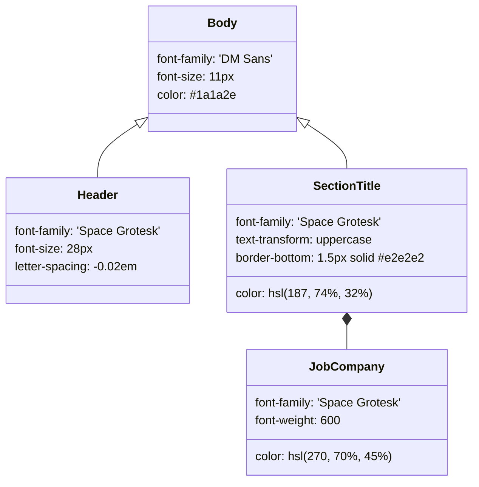

# CV HTML Template & Fonts

<details>
<summary>Relevant source files</summary>

The following files were used as context for generating this wiki page:

- [config/profile.example.yml](config/profile.example.yml)
- [fonts/dm-sans-latin-ext.woff2](fonts/dm-sans-latin-ext.woff2)
- [fonts/dm-sans-latin.woff2](fonts/dm-sans-latin.woff2)
- [fonts/space-grotesk-latin-ext.woff2](fonts/space-grotesk-latin-ext.woff2)
- [fonts/space-grotesk-latin.woff2](fonts/space-grotesk-latin.woff2)
- [modes/_shared.md](modes/_shared.md)
- [modes/auto-pipeline.md](modes/auto-pipeline.md)
- [modes/pdf.md](modes/pdf.md)
- [templates/cv-template.html](templates/cv-template.html)

</details>


The CV generation engine utilizes a highly structured HTML template designed for **ATS (Applicant Tracking System) compatibility** and rapid recruiter scanning. This template acts as the visual layer for the data stored in `cv.md`, transforming Markdown content into a professionally styled, single-column PDF.

## Template Architecture

The template located at `templates/cv-template.html` uses a custom placeholder system. During the PDF generation process, the `generate-pdf.mjs` script (orchestrated by `modes/pdf.md`) performs string replacement or DOM manipulation to inject profile data into these specific slots.

### Placeholder System

The template relies on a set of double-brace placeholders that are replaced during the `pdf` mode execution.

| Placeholder | Description | Implementation Context |
|:---|:---|:---|
| `{{LANG}}` | Sets the HTML `lang` attribute (e.g., `en`, `es`). | [templates/cv-template.html:2](), [modes/pdf.md:70]() |
| `{{PAGE_WIDTH}}` | CSS variable for paper format (`8.5in` for Letter, `210mm` for A4). | [templates/cv-template.html:67](), [modes/pdf.md:71]() |
| `{{NAME}}` | Candidate name from `profile.yml`. | [templates/cv-template.html:6](), [modes/pdf.md:72]() |
| `{{PHONE}}` | Phone number (omitted if empty in `profile.yml`). | [modes/pdf.md:73]() |
| `{{EMAIL}}` | Candidate email from `profile.yml`. | [modes/pdf.md:74]() |
| `{{SUMMARY_TEXT}}` | Custom summary injected with JD keywords and exit narrative. | [templates/cv-template.html:132](), [modes/pdf.md:81]() |
| `{{COMPETENCIES}}` | Flex-grid of `<span class="competency-tag">` elements. | [templates/cv-template.html:144](), [modes/pdf.md:83]() |
| `{{EXPERIENCE}}` | HTML block containing work history with reordered bullets. | [templates/cv-template.html:162](), [modes/pdf.md:85]() |
| `{{PROJECTS}}` | HTML block for top 3-4 relevant projects. | [modes/pdf.md:87]() |

**Sources:** [templates/cv-template.html:1-162](), [modes/pdf.md:64-94](), [config/profile.example.yml:5-13]()

### Layout & Design Strategy
The layout is optimized for the "6-second recruiter scan" by placing high-impact information at the top.

*   **Single Column Layout:** The design strictly avoids sidebars or parallel columns to prevent parsing errors in older ATS software. [modes/pdf.md:26]()
*   **Visual Hierarchy:** Uses `Space Grotesk` (weights 600-700) for headers to provide a modern feel, while `DM Sans` (weights 400-500) handles body text for high readability at 11px. [modes/pdf.md:36-40](), [templates/cv-template.html:56-79]()
*   **Color Scheme:** A professional "Cyan/Purple" scheme is used. Section headers use Cyan (`hsl(187, 74%, 32%)`) while company names use Purple (`hsl(270, 70%, 45%)`). [modes/pdf.md:39-41](), [templates/cv-template.html:124-178]()
*   **Section Ordering:** Optimized as follows: 1. Header, 2. Professional Summary, 3. Core Competencies, 4. Work Experience, 5. Projects, 6. Education, 7. Skills. [modes/pdf.md:45-53]()

### Data Flow: Markdown to Styled HTML

The following diagram illustrates how the system bridges the gap between raw Markdown data and the final rendered HTML structure.

**CV Transformation Map**
```mermaid
graph TD
    subgraph "NaturalLanguageSpace (cv.md & profile.yml)"
        MD_Name["profile.yml: candidate.full_name"]
        MD_Summary["> Summary Block"]
        MD_Exp["## Experience"]
        MD_Keywords["JD Keywords (Extracted)"]
    end

    subgraph "CodeEntitySpace (templates/cv-template.html)"
        H1_Tag["class='header' h1"]
        Summary_Div["class='summary-text'"]
        Job_Section["class='job'"]
        
        MD_Name -->|Injected into {{NAME}}| H1_Tag
        MD_Summary -->|Tailored with Keywords| Summary_Div
        MD_Exp -->|Reordered Bullets| Job_Section
        MD_Keywords -->|Injected into| Summary_Div
    end

    subgraph "CSSDesignTokens"
        SG_Font["'Space Grotesk' (Headings)"]
        DM_Font["'DM Sans' (Body)"]
        Gradient["linear-gradient: hsl 187 to hsl 270"]
    end

    H1_Tag -.-> SG_Font
    Summary_Div -.-> DM_Font
    Job_Section -.-> Gradient
```
**Sources:** [modes/pdf.md:5-22](), [templates/cv-template.html:73-136](), [config/profile.example.yml:5-13]()

---

## Typography & Self-Hosted Fonts

To ensure consistent rendering across different operating systems and CI/CD environments, the project self-hosts its typography in the `fonts/` directory.

### Font Definitions
The template defines `@font-face` rules pointing to local `.woff2` files. This is critical for the `generate-pdf.mjs` script, which renders the PDF via a headless browser using local file paths.

*   **Space Grotesk:** Primary branding font for headers. Includes `latin` and `latin-ext` subsets to support special characters. [templates/cv-template.html:8-24]()
*   **DM Sans:** Primary body font. Includes `latin` and `latin-ext` subsets. [templates/cv-template.html:26-42]()

### Font Assets
| File Path | Purpose | Subset |
|:---|:---|:---|
| `fonts/space-grotesk-latin.woff2` | Headers | Standard Latin |
| `fonts/space-grotesk-latin-ext.woff2` | Headers | Extended Latin |
| `fonts/dm-sans-latin.woff2` | Body Text | Standard Latin |
| `fonts/dm-sans-latin-ext.woff2` | Body Text | Extended Latin |

**Sources:** [fonts/space-grotesk-latin.woff2:1](), [fonts/dm-sans-latin.woff2:1](), [templates/cv-template.html:10-37]()

---

## CSS Implementation Details

The template includes specific CSS logic to handle the nuances of PDF generation and ATS parsing.

### Print Optimization
The template forces `-webkit-print-color-adjust: exact` to ensure that background colors for competency tags and gradients are preserved when the browser renders the PDF. [templates/cv-template.html:51-52]()

### Structural Components
The CSS classes map directly to the semantic sections of a professional CV:

*   `.competency-tag`: Styled with a light cyan background (`hsl(187, 40%, 95%)`) and subtle borders for high-density skill display. [templates/cv-template.html:150-159]()
*   `.job-header`: Uses `display: flex` with `justify-content: space-between` to align the Company/Role on the left and the Date/Location on the right. [templates/cv-template.html:166-172]()
*   `.avoid-break`: Applied to entries to prevent a job description or education entry from being split across two pages (widows/orphans control). [templates/cv-template.html:331-333]()

**Style Entity Relationship**

**Sources:** [templates/cv-template.html:55-129](), [templates/cv-template.html:174-179]()
