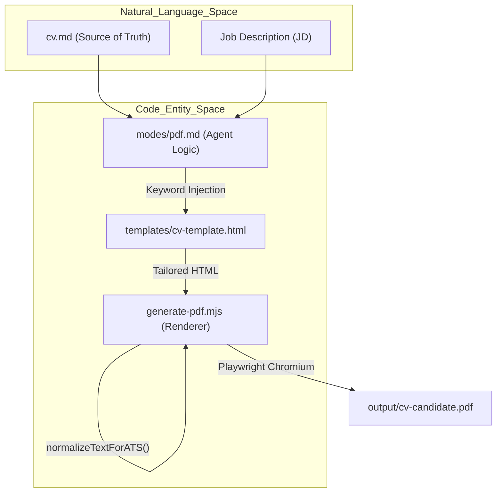
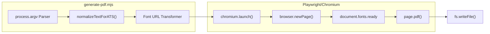

# generate-pdf.mjs Script

<details>
<summary>Relevant source files</summary>

The following files were used as context for generating this wiki page:

- [config/profile.example.yml](config/profile.example.yml)
- [examples/ats-normalization-test.md](examples/ats-normalization-test.md)
- [generate-pdf.mjs](generate-pdf.mjs)
- [modes/_shared.md](modes/_shared.md)
- [modes/auto-pipeline.md](modes/auto-pipeline.md)
- [modes/pdf.md](modes/pdf.md)
- [templates/cv-template.html](templates/cv-template.html)

</details>


The `generate-pdf.mjs` script is a specialized utility within the Career-Ops engine responsible for transforming tailored HTML CVs into ATS-optimized PDF documents. It leverages Playwright and headless Chromium to ensure high-fidelity rendering, precise font embedding, and standardized paper formatting, while implementing critical Unicode normalization for Applicant Tracking Systems (ATS).

## Overview and CLI Usage

The script is designed to be called either manually by the user or automatically by the `pdf` agent mode [modes/pdf.md:21-21](). It accepts positional arguments for input and output paths, along with an optional flag for paper sizing.

**Command Syntax:**
```bash
node generate-pdf.mjs <input.html> <output.pdf> [--format=letter|a4]
```

### Argument Parsing
The script parses `process.argv` to extract the `inputPath`, `outputPath`, and `format` [generate-pdf.mjs:83-91]().
*   **Default Format**: `a4` [generate-pdf.mjs:81-81]().
*   **Validation**: It strictly validates that the format is either `a4` or `letter` [generate-pdf.mjs:102-106]().
*   **Path Resolution**: All paths are resolved to absolute paths using `path.resolve` to ensure consistency during headless rendering [generate-pdf.mjs:98-99]().

**Sources:** [generate-pdf.mjs:78-106]()

## Technical Implementation

### ATS Unicode Normalization
A critical feature of the script is `normalizeTextForATS`, which sanitizes body text to prevent "mojibake" or parsing errors in legacy ATS systems [generate-pdf.mjs:34-75]().
*   **Protection**: It uses a masking technique to preserve CSS, JS, and tag attributes while only modifying visible text [generate-pdf.mjs:38-61]().
*   **Replacements**: Converts em-dashes (`\u2014`) and en-dashes (`\u2013`) to standard hyphens, "smart" quotes to straight quotes, and removes zero-width characters [generate-pdf.mjs:66-72]().
*   **Logging**: The script logs a breakdown of all replacements made (e.g., `nbsp=5, smart-double-quote=2`) [generate-pdf.mjs:131-134]().

### Font Path Resolution (file:// URLs)
Because the PDF is rendered in a headless browser context without a traditional web server, relative CSS paths for fonts (e.g., `./fonts/font.woff2`) fail to resolve. The script implements a pre-processing step that:
1.  Reads the HTML source [generate-pdf.mjs:113-113]().
2.  Resolves the `fonts/` directory relative to the script location [generate-pdf.mjs:116-116]().
3.  Replaces relative paths with absolute `file://` URLs [generate-pdf.mjs:117-125]().

### Playwright Rendering Pipeline
The script uses the following sequence to ensure the PDF is rendered only after all assets are fully loaded:
1.  **Launch**: Starts a headless Chromium instance [generate-pdf.mjs:136-136]().
2.  **Content Injection**: Sets the page content using the processed HTML and defines a `baseURL` to handle any other relative resources [generate-pdf.mjs:141-144]().
3.  **Network Idle**: Waits for the `networkidle` state [generate-pdf.mjs:142-142]().
4.  **Font Readiness**: Executes a browser-side check using `document.fonts.ready` to confirm typography is correctly applied [generate-pdf.mjs:147-147]().

**Sources:** [generate-pdf.mjs:34-147]()

## Data Flow: HTML to PDF

The following diagram illustrates the transformation from the raw Markdown source of truth to the final PDF binary.

### CV Generation Logic Flow

**Sources:** [modes/pdf.md:3-21](), [generate-pdf.mjs:34-75](), [templates/cv-template.html:1-7]()

## Advanced Features

### Paper Format Detection
The system automatically detects the appropriate paper format based on the location of the hiring company. If the company is based in the US or Canada, it defaults to `letter`; otherwise, it uses `a4` [modes/pdf.md:9-11]().

### Page Count Estimation
The script provides a post-generation report including the approximate page count. It parses the PDF binary structure using a regular expression to count `/Type /Page` objects [generate-pdf.mjs:167-168]().

### System Component Interaction
This diagram maps the CLI script to the internal browser entities it manages.


**Sources:** [generate-pdf.mjs:78-177]()

## Integration with Batch Pipeline
The script is a downstream consumer in the `auto-pipeline` and `batch-runner.sh` workflows. When `cv.output_format` is set to `html` (the default), the pipeline triggers the PDF generation after the AI agent has finished tailoring the HTML content [modes/auto-pipeline.md:29-33]().

## Technical Specifications Table

| Feature | Implementation Detail |
| :--- | :--- |
| **Engine** | Playwright (Chromium Headless) [generate-pdf.mjs:13-13]() |
| **ATS Normalization** | Converts em-dashes, smart quotes, non-breaking spaces [generate-pdf.mjs:66-72]() |
| **Typography** | Space Grotesk (Headings), DM Sans (Body) [templates/cv-template.html:8-42]() |
| **ATS Layout** | Single-column, standard headers, no text in SVGs [modes/pdf.md:26-31]() |
| **Margins** | Fixed at 0.6 inches [generate-pdf.mjs:153-158]() |
| **File Handling** | Absolute `file://` resolution for fonts [generate-pdf.mjs:117-120]() |

**Sources:** [generate-pdf.mjs:1-178](), [modes/pdf.md:1-62](), [templates/cv-template.html:1-130](), [modes/auto-pipeline.md:29-33]()
