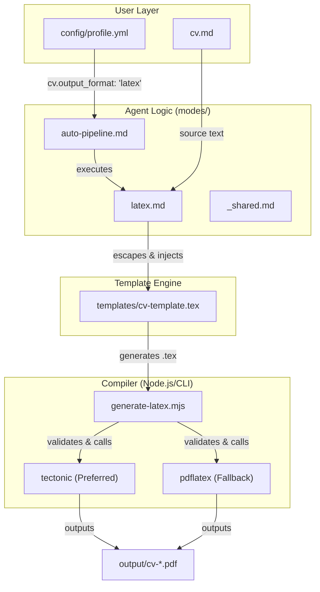

# LaTeX/Overleaf Export

Relevant source files

The following files were used as context for generating this wiki page:

- [config/profile.example.yml](config/profile.example.yml)
- [generate-latex.mjs](generate-latex.mjs)
- [modes/_shared.md](modes/_shared.md)
- [modes/auto-pipeline.md](modes/auto-pipeline.md)
- [modes/latex.md](modes/latex.md)
- [modes/pdf.md](modes/pdf.md)
- [templates/cv-template.html](templates/cv-template.html)
- [templates/cv-template.tex](templates/cv-template.tex)

The LaTeX/Overleaf export path provides a high-fidelity, professional alternative to the standard HTML-to-PDF workflow. It is designed for candidates who require a traditional academic or high-end engineering CV format that is 100% compatible with Overleaf and optimized for ATS (Applicant Tracking Systems) through native Unicode mapping.

### Pipeline Overview

The LaTeX export process is orchestrated via `modes/latex.md` [modes/latex.md:1-22](). It follows a structured sequence that mirrors the `pdf` mode but targets `.tex` source generation and specialized LaTeX compilation.

1.  **Context Gathering**: Reads `cv.md` (Source of Truth) and `config/profile.yml` (Identity) [modes/latex.md:7-8]().
2.  **JD Analysis**: Extracts 15-20 keywords and detects the role archetype [modes/latex.md:10-12]().
3.  **Tailored Generation**: Rewrites the Professional Summary and reorders experience bullets/projects based on JD relevance [modes/latex.md:13-16]().
4.  **Templating**: Injects the processed content into `templates/cv-template.tex` using a specific placeholder system [modes/latex.md:17]().
5.  **Validation & Compilation**: Executes `generate-latex.mjs` to verify the structure and compile the PDF using `tectonic` or `pdflatex` [modes/latex.md:19]().

### Data Flow: From Markdown to LaTeX

The following diagram illustrates how the system routes data through the LaTeX workflow based on user configuration.

**LaTeX Export System Topology**

**Sources:** [modes/auto-pipeline.md:30-33](), [modes/latex.md:1-22](), [generate-latex.mjs:133-141]()

### The Template Placeholder System

The file `templates/cv-template.tex` uses double-brace placeholders. The agent is responsible for performing the substitution while ensuring all content is properly escaped for LaTeX syntax.

| Placeholder | Description | Source Mapping |
| :--- | :--- | :--- |
| `{{NAME}}` | Full Candidate Name | `profile.yml` → `candidate.full_name` |
| `{{CONTACT_LINE}}` | Phone, Location, and Visa status | Concatenated from `profile.yml` |
| `{{EMAIL_URL}}` | Raw email for `mailto:` link | `profile.yml` → `candidate.email` |
| `{{EMAIL_DISPLAY}}` | Escaped email for text display | `profile.yml` → `candidate.email` (escaped) |
| `{{EXPERIENCE}}` | List of `\resumeSubheading` blocks | `cv.md` Work Experience |
| `{{PROJECTS}}` | List of `\resumeProjectHeading` blocks | `cv.md` Projects (Top 3-4) |
| `{{SKILLS}}` | Formatted `\textbf{Category}` lines | `cv.md` Technical Skills |

**Sources:** [modes/latex.md:24-41](), [templates/cv-template.tex:83-119]()

### LaTeX Content Generation Rules

The agent transforms Markdown sections into specific LaTeX environments defined in the template [templates/cv-template.tex:48-78]().

#### Experience and Projects
Each work experience entry is wrapped in a `\resumeSubheading` which takes four arguments: Company, Date Range, Role Title, and Location [modes/latex.md:67-75](). Within each subheading, bullets are generated as `\resumeItem` entries [templates/cv-template.tex:48-52]().

#### Critical Escaping Rules
To prevent compilation errors, the agent must escape special LaTeX characters in user-provided text before substitution [modes/latex.md:97-115]():
*   `&` → `\&`
*   `_` → `\_`
*   `$` → `\$`
*   `%` → `\%`
*   `±` → `$\pm$`

**Exception**: URLs inside `\href{URL}{...}` must remain raw in the first argument, while the second argument (display text) must be escaped [modes/latex.md:118-121]().

### Compilation & Validation: `generate-latex.mjs`

The `generate-latex.mjs` script acts as a safeguard and compiler wrapper.

**Validation Logic**:
Before attempting compilation, the script checks for [generate-latex.mjs:21-32]():
*   **Required Sections**: Presence of Education, Work Experience, Personal Projects, and Technical Skills.
*   **Required Commands**: Use of `\resumeSubheading`, `\resumeItem`, and `\resumeProjectHeading`.
*   **Unresolved Placeholders**: Detects any remaining `{{PLACEHOLDER}}` strings [generate-latex.mjs:75-79]().
*   **ATS Compatibility**: Ensures `\pdfgentounicode=1` is present for machine readability [generate-latex.mjs:93-96]().

**Engine Selection**:
The script detects available engines on the system `PATH` in the following order [generate-latex.mjs:133-141]():
1.  **Tectonic**: Preferred as it automatically manages LaTeX packages. When using Tectonic, the script strips `pdflatex`-specific primitives (like `\pdfgentounicode`) that cause crashes in the XeTeX-based Tectonic engine [generate-latex.mjs:154-160]().
2.  **pdflatex**: Standard fallback found in TeX Live or MiKTeX.

**Compiler Execution Flow**

```mermaid
graph TD
    START["generate-latex.mjs <input.tex>"] --> READ["Read .tex File"]
    READ --> VALIDATE{"Validate Structure"}
    VALIDATE -- "Fail" --> EXIT_ERR["Exit with JSON Issues Report"]
    VALIDATE -- "Pass" --> DETECT_ENG{"Detect Engine"}
    
    DETECT_ENG -- "tectonic found" --> PATCH["Patch .tex (Remove pdf-primitives)"]
    PATCH --> RUN_TECTONIC["execFileSync('tectonic', ...)"]
    
    DETECT_ENG -- "pdflatex found" --> RUN_PDFLATEX["execFileSync('pdflatex', ...) x2"]
    
    RUN_TECTONIC --> SUCCESS{"Check PDF Created"}
    RUN_PDFLATEX --> SUCCESS
    
    SUCCESS -- "Yes" --> CLEANUP["Remove .aux, .log, .out"]
    CLEANUP --> EXIT_OK["Report .pdf path & size"]
    SUCCESS -- "No" --> EXIT_COMPILE_ERR["Report LaTeX Error Log"]
```

**Sources:** [generate-latex.mjs:121-201](), [generate-latex.mjs:222-225]()

### Overleaf Compatibility
The template is designed to be "zero-config" for Overleaf. It utilizes standard CTAN packages such as `titlesec`, `hyperref`, and `fontawesome5` [modes/latex.md:142-145](). The generated `.tex` file can be uploaded directly to an Overleaf project and compiled without requiring additional `.cls` or `.sty` files [modes/latex.md:147]().

**Sources:** [modes/latex.md:140-148](), [templates/cv-template.tex:9-21]()
