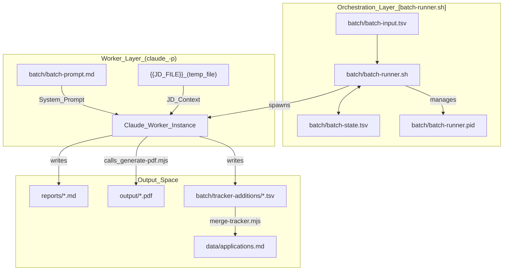
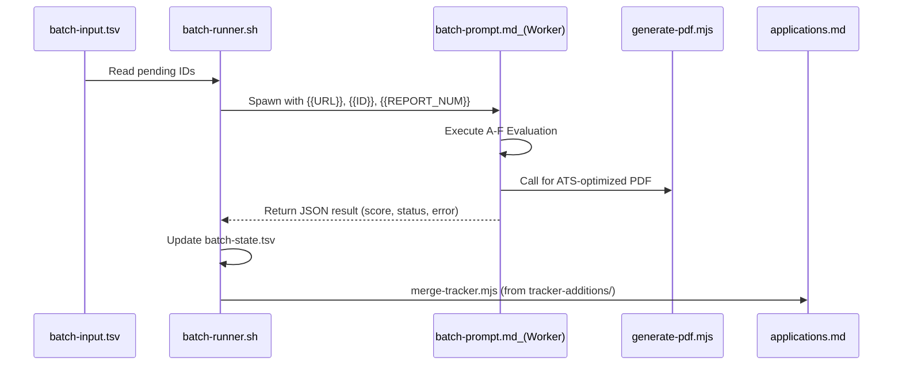

# Batch Processing System

Relevant source files

The following files were used as context for generating this wiki page:

- [LICENSE](LICENSE)
- [batch/batch-prompt.md](batch/batch-prompt.md)
- [batch/batch-runner.sh](batch/batch-runner.sh)
- [batch/tracker-additions/.gitkeep](batch/tracker-additions/.gitkeep)
- [cv-sync-check.mjs](cv-sync-check.mjs)
- [docs/ARCHITECTURE.md](docs/ARCHITECTURE.md)
- [docs/SETUP.md](docs/SETUP.md)
- [modes/apply.md](modes/apply.md)
- [modes/batch.md](modes/batch.md)
- [modes/pipeline.md](modes/pipeline.md)
- [modes/tracker.md](modes/tracker.md)

The **Batch Processing System** is a high-volume evaluation subsystem designed to process job offers in parallel. It automates the transition from a raw URL or Job Description (JD) to a complete professional evaluation, including a generated PDF CV and a structured entry in the application tracker.

This system is designed for "burst" processing where a candidate identifies dozens of potential roles and needs a rapid, high-quality assessment of each without manual intervention for every step.

## System Architecture

The batch system follows an **Orchestrator/Worker** pattern. The orchestrator manages the state, concurrency, and error recovery, while independent workers (powered by Claude) perform the actual analysis and file generation.

### High-Level Flow
1.  **Input**: A list of URLs or JDs is provided via `batch/batch-input.tsv` [batch/batch-runner.sh:16]().
2.  **Orchestration**: The system determines which offers are pending by checking `batch/batch-state.tsv` [batch/batch-runner.sh:17]().
3.  **Execution**: Workers are spawned (sequentially or in parallel) to process each offer using `claude -p` with the `batch-prompt.md` template [batch/batch-runner.sh:40-46]().
4.  **Output**: Each worker generates a Markdown report in `reports/`, a customized PDF via `generate-pdf.mjs`, and a tracker TSV line in `batch/tracker-additions/` [batch/batch-prompt.md:5-7]().
5.  **Completion**: Results are merged into the main `data/applications.md` tracker [batch/batch-runner.sh:22]().

### Code Entity Map: Architecture
The following diagram maps the logical components of the batch system to their physical file entities and data structures.

**Batch System Entity Mapping**

Sources: [batch/batch-runner.sh:13-25](), [batch/batch-prompt.md:1-10](), [batch/batch-prompt.md:46-56](), [modes/batch.md:26-34]()

---

## Operational Modes

The batch system can be triggered in two distinct ways depending on the source of the job offers.

### 1. Conductor --chrome Mode
In this mode, the system uses a headed browser to navigate portals in real-time, extracting JDs directly from the DOM [modes/batch.md:36-40]().
*   **Extraction**: Navigates to portal search results and populates `batch-input.tsv` [modes/batch.md:40]().
*   **Orchestration**: For each pending URL, it extracts the JD text to a temporary file and executes a headless worker [modes/batch.md:41-50]().
*   **Post-Process**: Automatically merges additions into the main tracker upon completion [modes/batch.md:56]().

### 2. Standalone Orchestrator (`batch-runner.sh`)
This is a headless Bash-based orchestrator used for bulk processing of URLs or JDs already collected in `batch-input.tsv` [batch/batch-runner.sh:4-6]().
*   **Parallelism**: Can run $N$ workers simultaneously using the `--parallel` flag [batch/batch-runner.sh:46]().
*   **Resumability**: Uses `batch-state.tsv` to skip completed IDs and can retry failed ones via `--retry-failed` [batch/batch-runner.sh:48]().
*   **Locking**: Implements a PID-based lock to prevent double execution [batch/batch-runner.sh:95-109]().

Sources: [modes/batch.md:36-62](), [batch/batch-runner.sh:38-77]()

---

## Core Components

### [batch-runner.sh Orchestrator](#4.1)
The primary Bash script responsible for the lifecycle of a batch job. It handles prerequisite validation (checking for `claude` CLI), state management with directory-based locking mechanisms to handle concurrency, and the final merging of data [batch/batch-runner.sh:121-160](). It ensures that every worker receives the correct `{{REPORT_NUM}}` and `{{ID}}` to maintain global consistency [batch/batch-runner.sh:235-250]().

For details, see [batch-runner.sh Orchestrator](#4.1).

### [batch-prompt.md Worker Template](#4.2)
A self-contained system prompt that transforms a standard Claude instance into a specialized career-ops worker [batch/batch-prompt.md:1-9](). It contains the logic for the 6-step evaluation pipeline (A-F), instructions for archetype detection, and the schema for the JSON output that the orchestrator parses to update the state [batch/batch-prompt.md:60-150]().

For details, see [batch-prompt.md Worker Template](#4.2).

---

## Data Flow & State Management

The system relies on Tab-Separated Values (TSV) files to maintain a robust, human-readable state that survives process crashes.

| File | Purpose | Key Columns |
| :--- | :--- | :--- |
| `batch-input.tsv` | Queue of work | `id`, `url`, `source`, `notes` [batch/batch-runner.sh:58]() |
| `batch-state.tsv` | Execution history | `status`, `started_at`, `score`, `error`, `retries` [batch/batch-runner.sh:143]() |
| `tracker-additions/` | Individual results | Individual TSV lines for `merge-tracker.mjs` [batch/batch-runner.sh:20]() |

### Code Entity Map: Data Lifecycle
This diagram illustrates how data transitions from raw input to the final application tracker.

**Batch Data Lifecycle**

Sources: [batch/batch-runner.sh:140-145](), [batch/batch-prompt.md:46-56](), [batch/batch-prompt.md:58-150](), [modes/batch.md:88-95]()
