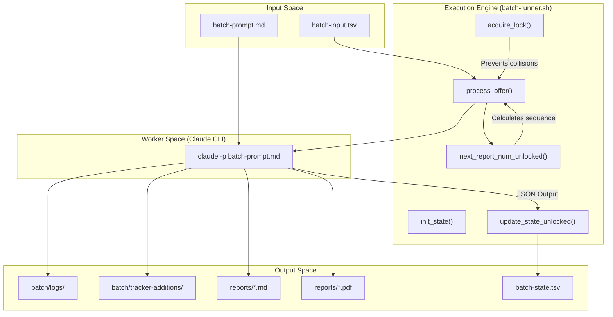
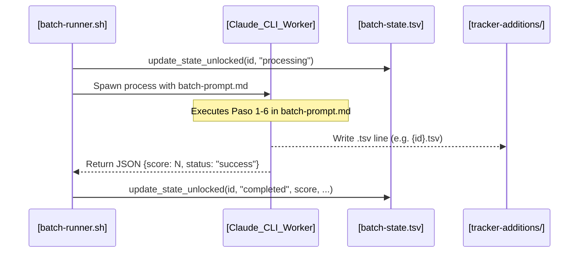

# batch-runner.sh Orchestrator

Relevant source files

The following files were used as context for generating this wiki page:

- [LICENSE](LICENSE)
- [batch/batch-prompt.md](batch/batch-prompt.md)
- [batch/batch-runner.sh](batch/batch-runner.sh)
- [batch/tracker-additions/.gitkeep](batch/tracker-additions/.gitkeep)
- [cv-sync-check.mjs](cv-sync-check.mjs)
- [docs/ARCHITECTURE.md](docs/ARCHITECTURE.md)

The `batch-runner.sh` script is the central orchestrator for high-volume, automated job evaluations. It manages a fleet of `claude -p` workers, providing a robust execution layer that handles parallelization, state persistence, and automatic recovery from failures. It transforms a list of job URLs into a structured set of evaluations, PDF reports, and tracker entries without manual intervention.

### Core Architecture and Data Flow

The orchestrator operates as a state machine, reading from an input queue and maintaining a persistent state file to ensure idempotency and resumability. It uses a dual-lock mechanism: a global process lock and a fine-grained state lock for thread-safe updates during parallel execution.

#### System Components Interaction
The following diagram illustrates how `batch-runner.sh` coordinates between input files, the Claude CLI, and the final data destinations.

**Orchestrator Logic Flow**

**Sources:** [batch/batch-runner.sh:13-23](), [batch/batch-runner.sh:95-109](), [batch/batch-runner.sh:235-250](), [batch/batch-runner.sh:314-411]()

---

### CLI Flags and Configuration

The orchestrator supports several flags to control the execution environment and recovery behavior:

| Flag | Default | Description |
| :--- | :--- | :--- |
| `--parallel N` | `1` | Number of concurrent `claude` worker processes. [batch/batch-runner.sh:30]() |
| `--dry-run` | `false` | Lists pending offers without initiating Claude workers. [batch/batch-runner.sh:31]() |
| `--retry-failed` | `false` | Filters the queue to only process IDs marked as `failed` in `batch-state.tsv`. [batch/batch-runner.sh:32]() |
| `--start-from N` | `0` | Skips all IDs numerically lower than `N`. [batch/batch-runner.sh:33]() |
| `--max-retries N` | `2` | Maximum number of attempts allowed for a single ID before permanent failure. [batch/batch-runner.sh:34]() |
| `--min-score N` | `0` | Skip PDF generation and tracker addition for offers scoring below `N`. [batch/batch-runner.sh:35]() |
| `--model NAME` | `""` | Passes a specific model name to `claude -p --model`. [batch/batch-runner.sh:36]() |

**Sources:** [batch/batch-runner.sh:29-36](), [batch/batch-runner.sh:79-92]()

---

### State Management and Resumability

The system uses two primary TSV (Tab-Separated Values) files to manage the lifecycle of a batch.

#### 1. batch-input.tsv
The source of truth for the work queue.
*   **Format:** `id	url	source	notes` [batch/batch-runner.sh:58]()
*   The `id` is a unique numeric identifier used to track progress.

#### 2. batch-state.tsv
The persistence layer managed by `update_state_unlocked()`. This file allows the script to be interrupted and resumed without duplicating work.
*   **Columns:** `id`, `url`, `status`, `started_at`, `completed_at`, `report_num`, `score`, `error`, `retries`. [batch/batch-runner.sh:143]()
*   **Statuses:** `none`, `processing`, `completed`, `failed`. [batch/batch-runner.sh:210-219]()

#### Lock Mechanisms
To prevent race conditions, `batch-runner.sh` implements two tiers of locking:
1.  **Process Lock (`acquire_lock`)**: Uses `batch-runner.pid` to prevent multiple orchestrator instances from running simultaneously. [batch/batch-runner.sh:95-109]()
2.  **State Lock (`acquire_state_lock`)**: Uses a directory-based lock (`.batch-state.lock/`) to synchronize access to `batch-state.tsv` across parallel workers. It includes a 30-second timeout and stale PID recovery. [batch/batch-runner.sh:147-188]()

**Sources:** [batch/batch-runner.sh:16-27](), [batch/batch-runner.sh:95-116](), [batch/batch-runner.sh:141-193]()

---

### Worker Execution and Parallelization

The orchestrator uses `process_offer()` to prepare the environment and `run_worker()` to manage the lifecycle of each Claude process.

#### Sequence Generation
Before launching a worker, the script calculates the `next_report_num_unlocked()`. It scans both the `reports/` directory and the `batch-state.tsv` file to find the highest existing number and increments it (e.g., `042`). This ensures that even if a report hasn't been written to disk yet, its ID is reserved in the state file. [batch/batch-runner.sh:235-250]()

#### Worker Invocation
Each worker is an instance of the Claude CLI. The orchestrator passes instructions via `batch-prompt.md` with placeholders like `{{URL}}`, `{{REPORT_NUM}}`, `{{DATE}}`, and `{{ID}}`. [batch/batch-prompt.md:46-54]()

**Sources:** [batch/batch-runner.sh:314-411](), [batch/batch-prompt.md:46-56]()

#### Data Flow: Worker to Orchestrator
The following diagram shows how the orchestrator captures the worker's output to update the global state.

**Worker-Orchestrator Handshake**

**Sources:** [batch/batch-runner.sh:253-311](), [batch/batch-runner.sh:314-411](), [batch/batch-prompt.md:58-140]()

---

### Post-Processing and Integration

Once the batch finishes, the orchestrator performs automatic merging and verification:

1.  **Logs**: Standard output and error from each worker are redirected to `batch/logs/{report_num}-{id}.log`. [batch/batch-runner.sh:354]()
2.  **Tracker Integration**: After all workers complete, the orchestrator calls `merge-tracker.mjs` to ingest TSV fragments from `batch/tracker-additions/` into the main `data/applications.md`. [batch/batch-runner.sh:498-502]()
3.  **Integrity Check**: It finally runs `verify-pipeline.mjs` to ensure the application database remains consistent. [batch/batch-runner.sh:505-509]()
4.  **Automatic Resumption**: Because `get_status()` checks `batch-state.tsv` before processing, the script can be safely restarted. It will skip `completed` items and only target `none` or `failed` (if `--retry-failed` is active). [batch/batch-runner.sh:210-219](), [batch/batch-runner.sh:455-465]()

**Sources:** [batch/batch-runner.sh:494-515](), [docs/ARCHITECTURE.md:54-71](), [docs/ARCHITECTURE.md:91-101]()
