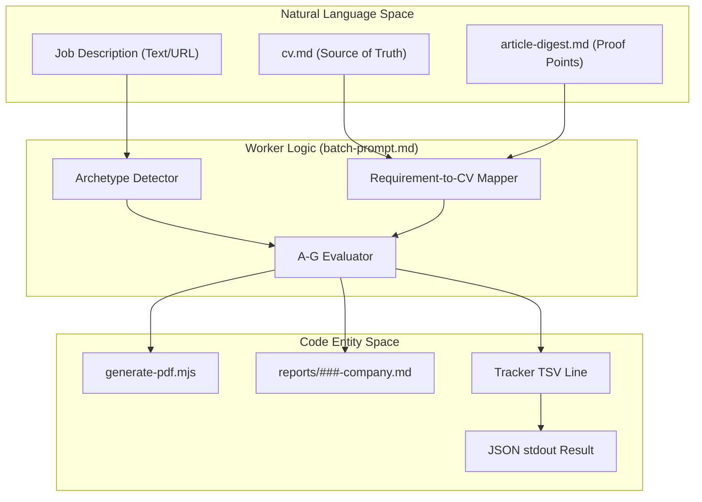
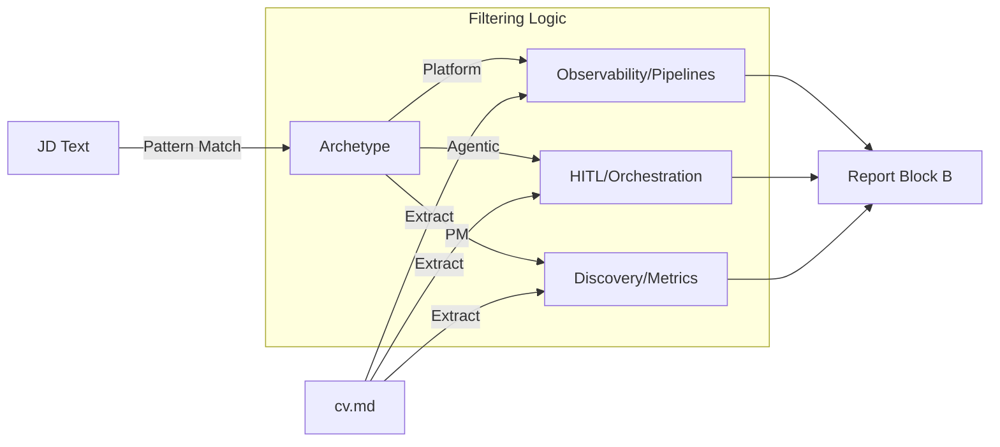

# batch-prompt.md Worker Template

<details>
<summary>Relevant source files</summary>

The following files were used as context for generating this wiki page:

- [LICENSE](LICENSE)
- [batch/batch-prompt.md](batch/batch-prompt.md)
- [batch/batch-runner.sh](batch/batch-runner.sh)
- [batch/tracker-additions/.gitkeep](batch/tracker-additions/.gitkeep)
- [cv-sync-check.mjs](cv-sync-check.mjs)
- [docs/ARCHITECTURE.md](docs/ARCHITECTURE.md)

</details>


The `batch-prompt.md` file is a self-contained, high-density instruction set used by the `claude -p` worker instances during batch processing. It defines the logic for transforming a raw Job Description (JD) into a comprehensive evaluation report, a tailored CV, and a structured data entry for the application tracker.

## Purpose and Scope

In the `career-ops` architecture, the orchestrator (`batch-runner.sh`) spawns multiple worker processes. Each worker is initialized with `batch-prompt.md` as its system prompt [batch/batch-runner.sh:18](). This template is designed to be "zero-dependency" from the perspective of Claude's internal state—it contains all the rules, archetypes, and pipeline steps necessary to complete an evaluation without requiring external tool calls to other Markdown skills [batch/batch-prompt.md:9-10]().

## Placeholder Substitution

Before a worker begins execution, the orchestrator performs string substitution on specific placeholders within the template to provide context for the specific job being processed.

| Placeholder | Description | Source in Orchestrator |
|-------------|-------------|------------------------|
| `{{URL}}` | The original job posting URL | `batch-input.tsv` |
| `{{JD_FILE}}` | Path to the local text file containing the scraped JD | `batch/jobs/*.txt` |
| `{{REPORT_NUM}}` | 3-digit zero-padded sequence number (e.g., `042`) | `next_report_num_unlocked` |
| `{{DATE}}` | Current date in `YYYY-MM-DD` format | `date +%Y-%m-%d` |
| `{{ID}}` | Unique identifier for the batch row | `batch-input.tsv` |

Sources: [batch/batch-prompt.md:46-55](), [batch/batch-runner.sh:235-245]()

## The 6-Step Evaluation Pipeline

The worker follows a rigid sequential pipeline to ensure consistency across hundreds of evaluations [batch/batch-prompt.md:58-66]().

### 1. JD Ingestion
The worker reads the content of `{{JD_FILE}}`. If the file is missing or empty, it attempts a fallback to `WebFetch` using `{{URL}}` to fetch the content live [batch/batch-prompt.md:60-64]().

### 2. Archetype Detection
The system classifies the role into one of six canonical archetypes [batch/batch-prompt.md:70-83](). This classification dictates which "proof points" from the candidate's history are prioritized [batch/batch-prompt.md:89-96]().

*   **AI Platform / LLMOps**: Focus on production, observability, and pipelines.
*   **Agentic Workflows**: Focus on orchestration, HITL (Human-in-the-loop), and reliability.
*   **Technical AI PM**: Focus on discovery, PRDs, and business-to-tech translation.
*   **AI Solutions Architect**: Focus on end-to-end enterprise integration.
*   **AI Forward Deployed Engineer**: Focus on rapid prototyping and client-facing delivery.
*   **AI Transformation Lead**: Focus on change management and organizational adoption.

### 3. A-G Evaluation Blocks
The worker generates a detailed Markdown report consisting of:
*   **Block A (Role Summary):** Metadata and TL;DR [batch/batch-prompt.md:106-108]().
*   **Block B (CV Match):** Direct mapping of JD requirements to `cv.md` lines [batch/batch-prompt.md:110-121]().
*   **Block C (Level Strategy):** Analysis of seniority and "vender senior" tactics [batch/batch-prompt.md:128-133]().
*   **Block D (Comp Research):** Web search for market rates and company reputation [batch/batch-prompt.md:134-135]().
*   **Block E (Personalization):** Top 5 specific changes for the CV and LinkedIn [batch/batch-prompt.md:136-137]().
*   **Block F (Interview Prep):** 6-10 STAR stories mapped to the JD [batch/batch-prompt.md:138-139]().
*   **Block G (Posting Legitimacy):** Analysis of posting signals (Description quality, hiring freezes) [batch/batch-prompt.md:140-141]().

### 4. Report & PDF Generation
The worker saves the Markdown report to `reports/` and then invokes `generate-pdf.mjs` [batch/batch-prompt.md:146-148](). It passes the proposed personalization changes to the PDF engine to create a tailored `cv.pdf` for that specific company.

### 5. Tracker TSV Generation
The worker generates a single line of Tab-Separated Values (TSV) formatted for the `merge-tracker.mjs` utility, saved to `batch/tracker-additions/` [batch/batch-prompt.md:150-151]().

### 6. JSON Output
The final step is printing a structured JSON object to `stdout`. The orchestrator parses this to determine if the worker succeeded or failed [batch/batch-prompt.md:153-154]().

Sources: [batch/batch-prompt.md:58-154](), [docs/ARCHITECTURE.md:37-53]()

## Data Flow and Entity Mapping

The following diagram illustrates how the `batch-prompt.md` instructions bridge the gap between natural language job descriptions and the structured code entities in the system.

### Worker Execution Logic

Sources: [batch/batch-prompt.md:1-28](), [batch/batch-prompt.md:58-154](), [docs/ARCHITECTURE.md:37-53]()

## Tracker TSV Format

The worker produces a TSV line following a strict schema. This line is saved to `batch/tracker-additions/` for later ingestion by `merge-tracker.mjs` [batch/batch-runner.sh:20]().

| Col | Field | Description |
|-----|-------|-------------|
| 1 | `#` | `{{REPORT_NUM}}` |
| 2 | `Date` | `{{DATE}}` |
| 3 | `Company` | Company Name |
| 4 | `Role` | Job Title |
| 5 | `Score` | Global Score (1-5) |
| 6 | `Status` | Default: `⏳ Evaluada` |
| 7 | `PDF` | Relative path to the generated PDF |
| 8 | `Report` | Relative path to the Markdown report |
| 9 | `Notes` | Archetype + Score breakdown + TL;DR |

Sources: [batch/batch-prompt.md:150-151](), [docs/ARCHITECTURE.md:86-88]()

## JSON Result Schema

At the end of the process, the worker must output a JSON block. The `batch-runner.sh` orchestrator captures this output to update the `batch-state.tsv` file [batch/batch-runner.sh:251-265]().

```json
{
  "status": "success",
  "id": "{{ID}}",
  "report_num": "{{REPORT_NUM}}",
  "company": "Company Name",
  "role": "Role Name",
  "score": 4.5,
  "report_path": "reports/001-company-2023-10-27.md",
  "pdf_path": "output/cv-candidate-company-2023-10-27.pdf"
}
```

If a failure occurs (e.g., JD could not be fetched), the worker outputs an error status which the orchestrator logs in `batch-state.tsv` [batch/batch-runner.sh:267-270]().

Sources: [batch/batch-prompt.md:153-154](), [batch/batch-runner.sh:251-270]()

## Archetype Logic Flow

The worker uses the `Archetype` to filter which information from `cv.md` and `article-digest.md` is relevant [batch/batch-prompt.md:89-96](). This ensures that a "Solutions Architect" evaluation emphasizes different achievements than an "LLMOps Engineer" evaluation [batch/batch-prompt.md:114-121]().

### Archetype Mapping Process

Sources: [batch/batch-prompt.md:70-83](), [batch/batch-prompt.md:89-104](), [cv-sync-check.mjs:49-56]()
