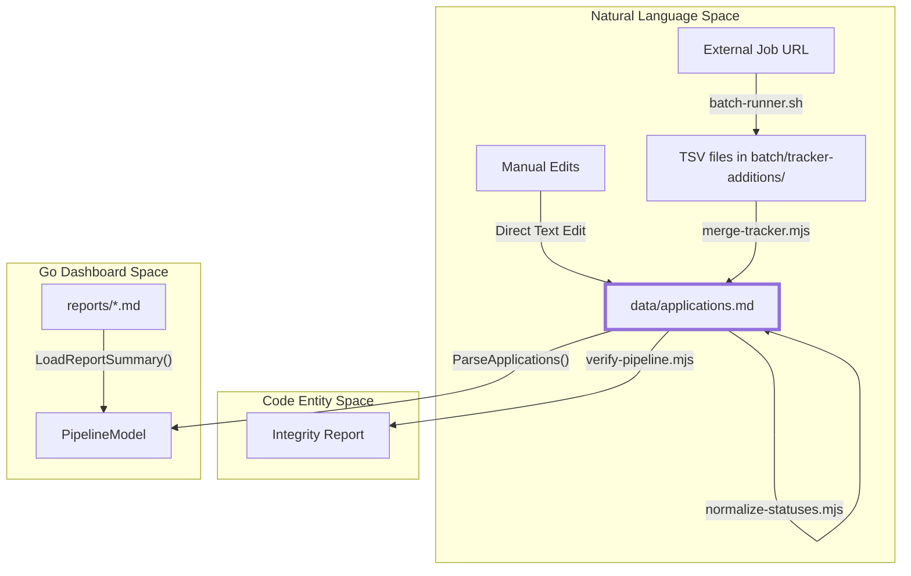
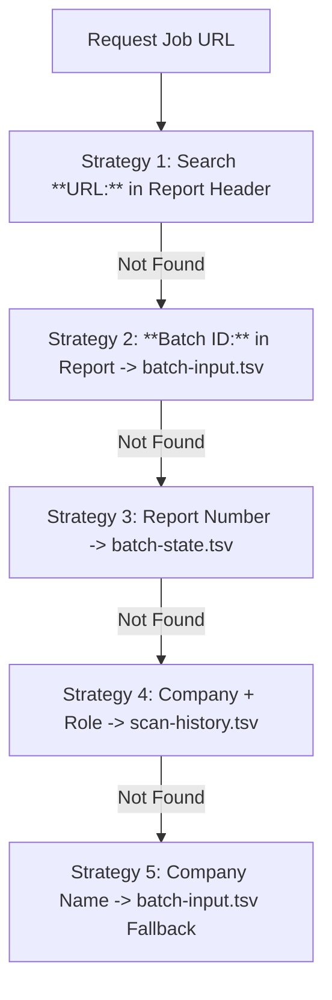

# Application Tracker & Data Layer

Relevant source files

The following files were used as context for generating this wiki page:

- [batch/logs/.gitkeep](batch/logs/.gitkeep)
- [dashboard/internal/data/career.go](dashboard/internal/data/career.go)
- [dashboard/internal/data/career_test.go](dashboard/internal/data/career_test.go)
- [dashboard/internal/ui/screens/pipeline.go](dashboard/internal/ui/screens/pipeline.go)
- [dashboard/internal/ui/screens/pipeline_test.go](dashboard/internal/ui/screens/pipeline_test.go)
- [data/.gitkeep](data/.gitkeep)
- [dedup-tracker.mjs](dedup-tracker.mjs)
- [jds/.gitkeep](jds/.gitkeep)
- [merge-tracker.mjs](merge-tracker.mjs)
- [normalize-statuses.mjs](normalize-statuses.mjs)
- [output/.gitkeep](output/.gitkeep)
- [templates/states.yml](templates/states.yml)
- [verify-pipeline.mjs](verify-pipeline.mjs)

The `data/` directory serves as the persistent storage layer for the entire career-ops ecosystem. Unlike traditional systems that rely on heavy databases, career-ops uses a **flat-file database** approach, primarily centered around `data/applications.md`. This Markdown-based architecture ensures that the data is human-readable, version-controllable via Git, and easily editable by both AI agents and manual user intervention.

## The Markdown Database Schema

The core of the data layer is `data/applications.md`. It uses a pipe-delimited Markdown table to track every job offer through its lifecycle [merge-tracker.mjs:24-26]().

### Canonical Table Structure
The table follows a strict 9-column schema required for compatibility across the Node.js maintenance scripts and the Go-based dashboard [merge-tracker.mjs:5-8]().

| Column | Name | Description |
| :--- | :--- | :--- |
| 1 | `#` | Sequential ID (Number) [dashboard/internal/data/career.go:80-83]() |
| 2 | `Date` | Date of the latest status change (YYYY-MM-DD) [dashboard/internal/data/career.go:86]() |
| 3 | `Company` | The name of the hiring organization [dashboard/internal/data/career.go:87]() |
| 4 | `Role` | The specific job title [dashboard/internal/data/career.go:88]() |
| 5 | `Score` | AI-generated match score (e.g., `4.2/5`) [dashboard/internal/data/career.go:94-97]() |
| 6 | `Status` | Canonical state (see State Machine below) [dashboard/internal/data/career.go:89]() |
| 7 | `PDF` | Indicator if a tailored CV exists (Unicode ✅) [dashboard/internal/data/career.go:90]() |
| 8 | `Report` | Markdown link to the evaluation file in `reports/` [dashboard/internal/data/career.go:100-103]() |
| 9 | `Notes` | Optional free-text for context [dashboard/internal/data/career.go:106-108]() |

**Sources:** [dashboard/internal/data/career.go:75-111](), [merge-tracker.mjs:5-8](), [verify-pipeline.mjs:75-80]()

## Canonical Status State Machine

To maintain data integrity and enable dashboard filtering, the `Status` column must adhere to a predefined set of canonical states defined in `templates/states.yml` [templates/states.yml:1-7]().

### State Hierarchy & Aliases
The system maps various natural language inputs (aliases) to a single canonical `id` used for logic and grouping [templates/states.yml:9-57](). Scripts like `dedup-tracker.mjs` use a `STATUS_RANK` to determine which status is "more advanced" in the pipeline [dedup-tracker.mjs:28-50]().

| ID | Label | Common Aliases | Dashboard Group | Rank |
| :--- | :--- | :--- | :--- | :--- |
| `evaluated` | Evaluated | evaluada, condicional | evaluated | 2 |
| `applied` | Applied | aplicado, enviada, sent | applied | 3 |
| `responded` | Responded | respondido | responded | 4 |
| `interview` | Interview | entrevista | interview | 5 |
| `offer` | Offer | oferta | offer | 6 |
| `rejected` | Rejected | rechazado, rechazada | rejected | 1 |
| `discarded` | Discarded | cerrada, cancelada | discarded | 0 |
| `skip` | SKIP | no aplicar, monitor | skip | 0 |

**Sources:** [templates/states.yml:9-57](), [dedup-tracker.mjs:28-50](), [normalize-statuses.mjs:29-87](), [merge-tracker.mjs:37-68]()

## Data Flow & Maintenance Architecture

The data layer is managed by a suite of Node.js scripts that ensure the flat-file remains consistent even when multiple batch processes are writing to it.

### System Data Flow
The following diagram illustrates how job data moves from external URLs into the canonical `applications.md` file and finally into the TUI Dashboard.

**Data Ingestion & Normalization Flow**

**Sources:** [merge-tracker.mjs:1-15](), [dashboard/internal/data/career.go:31-42](), [verify-pipeline.mjs:1-15](), [dashboard/internal/ui/screens/pipeline.go:124-139]()

### URL Enrichment Strategy
The dashboard uses a 5-tier strategy in `ParseApplications` to recover the original Job URL for the UI, as the Markdown table itself does not store the full URL to save space [dashboard/internal/data/career.go:113-118]().

**URL Resolution Logic**

**Sources:** [dashboard/internal/data/career.go:113-165]()

## Maintenance Scripts Overview

The system relies on several primary scripts to maintain the health of the data layer.

### [merge-tracker.mjs](#5.1)
This script is the primary entry point for batch data. It monitors the `batch/tracker-additions/` directory for TSV files generated by parallel workers [merge-tracker.mjs:27-34](). It performs fuzzy deduplication using `normalizeCompany` and `roleFuzzyMatch` and validates statuses against canonical states [merge-tracker.mjs:39-68]().
*   **Key Function:** Ingests 8-col and 9-col TSV data into the Markdown table.
*   **Details:** See [merge-tracker.mjs](#5.1).

### [dedup-tracker.mjs](#5.2)
Over time, the tracker may accumulate redundant entries. This script uses a two-tier grouping (company then role cluster) and a `STATUS_RANK` hierarchy to decide which entry to keep [dedup-tracker.mjs:157-180]().
*   **Key Function:** Cleans up duplicates and promotes the most "advanced" status if a discarded entry was further along [dedup-tracker.mjs:181-201]().
*   **Details:** See [dedup-tracker.mjs](#5.2).

### [normalize-statuses.mjs & verify-pipeline.mjs](#5.3)
These scripts handle the final "polish" and safety checks of the data layer.
*   **normalize-statuses.mjs**: Strips markdown formatting (like bolding) from status/score cells and maps aliases to their canonical form [normalize-statuses.mjs:29-87]().
*   **verify-pipeline.mjs**: A diagnostic tool that checks for broken report links, schema violations, and pending TSV files [verify-pipeline.mjs:127-174]().
*   **Details:** See [normalize-statuses.mjs & verify-pipeline.mjs](#5.3).

### [Pattern Analysis & Follow-up Cadence Scripts](#5.4)
Advanced analytics scripts that operate on the tracker data to provide insights.
*   **analyze-patterns.mjs**: Detects rejection patterns and tech stack gaps based on tracker history.
*   **followup-cadence.mjs**: Calculates the urgency of follow-ups based on the `Date` and `Status` columns.
*   **Details:** See [Pattern Analysis & Follow-up Cadence Scripts](#5.4).

**Sources:** [merge-tracker.mjs:1-15](), [dedup-tracker.mjs:1-10](), [normalize-statuses.mjs:1-12](), [verify-pipeline.mjs:1-15]()
