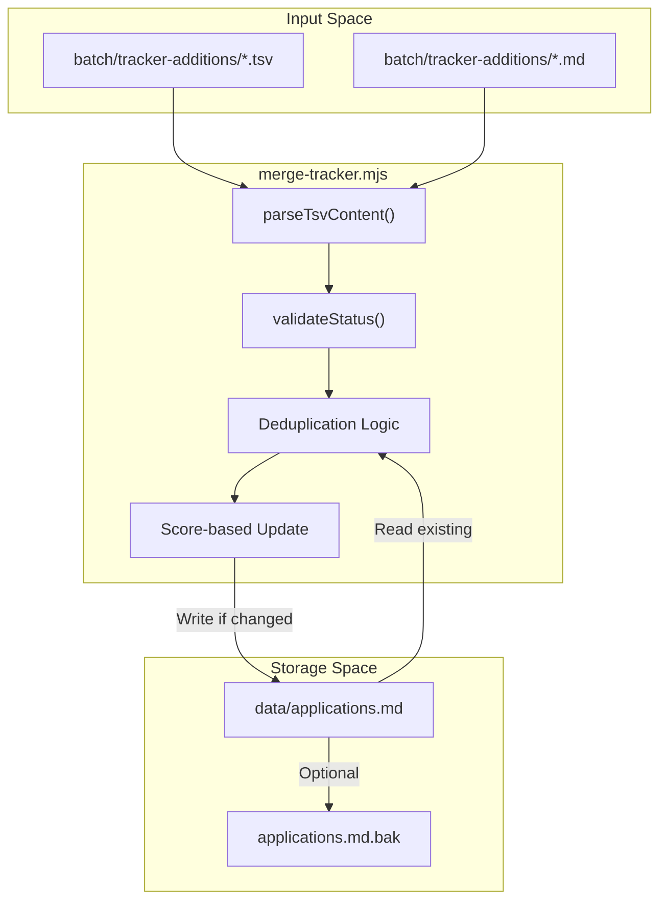
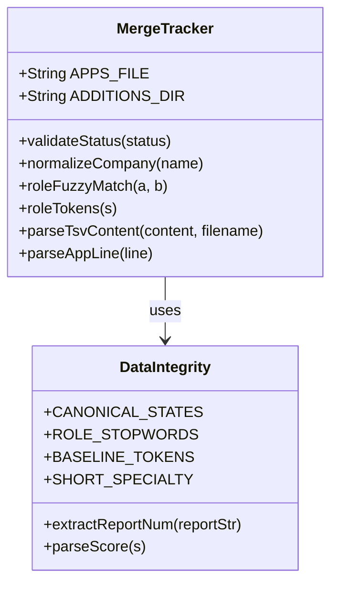

# merge-tracker.mjs

Relevant source files

The following files were used as context for generating this wiki page:

- [dedup-tracker.mjs](dedup-tracker.mjs)
- [merge-tracker.mjs](merge-tracker.mjs)
- [normalize-statuses.mjs](normalize-statuses.mjs)
- [verify-pipeline.mjs](verify-pipeline.mjs)

`merge-tracker.mjs` is the primary synchronization utility responsible for ingesting new job application data from the batch processing subsystem into the central `applications.md` database [merge-tracker.mjs:1-15](). It handles complex TSV parsing, fuzzy deduplication of company and role names, and score-based update logic to ensure the tracker remains the single source of truth for all career operations.

### Core Logic and Data Flow

The script operates by reading "addition" files from a specific directory, comparing them against the existing entries in `applications.md`, and either appending new rows or updating existing ones based on a hierarchy of matching rules.

#### High-Level Data Flow
The following diagram illustrates how data moves from the batch worker output into the final Markdown table.

**Data Ingestion Pipeline**

Sources: [merge-tracker.mjs:22-28](), [merge-tracker.mjs:107-184](), [merge-tracker.mjs:189-200]()

### Implementation Details

#### 1. Flexible TSV/Markdown Parsing
The script is designed to be resilient to variations in batch worker output. It supports three primary formats [merge-tracker.mjs:5-9]():
*   **9-column TSV**: Includes an explicit `notes` field (`num\tdate\tcompany\trole\tstatus\tscore\tpdf\treport\tnotes`).
*   **8-column TSV**: Standard output without notes (`num\tdate\tcompany\trole\tstatus\tscore\tpdf\treport`).
*   **Pipe-delimited**: Raw Markdown table rows (`| col | col | ... |`).

A key feature is the heuristic column detection [merge-tracker.mjs:141-163](). If the worker swaps the `status` and `score` columns, `parseTsvContent` detects this by checking if a column matches a score regex (`/^\d+\.?\d*\/5$/`) or a status keyword list [merge-tracker.mjs:145-148]().

#### 2. Status Validation & Normalization
To maintain data integrity, every incoming status is passed through `validateStatus()` [merge-tracker.mjs:39-68]().
*   **Canonical States**: Only states defined in the internal `CANONICAL_STATES` array (e.g., `Evaluated`, `Applied`, `Interview`) are permitted [merge-tracker.mjs:37]().
*   **Alias Mapping**: Common variations like "enviada", "sent", or "aplicado" are automatically mapped to "Applied" [merge-tracker.mjs:48-59]().
*   **Fallback**: If a status is unrecognizable, it defaults to "Evaluated" and logs a warning [merge-tracker.mjs:66-67]().

#### 3. Fuzzy Deduplication Strategy
`merge-tracker.mjs` prevents duplicate entries for the same job posting using a multi-tiered approach:
*   **Company Normalization**: The `normalizeCompany()` function strips non-alphanumeric characters and converts to lowercase [merge-tracker.mjs:70-72]().
*   **Role Fuzzy Match**: The `roleFuzzyMatch()` function compares job titles by splitting them into tokens [merge-tracker.mjs:122-128](). It uses a Jaccard-style ratio (threshold 0.6) and requires at least one "discriminating" token (non-baseline words like "API" or "SRE" rather than just "Engineer") to prevent false positives between distinct roles at the same company [merge-tracker.mjs:130-151]().
*   **Report ID Match**: If a report number (e.g., `[123]`) is present in the report string, it is extracted via `extractReportNum()` and used for matching [merge-tracker.mjs:153-156]().

#### 4. Score-Based Update Logic
When a duplicate is detected, the script does not simply discard the new data. It compares the scores of the existing and new entries [merge-tracker.mjs:10-11]().
*   **Update In-Place**: If the new entry has a higher score (parsed via `parseScore()`), the script updates the existing row's score, status, and report links [merge-tracker.mjs:11]().
*   **Preservation**: If the existing entry has a higher or equal score, the new entry is ignored to prevent degrading the quality of the tracker data.

### System Entity Mapping

This diagram maps the logical operations of the script to the specific functions and variables defined in the source code.

**Logic to Code Entity Mapping**

Sources: [merge-tracker.mjs:22-37](), [merge-tracker.mjs:39-128](), [merge-tracker.mjs:153-161]()

### CLI Usage and Flags

The script provides two critical flags for safe data management:

| Flag | Description |
| :--- | :--- |
| `--dry-run` | Processes all additions and logs intended changes to the console without modifying `applications.md` [merge-tracker.mjs:29](). |
| `--verify` | Performs a post-merge integrity check by invoking `verify-pipeline.mjs` [merge-tracker.mjs:30](). |

### Execution Flow
1.  **Environment Setup**: Ensures the `data/` and `batch/tracker-additions/` directories exist [merge-tracker.mjs:32-34]().
2.  **Load Applications**: Reads `applications.md` and parses all existing rows using `parseAppLine()` [merge-tracker.mjs:163-173]().
3.  **Scan Additions**: Iterates through `.tsv` files in `batch/tracker-additions/` [merge-tracker.mjs:27]().
4.  **Process and Merge**: For each addition, it checks for duplicates via company/role fuzzy matching. If unique, it assigns a new ID; if a duplicate with a higher score, it updates in-place.
5.  **Insertion**: New entries are inserted into the Markdown table after the header separator (usually line 3) to maintain chronological order [merge-tracker.mjs:340-350]().
6.  **Cleanup**: Successfully merged files are moved to the `merged/` subdirectory to prevent double-processing [merge-tracker.mjs:28]().

Sources: [merge-tracker.mjs:1-35](), [merge-tracker.mjs:70-151](), [merge-tracker.mjs:320-360]()
