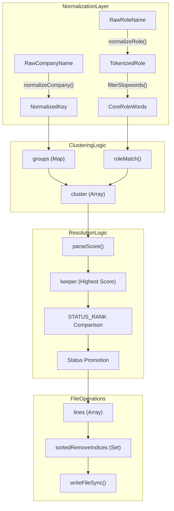
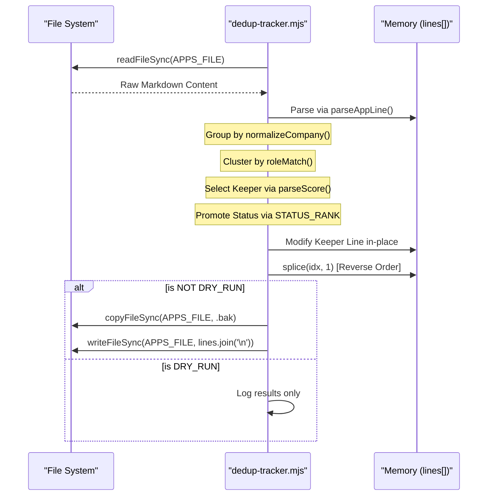

# dedup-tracker.mjs

Relevant source files

The following files were used as context for generating this wiki page:

- [dedup-tracker.mjs](dedup-tracker.mjs)
- [merge-tracker.mjs](merge-tracker.mjs)
- [normalize-statuses.mjs](normalize-statuses.mjs)
- [verify-pipeline.mjs](verify-pipeline.mjs)

`dedup-tracker.mjs` is a maintenance utility designed to ensure the integrity and cleanliness of the `applications.md` flat-file database [dedup-tracker.mjs:3-10](). It identifies redundant job entries by comparing normalized company names and performing fuzzy role matching. The script prioritizes data retention by selecting the highest-scoring evaluation as the "keeper" while promoting its status if a discarded duplicate reached a more advanced stage in the recruitment pipeline [dedup-tracker.mjs:5-7]().

## Core Logic & Hierarchy

The script operates on a predefined hierarchy of application statuses. This allows it to safely merge entries without losing progress (e.g., if one entry is marked "Evaluated" with a high score but a duplicate is already at the "Interview" stage, the final entry will keep the high score but advance to "Interview") [dedup-tracker.mjs:26-27]().

### STATUS_RANK Hierarchy
The `STATUS_RANK` object defines the "advancement" of an application. Higher values represent a more advanced stage in the pipeline [dedup-tracker.mjs:28-50](). It includes both English canonicals from `states.yml` and Spanish aliases for backwards compatibility [dedup-tracker.mjs:29-49]().

| Status (Canonical/Alias) | Rank | Description |
| :--- | :--- | :--- |
| `skip` / `discarded` / `no_aplicar` | 0 | Entry point or explicit rejection of interest. |
| `rejected` / `rechazado` | 1 | Terminal state (Company rejected candidate). |
| `evaluated` / `evaluada` | 2 | Initial AI evaluation complete. |
| `applied` / `aplicado` | 3 | Application submitted. |
| `responded` / `respondido` | 4 | Initial contact from recruiter. |
| `interview` / `entrevista` | 5 | Interview process active. |
| `offer` / `oferta` | 6 | Job offer received. |

**Sources:** [dedup-tracker.mjs:28-50]()

## Data Flow: Deduplication Pipeline

The script follows a multi-stage process to identify, merge, and prune entries.

### 1. Normalization & Grouping
The script first normalizes company names by removing special characters, parentheses, and extra whitespace [dedup-tracker.mjs:52-58](). It then groups all entries by these normalized company keys [dedup-tracker.mjs:146-151]().

### 2. Two-Tier Clustering
Within each company group, the script performs a secondary "Role Cluster" check:
*   **Stopword Filtering:** It removes common seniority (Senior, Junior, Lead) and location (Remote, Tokyo, London) keywords to find the core role [dedup-tracker.mjs:68-80]().
*   **Fuzzy Role Match:** It tokenizes role titles and checks for an overlap of at least 2 words with a similarity ratio $\ge$ 0.6 [dedup-tracker.mjs:82-96]().
*   **Cluster Formation:** Entries within the same company that pass the fuzzy role match are grouped into a `cluster` [dedup-tracker.mjs:162-173]().

### 3. Keeper Selection & Status Promotion
For every cluster of duplicates:
1.  **Selection:** The entry with the highest numeric score (parsed via `parseScore`) is selected as the `keeper` [dedup-tracker.mjs:178-179]().
2.  **Status Promotion:** The script iterates through the discarded entries. If any discarded entry has a `STATUS_RANK` higher than the `keeper`, the `keeper`'s status is updated to that higher value [dedup-tracker.mjs:181-190]().
3.  **In-place Modification:** The `keeper` line in the original `lines` array is modified to reflect the new status while preserving the Markdown table structure [dedup-tracker.mjs:193-201]().

### 4. Reverse-Order Deletion
To maintain array index integrity while removing lines, the script collects all indices marked for deletion in a `Set`, sorts them in descending order, and splices the array [dedup-tracker.mjs:217-220]().

### Entity Mapping: Logic to Code
The following diagram maps the deduplication concepts to the specific functions and variables in the implementation.

**Deduplication Logic Mapping**

**Sources:** [dedup-tracker.mjs:52-96](), [dedup-tracker.mjs:146-151](), [dedup-tracker.mjs:162-173](), [dedup-tracker.mjs:178-201](), [dedup-tracker.mjs:217-226]()

## Implementation Details

### File Path Resolution
The script supports two directory structures: the standard `data/applications.md` and a legacy/root `applications.md` [dedup-tracker.mjs:18-20](). It also ensures the `data/` directory exists for fresh setups [dedup-tracker.mjs:24]().

### Backup Mechanism
Before writing any changes to the disk, the script creates a `.bak` file of the current `applications.md` [dedup-tracker.mjs:225](). This ensures that if the deduplication logic produces an unexpected result, the data is recoverable.

### CLI Arguments
*   `--dry-run`: Performs all calculations, identifies duplicates, and logs the intended changes to the console without modifying the file or creating a backup [dedup-tracker.mjs:21](), [dedup-tracker.mjs:224-227]().

**System Execution Flow**

**Sources:** [dedup-tracker.mjs:18-24](), [dedup-tracker.mjs:103-120](), [dedup-tracker.mjs:193-201](), [dedup-tracker.mjs:217-227]()
