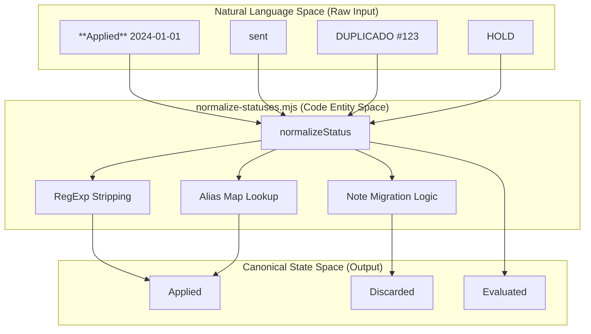
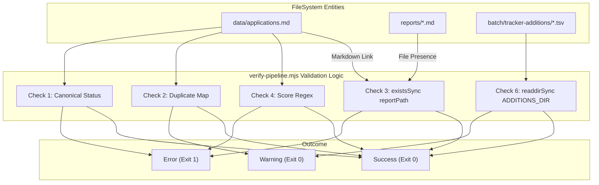

# normalize-statuses.mjs & verify-pipeline.mjs

Relevant source files

The following files were used as context for generating this wiki page:

- [dedup-tracker.mjs](dedup-tracker.mjs)
- [merge-tracker.mjs](merge-tracker.mjs)
- [normalize-statuses.mjs](normalize-statuses.mjs)
- [verify-pipeline.mjs](verify-pipeline.mjs)

This section covers the two primary data-integrity scripts used to maintain the `applications.md` flat-file database. These scripts ensure that application states remain consistent with the canonical state machine and that the pipeline remains free of structural errors or broken references.

## normalize-statuses.mjs

`normalize-statuses.mjs` is a transformation script designed to clean and standardize the `STATUS` column in `applications.md`. It resolves inconsistencies introduced by manual editing or legacy batch outputs by mapping varied inputs to a strict set of canonical states [normalize-statuses.mjs:5-6]().

### Core Logic and Transformations

The script iterates through every row of the Markdown table, extracts the status field, and applies a series of normalization rules defined in the `normalizeStatus` function [normalize-statuses.mjs:29-87]().

| Transformation Type | Logic | Implementation |
|:---|:---|:---|
| **Bold Stripping** | Removes `**` markers from status and score. | [normalize-statuses.mjs:31](), [normalize-statuses.mjs:138]() |
| **Alias Mapping** | Maps terms like "sent", "enviada", or "aplicado" to "Applied". | [normalize-statuses.mjs:78-83]() |
| **Date Stripping** | Removes trailing years/dates from status strings (e.g., "Rechazado 2024"). | [normalize-statuses.mjs:47-50]() |
| **Note Migration** | If a status indicates a duplicate (e.g., "DUPLICADO"), it changes the status to "Discarded" and moves the original string to the `notas` column. | [normalize-statuses.mjs:34-37](), [normalize-statuses.mjs:127-134]() |
| **State Reset** | Maps internal flags like "HOLD", "MONITOR", or "VERIFICAR" to "Evaluated" or "SKIP". | [normalize-statuses.mjs:52-59]() |

### Safety Mechanisms

To prevent data loss, the script implements two safety layers:
1.  **Dry Run Mode**: Using the `--dry-run` flag allows users to preview changes in the console without modifying the file [normalize-statuses.mjs:23](), [normalize-statuses.mjs:163-164]().
2.  **Automatic Backup**: Before writing any changes, the script creates a `.bak` copy of the current `applications.md` [normalize-statuses.mjs:158-160]().

### Status Normalization Flow

This diagram illustrates how raw status strings from the Markdown table are processed into canonical entities.

**Status Normalization Pipeline**

**Sources:** [normalize-statuses.mjs:29-87](), [normalize-statuses.mjs:100-147]()

---

## verify-pipeline.mjs

`verify-pipeline.mjs` acts as a "Linter" or "Health Check" for the entire application tracking system. Unlike the normalization script, it does not modify data; it validates the integrity of the database and exits with a non-zero code if critical errors are found [verify-pipeline.mjs:196]().

### Validation Checks

The script performs seven distinct integrity checks [verify-pipeline.mjs:5-12]():

1.  **Canonical Statuses**: Ensures every status matches the allowed list in `CANONICAL_STATUSES` and lacks markdown bolding or embedded dates [verify-pipeline.mjs:36-39](), [verify-pipeline.mjs:84-108]().
2.  **Duplicate Detection**: Groups entries by a normalized key (Company + Role) to flag potential double-entries [verify-pipeline.mjs:110-125]().
3.  **Report Link Integrity**: Parses Markdown links in the `report` column and verifies the target `.md` file actually exists in the `reports/` directory [verify-pipeline.mjs:127-138]().
4.  **Score Format**: Validates that scores follow the `X.XX/5` pattern or are marked as `N/A` or `DUP` [verify-pipeline.mjs:140-149]().
5.  **Row Structural Integrity**: Checks that every row contains the minimum required number of pipe-delimited columns (9) [verify-pipeline.mjs:151-162]().
6.  **Pending Data Detection**: Scans the `batch/tracker-additions/` directory for TSV files that have not yet been merged into the main tracker [verify-pipeline.mjs:164-173]().
7.  **Visual Cleanliness**: Specifically warns if scores contain bolding, which interferes with TUI rendering [verify-pipeline.mjs:175-183]().

### Error vs. Warning Classification

The script distinguishes between structural failures and stylistic inconsistencies:
*   **Errors (❌)**: Broken report links, non-canonical statuses, invalid row formats. These cause a non-zero exit code [verify-pipeline.mjs:55](), [verify-pipeline.mjs:196]().
*   **Warnings (⚠️)**: Potential duplicates, pending TSVs, bolding in scores. These alert the user but allow the pipeline to proceed [verify-pipeline.mjs:56]().

### System Integrity Validation Flow

This diagram maps the validation checks to the specific file entities they monitor.

**Pipeline Integrity Mapping**

**Sources:** [verify-pipeline.mjs:23-50](), [verify-pipeline.mjs:84-183]()

### Key Data Structures

The `verify-pipeline.mjs` script parses the Markdown table into an array of `entries` objects for easier validation [verify-pipeline.mjs:68-80]():

| Property | Source Column | Description |
|:---|:---|:---|
| `num` | 1 | The unique application ID. |
| `company` | 3 | Used for duplicate detection key generation. |
| `role` | 4 | Used for duplicate detection key generation. |
| `score` | 5 | Validated against regex `^\d+\.?\d*\/5$`. |
| `status` | 6 | Validated against `CANONICAL_STATUSES`. |
| `report` | 8 | Parsed for relative file path extraction. |

**Sources:** [verify-pipeline.mjs:36-50](), [verify-pipeline.mjs:68-80](), [verify-pipeline.mjs:143-144]()
