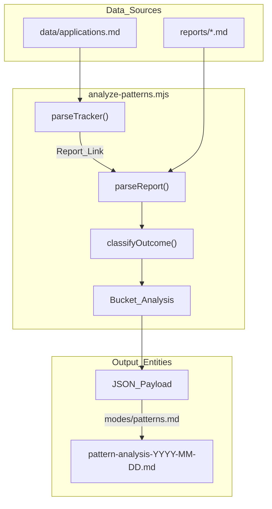
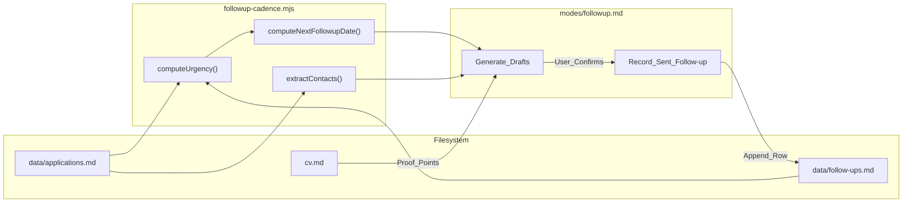

# Pattern Analysis & Follow-up Cadence Scripts

Relevant source files

The following files were used as context for generating this wiki page:

- [.agents/skills/career-ops/SKILL.md](.agents/skills/career-ops/SKILL.md)
- [.claude/skills/career-ops/SKILL.md](.claude/skills/career-ops/SKILL.md)
- [analyze-patterns.mjs](analyze-patterns.mjs)
- [followup-cadence.mjs](followup-cadence.mjs)
- [modes/followup.md](modes/followup.md)
- [modes/patterns.md](modes/patterns.md)

The **Pattern Analysis** and **Follow-up Cadence** systems provide the analytical layer of `career-ops`. While other modes focus on individual job evaluations, these scripts analyze the aggregate data in `data/applications.md` and `reports/` to identify why applications are failing and ensure active leads do not go cold.

## 1. Pattern Analysis (`analyze-patterns.mjs`)

The `analyze-patterns.mjs` script is a diagnostic tool that parses the history of all applications to identify correlations between job attributes (archetypes, remote policy, tech stack) and success rates. It is invoked via the `patterns` mode [modes/patterns.md:29-30]().

### Implementation & Data Flow
The script performs a multi-stage ingestion process:
1.  **Tracker Parsing**: Reads `data/applications.md` (or the fallback `applications.md`) to identify all entries and their current statuses [analyze-patterns.mjs:19-21](), [analyze-patterns.mjs:62-79]().
2.  **Report Deep-Dive**: For every application, it locates the corresponding Markdown report in `reports/` and extracts structured data from the A-F evaluation blocks [analyze-patterns.mjs:82-169]().
3.  **Classification**: It normalizes raw statuses into four outcome buckets: `positive` (Interview/Offer/Responded/Applied), `negative` (Rejected/Discarded), `self_filtered` (SKIP), and `pending` (Evaluated) [analyze-patterns.mjs:53-59]().
4.  **Bucket Analysis**: It groups data by dimensions such as `archetype`, `seniority`, and `remotePolicy` to calculate conversion rates [analyze-patterns.mjs:172-180]().

### Key Functions
- `parseReport(reportPath)`: Uses Regex to extract metadata (Archetype, Seniority, Remote, Team Size, Comp, Domain) and specific scores (CV Match, North Star, Global) from the evaluation report [analyze-patterns.mjs:82-169]().
- `classifyRemote(raw)`: Buckets various remote strings into `global remote`, `geo-restricted`, or `hybrid/onsite` to detect location-based rejection patterns [analyze-patterns.mjs:172-180]().
- `calculateGaps(reports)`: Aggregates the "Gaps" table from Block B of all reports to identify recurring tech stack deficiencies [analyze-patterns.mjs:151-166]().

### Pattern Analysis Logic
The following diagram illustrates how the script bridges the flat-file database to analytical insights.

**System Logic: Pattern Detection Pipeline**

Sources: [analyze-patterns.mjs:62-169](), [modes/patterns.md:24-51]()

---

## 2. Follow-up Cadence (`followup-cadence.mjs`)

The `followup-cadence.mjs` script manages the post-application lifecycle. It calculates when the next touchpoint should occur based on the current status and previous history. It integrates with `modes/followup.md` to generate the actual communication drafts.

### Urgency Tiers & Rules
The system enforces a strict cadence configuration defined in the `CADENCE` object [followup-cadence.mjs:33-40]():
- **Applied**: First follow-up at 7 days (default); subsequent every 7 days; max 2 attempts [followup-cadence.mjs:157-162]().
- **Responded**: Urgent reply if < 1 day; follow-up every 3 days if they stop responding [followup-cadence.mjs:163-167]().
- **Interview**: Thank-you note within 1 day [followup-cadence.mjs:168-171]().

### Data Interaction
The script correlates two primary files:
1.  **`data/applications.md`**: The source of truth for the current state of the application [followup-cadence.mjs:19-21]().
2.  **`data/follow-ups.md`**: A secondary ledger that records the history of sent messages to avoid double-pinging [followup-cadence.mjs:22-22]().

### Key Functions
- `computeUrgency()`: Determines the visual status (`urgent`, `overdue`, `waiting`, or `cold`) by comparing the last activity date against `CADENCE` rules [followup-cadence.mjs:156-173]().
- `extractContacts(notes)`: Scans the notes column of the tracker using Regex to find email addresses and associated names for draft personalization [followup-cadence.mjs:131-145]().
- `computeNextFollowupDate()`: Calculates the exact ISO date for the next recommended action based on status and history [followup-cadence.mjs:176-191]().

**Entity Mapping: Follow-up Generation**

Sources: [followup-cadence.mjs:33-40](), [followup-cadence.mjs:156-191](), [modes/followup.md:51-150]()

---

## 3. Integration with Agent Modes

The scripts are designed to be "script-first, agent-wrapped." The `.mjs` files handle the heavy lifting of date math and data parsing, while the `.md` mode files handle the natural language generation and user interaction.

### Pattern Mode Workflow (`modes/patterns.md`)
1.  **Validation**: Ensures at least 5 applications have outcomes beyond "Evaluated" before running [modes/patterns.md:15-22]().
2.  **Execution**: Runs `node analyze-patterns.mjs` and captures the structured JSON output [modes/patterns.md:26-32]().
3.  **Reporting**: Formats the JSON into a structured Markdown report in `reports/pattern-analysis-{YYYY-MM-DD}.md` including a **Conversion Funnel** and **Archetype Performance** table [modes/patterns.md:53-110]().
4.  **Action**: Offers to automatically update `portals.yml` (to exclude bad-fit roles) or `config/profile.yml` (to set a minimum score threshold) [modes/patterns.md:129-144]().

### Follow-up Mode Workflow (`modes/followup.md`)
1.  **Dashboard**: Displays a cadence dashboard of all active applications sorted by urgency [modes/followup.md:34-50]().
2.  **Drafting**: For `overdue` or `urgent` entries, it reads the evaluation report's "Block B" (CV Match) and `cv.md` to find specific value-adds to include in the message [modes/followup.md:53-88]().
3.  **Tone Control**: Enforces strict constraints, such as banning phrases like "just checking in" and keeping drafts under 150 words [modes/followup.md:68-75]().
4.  **Persistence**: Once the user confirms a message is sent, the agent appends a row to `data/follow-ups.md` with the next sequential ID [modes/followup.md:126-150]().

Sources: [modes/patterns.md:1-155](), [modes/followup.md:1-174](), [.claude/skills/career-ops/SKILL.md:33-34]()
