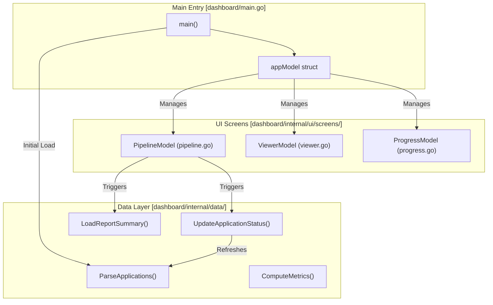

# Dashboard TUI (Go)

Relevant source files

The following files were used as context for generating this wiki page:

- [dashboard/go.mod](dashboard/go.mod)
- [dashboard/go.sum](dashboard/go.sum)
- [dashboard/internal/data/career.go](dashboard/internal/data/career.go)
- [dashboard/internal/data/career_test.go](dashboard/internal/data/career_test.go)
- [dashboard/internal/model/career.go](dashboard/internal/model/career.go)
- [dashboard/internal/theme/catppuccin_latte.go](dashboard/internal/theme/catppuccin_latte.go)
- [dashboard/internal/theme/theme.go](dashboard/internal/theme/theme.go)
- [dashboard/internal/ui/screens/pipeline.go](dashboard/internal/ui/screens/pipeline.go)
- [dashboard/internal/ui/screens/pipeline_test.go](dashboard/internal/ui/screens/pipeline_test.go)
- [dashboard/internal/ui/screens/progress.go](dashboard/internal/ui/screens/progress.go)
- [dashboard/internal/ui/screens/viewer.go](dashboard/internal/ui/screens/viewer.go)
- [dashboard/internal/ui/screens/viewer_test.go](dashboard/internal/ui/screens/viewer_test.go)
- [dashboard/main.go](dashboard/main.go)
- [templates/states.yml](templates/states.yml)

The **Dashboard TUI** is a terminal-based graphical interface for the `career-ops` ecosystem, built using the Go programming language. It provides a centralized view of the job application pipeline, allowing users to browse, filter, and read evaluation reports without leaving the terminal.

The application is built on the **Bubble Tea** framework, following the Model-View-Update (MVU) architecture, and utilizes **Lip Gloss** for sophisticated terminal styling. It requires Go 1.24+ to build and run [dashboard/go.mod:1-10]().

## Architecture & Data Flow

The dashboard functions as a read-write interface over the `applications.md` flat-file database. It parses the Markdown table into structured Go models and synchronizes changes back to the filesystem when statuses are updated.

### System Topology
The following diagram illustrates how the `appModel` coordinates between the data layer and the UI screens.

**Dashboard Component Interaction**

Sources: [dashboard/main.go:26-34](), [dashboard/main.go:36-41](), [dashboard/main.go:64-76](), [dashboard/main.go:154-183]()

### Model-View-Update (MVU) Implementation
The `appModel` in `dashboard/main.go` acts as the root orchestrator:
*   **Model**: Holds the `PipelineModel`, `ViewerModel`, `ProgressModel`, and the current `viewState` (e.g., `viewPipeline`, `viewReport`, or `viewProgress`) [dashboard/main.go:20-34]().
*   **Update**: Handles high-level messages like `PipelineOpenReportMsg` to switch screens, `PipelineUpdateStatusMsg` to modify data, or `PipelineOpenURLMsg` to trigger OS-level browser commands [dashboard/main.go:69-108]().
*   **View**: Conditionally renders the active screen based on the state [dashboard/main.go:143-152]().

## Visual Theme (Catppuccin Mocha)

The dashboard uses the **Catppuccin Mocha** color palette to provide a high-contrast, modern aesthetic. The theme is centralized in the `theme` package, defining base colors (Base, Surface, Overlay) and accent colors (Blue, Mauve, Green, etc.) used across all UI components [dashboard/internal/theme/theme.go:9-27](). It supports automatic background detection to switch between Latte and Mocha [dashboard/internal/theme/theme.go:29-44]().

| Color Entity | Code Reference | Usage in TUI |
| :--- | :--- | :--- |
| `Base` | `theme.Base` | Main background |
| `Blue` | `theme.Blue` | Headers and primary actions |
| `Mauve` | `theme.Mauve` | Secondary headers (H2) |
| `Green` | `theme.Green` | High scores and "Applied" status |
| `Red` | `theme.Red` | Low scores and "Rejected" status |

Sources: [dashboard/internal/theme/theme.go:9-27](), [dashboard/internal/theme/theme.go:29-44]()

## Core Screens

The dashboard is divided into three primary functional areas:

### 1. Pipeline Screen
The entry point of the application. It displays the `applications.md` data in a sortable, filterable list.
*   **Functionality**: Includes a metrics header, tab-based filtering by status (ALL, EVALUATED, APPLIED, INTERVIEW, TOP ≥4, SKIP), and multiple sorting modes (Score, Date, Company, Status) [dashboard/internal/ui/screens/pipeline.go:59-92]().
*   **Lazy Loading**: It emits `PipelineLoadReportMsg` to asynchronously fetch report summaries (Archetype, TL;DR, Remote, Comp) from the filesystem to keep the UI responsive [dashboard/internal/ui/screens/pipeline.go:32-36]().
*   **Search**: Supports real-time substring filtering on company, role, and notes fields [dashboard/internal/ui/screens/pipeline.go:118-121]().
*   **For details, see [Pipeline Screen & Viewer](#6.1)**.

Sources: [dashboard/internal/ui/screens/pipeline.go:102-121](), [dashboard/main.go:64-67]()

### 2. Report Viewer
A dedicated screen for reading the detailed evaluation reports generated by the AI agents.
*   **Markdown Rendering**: The `ViewerModel` implements a custom Markdown styler that highlights headers, code blocks, and tables [dashboard/internal/ui/screens/viewer.go:218-302]().
*   **Navigation**: Supports Vim-style keybindings (`j`/`k`, `G`, `g`) and page navigation [dashboard/internal/ui/screens/viewer.go:85-130]().
*   **For details, see [Pipeline Screen & Viewer](#6.1)**.

Sources: [dashboard/main.go:82-90](), [dashboard/internal/ui/screens/viewer.go:19-28]()

### 3. Progress Analytics
A high-level analytics screen providing visual feedback on pipeline velocity and conversion rates.
*   **Metrics**: Displays `ProgressMetrics` including funnel stages, score distribution, and weekly activity [dashboard/internal/model/career.go:35-55]().
*   **State Transition**: Triggered via `PipelineOpenProgressMsg` [dashboard/main.go:95-102]().

Sources: [dashboard/main.go:38-39](), [dashboard/main.go:95-106]()

## Data Integration

The dashboard is not just a viewer; it is tightly integrated with the `career-ops` data structure:
*   **Parsing**: It reads the pipe-delimited Markdown table from `applications.md` via `data.ParseApplications` [dashboard/internal/data/career.go:29-41]().
*   **Enrichment**: It maps tracker entries to physical report files and job URLs using a 5-tier resolution strategy [dashboard/internal/data/career.go:113-167]().
*   **Writing**: It can update application statuses directly via `data.UpdateApplicationStatus`, which modifies the Markdown file and triggers a UI refresh [dashboard/main.go:69-76]().
*   **For details, see [Dashboard Data Layer](#6.2)**.

Sources: [dashboard/main.go:36-41](), [dashboard/internal/data/career.go:113-167]()
