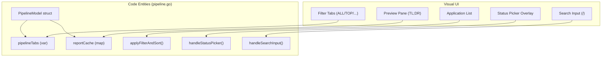
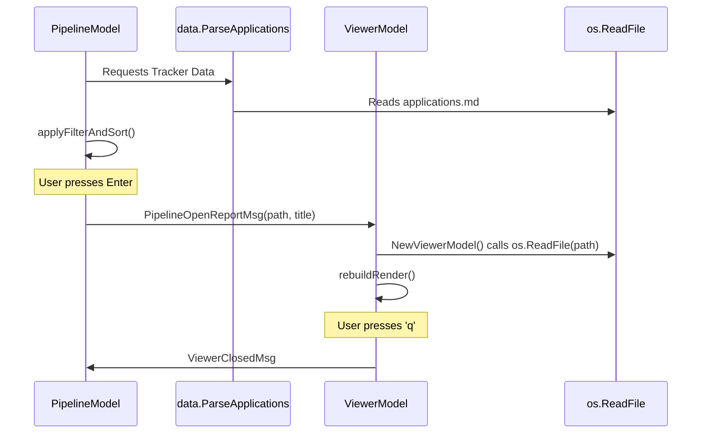

# Pipeline Screen & Viewer

Relevant source files

The following files were used as context for generating this wiki page:

- [dashboard/go.mod](dashboard/go.mod)
- [dashboard/internal/data/career.go](dashboard/internal/data/career.go)
- [dashboard/internal/data/career_test.go](dashboard/internal/data/career_test.go)
- [dashboard/internal/ui/screens/pipeline.go](dashboard/internal/ui/screens/pipeline.go)
- [dashboard/internal/ui/screens/pipeline_test.go](dashboard/internal/ui/screens/pipeline_test.go)
- [dashboard/internal/ui/screens/viewer.go](dashboard/internal/ui/screens/viewer.go)
- [dashboard/internal/ui/screens/viewer_test.go](dashboard/internal/ui/screens/viewer_test.go)
- [templates/states.yml](templates/states.yml)

The Dashboard TUI is built using the **Bubble Tea** Model-View-Update (MVU) architecture. It provides a high-performance interface for navigating the job application pipeline, allowing users to filter, sort, and preview evaluation reports without leaving the terminal. The system is split into two primary models: `PipelineModel` for the list view and `ViewerModel` for document inspection.

## Pipeline Screen (PipelineModel)

The `PipelineModel` serves as the primary entry point for managing applications. It transforms the flat-file data from `applications.md` into an interactive, categorized, and searchable dashboard [dashboard/internal/ui/screens/pipeline.go:102-121]().

### Filtering and Sorting Logic
The core of the pipeline's interactivity is the `applyFilterAndSort` method [dashboard/internal/ui/screens/pipeline.go:137](). It processes the raw application list based on the currently selected tab, search query, and sort mode.

*   **Tabs (Filter Modes):** Defined in `pipelineTabs` [dashboard/internal/ui/screens/pipeline.go:83-92]().
    *   `ALL`: No filtering.
    *   `EVALUATED`: Shows applications with status "Evaluated" [templates/states.yml:10-14]().
    *   `APPLIED`: Shows applications with status "Applied" or "Responded" [templates/states.yml:16-26]().
    *   `INTERVIEW`: Shows applications in "Interview" or "Offer" states [templates/states.yml:28-38]().
    *   `TOP ≥4`: Filters for applications with a score of 4.0 or higher [dashboard/internal/ui/screens/pipeline.go:75]().
    *   `SKIP`, `REJECTED`, `DISCARDED`: Status-specific views [dashboard/internal/ui/screens/pipeline.go:72-74]().
*   **Search Sub-state:** Users can press `/` to enter a substring search that filters by company, role, or notes [dashboard/internal/ui/screens/pipeline.go:119-121](). This filter composes with the active tab [dashboard/internal/ui/screens/pipeline_test.go:157-172]().
*   **Sort Modes:** Users cycle through `score`, `date`, `company`, and `status` [dashboard/internal/ui/screens/pipeline.go:59-64]().
*   **View Modes:** Supports a `flat` list or a `grouped` view where applications are categorized by their status priority [dashboard/internal/ui/screens/pipeline.go:98-99]().

### Lazy-Loaded Report Cache
To maintain UI responsiveness while providing rich previews, the dashboard uses a lazy-loading mechanism for evaluation reports.
1.  As the user moves the `cursor`, `loadCurrentReport()` is triggered [dashboard/internal/ui/screens/pipeline.go:244]().
2.  This emits a `PipelineLoadReportMsg` [dashboard/internal/ui/screens/pipeline.go:32-36]().
3.  The main loop catches this and calls `data.LoadReportSummary` to parse specific blocks (Archetype, TL;DR, Remote, Comp) from the Markdown file using regex [dashboard/internal/data/career.go:16-27]().
4.  The data is returned via `EnrichReport`, which stores it in `reportCache map[string]reportSummary` [dashboard/internal/ui/screens/pipeline.go:165-173]() to prevent redundant disk I/O.

### Status Picker Overlay
Users can update application statuses directly using the `c` key. This activates `statusPicker`, a modal-like state [dashboard/internal/ui/screens/pipeline.go:116]() that intercepts keyboard input to select from `statusOptions` [dashboard/internal/ui/screens/pipeline.go:96](). Selecting a status triggers a `PipelineUpdateStatusMsg` [dashboard/internal/ui/screens/pipeline.go:39-43]().

### UI Component Mapping
The following diagram maps the visual components of the Pipeline Screen to their underlying code structures.

**Pipeline Screen Entity Mapping**

Sources: [dashboard/internal/ui/screens/pipeline.go:83-121](), [dashboard/internal/ui/screens/pipeline.go:137](), [dashboard/internal/ui/screens/pipeline.go:238-243]()

---

## Viewer Screen (ViewerModel)

The `ViewerModel` is a specialized Markdown renderer designed for reading evaluation reports. It is triggered when a user presses `enter` on a selected application [dashboard/internal/ui/screens/pipeline.go:21]().

### Markdown Rendering
`viewer.go` implements custom rendering logic using **Lipgloss** and **ansi** wrapping [dashboard/internal/ui/screens/viewer.go:20-28]().
*   **Table Block Detection:** The viewer detects Markdown tables via `isTableLine` [dashboard/internal/ui/screens/viewer.go:304-307]() and renders them using `renderTableBlock` [dashboard/internal/ui/screens/viewer.go:237]().
*   **Paragraph Wrapping:** Text is wrapped to the terminal width minus padding [dashboard/internal/ui/screens/viewer.go:282-286]().
*   **Fenced Code:** Code blocks are detected and rendered with a distinct background style [dashboard/internal/ui/screens/viewer.go:241-262]().
*   **Inline Elements:** Bold, code spans, and links are processed via `renderInlineElements` [dashboard/internal/ui/screens/viewer.go:286]().

### Navigation and Keybindings
The viewer supports standard pager navigation [dashboard/internal/ui/screens/viewer.go:85-130]():
*   `j`/`down`, `k`/`up`: Line-by-line scrolling.
*   `ctrl+d`, `pgdown`: Half-page jumps.
*   `ctrl+u`, `pgup`: Half-page reverse jumps.
*   `g`/`home`, `G`/`end`: Jump to start/end of document.

### Data Flow: Pipeline to Viewer
The transition between the list and the viewer is managed by the top-level application via message passing.

**Data Flow Diagram**

Sources: [dashboard/internal/ui/screens/pipeline.go:21-25](), [dashboard/internal/ui/screens/viewer.go:31-51](), [dashboard/internal/data/career.go:31-41]()

---

## Key Functions Reference

### Pipeline Logic
| Function | Description |
| :--- | :--- |
| `applyFilterAndSort` | Filters `apps` into `filtered` based on `activeTab` and `searchQuery`. [dashboard/internal/ui/screens/pipeline.go:137]() |
| `WithReloadedData` | Rebuilds the model with fresh data while preserving cursor and search state. [dashboard/internal/ui/screens/pipeline.go:177-224]() |
| `adjustScroll` | Ensures the `cursor` remains within the visible viewport. [dashboard/internal/ui/screens/pipeline.go:222]() |
| `handleSearchInput` | Processes runes into `searchQuery` and triggers live filtering. [dashboard/internal/ui/screens/pipeline.go:242]() |

### Viewer Logic
| Function | Description |
| :--- | :--- |
| `rebuildRender` | Recomputes `renderedLines` from raw lines based on current terminal width. [dashboard/internal/ui/screens/viewer.go:54-57]() |
| `renderAll` | Main loop that identifies blocks (tables, code, paragraphs) for styling. [dashboard/internal/ui/screens/viewer.go:219-302]() |
| `clampScrollOffset` | Prevents scrolling past the end of the rendered content. [dashboard/internal/ui/screens/viewer.go:59-70]() |
| `renderHeader` | Draws the top bar with the report title and scroll percentage. [dashboard/internal/ui/screens/viewer.go:157-195]() |

Sources: [dashboard/internal/ui/screens/pipeline.go:1-243](), [dashboard/internal/ui/screens/viewer.go:1-302](), [dashboard/internal/data/career.go:1-167]()
