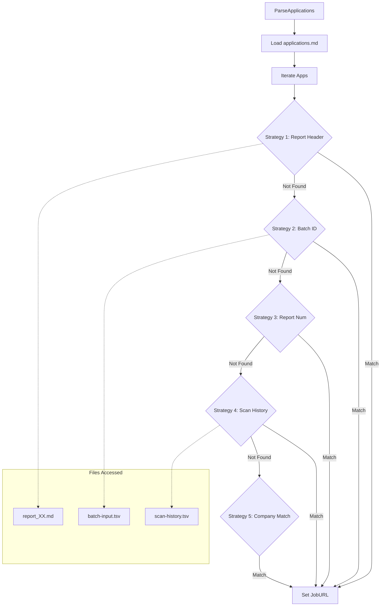
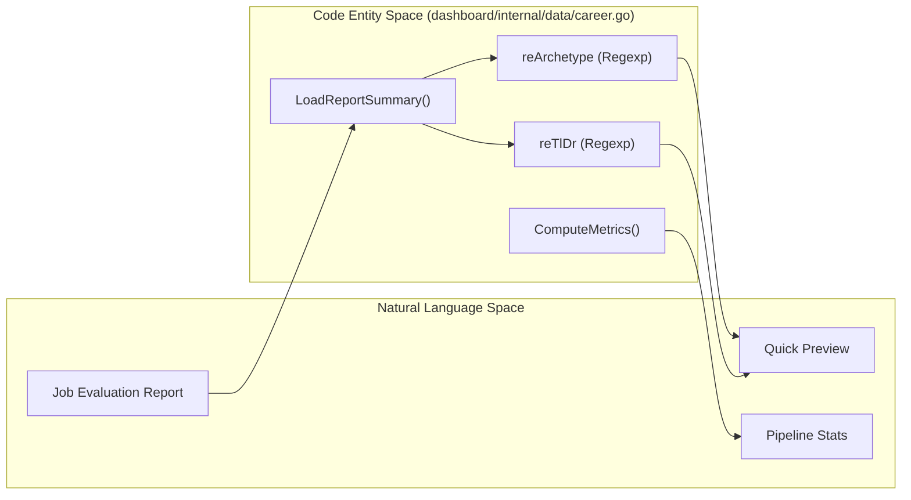
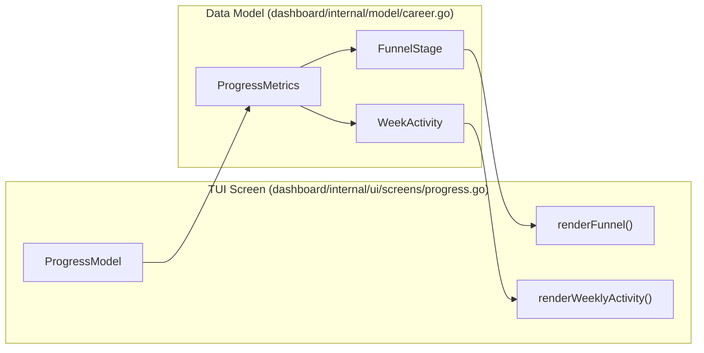

# Dashboard Data Layer

Relevant source files

The following files were used as context for generating this wiki page:

- [dashboard/internal/data/career.go](dashboard/internal/data/career.go)
- [dashboard/internal/data/career_test.go](dashboard/internal/data/career_test.go)
- [dashboard/internal/model/career.go](dashboard/internal/model/career.go)
- [dashboard/internal/ui/screens/pipeline.go](dashboard/internal/ui/screens/pipeline.go)
- [dashboard/internal/ui/screens/pipeline_test.go](dashboard/internal/ui/screens/pipeline_test.go)
- [dashboard/internal/ui/screens/progress.go](dashboard/internal/ui/screens/progress.go)
- [dashboard/main.go](dashboard/main.go)
- [templates/states.yml](templates/states.yml)

The Dashboard Data Layer is the Go-based engine responsible for transforming the flat-file Markdown database (`applications.md`) into structured data for the TUI. It handles parsing, complex URL enrichment strategies, metric computation, and status normalization according to the system's canonical state machine.

## Data Models

The system uses primary structures defined in `dashboard/internal/model/career.go` to represent application data and aggregate performance.

### CareerApplication
Represents a single row from the tracker, enriched with metadata from associated report files.
[dashboard/internal/model/career.go:4-22]()

| Field | Type | Description |
| :--- | :--- | :--- |
| `Number` | `int` | Sequential ID based on the tracker column. [dashboard/internal/data/career.go:81-83]() |
| `Date` | `string` | Date of evaluation/application. |
| `Company` | `string` | Target organization name. |
| `Score` | `float64` | Numeric value parsed from the "Score" column (e.g., 4.5). |
| `Status` | `string` | Normalized state (e.g., "Applied", "Interview"). |
| `JobURL` | `string` | Original job posting URL (resolved via enrichment). |
| `Archetype` | `string` | Lazy-loaded "Arquetipo" from the report markdown. |
| `TlDr` | `string` | Lazy-loaded "TL;DR" summary from the report. |

### PipelineMetrics & ProgressMetrics
These models hold aggregate statistics displayed in the dashboard header and the dedicated progress screen.
[dashboard/internal/model/career.go:25-32]()
[dashboard/internal/model/career.go:35-55]()

| Model | Field | Description |
| :--- | :--- | :--- |
| `PipelineMetrics` | `Total` | Total number of entries in the tracker. |
| `PipelineMetrics` | `AvgScore` | Arithmetic mean of all numerical scores. |
| `ProgressMetrics` | `FunnelStages` | Slice of `FunnelStage` for conversion analysis. |
| `ProgressMetrics` | `WeeklyActivity` | Application counts grouped by ISO week. |

Sources: [dashboard/internal/model/career.go:1-75](), [dashboard/internal/data/career.go:81-83]()

## Application Parsing

The `ParseApplications` function is the entry point for data ingestion. It searches for `applications.md` in the root or `data/` directory and iterates through the Markdown table. [dashboard/internal/data/career.go:31-41]()

### Table Ingestion Logic
The parser handles two variations of the Markdown table format:
1.  **Pure Pipe:** Standard Markdown `| Field | Field |`. [dashboard/internal/data/career.go:67-73]()
2.  **Mixed Tab/Pipe:** Lines starting with `| ` but using tabs for field separation, common in some batch exports. [dashboard/internal/data/career.go:58-66]()

### Field Mapping
| Column Index | Model Field | Logic |
| :--- | :--- | :--- |
| 0 | `Number` | Parsed as `int` from the first column. [dashboard/internal/data/career.go:81-83]() |
| 1 | `Date` | Raw string. [dashboard/internal/data/career.go:86]() |
| 2 | `Company` | Raw string. [dashboard/internal/data/career.go:87]() |
| 4 | `Score` | Parsed via `reScoreValue` regex `(\d+\.?\d*)/5`. [dashboard/internal/data/career.go:94-97]() |
| 5 | `Status` | Raw string (later normalized). [dashboard/internal/data/career.go:89]() |
| 6 | `HasPDF` | Boolean check for the `✅` Unicode checkmark. [dashboard/internal/data/career.go:90]() |
| 7 | `ReportPath` | Parsed from Markdown link `[num](path)` via `reReportLink`. [dashboard/internal/data/career.go:100-103]() |

Sources: [dashboard/internal/data/career.go:16-27](), [dashboard/internal/data/career.go:29-111](), [dashboard/internal/data/career_test.go:9-43]()

## 5-Tier URL Enrichment Strategy

Because `applications.md` does not store job URLs directly to keep the table compact, the data layer employs a 5-tier strategy in `ParseApplications` to resolve the original posting URL.

### Resolution Hierarchy
1.  **Report Header:** Scans the first 1000 bytes of the report `.md` for a `**URL:**` field. [dashboard/internal/data/career.go:133-141]()
2.  **Batch ID Lookup:** Scans the report for `**Batch ID:**` and looks up the ID in `batch/batch-input.tsv`. [dashboard/internal/data/career.go:143-149]()
3.  **Report Number Mapping:** Matches the `ReportNumber` against `batch-state.tsv` completed entries (legacy). [dashboard/internal/data/career.go:151-157]()
4.  **Scan History:** Matches `Company` + `Role` against `data/scan-history.tsv` via `enrichFromScanHistory`. [dashboard/internal/data/career.go:161]()
5.  **Company Fallback:** Searches `batch-input.tsv` for any entry matching the company name via `enrichAppURLsByCompany`. [dashboard/internal/data/career.go:164]()

### Data Flow: URL Resolution

Sources: [dashboard/internal/data/career.go:113-167](), [dashboard/internal/data/career.go:170-198]()

## Status Management

The data layer enforces consistency between the UI and the `templates/states.yml` configuration.

### NormalizeStatus
Converts raw strings from the tracker into canonical labels. It strips Markdown bolding (`**`), removes dates appended to statuses, and maps aliases (e.g., "entrevista" → "Interview") based on the `states.yml` definitions.
[dashboard/internal/data/career.go:348-369]()

### UpdateApplicationStatus
Allows the TUI to write status updates back to the disk. It reads the `applications.md` file, locates the specific row by `Company` and `Role`, and replaces the status field while preserving other columns. [dashboard/main.go:69-77]()

### StatusPriority
Determines the sorting order in the "Grouped" view. The priority is defined by the `STATUS_RANK` map:
1.  **Offer** (Highest)
2.  **Interview**
3.  **Responded**
4.  **Applied**
5.  **Evaluated**
6.  **Rejected / Discarded / SKIP** (Lowest)

[dashboard/internal/data/career.go:406-424]()

Sources: [dashboard/internal/data/career.go:348-424](), [templates/states.yml:9-57](), [dashboard/main.go:69-77]()

## Report Summary Loading

To maintain high performance in the TUI, reports are lazy-loaded. When a user selects an application, `LoadReportSummary` parses the specific report file for key metadata using regular expressions. [dashboard/main.go:171-183]()

| Metadata | Regex Pattern | File Reference |
| :--- | :--- | :--- |
| **Archetype** | `reArchetype` / `reArchetypeColon` | [dashboard/internal/data/career.go:19,24]() |
| **TL;DR** | `reTlDr` / `reTlDrColon` | [dashboard/internal/data/career.go:20,21]() |
| **Remote** | `reRemote` | [dashboard/internal/data/career.go:22]() |
| **Comp** | `reComp` | [dashboard/internal/data/career.go:23]() |

### Code Entity Association

Sources: [dashboard/internal/data/career.go:16-27](), [dashboard/internal/data/career.go:312-346](), [dashboard/main.go:171-183]()

## Metrics Computation

The data layer provides two levels of metric calculation:
1. **ComputeMetrics**: Generates `PipelineMetrics` for the main dashboard header, calculating average scores and actionable counts. [dashboard/internal/data/career.go:371-404]()
2. **ComputeProgressMetrics**: Generates `ProgressMetrics` for the analytics screen (`progress.go`), including funnel conversion rates (Response, Interview, Offer) and weekly activity trends. [dashboard/internal/data/career.go:426-538]()

### Analytics Data Association

Sources: [dashboard/internal/data/career.go:371-538](), [dashboard/internal/model/career.go:24-74](), [dashboard/internal/ui/screens/progress.go:18-34]()
