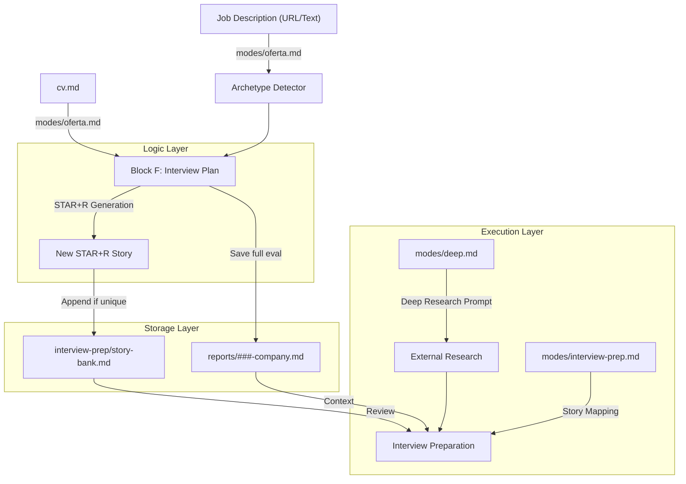
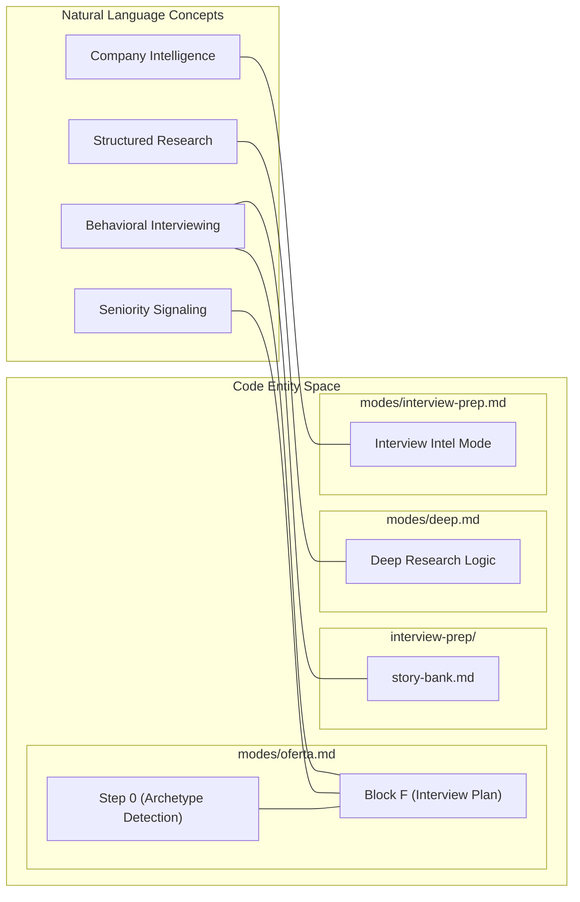

# Interview Preparation & Story Bank

Relevant source files

The following files were used as context for generating this wiki page:

- [interview-prep/story-bank.md](interview-prep/story-bank.md)
- [modes/deep.md](modes/deep.md)
- [modes/interview-prep.md](modes/interview-prep.md)
- [modes/oferta.md](modes/oferta.md)

The **interview-prep/** subsystem is designed to transition a candidate from "qualified applicant" to "hired professional" by building a persistent, evolving repository of behavioral stories and deep company intelligence. Unlike static CVs, the Story Bank grows with every job evaluation, ensuring that the candidate's interview performance improves cumulatively across multiple applications.

## Persistent Story Repository: `story-bank.md`

The core of this subsystem is `interview-prep/story-bank.md`, a Markdown-based "experience database" [interview-prep/story-bank.md:1-3](). It uses the **STAR+R** framework (Situation, Task, Action, Result + **Reflection**) to document professional achievements.

The addition of **Reflection** is a technical design choice to signal seniority; while junior candidates focus on the "what," the system prompts senior candidates to extract "lessons learned" or "what I would do differently" [modes/oferta.md:72-72]().

### Data Flow: Generation to Persistence

Stories are harvested during the job evaluation process and stored for long-term reuse.

1.  **Trigger:** A user runs `/career-ops oferta` or the `auto-pipeline` [modes/oferta.md:1-3]().
2.  **Extraction:** In **Block F (Interview Plan)**, the AI maps JD requirements to the candidate's `cv.md` and `article-digest.md` [modes/oferta.md:65-70]().
3.  **Formatting:** The AI generates 6-10 STAR+R stories tailored to the specific role archetype (e.g., FDE, LLMOps, PM) [modes/oferta.md:76-82]().
4.  **Persistence:** The system checks if these stories exist in `interview-prep/story-bank.md`. If not, it appends new ones to the file [modes/oferta.md:74-74](), [interview-prep/story-bank.md:7-12]().

### Story Bank Structure

The bank organizes stories by "Theme" to allow quick retrieval during interview prep [interview-prep/story-bank.md:17-26]().

| Field | Description | Source |
| :--- | :--- | :--- |
| **Theme** | The behavioral category (e.g., Conflict, Leadership, Technical Debt). | [interview-prep/story-bank.md:18-18]() |
| **Source** | Reference to the specific `reports/` file where the story originated. | [interview-prep/story-bank.md:19-19]() |
| **STAR+R** | The core narrative components including the Reflection. | [interview-prep/story-bank.md:20-24]() |
| **Best for** | A list of specific interview questions this story can answer. | [interview-prep/story-bank.md:25-25]() |

**Sources:** [interview-prep/story-bank.md:1-27](), [modes/oferta.md:65-82]()

---

## Interview Prep Logic (Block F)

When evaluating a specific job offer via `modes/oferta.md`, the system generates a tailored **Interview Plan** in Block F. This plan is heavily influenced by the **Archetype Detection** performed in Step 0 [modes/oferta.md:5-10]().

### Archetype-Driven Framing
The system frames stories differently based on the detected role type to align with what the hiring team expects [modes/oferta.md:76-82]():

| Archetype | Story Framing Focus |
| :--- | :--- |
| **FDE (Forward Deployed)** | Delivery speed and client-facing impact [modes/oferta.md:77-77](). |
| **SA (Solutions Architect)** | Architectural decisions and system integrations [modes/oferta.md:78-78](). |
| **LLMOps** | Metrics, evaluations, and production hardening [modes/oferta.md:80-80](). |
| **Agentic** | Orchestration, error handling, and Human-in-the-loop (HITL) [modes/oferta.md:81-81](). |
| **Transformation** | Organizational change and adoption metrics [modes/oferta.md:82-82](). |
| **PM** | Product discovery and trade-offs [modes/oferta.md:79-79](). |

**Sources:** [modes/oferta.md:5-10](), [modes/oferta.md:76-82]()

---

## Company-Specific Intelligence (`interview-prep.md`)

The `modes/interview-prep.md` mode provides targeted intelligence when an application reaches the `Interview` status [modes/interview-prep.md:1-3]().

### Research Execution
The mode executes targeted `WebSearch` queries to extract structured data across three distinct audiences [modes/interview-prep.md:15-19]():
*   **Recruiter / HR screen:** Focuses on comp ranges (Levels.fyi/Glassdoor), process timelines, and benefits [modes/interview-prep.md:21-26]().
*   **Hiring manager / leadership:** Focuses on engineering blogs, product roadmaps, and hiring drivers [modes/interview-prep.md:30-34]().
*   **Peer / technical panel:** Focuses on specific coding questions from LeetCode/Glassdoor and technical bars from Blind [modes/interview-prep.md:38-42]().

### Audience Mapping
A key feature is the classification of interview rounds into specific audiences (`recruiter-screen`, `hiring-manager`, `peer-tech`, or `panel-mixed`), which determines the preparation strategy [modes/interview-prep.md:67-77]().

**Sources:** [modes/interview-prep.md:1-112]()

---

## Deep Research Mode (`deep.md`)

The `modes/deep.md` skill generates a comprehensive prompt for external research tools like Perplexity or Claude [modes/deep.md:22-25]().

### Language Resolution
This mode overrides the standard JD-language default. It resolves output language based on:
1.  **User prompt language** [modes/deep.md:10-12]().
2.  **`config/profile.yml`** locale settings [modes/deep.md:13-15]().
3.  **JD language** as a fallback [modes/deep.md:16-17]().

### Research Axes
The generated prompt covers six critical dimensions:
1.  **AI Strategy:** Engineering blogs, AI stack, and ML features [modes/deep.md:29-33]().
2.  **Recent Movements:** Funding, leadership changes, and pivots [modes/deep.md:35-39]().
3.  **Engineering Culture:** Deployment cadence and remote-first policies [modes/deep.md:41-46]().
4.  **Probable Challenges:** Scaling issues and reliability pain points [modes/deep.md:48-52]().
5.  **Competitive Landscape:** Moats and differentiation [modes/deep.md:54-57]().
6.  **Candidate Angle:** Personalized value proposition using `cv.md` and `profile.yml` [modes/deep.md:59-64]().

**Sources:** [modes/deep.md:1-68]()

---

## Technical Data Flow: Story Lifecycle

The following diagram illustrates how a story moves from a Job Description into the persistent Story Bank and finally into an interview.

### System Architecture: Story Propagation

**Sources:** [modes/oferta.md:65-74](), [interview-prep/story-bank.md:1-12](), [modes/deep.md:1-45](), [modes/interview-prep.md:1-10]()

### Entity Mapping: Natural Language to Code
This diagram maps the conceptual interview preparation steps to the specific files and blocks that implement them.

**Sources:** [modes/oferta.md:5-10](), [modes/oferta.md:65-72](), [interview-prep/story-bank.md:1-5](), [modes/deep.md:1-10](), [modes/interview-prep.md:15-19]()
