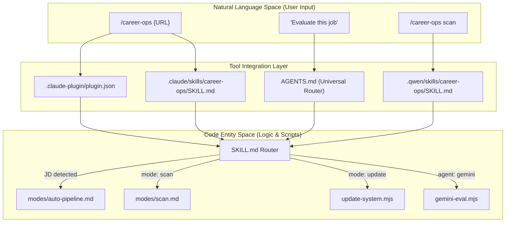
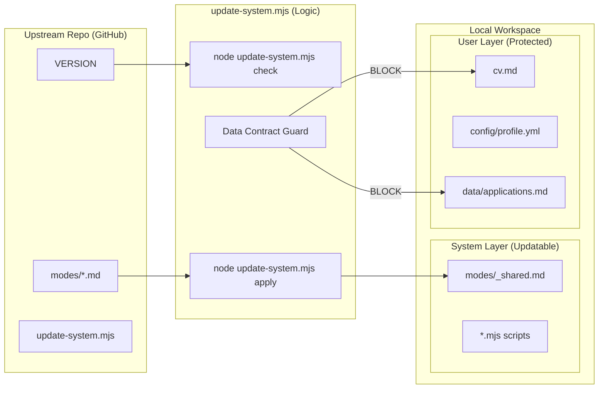

# Multi-Agent & Tool Integration

Relevant source files

The following files were used as context for generating this wiki page:

- [.agents/skills/career-ops/SKILL.md](.agents/skills/career-ops/SKILL.md)
- [.claude-plugin/marketplace.json](.claude-plugin/marketplace.json)
- [.claude-plugin/plugin.json](.claude-plugin/plugin.json)
- [.claude/skills/career-ops/SKILL.md](.claude/skills/career-ops/SKILL.md)
- [.qwen/skills/career-ops/SKILL.md](.qwen/skills/career-ops/SKILL.md)
- [AGENTS.md](AGENTS.md)
- [CLAUDE.md](CLAUDE.md)
- [GEMINI.md](GEMINI.md)
- [analyze-patterns.mjs](analyze-patterns.mjs)
- [followup-cadence.mjs](followup-cadence.mjs)
- [modes/followup.md](modes/followup.md)
- [modes/patterns.md](modes/patterns.md)
- [modes/tr/README.md](modes/tr/README.md)
- [modes/tr/_shared.md](modes/tr/_shared.md)
- [modes/tr/basvuru.md](modes/tr/basvuru.md)
- [modes/tr/is-ilani.md](modes/tr/is-ilani.md)
- [modes/tr/pipeline.md](modes/tr/pipeline.md)

This page provides an overview of how `career-ops` functions as a cross-tool command center. While optimized for **Claude Code**, the system architecture is designed to be tool-agnostic, integrating with multiple AI coding assistants (Gemini, Qwen, Copilot, Kimi) and maintaining a robust self-update mechanism that preserves user data.

## Integration Architecture

The system uses a layered approach to integration. High-level "Slash Commands" are mapped to specific "Skills," which then route to "Modes" (Markdown-based instruction sets). This ensures that whether a user is in a terminal using Claude Code or an IDE using a different agent, the underlying logic remains consistent.

### Multi-Agent Routing Flow

The following diagram illustrates how a natural language intent (e.g., "evaluate this job") travels from various entry points to the core logic defined in the `modes/` directory.

**Diagram: Intent Routing to Code Entities**

Sources: [.claude/skills/career-ops/SKILL.md:9-37](), [AGENTS.md:45-48](), [.claude-plugin/plugin.json:1-18]()

---

## Agent Routing Layer (AGENTS.md & SKILL.md)

`career-ops` provides explicit support for multiple agents through a unified skill standard. The `AGENTS.md` file serves as the universal routing layer shared by all AI CLI clients [AGENTS.md:1-10]().

*   **Claude Code**: Uses `.claude/skills/career-ops/SKILL.md` to dispatch commands and handle auto-pipeline detection [ .claude/skills/career-ops/SKILL.md:12-36]().
*   **Qwen & Others**: Integration files in `.qwen/skills/` and `.agents/skills/` provide compatibility shims for different agent ecosystems.
*   **Marketplace Integration**: The `.claude-plugin/` directory contains `plugin.json` and `marketplace.json` for marketplace visibility and permission management (e.g., WebSearch and Bash access) [.claude-plugin/plugin.json:10-17]().

For details, see [Agent Routing Layer (AGENTS.md, CLAUDE.md, GEMINI.md, Qwen)](#8.1).

---

## Gemini Evaluator (gemini-eval.mjs)

For users seeking a free-tier alternative to Claude, the system includes `gemini-eval.mjs`. This standalone script allows for high-quality job evaluations using Google's Gemini models without requiring a full agent environment.

*   **Logic Parity**: It reads `modes/oferta.md`, `modes/_shared.md`, and `cv.md` to ensure evaluations match the Claude-based pipeline [GEMINI.md:1-3]().
*   **Model Lifecycle**: Supports `gemini-2.0-flash` and manages model transitions automatically.
*   **CLI Usage**: Invoked via `node gemini-eval.mjs {JD_TEXT}`.

For details, see [Gemini Evaluator (gemini-eval.mjs)](#8.2).

---

## System Update & Version Management

To ensure AI agents always use the latest scoring logic and templates without overwriting user data, `career-ops` employs a specialized update utility: `update-system.mjs`.

### The Data Contract
The system enforces a strict boundary defined in `DATA_CONTRACT.md`. This separation ensures that personal files like `cv.md` or `config/profile.yml` are never modified by the update process [AGENTS.md:11-23]().

**Diagram: Update Boundary Enforcement**

Sources: [AGENTS.md:11-23](), [AGENTS.md:27-44]()

### Update Commands
Users can manage the system state using the following commands:
*   `node update-system.mjs check`: Checks for new versions and returns JSON status [AGENTS.md:29-34]().
*   `node update-system.mjs apply`: Performs a safe update of system files [AGENTS.md:36-36]().
*   `node update-system.mjs rollback`: Reverts to the previous version in case of failure [AGENTS.md:43-43]().

For details, see [System Update & Version Management](#8.3).

Sources: [AGENTS.md:25-44](), [.claude/skills/career-ops/SKILL.md:6-6]()
