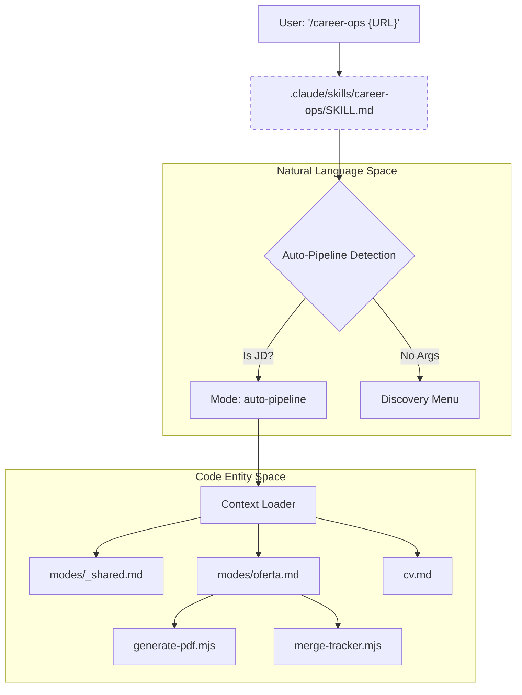
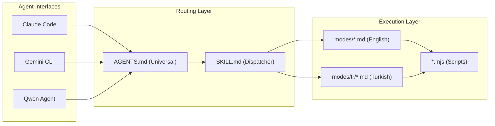

# Agent Routing Layer (AGENTS.md, CLAUDE.md, GEMINI.md, Qwen)

Relevant source files

The following files were used as context for generating this wiki page:

- [.agents/skills/career-ops/SKILL.md](.agents/skills/career-ops/SKILL.md)
- [.claude-plugin/marketplace.json](.claude-plugin/marketplace.json)
- [.claude-plugin/plugin.json](.claude-plugin/plugin.json)
- [.claude/skills/career-ops/SKILL.md](.claude/skills/career-ops/SKILL.md)
- [.qwen/skills/career-ops/SKILL.md](.qwen/skills/career-ops/SKILL.md)
- [AGENTS.md](AGENTS.md)
- [CLAUDE.md](CLAUDE.md)
- [GEMINI.md](GEMINI.md)
- [analyze-patterns.mjs](analyze-patterns.mjs)
- [followup-cadence.mjs](followup-cadence.mjs)
- [modes/followup.md](modes/followup.md)
- [modes/patterns.md](modes/patterns.md)
- [modes/tr/README.md](modes/tr/README.md)
- [modes/tr/_shared.md](modes/tr/_shared.md)
- [modes/tr/basvuru.md](modes/tr/basvuru.md)
- [modes/tr/is-ilani.md](modes/tr/is-ilani.md)
- [modes/tr/pipeline.md](modes/tr/pipeline.md)

The **Agent Routing Layer** is the universal entry point for all AI-enabled CLI clients and IDE extensions. It implements the [open agent skill standard](https://agentskills.io), allowing `career-ops` to function as a cohesive "Skill" across Claude Code, Codex, Gemini, OpenCode, Qwen, and Copilot. This layer handles mode dispatching, automatic context loading, and environment-specific overrides.

## Universal Routing Logic (AGENTS.md)

The `AGENTS.md` file serves as the primary manifest for all AI agents. It defines the system's origin, the **Data Contract**, and the onboarding workflow that every agent must follow upon session initialization.

### The Data Contract
To ensure that system updates do not overwrite personal data, the routing layer enforces a strict boundary:

| Layer | Files / Paths | Update Policy |
| :--- | :--- | :--- |
| **User Layer** | `cv.md`, `config/profile.yml`, `modes/_profile.md`, `data/*`, `reports/*` | **NEVER** auto-updated [[AGENTS.md:15-17]]() |
| **System Layer** | `modes/_shared.md`, `AGENTS.md`, `*.mjs`, `dashboard/`, `templates/` | Auto-updatable via `update-system.mjs` [[AGENTS.md:19-21]]() |

**The Core Rule:** Agents must always write customizations (archetypes, salary targets) to `modes/_profile.md` or `config/profile.yml`, never to the system-level `_shared.md` [[AGENTS.md:23]]().

### Session Initialization & Onboarding
Every agent session begins with a silent check of `cv.md`, `config/profile.yml`, and `portals.yml` [[AGENTS.md:74-80]](). If these are missing, the agent enters **Onboarding Mode**, guiding the user through CV creation and profile setup [[AGENTS.md:83-110]]().

**Sources:**
- [AGENTS.md:11-44]()
- [AGENTS.md:72-106]()

## Mode Dispatcher (SKILL.md)

The dispatcher located at `.claude/skills/career-ops/SKILL.md` (with shims in `.agents/skills/` and `.qwen/skills/`) acts as the routing table for the `/career-ops` slash command.

### Mode Routing Table
The dispatcher maps the `$mode` argument to specific Markdown instruction sets:

| Input | Mode | Description |
| :--- | :--- | :--- |
| (empty) | `discovery` | Shows the command menu [[.claude/skills/career-ops/SKILL.md:18]]() |
| JD Text/URL | `auto-pipeline` | Automatic detection of job descriptions [[.claude/skills/career-ops/SKILL.md:19]]() |
| `oferta` | `oferta` | A-F evaluation only [[.claude/skills/career-ops/SKILL.md:20]]() |
| `scan` | `scan` | Portal scanning (delegated to subagent) [[.claude/skills/career-ops/SKILL.md:31]]() |
| `apply` | `apply` | Form-filling assistant (delegated to subagent) [[.claude/skills/career-ops/SKILL.md:30]]() |

### Context Loading Strategy
The dispatcher optimizes token usage by loading only the necessary files for a given mode:
1.  **Shared Context:** Modes like `auto-pipeline` or `oferta` read `modes/_shared.md` + `modes/{mode}.md` [[.claude/skills/career-ops/SKILL.md:77-80]]().
2.  **Standalone:** Research modes like `deep` or `tracker` only load their specific mode file [[.claude/skills/career-ops/SKILL.md:82-85]]().
3.  **Subagent Delegation:** High-complexity tasks (`scan`, `apply`) launch a general-purpose subagent with injected context [[.claude/skills/career-ops/SKILL.md:87-96]]().

**Sources:**
- [.claude/skills/career-ops/SKILL.md:12-39]()
- [.claude/skills/career-ops/SKILL.md:73-98]()

## Multi-Agent Integration Flow

The following diagram bridges the **Natural Language Space** (User Intents) to the **Code Entity Space** (Scripts and Mode files).

### Command Execution Pipeline
Title: Agent Command Resolution & Context Injection

**Sources:**
- [.claude/skills/career-ops/SKILL.md:36-38]()
- [.claude/skills/career-ops/SKILL.md:77-80]()

## Platform Overlays

While `AGENTS.md` provides universal rules, platform-specific overlays allow for fine-tuning:

*   **CLAUDE.md**: Imports `@AGENTS.md` and adds Claude Code specific optimizations [[CLAUDE.md:1-2]]().
*   **GEMINI.md**: Imports `@./AGENTS.md` for Google's Gemini CLI [[GEMINI.md:1]]().
*   **Qwen Integration**: Managed via `.qwen/skills/career-ops/SKILL.md`, providing compatibility for Alibaba's Qwen agent.
*   **Marketplace Manifest**: The `.claude-plugin/plugin.json` and `marketplace.json` define permissions (Bash, WebFetch, WebSearch) and metadata for the Claude extension ecosystem [[.claude-plugin/plugin.json:1-18]]() [[.claude-plugin/marketplace.json:1-18]]().

## Localized Routing (i18n)

The routing layer supports localized workflows through language-specific subdirectories (e.g., `modes/tr/`).

### Turkish Mode (modes/tr/)
The Turkish integration (`modes/tr/README.md`) adapts the agent's behavior for the DACH/TR market, handling specific concepts like **SGK**, **Kıdem Tazminatı** (severance), and **TÜFE** (inflation) adjustments [[modes/tr/README.md:53-65]]().

*   **Activation:** Users can activate via command or by setting `language.modes_dir: modes/tr` in `config/profile.yml` [[modes/tr/README.md:18-38]]().
*   **Turkish Dispatcher:** `modes/tr/is-ilani.md` replaces the standard `oferta.md` for full A-G evaluations in Turkish [[modes/tr/is-ilani.md:1-150]]().

### Agent System Topology
Title: Multi-Platform System Topology

**Sources:**
- [modes/tr/README.md:1-49]()
- [modes/tr/is-ilani.md:1-150]()
- [.claude-plugin/plugin.json:10-17]()
