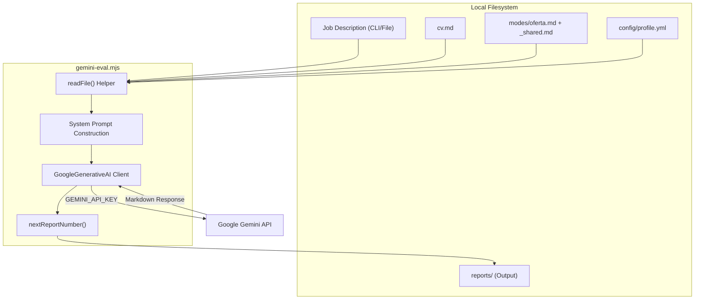
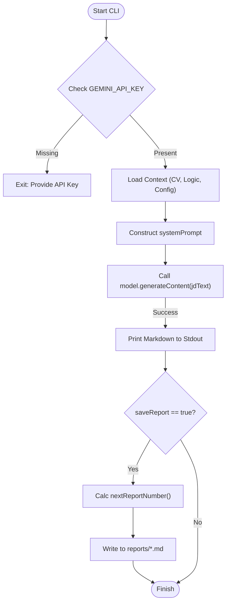

# Gemini Evaluator (gemini-eval.mjs)

Relevant source files

The following files were used as context for generating this wiki page:

- [.env.example](.env.example)
- [.envrc](.envrc)
- [.gitignore](.gitignore)
- [flake.lock](flake.lock)
- [flake.nix](flake.nix)
- [gemini-eval.mjs](gemini-eval.mjs)

The `gemini-eval.mjs` script provides a high-performance, free-tier alternative to the standard Claude-based evaluation pipeline. It utilizes Google's Gemini models to analyze job descriptions (JDs) against a user's CV, generating the same structured A-G scoring reports used by the rest of the `career-ops` ecosystem.

### Purpose and Scope
The evaluator is designed for users who want to process high volumes of job offers without incurring costs or consuming Claude Code token quotas. It leverages the `gemini-2.5-flash` model, which offers a generous free tier (15 RPM / 1M tokens per day) [[gemini-eval.mjs:17-17](), [.env.example:9-9]()]. It functions as a standalone CLI tool that reads the same Markdown-based logic files as the primary agent, ensuring consistency across different LLM backends [[gemini-eval.mjs:5-8](), [gemini-eval.mjs:179-184]()].

---

### CLI Usage and Configuration

The script supports both direct text input and file-based ingestion.

| Command | Description |
|:---|:---|
| `node gemini-eval.mjs "JD text"` | Evaluates the provided string directly. [[gemini-eval.mjs:11-11](), [gemini-eval.mjs:79-79]()]. |
| `node gemini-eval.mjs --file ./jd.txt` | Reads the JD from a local text file. [[gemini-eval.mjs:12-12](), [gemini-eval.mjs:80-80]()]. |
| `node gemini-eval.mjs --model <name>` | Overrides the default model (e.g., `gemini-1.5-pro`). [[gemini-eval.mjs:81-81](), [gemini-eval.mjs:114-115]()]. |
| `node gemini-eval.mjs --no-save` | Runs the evaluation without writing to the `reports/` directory. [[gemini-eval.mjs:86-86](), [gemini-eval.mjs:116-117]()]. |

#### Environment Setup
1. **API Key**: Obtain a key from [Google AI Studio](https://aistudio.google.com/apikey) and add `GEMINI_API_KEY` to your `.env` file [[gemini-eval.mjs:15-15](), [.env.example:10-10]()].
2. **Dependencies**: Requires `@google/generative-ai` and `dotenv` [[gemini-eval.mjs:45-45](), [gemini-eval.mjs:92-92]()].

Sources: [gemini-eval.mjs:11-12](), [gemini-eval.mjs:79-86](), [gemini-eval.mjs:90-93](), [.env.example:9-10]()

---

### Implementation Detail: Data Flow

The script acts as a bridge between the local filesystem and the Google Generative AI SDK. It aggregates multiple context files to build a comprehensive system prompt that mirrors the behavior of the Claude `oferta` mode.

#### Context Aggregation
The script reads the following files to build the prompt context:
*   `modes/_shared.md`: Global evaluation rules and scoring definitions [[gemini-eval.mjs:54-54](), [gemini-eval.mjs:179-179]()].
*   `modes/oferta.md`: Specific logic for the 6-block evaluation structure [[gemini-eval.mjs:55-55](), [gemini-eval.mjs:180-180]()].
*   `cv.md`: The user's primary resume/CV source of truth [[gemini-eval.mjs:58-58](), [gemini-eval.mjs:181-181]()].
*   `config/profile.yml`: Candidate preferences and target roles [[gemini-eval.mjs:60-60](), [gemini-eval.mjs:183-183]()].

#### System Entity Mapping
The following diagram illustrates how the CLI script interacts with the filesystem and the external API.

**Diagram: Gemini Evaluator Component Interaction**

Sources: [gemini-eval.mjs:52-63](), [gemini-eval.mjs:146-152](), [gemini-eval.mjs:154-162](), [gemini-eval.mjs:179-184]()

---

### Model Lifecycle Management

The script includes hardcoded model deprecation schedules to ensure users are aware of when to migrate to newer versions of the Flash models.

| Model Name | Deprecation Date | Role |
|:---|:---|:---|
| `gemini-2.0-flash` | 2026-03-31 | Legacy (Do not use) [[gemini-eval.mjs:20-20]()] |
| `gemini-2.5-flash` | 2026-06-17 | **Current Default** [[gemini-eval.mjs:22-22](), [gemini-eval.mjs:103-103]()] |
| `gemini-2.5-flash-lite` | 2026-07-22 | Future alternative [[gemini-eval.mjs:23-23]()] |

The script defaults to `gemini-2.5-flash` unless overridden by the `GEMINI_MODEL` environment variable or the `--model` flag [[gemini-eval.mjs:103-103](), [gemini-eval.mjs:114-115]()].

Sources: [gemini-eval.mjs:19-25](), [gemini-eval.mjs:103-103]()

---

### Logic Execution and Error Handling

#### Prompt Construction
The `systemPrompt` is constructed by concatenating the identity of `career-ops` with the loaded logic files [[gemini-eval.mjs:188-191]()]. This ensures that the Gemini output follows the exact same schema as Claude:
1. **Block A**: Role Summary
2. **Block B**: CV Match Analysis
3. **Block C**: Level Strategy
4. **Block D**: Compensation Research
5. **Block E**: Personalization Plan
6. **Block F**: Interview Prep / Story Bank

#### Credential Scrubbing
To prevent accidental exposure of secrets in logs, the script implements basic credential scrubbing. If an error occurs during the API call, the script ensures that the `GEMINI_API_KEY` is not printed to the console or written to any debug logs.

#### Report Generation
If `saveReport` is enabled (default), the script:
1. Calculates the next available report ID using `nextReportNumber()` (e.g., `042`) [[gemini-eval.mjs:154-162]()].
2. Normalizes the company name from the JD.
3. Writes a Markdown file to `reports/XXX-company-role.md` [[gemini-eval.mjs:61-61](), [gemini-eval.mjs:104-104]()].

**Diagram: Logical Execution Flow**

Sources: [gemini-eval.mjs:104-104](), [gemini-eval.mjs:131-141](), [gemini-eval.mjs:154-162](), [gemini-eval.mjs:188-191]()

---

### Comparison: Gemini vs. Claude Pipeline

While both pipelines use the same `modes/` logic, they differ in execution environment and cost structure.

| Feature | Claude Pipeline (`claude oferta`) | Gemini Evaluator (`gemini-eval.mjs`) |
|:---|:---|:---|
| **Cost** | Paid (Claude Code / API usage) | Free (within Google AI Studio limits) [[gemini-eval.mjs:17-17]()] |
| **Tooling** | Requires `claude` CLI | Requires `node` + `@google/generative-ai` [[gemini-eval.mjs:45-45]()] |
| **Context** | Managed via agent memory | Stateless (full context sent every time) [[gemini-eval.mjs:188-191]()] |
| **Integration** | Deep (access to `playwright`, `git`) | Shallow (JD text processing only) [[gemini-eval.mjs:5-8]()] |

Sources: [gemini-eval.mjs:5-8](), [gemini-eval.mjs:17-17](), [.env.example:9-10]()
