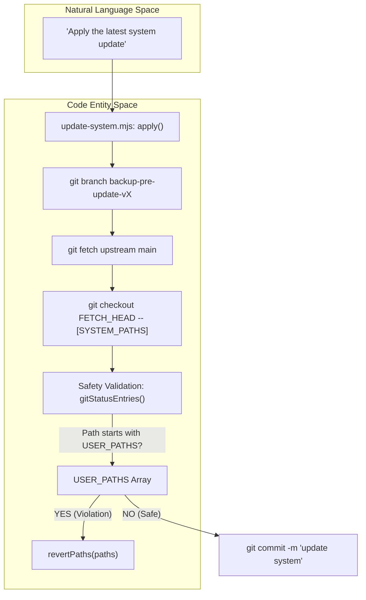
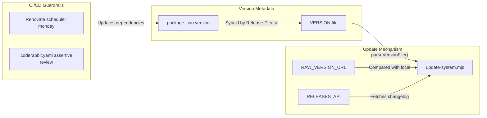

# System Update & Version Management

Relevant source files

The following files were used as context for generating this wiki page:

- [.coderabbit.yaml](.coderabbit.yaml)
- [.github/workflows/release.yml](.github/workflows/release.yml)
- [DATA_CONTRACT.md](DATA_CONTRACT.md)
- [VERSION](VERSION)
- [modes/_profile.template.md](modes/_profile.template.md)
- [release-please-config.json](release-please-config.json)
- [renovate.json](renovate.json)
- [update-system.mjs](update-system.mjs)
- [writing-samples/README.md](writing-samples/README.md)

The Career-Ops system implements a robust update mechanism designed to evolve the AI agent's logic and tooling while strictly protecting personal user data. This is achieved through a rigid separation of concerns defined in the project's **Data Contract**.

## The Data Contract: System vs. User Layers

The system distinguishes between two layers to ensure that updates never overwrite candidate-specific information. This boundary is defined in `DATA_CONTRACT.md` and enforced by the `update-system.mjs` script.

### User Layer (Immutable by System)
The User Layer contains personal data, customizations, and work products. The update process is explicitly forbidden from reading, modifying, or deleting these files [DATA_CONTRACT.md:69-70]().

| File/Path | Purpose |
|-----------|---------|
| `cv.md` | Candidate CV source of truth [DATA_CONTRACT.md:11]() |
| `config/profile.yml` | Identity, targets, and compensation ranges [DATA_CONTRACT.md:12]() |
| `modes/_profile.md` | Personal archetypes and negotiation scripts [DATA_CONTRACT.md:13]() |
| `data/` | Tracker, pipeline, and history databases [DATA_CONTRACT.md:17-20]() |
| `reports/` | Generated evaluation reports [DATA_CONTRACT.md:22]() |
| `interview-prep/story-bank.md` | Accumulated STAR+R stories [DATA_CONTRACT.md:15]() |

### System Layer (Auto-Updatable)
The System Layer contains the core logic, agent instructions, and utility scripts. These are safely replaced during the update process [DATA_CONTRACT.md:71-72]().

| File/Path | Purpose |
|-----------|---------|
| `modes/*.md` | AI agent behavior and scoring logic [DATA_CONTRACT.md:32-47]() |
| `*.mjs` | Node.js utility scripts [DATA_CONTRACT.md:55]() |
| `dashboard/` | Go TUI application source [DATA_CONTRACT.md:58]() |
| `batch/` | Batch processing orchestrator and templates [DATA_CONTRACT.md:56-57]() |

**Sources:** [DATA_CONTRACT.md:1-72](), [update-system.mjs:31-105]()

---

## Technical Implementation: update-system.mjs

The `update-system.mjs` script is the primary tool for managing the lifecycle of the system layer. It uses `git` for atomic operations and rollback capabilities.

### Command Reference
The script supports four primary operations [update-system.mjs:10-13]():
*   `check`: Compares `localVersion()` against the `RAW_VERSION_URL` and fetches the latest changelog from the GitHub Releases API [update-system.mjs:156-236]().
*   `apply`: Executes the multi-step update workflow, including backup creation and safety validation.
*   `rollback`: Reverts the system to the state captured in the backup branch.
*   `dismiss`: Silences update notifications by creating a `.update-dismissed` flag file [update-system.mjs:158-161]().

### Version Resolution Logic
The `check()` function fetches data from both the raw `VERSION` file and the GitHub Releases API in parallel using `Promise.allSettled` [update-system.mjs:174-183](). It uses the higher version between the two to handle cases where the file might not have been bumped yet or the raw host is unreachable [update-system.mjs:224-231]().

### System Update Flow
This diagram illustrates the transition from natural language commands to the code-level execution of the update safety checks.

Title: System Update Safety Workflow

**Sources:** [update-system.mjs:31-90](), [update-system.mjs:93-105](), [update-system.mjs:132-142](), [update-system.mjs:156-241]()

---

## Versioning & Release Infrastructure

The project follows Semantic Versioning (SemVer) managed through automated tooling to ensure consistency between the code, the manifest, and the CLI.

### Release Components
*   **VERSION File**: A plain text file containing the current SemVer string (e.g., `1.8.0`), used by the update script to identify the local state [VERSION:1](), [update-system.mjs:113-116]().
*   **Release-Please**: Automates version bumps and CHANGELOG updates based on Conventional Commits. It uses `release-please-config.json` to synchronize the version across `package.json` and the manifest [.github/workflows/release.yml:14-17](), [release-please-config.json:8-14]().

### Version Propagation and CI Guardrails
Title: Version Propagation and CI Guardrails

**Sources:** [VERSION:1](), [update-system.mjs:27-28](), [update-system.mjs:107-111](), [release-please-config.json:1-17](), [renovate.json:9]()

---

## CI Guardrails & Security

The system employs multiple layers of automated review to prevent regressions or security vulnerabilities from entering the system layer.

### CodeRabbit AI Review
The `.coderabbit.yaml` configuration enforces "assertive" reviews with specific instructions for critical files:
*   **CLAUDE.md**: Monitored for agent instruction conflicts [.coderabbit.yaml:13-14]().
*   **_shared.md**: Changes to scoring logic are flagged [.coderabbit.yaml:15-16]().
*   **DATA_CONTRACT.md**: Any reclassification of user-layer files is rejected [.coderabbit.yaml:17-18]().
*   **Scripts (*.mjs)**: Scanned for command injection, path traversal, and SSRF [.coderabbit.yaml:19-20]().

### Automated Dependency Management
*   **Renovate**: Configured to group non-major updates for GitHub Actions, Go, and npm dependencies. Updates are scheduled for Monday mornings [renovate.json:5-28]().
*   **Semantic Commits**: Renovate is configured to use semantic commits to maintain a clean, parseable history for `release-please` [renovate.json:6]().

**Sources:** [.coderabbit.yaml:1-25](), [renovate.json:1-30](), [update-system.mjs:3-16]()
