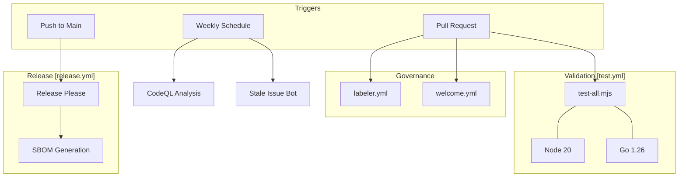
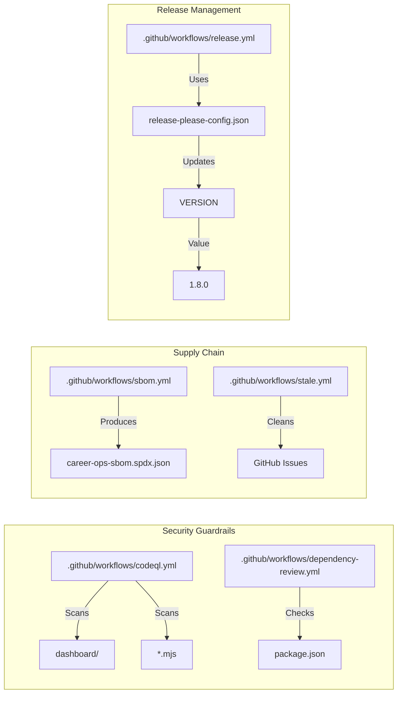

# Infrastructure & CI/CD

Relevant source files

The following files were used as context for generating this wiki page:

- [.github/labeler.yml](.github/labeler.yml)
- [.github/workflows/codeql.yml](.github/workflows/codeql.yml)
- [.github/workflows/dependency-review.yml](.github/workflows/dependency-review.yml)
- [.github/workflows/labeler.yml](.github/workflows/labeler.yml)
- [.github/workflows/release.yml](.github/workflows/release.yml)
- [.github/workflows/sbom.yml](.github/workflows/sbom.yml)
- [.github/workflows/stale.yml](.github/workflows/stale.yml)
- [.github/workflows/test.yml](.github/workflows/test.yml)
- [.github/workflows/welcome.yml](.github/workflows/welcome.yml)
- [VERSION](VERSION)
- [modes/_profile.template.md](modes/_profile.template.md)
- [release-please-config.json](release-please-config.json)

The `career-ops` repository utilizes a robust automation infrastructure to ensure the integrity of its AI agent modes, data processing scripts, and the Go-based dashboard. This infrastructure spans automated testing, dependency management, security scanning, and a standardized release process.

## Automation Architecture

The automation stack is primarily driven by GitHub Actions, which orchestrates the execution of Node.js scripts and Go builds. The system distinguishes between core architectural changes and peripheral updates through a strict labeling taxonomy.

### CI/CD Workflow Topology

The following diagram illustrates how various workflows interact with the codebase upon code changes.

**Diagram: CI/CD Pipeline Orchestration**

**Sources:** [.github/workflows/test.yml:1-20](), [.github/workflows/release.yml:1-18](), [.github/workflows/codeql.yml:1-51](), [.github/workflows/stale.yml:1-35](), [.github/workflows/welcome.yml:1-34]().

---

## Testing & CI Pipeline

The primary gatekeeper for the repository is the `test.yml` workflow, which executes the `test-all.mjs` master runner. This suite performs critical checks including syntax validation of `.mjs` files, personal data leak prevention, and Go build verification for the dashboard.

*   **Execution Environment:** Runs on `ubuntu-latest` using Node 20 and Go 1.26 [.github/workflows/test.yml:12-17]().
*   **PR Governance:** The `labeler.yml` workflow automatically categorizes PRs into buckets like `🔴 core-architecture`, `⚠️ agent-behavior`, or `📊 dashboard` based on the file paths modified [.github/labeler.yml:1-56]().
*   **Contributor Onboarding:** A `welcome.yml` workflow greets first-time contributors and provides links to `CONTRIBUTING.md` and `SUPPORT.md` [.github/workflows/welcome.yml:19-33]().

For details, see [Testing & CI Pipeline](#9.1).

**Sources:** [.github/workflows/test.yml:1-20](), [.github/labeler.yml:1-56](), [.github/workflows/welcome.yml:1-34]().

---

## Release Engineering & Security

The repository follows a "Release Please" strategy to automate versioning and changelog generation based on conventional commits. Security is maintained through a multi-layered approach involving automated dependency updates, SBOM generation, and CodeQL scanning.

### Dependency & Security Matrix

| Component | Tool | Frequency / Trigger |
| :--- | :--- | :--- |
| **Versioning** | `release-please` | Push to `main` [.github/workflows/release.yml:1-18]() |
| **Dependencies** | `Renovate` | Configured via `renovate.json` (Internal) |
| **Security Scan** | `CodeQL` | Weekly (Monday 4am) + PRs [.github/workflows/codeql.yml:7-8]() |
| **Dep Review** | `dependency-review` | Every PR (Fail on High) [.github/workflows/dependency-review.yml:23-27]() |
| **SBOM** | `anchore/sbom-action` | On Release Publication [.github/workflows/sbom.yml:3-4]() |

### Code Entity Association: Security & Release

This diagram maps the security and release automation to the specific configuration files and entities they manage.

**Diagram: Security and Release Entity Mapping**

For details, see [Release Engineering & Security](#9.2).

**Sources:** [VERSION:1-1](), [release-please-config.json:1-17](), [.github/workflows/sbom.yml:16-21](), [.github/workflows/dependency-review.yml:1-27](), [.github/workflows/codeql.yml:1-51]().

---

## Child Pages
- **[Testing & CI Pipeline](#9.1)**: Deep dive into `test-all.mjs`, the Node/Go test matrix, and PR labeling logic.
- **[Release Engineering & Security](#9.2)**: Details on the release manifest, Renovate configuration, SBOM generation, and automated security scanning.
