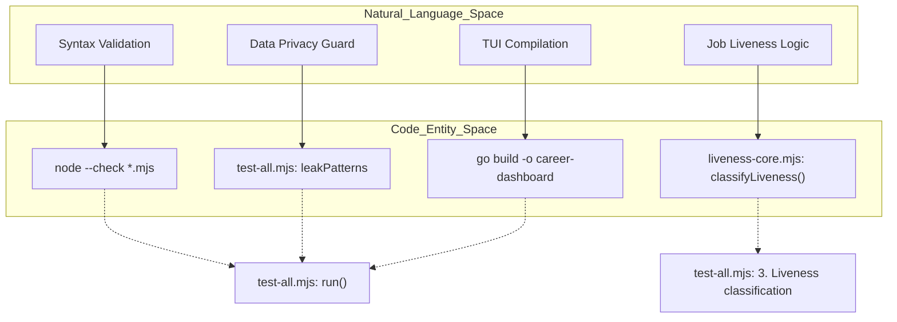
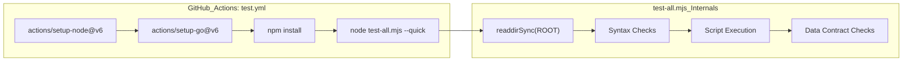

# Testing & CI Pipeline

Relevant source files

The following files were used as context for generating this wiki page:

- [.github/labeler.yml](.github/labeler.yml)
- [.github/workflows/labeler.yml](.github/workflows/labeler.yml)
- [.github/workflows/test.yml](.github/workflows/test.yml)
- [.github/workflows/welcome.yml](.github/workflows/welcome.yml)
- [check-liveness.mjs](check-liveness.mjs)
- [liveness-core.mjs](liveness-core.mjs)
- [test-all.mjs](test-all.mjs)

This page details the automated quality assurance and continuous integration infrastructure of the `career-ops` repository. The system employs a multi-layered testing strategy that validates everything from JavaScript syntax and Go compilation to complex AI agent behaviors and data privacy constraints.

## Master Test Runner (`test-all.mjs`)

The `test-all.mjs` script serves as the central orchestrator for all local and CI-based tests [test-all.mjs:4-7](). It is designed to be executed before any PR submission to ensure the integrity of the "System Layer" while respecting the "User Layer" boundaries defined in `DATA_CONTRACT.md`.

### Execution Flow

The runner performs six distinct phases of validation:

1.  **Syntax Checks**: Iterates through all `.mjs` files in the root directory and validates them using `node --check` [test-all.mjs:51-59]().
2.  **Script Execution**: Runs core utility scripts (e.g., `verify-pipeline.mjs`, `normalize-statuses.mjs`, `merge-tracker.mjs`) to ensure they handle empty or missing data gracefully without crashing [test-all.mjs:63-83]().
3.  **Liveness Classification**: Imports `liveness-core.mjs` to unit test the regex-based job status detection logic against known "expired" and "active" HTML snippets [test-all.mjs:87-138]().
4.  **Dashboard Build**: Verifies that the Go-based TUI compiles correctly [test-all.mjs:142-149](). This step can be skipped using the `--quick` flag [test-all.mjs:11]().
5.  **Data Contract Validation**: Ensures essential system files (like `CLAUDE.md`, `VERSION`, and `modes/_shared.md`) exist [test-all.mjs:156-173](), while verifying that user-specific files (like `config/profile.yml`) are correctly gitignored [test-all.mjs:176-188]().
6.  **Personal Data Leak Check**: Scans the codebase for PII (Personally Identifiable Information) patterns (e.g., specific names, emails, or local paths) to prevent accidental commits of private data [test-all.mjs:192-210]().

### Liveness Logic Testing

The `classifyLiveness` function from `liveness-core.mjs` is a critical component used by the `scan` mode and `check-liveness.mjs` to filter out expired job postings [liveness-core.mjs:49-78](). The test suite validates this logic by simulating various scenarios:

| Scenario | Input Pattern | Expected Result |
| :--- | :--- | :--- |
| **Expired Page** | "The job you are looking for is no longer open." | `expired` [test-all.mjs:92-101]() |
| **Active Page** | Visible "Apply for this Job" button | `active` [test-all.mjs:103-116]() |
| **Closed Banner** | "Applications have closed for this job" | `expired` [test-all.mjs:118-135]() |
| **Minimal Content** | Less than 300 characters of body text | `expired` [liveness-core.mjs:73-75]() |

**Sources:** [test-all.mjs:1-210](), [liveness-core.mjs:1-79](), [check-liveness.mjs:1-117]()

---

## CI/CD Workflows

The repository uses GitHub Actions to enforce quality standards on every Pull Request.

### Test Workflow (`test.yml`)
This workflow runs on every PR targeting the `main` branch [test.yml:3-5](). It sets up a dual-language environment:
- **Node.js 20**: For running the `.mjs` test suite [test.yml:12-14]().
- **Go 1.26**: For compiling the dashboard [test.yml:15-17]().

The primary command executed is `node test-all.mjs --quick` [test.yml:19]().

### PR Taxonomy & Labeling (`labeler.yml`)
The system automatically categorizes PRs based on the files modified using `actions/labeler@v6` [labeler.yml:1-17]().

| Label | Scope | Files Monitored |
| :--- | :--- | :--- |
| `🔴 core-architecture` | System definitions | `CLAUDE.md`, `DATA_CONTRACT.md`, `modes/_shared.md` [.github/labeler.yml:1-6]() |
| `⚠️ agent-behavior` | AI instructions | `modes/*.md`, `.claude/skills/**` [.github/labeler.yml:8-13]() |
| `🔧 scripts` | Utility logic | `*.mjs`, `batch/**` [.github/labeler.yml:15-19]() |
| `📊 dashboard` | TUI interface | `dashboard/**` [.github/labeler.yml:41-44]() |
| `🌐 i18n` | Translations | `README.*.md`, `modes/de/**`, etc. [.github/labeler.yml:32-39]() |

### Contributor Onboarding (`welcome.yml`)
A dedicated workflow greets first-time contributors and provides immediate links to `CONTRIBUTING.md` and the community Discord [welcome.yml:1-34]().

**Sources:** [.github/workflows/test.yml:1-20](), [.github/labeler.yml:1-56](), [.github/workflows/welcome.yml:1-34]()

---

## Code Entity Mapping

The following diagrams illustrate how the natural language requirements for testing map to specific code entities and how the CI pipeline orchestrates these checks.

### Test Orchestration Mapping
"This diagram bridges the high-level 'Test Phases' to the specific JavaScript functions and shell commands that execute them."

**Sources:** [test-all.mjs:51-59](), [test-all.mjs:194-197](), [test-all.mjs:144](), [liveness-core.mjs:49]()

### CI Pipeline Flow
"This diagram shows the sequence of operations in the GitHub Actions environment."

**Sources:** [.github/workflows/test.yml:11-19](), [test-all.mjs:51-53](), [test-all.mjs:63-72](), [test-all.mjs:156-165]()
