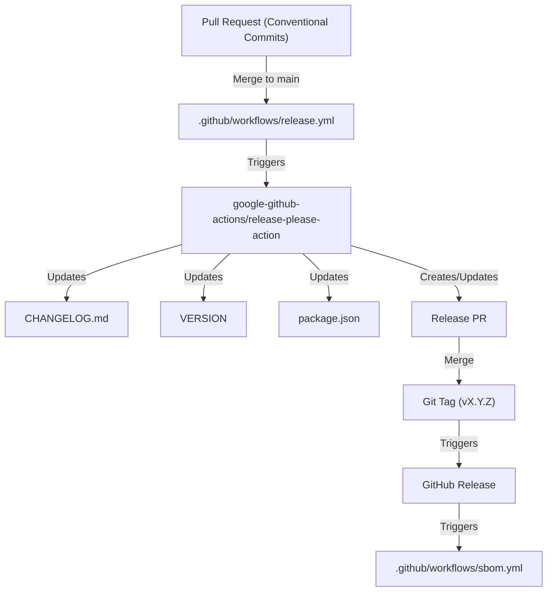
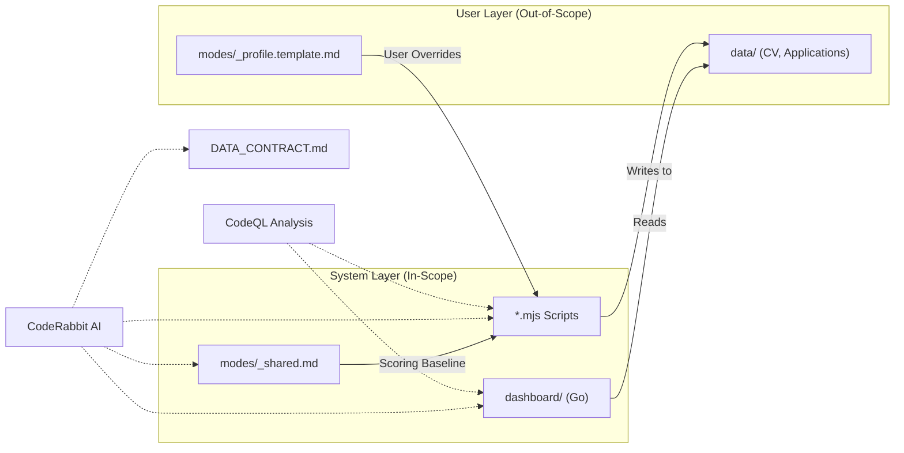

# Release Engineering & Security

Relevant source files

The following files were used as context for generating this wiki page:

- [.coderabbit.yaml](.coderabbit.yaml)
- [.github/dependabot.yml](.github/dependabot.yml)
- [.github/workflows/codeql.yml](.github/workflows/codeql.yml)
- [.github/workflows/dependency-review.yml](.github/workflows/dependency-review.yml)
- [.github/workflows/release.yml](.github/workflows/release.yml)
- [.github/workflows/sbom.yml](.github/workflows/sbom.yml)
- [.github/workflows/stale.yml](.github/workflows/stale.yml)
- [VERSION](VERSION)
- [modes/_profile.template.md](modes/_profile.template.md)
- [release-please-config.json](release-please-config.json)
- [renovate.json](renovate.json)

This page details the automation infrastructure and security protocols governing the `career-ops` repository. It covers the automated release pipeline, dependency management strategies, AI-assisted code review guardrails, and security analysis workflows that ensure the integrity of the career automation suite.

## Release Management Workflow

The project utilizes `release-please` to automate versioning and changelog generation. This workflow relies on **Conventional Commits** to determine semantic version bumps (e.g., `feat:`, `fix:`, `chore:`).

### Release Please Implementation
The release process is triggered by pushes to the `main` branch. The `release-please-action` parses the commit history to maintain the `CHANGELOG.md` and update the version in the manifest file.

- **Workflow Configuration**: Defined in [.github/workflows/release.yml:1-18]().
- **Configuration Details**: Uses the `simple` release type and synchronizes the version in `package.json` [release-please-config.json:3-15]().
- **Version Source**: The current system version is maintained in [VERSION:1-1]().

### Release Lifecycle Diagram

The following diagram illustrates the flow from a developer's pull request to a finalized GitHub Release.

**Release Pipeline Data Flow**

**Sources:** [.github/workflows/release.yml:1-18](), [release-please-config.json:1-17](), [VERSION:1-1]().

---

## Dependency Management & Integrity

`career-ops` uses **Renovate** for automated dependency updates across multiple package managers (npm, Go modules, and GitHub Actions), supplemented by **Dependabot** for secondary coverage.

### Renovate Configuration
The project follows a strict update schedule to minimize developer distraction while maintaining security.
- **Schedule**: Updates are batched for Monday before 7:00 AM [renovate.json:9-9]().
- **Managers**:
    - `github-actions`: Updates workflow actions [renovate.json:14-17]().
    - `gomod`: Manages Go dependencies for the `dashboard/` TUI [renovate.json:19-22]().
    - `npm`: Manages Node.js dependencies for the core scripts [renovate.json:24-27]().
- **Limits**: Concurrent PRs are capped at 5 to prevent CI congestion [renovate.json:11-11]().

### Dependabot Integration
Dependabot provides weekly checks for the same ecosystems to ensure no security patches are missed between Renovate cycles.
- **Ecosystems**: Covers `npm`, `gomod` (in `/dashboard`), and `github-actions` [.github/dependabot.yml:3-19]().

### Dependency Review
For every Pull Request, the `dependency-review-action` scans for new vulnerabilities.
- **Severity Threshold**: The CI is configured to fail if a dependency with a `high` severity vulnerability is introduced [.github/workflows/dependency-review.yml:25-25]().
- **Status**: Currently runs with `continue-on-error: true` as a temporary workaround until dependency graph settings are finalized [.github/workflows/dependency-review.yml:22-23]().

**Sources:** [renovate.json:1-30](), [.github/dependabot.yml:1-20](), [.github/workflows/dependency-review.yml:1-27]().

---

## AI Review Guardrails (CodeRabbit)

To maintain high code quality and safety in a project heavily utilizing AI agents, **CodeRabbit** provides automated AI reviews with specific instructions tailored to the system's architecture.

### Instruction Logic
CodeRabbit is configured with path-specific instructions to protect critical system boundaries:
- **Scoring Logic**: Changes to `modes/_shared.md` are flagged to prevent accidental degradation of the A-F evaluation scoring system [.coderabbit.yaml:15-16]().
- **Data Contract**: Changes to `DATA_CONTRACT.md` are reviewed to ensure the boundary between "System Layer" and "User Layer" is preserved [.coderabbit.yaml:17-18]().
- **Script Safety**: `.mjs` files are audited for command injection, path traversal, and SSRF vulnerabilities [.coderabbit.yaml:19-20]().
- **Dashboard Integrity**: Go code in `dashboard/` is checked for proper error handling and hardcoded paths [.coderabbit.yaml:21-22]().
- **Agent Behavior**: `CLAUDE.md` changes are reviewed for conflicts with existing agent instructions [.coderabbit.yaml:13-14]().

**Sources:** [.coderabbit.yaml:1-25]().

---

## Security Infrastructure

The project implements a multi-layered security strategy encompassing static analysis and SBOM generation.

### Static Analysis (CodeQL)
GitHub CodeQL runs weekly and on every PR to detect vulnerabilities in the codebase.
- **Languages**: Analyzes `javascript-typescript` for scripts and `go` for the dashboard [.github/workflows/codeql.yml:22-22]().
- **Build Integration**: For Go, the workflow builds the dashboard directly to ensure accurate analysis [.github/workflows/codeql.yml:39-41]().
- **Schedule**: Weekly runs occur every Monday at 4am UTC [.github/workflows/codeql.yml:8-8]().

### SBOM Generation
Software Bill of Materials (SBOM) are generated for every published release to provide transparency into the software supply chain.
- **Format**: SPDX-JSON [.github/workflows/sbom.yml:20-21]().
- **Artifact**: `career-ops-sbom.spdx.json` is uploaded directly to the GitHub Release assets using the GitHub CLI [.github/workflows/sbom.yml:26-26]().

**Code Entity to Security Boundary Mapping**

**Sources:** [.github/workflows/codeql.yml:1-51](), [.github/workflows/sbom.yml:1-27](), [.coderabbit.yaml:1-25](), [modes/_profile.template.md:9-10]().

---

## Maintenance & Community Guardrails

To keep the repository healthy and focused, automated workflows manage the lifecycle of issues and PRs.

### Stale Issue Management
The `stale` workflow automatically closes inactive issues and PRs to prevent backlog rot.
- **Schedule**: Runs every Monday at 6am UTC [.github/workflows/stale.yml:4-4]().
- **Issue Threshold**: Marked stale after 60 days, closed after 14 more days [.github/workflows/stale.yml:27-29]().
- **PR Threshold**: Marked stale after 30 days [.github/workflows/stale.yml:28-28]().
- **Exemptions**: Issues/PRs labeled `pinned` or `security` are never marked stale [.github/workflows/stale.yml:33-34]().

**Sources:** [.github/workflows/stale.yml:1-35]().
