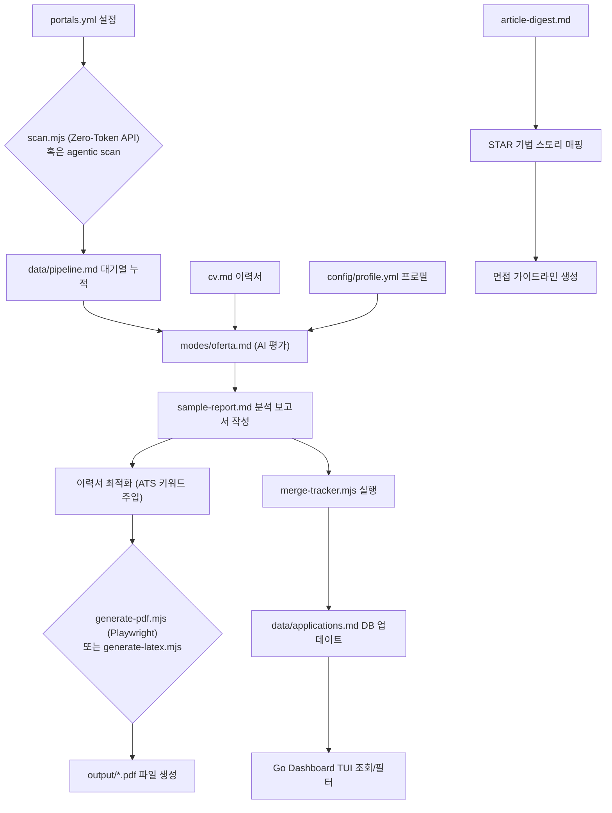

# 🚀 Career-Ops 프로젝트 분석 보고서

**Career-Ops**는 **Claude Code** 및 기타 AI 코딩 CLI 환경을 기반으로 동작하여, 사용자의 이력과 타깃 채용 공고(JD)를 비교하고 맞춤형 이력서를 자동 빌드 및 이력을 추적 관리하는 **AI 기반 구직 파이프라인 자동화 플랫폼**입니다. 단순 대량 지원(Spray-and-Pray)이 아니라, 이력의 적합성을 정밀하게 검증하여 **합격률이 높은 포지션에 집중하도록 돕는 철학**을 지니고 있습니다.

---

## 1. 프로젝트 주요 구성 요소 (Directory & File Structure)

이 프로젝트는 시스템의 규칙과 로직을 정의하는 **System Layer**와, 구직자 개인의 정보가 기록되는 **User Layer**로 엄격히 구분되어 설계되었습니다.

### 📂 주요 디렉토리 구성
*   **`/modes`**: AI 에이전트의 가이드라인과 "스킬"을 정의한 마크다운 파일군. AI가 어떻게 이력서를 빌드하고 공고를 분석할지 지정합니다.
    *   [modes/_shared.md](file:///Users/kkh/Desktop/oss-analysis/artifacts/career-ops/modes/_shared.md): 공통으로 쓰이는 공고 유형(Archetype) 감지 규칙, 평가 채점(1.0 ~ 5.0) 기준이 기록됩니다.
    *   `modes/oferta.md` (혹은 터키어 버전 [modes/tr/is-ilani.md](file:///Users/kkh/Desktop/oss-analysis/artifacts/career-ops/modes/tr/is-ilani.md)): 공고 텍스트/URL을 받아 분석을 실행하는 핵심 로직.
    *   [modes/_profile.md](file:///Users/kkh/Desktop/oss-analysis/artifacts/career-ops/modes/_profile.md): 사용자 고유의 글쓰기 스타일 등 개인화된 캐시 정보 보관.
*   **`/batch`**: 대량의 공고를 병렬로 분석하기 위한 스크립트 모음. 
    *   `batch/batch-runner.sh`가 여러 개의 `claude -p` 에이전트 인스턴스를 띄워 `batch-prompt.md` 로직으로 대량 분석을 처리합니다.
*   **`/data`**: 파이프라인의 진행 상황 및 전체 이력이 저장되는 로컬 데이터베이스 공간.
    *   `data/applications.md`가 단일 진실 공급원(SSOT) 역할을 하여 모든 지원 상태를 flat-file 형식으로 기록합니다.
    *   `data/pipeline.md`는 분석 대상 대기열(Queue) 역할을 합니다.
*   **`templates/`**: 이력서 변환용 템플릿 보관소. HTML 기반([templates/cv-template.html](file:///Users/kkh/Desktop/oss-analysis/artifacts/career-ops/templates/cv-template.html)) 및 LaTeX 기반([templates/cv-template.tex](file:///Users/kkh/Desktop/oss-analysis/artifacts/career-ops/templates/cv-template.tex)) 템플릿을 제공합니다.
*   **`/interview-prep`**: 면접 준비를 위한 이력서 증명 자료(STAR 기법 기반의 성공 사례 및 주요 아키텍처 의사결정)가 정리된 `story-bank.md`를 보관합니다.

### 📄 주요 설정 및 검증 파일
*   **`cv.md`** (템플릿: [examples/cv-example.md](file:///Users/kkh/Desktop/oss-analysis/artifacts/career-ops/examples/cv-example.md)): 사용자의 원본 이력서(Markdown 포맷). 모든 맞춤형 변환과 적합성 분석의 원천이 됩니다.
*   **[config/profile.yml](file:///Users/kkh/Desktop/oss-analysis/artifacts/career-ops/config/profile.yml)** (템플릿: [config/profile.example.yml](file:///Users/kkh/Desktop/oss-analysis/artifacts/career-ops/config/profile.example.yml)): 구직자의 신상 정보, 타깃 역할군(North Star), 보상 요구조건(Compensation Range) 등의 개인 메타데이터 설정.
*   **[portals.yml](file:///Users/kkh/Desktop/oss-analysis/artifacts/career-ops/portals.yml)** (템플릿: [templates/portals.example.yml](file:///Users/kkh/Desktop/oss-analysis/artifacts/career-ops/templates/portals.example.yml)): 스캐너 프로그램이 공고 사이트(Greenhouse, Lever, Workday 등)에서 신규 공고를 수집할 때 사용하는 키워드 필터 설정.
*   **[doctor.mjs](file:///Users/kkh/Desktop/oss-analysis/artifacts/career-ops/doctor.mjs)**: 개발 환경 및 필수 사용자 설정 파일들이 정상적으로 준비되었는지 검증하는 pass/fail 체크 헬스 스크립트.

---

## 2. 파이프라인 동작 방식 (Step-by-Step Flow)

사용자가 채용 공고를 탐색하고 최종적으로 이력서 빌드 및 상태 관리까지 도달하는 파이프라인의 핵심 5단계입니다.



### 1단계: 탐색 (Discovery & Scan)
*   **동작**: [portals.yml](file:///Users/kkh/Desktop/oss-analysis/artifacts/career-ops/portals.yml)에 설정된 검색 필터(지역 허용/차단 키워드, 직무명 긍정/부정 키워드 등)를 바탕으로 신규 공고를 탐색합니다.
*   **수행 도구**:
    1.  **Zero-Token API 스캐너 ([scan.mjs](file:///Users/kkh/Desktop/oss-analysis/artifacts/career-ops/scan.mjs))**: Greenhouse, Lever, Ashby, Workday와 같은 공고 관리 솔루션의 퍼블릭 API를 토큰 소모 없이 빠르게 호출하여 중복되지 않은 신규 URL 목록을 수집합니다.
    2.  **AI 에이전트 스캐너 (`modes/scan.md`)**: API를 제공하지 않는 싱글 페이지 애플리케이션(SPA) 등 복잡한 채용 웹사이트를 Playwright를 활용해 깊이 있게 스크래핑합니다.
*   **산출물**: 수집된 URL이 `data/pipeline.md`에 임시 저장됩니다.

### 2단계: 심층 평가 (Evaluation)
*   **동작**: AI가 사용자의 `cv.md` 정보와 [config/profile.yml](file:///Users/kkh/Desktop/oss-analysis/artifacts/career-ops/config/profile.yml)의 조건값을 채용 공고(JD)의 요구사항과 면밀히 대조합니다.
*   **채점 기준 (A-F 영역 + G 검증)**:
    *   **Block A (Role Summary)**: 공고 분석, 채용 아키타입 정의, 요구 시니어리티 수준 식별.
    *   **Block B (CV Match)**: 사용자의 이력 라인과 JD 요구사항 간의 명시적 정렬도 평가 (매핑 테이블 구성).
    *   **Block C (Level & Strategy)**: 직급 불일치 여부를 탐지하고 해당 직무를 공략할 세일즈 포지셔닝 전략(Sell Plan) 수립.
    *   **Block D (Comp & Demand)**: Levels.fyi 등의 데이터를 활용한 시장 평균 연봉 정보 및 구직자의 연봉 조건 적합성 비교.
    *   **Block E (Personalization)**: 구직 분야에 맞춘 최적의 ATS(지원자 추적 시스템) 키워드 주입 가이드 제안.
    *   **Block F (Interview Plan)**: 사용자의 핵심 프로젝트 증거 자료를 바탕으로 한 타깃 STAR 면접 질문 예상 세트 수립.
    *   **Block G (Legitimacy Assessment)**: 해당 채용 공고의 정당성과 신뢰도 판별 (가짜 공고 필터링).
*   **산출물**: `reports/` 폴더 내에 마크다운 포맷의 [sample-report.md](file:///Users/kkh/Desktop/oss-analysis/artifacts/career-ops/examples/sample-report.md) 형식을 따른 심층 분석 결과서가 생성됩니다.

### 3단계: 맞춤형 이력서 생성 (Tailoring & Rendering)
*   **동작**: 심층 평가에서 도출된 ATS 최적화 키워드를 바탕으로 이력서를 맞춤 변환하고 컴파일합니다.
*   **수행 도구**:
    *   `generate-pdf.mjs`: Node.js 및 Playwright 브라우저 렌더링 엔진을 사용해 HTML 템플릿([templates/cv-template.html](file:///Users/kkh/Desktop/oss-analysis/artifacts/career-ops/templates/cv-template.html))을 PDF 문서로 출력합니다.
    *   `generate-latex.mjs`: `pdflatex` 또는 `tectonic` 컴파일러를 이용해 LaTeX 템플릿([templates/cv-template.tex](file:///Users/kkh/Desktop/oss-analysis/artifacts/career-ops/templates/cv-template.tex))을 컴파일합니다.
*   **산출물**: `output/` 디렉토리에 지원을 위한 완성형 PDF 이력서가 자동 저장됩니다.

### 4단계: 상태 기록 및 TUI 모니터링 (Tracker & Data Layer)
*   **동작**: 새로 평가하거나 지원한 정보는 파이프라인 데이터 정합성 유지 스크립트에 의해 중앙 관리됩니다.
*   **수행 도구**:
    *   `merge-tracker.mjs`: 평가 리포트의 핵심 점수 정보를 `data/applications.md` 파일에 병합합니다.
    *   `dedup-tracker.mjs`: 중복 등록된 지원 정보를 제거합니다.
    *   `dashboard/main.go`: Go 언어로 작성된 터미널 대시보드 UI(TUI)를 실행하여 터미널 상에서 한눈에 지원 현황을 검색, 필터링 및 업데이트할 수 있게 합니다.

### 5단계: 면접 대비 (Interview Intelligence)
*   **동작**: [examples/article-digest-example.md](file:///Users/kkh/Desktop/oss-analysis/artifacts/career-ops/examples/article-digest-example.md) 등 포트폴리오 성격의 '증명 문서'를 사전에 확보해 두고, 면접을 대비해 회사 맞춤형 심층 정보(Deep Report)를 생성합니다.
*   **주요 정보**: 프로젝트별 핵심 지표(Hero Metrics), 주요 기술 선택의 트레이드오프(Key Decisions), 외부 검증 지표 등을 종합하여 질문에 대한 방어 논리를 사전에 구축합니다.

---

## 3. Career-Ops의 고유 설계 디자인 및 장점

### 🛡️ 데이터 계약 시스템 ([DATA_CONTRACT.md](file:///Users/kkh/Desktop/oss-analysis/artifacts/career-ops/DATA_CONTRACT.md))
*   구직자의 아주 민감한 개인 정보(PII - 이력서 내용, 연봉 타깃 등)와 고유 분석 이력은 **User Layer**로 분류됩니다.
*   오픈소스 업데이트를 위해 [update-system.mjs](file:///Users/kkh/Desktop/oss-analysis/artifacts/career-ops/update-system.mjs)를 실행할 때, 이 User Layer 영역(`cv.md`, `config/profile.yml`, `data/*` 등)은 자동으로 스킵되도록 보장하여 사용자가 로컬 설정을 안심하고 유지보수할 수 있습니다.

### 🔀 다중 직무 동시 지원 (Dual-Track Configuration)
*   사용자가 서로 다른 두 가지 역할군(예: 소프트웨어 엔지니어 & IT 강사)을 타깃으로 구직 활동을 할 때도 유연하게 대처합니다.
*   [config/profile.yml](file:///Users/kkh/Desktop/oss-analysis/artifacts/career-ops/config/profile.yml)에 복수의 핵심 적합성(fit: primary) 프로필을 선언해 두면, 평가 에이전트(`oferta.md`)가 공고의 성격에 최적화된 이력서 작성 가이드를 동적으로 자동 선택 및 믹싱해 줍니다.


##  사용자가 직접 준비해야 하는 파일 및 위치

| 파일명 / 경로 | 준비 방법 및 역할 |
| :--- | :--- |
| **`cv.md`**<br>(프로젝트 루트) | **사용자의 원본 이력서 (Markdown 포맷)**<br>• 사용자의 전체 경력과 학력, 기술 스택을 마크다운 형식으로 작성하여 루트 디렉토리에 생성합니다.<br>• 모든 AI 맞춤형 이력서 생성의 원천 데이터(SSOT)가 됩니다. |
| **[config/profile.yml](file:///Users/kkh/Desktop/oss-analysis/artifacts/career-ops/config/profile.yml)** | **사용자의 프로필 설정 (YAML 포맷)**<br>• 기본으로 제공되는 `config/profile.example.yml` 파일을 복사하여 만듭니다.<br>• 이름, 연락처, 링크드인 주소, 희망 연봉 범위, 타깃 직무 등을 기입합니다. |
| **[portals.yml](file:///Users/kkh/Desktop/oss-analysis/artifacts/career-ops/portals.yml)** | **채용 사이트 검색 필터 조건 (YAML 포맷)**<br>• 기본으로 제공되는 `templates/portals.example.yml` 파일을 복사하여 만듭니다.<br>• 공고 스캐너가 자동으로 탐색할 때 수집할 키워드와 제외할 키워드/지역을 설정합니다. |
| **[writing-samples/](file:///Users/kkh/Desktop/oss-analysis/artifacts/career-ops/writing-samples/)**<br>(선택 사항) | **사용자 글쓰기 스타일 샘플 디렉토리**<br>• AI가 사용자의 평소 어투나 작성 스타일을 학습하여 이력서나 링크드인 아웃리치 메시지를 작성할 수 있도록, 기존에 작성했던 글이나 커버레터 샘플을 담아둡니다. |

---

### 🛠️ 준비 후 검증 단계

파일을 지정된 위치에 저장한 후, 환경이 제대로 구성되었는지 검증하기 위해 터미널에서 다음 명령어를 실행합니다.

```bash
# 필수 Node 패키지 및 브라우저 설치
npm install
npx playwright install chromium

# 환경 진단 스크립트 실행 (필수 파일 배치 검증)
npm run doctor
```

이 검증을 수행하는 [doctor.mjs](file:///Users/kkh/Desktop/oss-analysis/artifacts/career-ops/doctor.mjs) 스크립트가 사용자가 필요한 위치에 `cv.md`, `config/profile.yml`, `portals.yml` 등을 제대로 생성했는지, 그리고 출력을 저장할 디렉토리들(`data/`, `output/`, `reports/`)이 준비되었는지 **Pass/Fail 형태로 최종 확인**해 줍니다.