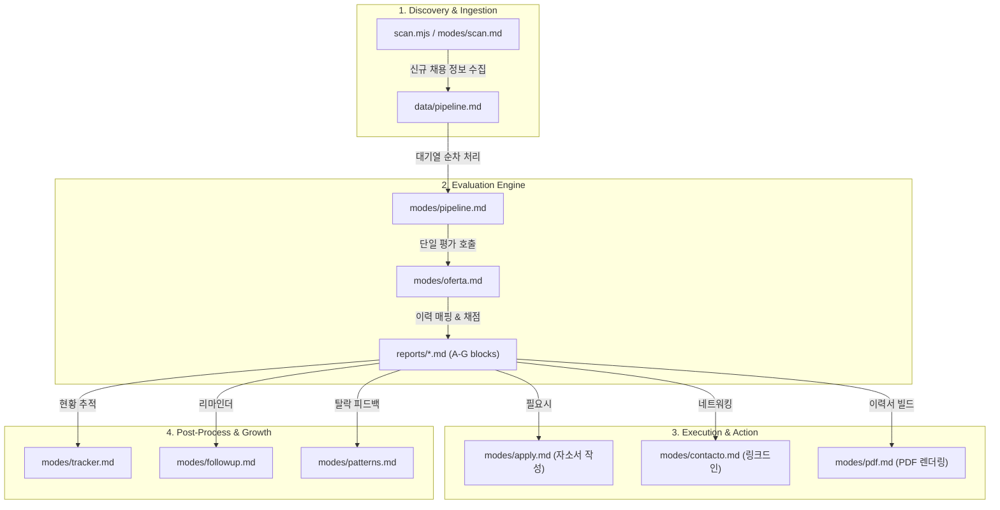

# 🤖 Career-Ops AI 에이전트 동작 원리 및 모드 분석

Career-Ops의 핵심 "두뇌"는 코드 엔진이 아니라 [modes/](file:///Users/kkh/Desktop/oss-analysis/artifacts/career-ops/modes/) 디렉토리 하위에 위치한 마크다운 형식의 **Skill Modes**입니다. AI 에이전트는 사용자가 내린 명령어에 대응하는 마크다운 문서를 읽고, 그 안에 기술된 프롬프트 지침, 평가 기준, 분석 알고리즘에 맞춰 행동을 결정합니다.

---

## 1. AI 에이전트 프롬프트 아키텍처
AI 에이전트가 작업을 실행할 때 지침을 조합하는 방식은 **3중 레이어** 구조를 띱니다.

1.  **전역 공유 규칙 ([modes/_shared.md](file:///Users/kkh/Desktop/oss-analysis/artifacts/career-ops/modes/_shared.md))**:
    모든 AI 에이전트 행동에 공통으로 인젝션되는 지침입니다. 직무 아키타입 분류 규칙, 채점 방식, 채용 공고 신뢰성(Block G) 검증 지침이 담겨 있습니다.
2.  **사용자 프로필 설정 ([modes/_profile.md](file:///Users/kkh/Desktop/oss-analysis/artifacts/career-ops/modes/_profile.md))**:
    글쓰기 스타일 학습 결과물, 개인 선호 아키타입, 연봉 조건 등 개인화 정보가 캐싱되어 `_shared.md` 규칙을 덮어씁니다(Override).
3.  **모드별 특화 Prompt**:
    `oferta.md`, `pdf.md` 등 사용자가 실행한 각각의 작업 명령어가 구체적인 가이드라인을 제공합니다.

---

## 2. 핵심 동작 모드별 분석

---

### 📂 1) 평가 모드 (Evaluation Modes)
사용자가 채용 공고(JD)의 텍스트나 URL을 제공하면 이를 분석하고 적합성을 판별합니다.

*   **단일 공고 심층 분석 ([modes/oferta.md](file:///Users/kkh/Desktop/oss-analysis/artifacts/career-ops/modes/oferta.md))**:
    *   **동작**: 공고(JD)가 들어오면 가장 먼저 **공고 아키타입**(`AI Platform / LLMOps`, `Agentic / Automation` 등)을 식별합니다. 이후 사용자의 `cv.md`와 대조하여 적합성 점수를 매기고, 이력 매핑 테이블, 예상 면접 질문, 채용 사기/유령 공고 여부(Block G)가 포함된 종합 평가서(`reports/`)를 만듭니다.
*   **다중 공고 비교 (`modes/ofertas.md`)**:
    *   **동작**: 여러 개의 제안이 있을 때 타깃 부합도(25%), 이력 매핑도(15%), 직급 적합성(15%), 예상 급여(10%), 원격 근무 수준(5%) 등의 가중치 매트릭스를 계산하여 우선순위를 산출합니다.
*   **자동 파이프라인 ([modes/auto-pipeline.md](file:///Users/kkh/Desktop/oss-analysis/artifacts/career-ops/modes/auto-pipeline.md))**:
    *   **동작**: 공고 URL 수집 → JD 정보 긁어오기(Playwright/WebFetch) → `oferta.md` 실행 → (점수가 4.5 이상일 시) 지원서 답변 초안을 자동 생성하는 일련의 과정을 배치성으로 자동 실행합니다.

---

### 📂 2) 탐색 및 파이프라인 관리 모드 (Discovery & Pipeline)
어떤 경로로 채용 정보를 확보하고, 확보된 정보를 어떻게 대기열에 담아 처리할지 관리합니다.

*   **채용 공고 수집 ([modes/scan.md](file:///Users/kkh/Desktop/oss-analysis/artifacts/career-ops/modes/scan.md))**:
    *   **동작**: [portals.yml](file:///Users/kkh/Desktop/oss-analysis/artifacts/career-ops/portals.yml)의 관심 기업 목록과 키워드를 기반으로 3개 수준(Playwright 브라우저 직접 탐색, [scan.mjs](file:///Users/kkh/Desktop/oss-analysis/artifacts/career-ops/scan.mjs)를 통한 무토큰 ATS API 연동, WebSearch 기반 키워드 검색)으로 신규 공고를 긁어옵니다. 
    *   이때 만료된 공고인지 판별하는 활성 상태 체크(Liveness check)와 중복 방지 처리를 마친 뒤 [data/pipeline.md](file:///Users/kkh/Desktop/oss-analysis/artifacts/career-ops/data/pipeline.md) 대기열에 쌓습니다.
*   **대기열 순차 처리 ([modes/pipeline.md](file:///Users/kkh/Desktop/oss-analysis/artifacts/career-ops/modes/pipeline.md))**:
    *   **동작**: [data/pipeline.md](file:///Users/kkh/Desktop/oss-analysis/artifacts/career-ops/data/pipeline.md)에 보관된 미처리 항목(`[ ]`)을 읽어와 위에서 언급한 `auto-pipeline` 평가를 가동하고, 완료된 것은 `[x]`, 오류가 난 공고는 `[!]`로 태스크 상태를 마킹합니다.

---

### 📂 3) 지원 및 네트워킹 지원 모드 (Application & Outreach)
평가 단계를 넘어 실제 지원하고 채용 담당자에게 접근하는 구체적 구직 활동을 지원합니다.

*   **실시간 지원서 작성 보조 ([modes/apply.md](file:///Users/kkh/Desktop/oss-analysis/artifacts/career-ops/modes/apply.md))**:
    *   **동작**: Playwright로 크롬 브라우저 상의 지원 폼 양식을 분석한 후, 평가 보고서에 작성해 놓은 예상 면접 질문 대비용 **STAR 스토리**와 프로필 정보를 결합하여 "지원동기", "역량 강점"과 같은 주관식 지원서 폼 내용을 실시간으로 작성해 줍니다.
*   **링크드인 메시지 빌더 ([modes/contacto.md](file:///Users/kkh/Desktop/oss-analysis/artifacts/career-ops/modes/contacto.md))**:
    *   **동작**: 검색 도구로 타깃 기업의 채용 담당자나 엔지니어 팀원을 찾고, 링크드인 1촌 신청 글자 수 제한(300자)에 맞춰 핵심 관심사 지적(Hook) + 나의 강점 증명(Proof) + 대화 제안(Proposal) 형태의 3문장 메시지를 동적으로 작성해 줍니다.
*   **단계별 후속 연락 추적 ([modes/followup.md](file:///Users/kkh/Desktop/oss-analysis/artifacts/career-ops/modes/followup.md))**:
    *   **동작**: [followup-cadence.mjs](file:///Users/kkh/Desktop/oss-analysis/artifacts/career-ops/followup-cadence.mjs) 스크립트가 각 지원 단계(지원완료, 회신 대기, 면접 진행 중)별 경과일을 계산해 이메일/링크드인 후속 연락을 취할 타이밍을 알려주고 적합한 메일 초안을 작성합니다.

---

### 📂 4) 성장 및 의사결정 모드 (Career Development & Feedback)
구직 과정 전체의 데이터를 피드백하여 구직 성향을 개선하고 학습 방향을 조율하도록 지원합니다.

*   **면접 기업 딥 서치 ([modes/deep.md](file:///Users/kkh/Desktop/oss-analysis/artifacts/career-ops/modes/deep.md))**:
    *   **동작**: 면접을 앞두고 Perplexity, GPT-4 등 추론형 AI 엔진에 주입할 목적의 고정교적 프롬프트를 빌드합니다. 해당 기업의 AI 전략, 엔지니어링 문화, 제품 출시 동향, 극복해야 할 스케일링 이슈를 6가지 축으로 심도 있게 질의할 수 있게 유도합니다.
*   **교육/강의 ROI 검증 ([modes/training.md](file:///Users/kkh/Desktop/oss-analysis/artifacts/career-ops/modes/training.md))**:
    *   **동작**: 특정 온라인 자격증이나 부트캠프를 수강하려 할 때, 그것이 타깃 역할에 맞는지, 기회비용은 얼마나 발생하는지를 점수화하여 실행(HACER), 보류(NO HACER), 타임박스(HACER CON TIMEBOX) 등의 의사결정을 내려 줍니다.
*   **사이드 프로젝트 검증 ([modes/project.md](file:///Users/kkh/Desktop/oss-analysis/artifacts/career-ops/modes/project.md))**:
    *   **동작**: 준비 중인 토이 프로젝트가 면접관에게 매력적인 신호(Signal)를 줄 수 있는지, 구현 가치는 충분한지 다중 기준 의사결정(MCDA) 평가 모델로 수치화하여 빌드 여부를 제안합니다.
*   **불합격 패턴 분석 ([modes/patterns.md](file:///Users/kkh/Desktop/oss-analysis/artifacts/career-ops/modes/patterns.md))**:
    *   **동작**: [analyze-patterns.mjs](file:///Users/kkh/Desktop/oss-analysis/artifacts/career-ops/analyze-patterns.mjs)를 통해 누적된 불합격 데이터(`data/applications.md` 및 보고서들)를 스캔하여 국가 규제/기술적 역량 갭/매칭 점수 하한선 등의 패턴을 추출한 뒤, `portals.yml` 필터링 강도를 고치는 등의 액션을 추천합니다.

---

## 3. i18n(국제화) 활성화 및 다문화 시장 대응
Career-Ops는 국가별 채용 문화와 노동법, 급여 세제의 차이를 마크다운 로직에 그대로 반영하여 다국적 시장에 대응하고 있습니다 ([modes/de/](file:///Users/kkh/Desktop/oss-analysis/artifacts/career-ops/modes/de/), [modes/ja/](file:///Users/kkh/Desktop/oss-analysis/artifacts/career-ops/modes/ja/) 등).

*   **터키 시장 (`modes/tr/`)**: 고인플레이션 환경에 맞춘 급여 재조정(TÜFE 반영), 식대 카드(Sodexo/Multinet), 노동법 제4857호에 따른 퇴직금(Kıdem tazminatı) 및 고용보험(SGK) 여부 검증.
*   **브라질 시장 (`modes/pt/`)**: 브라질 특유의 고용 계약인 정규직(CLT) 대비 계약직(PJ) 세율 보정 및 필수 연말 보너스(13th salary), 퇴직 적립금(FGTS) 비교 분석 지원.
*   **러시아 시장 (`modes/ru/`)**: 실질 소득 계산을 위한 세전(Gross) 대비 세후(Net) 자동 보정 연산 및 러시아 노동법(TK RF) 기반의 계약 형태 적정성 채점.

### 🌐 각 디렉토리의 의미와 타깃 시장

| 디렉토리명                                                                           | 대상 언어 / 국가                             |
| :------------------------------------------------------------------------------ | :------------------------------------- |
| **[ar](file:///Users/kkh/Desktop/oss-analysis/artifacts/career-ops/modes/ar/)** | 아랍어 (Arabic) 중동 시장                  |
| **[de](file:///Users/kkh/Desktop/oss-analysis/artifacts/career-ops/modes/de/)** | 독일어 (German) DACH 지역 (독일/오스트리아/스위스) |
| **[fr](file:///Users/kkh/Desktop/oss-analysis/artifacts/career-ops/modes/fr/)** | 프랑스어 (French) 프랑스 및 프랑스어권           |
| **[ja](file:///Users/kkh/Desktop/oss-analysis/artifacts/career-ops/modes/ja/)** | 일본어 (Japanese) 일본 시장                |
| **[pt](file:///Users/kkh/Desktop/oss-analysis/artifacts/career-ops/modes/pt/)** | 포르투갈어 (Portuguese) 브라질 / 포르투갈 시장    |
| **[ru](file:///Users/kkh/Desktop/oss-analysis/artifacts/career-ops/modes/ru/)** | 러시아어 (Russian) 러시아 / CIS 지역         |
| **[tr](file:///Users/kkh/Desktop/oss-analysis/artifacts/career-ops/modes/tr/)** | 터키어 (Turkish) 터키 시장                 |
| **[ua](file:///Users/kkh/Desktop/oss-analysis/artifacts/career-ops/modes/ua/)** | 우크라이나어 (Ukrainian) 우크라이나 시장         |

### 🔑 현지화 디렉토리의 주요 동작 원리

사용자가 `config/profile.yml` 설정 파일에서 주 활동 국가 언어(Locale)를 지정(예: `language.modes_dir: modes/ja/`)하면, AI 에이전트는 다음과 같이 행동합니다.

1.  **현지 법률/기준에 맞춰 점수 계산**: 
    연봉 조건을 계산할 때 단순히 금액만 보는 것이 아니라, 해당 국가의 세율이나 강제 세금 공제액(예: 터키 SGK, 브라질 CLT 세금)을 자동으로 빼서 **실제 쥐게 될 실수령액을 기준으로 연봉 만족 점수(Block D)를 판별**합니다.
2.  **공고 신뢰성 검증**: 
    해당 국가 채용 시장에서 기승을 부리는 채용 사기 유형이나 유령 공고(Ghost Job) 유형의 최신 패턴을 적용해 공고의 Legitimacy(합법성/신뢰성)를 필터링합니다.
3.  **현지 이력서 톤앤매너 튜닝**: 
    예를 들어 일본어 모드(`ja`)에서는 대단히 정중하고 겸양된 표현을 사용하며, 포르투갈어 모드(`pt`)에서는 브라질 IT 업계에서 보편적으로 사용되는 포르투갈어-영어 혼용 기술 전문 용어(Tech Slang)를 자연스럽게 활용해 이력서를 튜닝합니다.