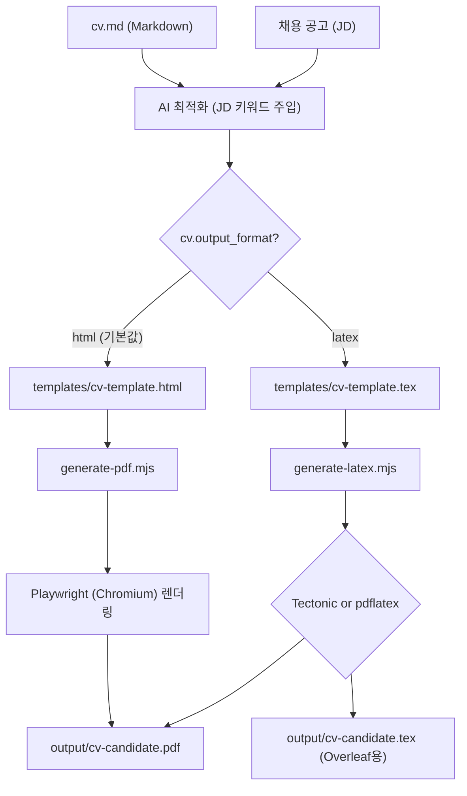

Career-Ops에서 **이력서를 ATS에 최적화하여 PDF 및 LaTeX 문서로 자동 생성해 주는 문서 변환 엔진**의 아키텍처와 상세 동작 방식을 설명해 드립니다.

# 📄 Career-Ops 이력서 생성 엔진 (PDF & LaTeX) 분석

이 엔진은 Markdown 포맷의 원본 이력서(`cv.md`)를 읽어와 채용 담당자의 가독성을 극대화하고 **ATS(지원자 추적 시스템) 분류기에 가장 잘 읽히는 형태**로 변환하여 출력합니다. 

사용자가 [config/profile.yml](file:///Users/kkh/Desktop/oss-analysis/artifacts/career-ops/config/profile.yml) 파일의 `cv.output_format` 설정을 `html` 혹은 `latex`로 지정함에 따라 서로 다른 두 가지 생성 경로를 제공합니다.

---

## 1. 두 가지 생성 경로 비교 (HTML vs LaTeX)

---

## 2. HTML to PDF 변환 경로 (`cv.output_format: html`)
이 경로는 가장 직관적이고 미려한 디자인을 웹 렌더링 엔진(크로미움)을 활용해 정밀하게 출력해 내는 기본 경로입니다.

### 🎨 템플릿 구조 ([templates/cv-template.html](file:///Users/kkh/Desktop/oss-analysis/artifacts/career-ops/templates/cv-template.html))
*   **ATS 친화적 1단 레이아웃**: 오래된 ATS 파서가 텍스트 순서를 뒤죽박죽으로 읽는 것을 막기 위해 사이드바를 배제한 단일 열(Single Column)을 고수합니다.
*   **자가 설치형 웹폰트(Self-hosted Fonts)**: OS 환경에 따라 글꼴이 깨지는 것을 방지하고자 Google Fonts 대신 `fonts/` 디렉토리에 포함된 `Space Grotesk`(헤더용) 및 `DM Sans`(본문용) 로컬 woff2 파일들을 결합하여 사용합니다.
*   **플레이스홀더 시스템**: `{{NAME}}`, `{{SUMMARY_TEXT}}`, `{{EXPERIENCE}}` 등의 대괄호 기호를 AI 에이전트([modes/pdf.md](file:///Users/kkh/Desktop/oss-analysis/artifacts/career-ops/modes/pdf.md))가 분석 후 최종 HTML 파일로 치환합니다.

### ⚙️ 렌더링 스크립트 ([generate-pdf.mjs](file:///Users/kkh/Desktop/oss-analysis/artifacts/career-ops/generate-pdf.mjs))
1.  **ATS 유니코드 단순화 (`normalizeTextForATS`)**:
    *   HTML 태그 내부의 속성값(CSS, JS 등)은 건드리지 않도록 마스킹하고, **Recruiter 화면에 노출되는 텍스트 영역의 깨진 기호들만 골라서 정화**합니다.
    *   스마트 쿼트(둥근 따옴표 `“”`)는 곧은 따옴표(`""`)로, 대시 기호(em-dash `—`, en-dash `–`)는 일반 하이픈(`-`)으로 치환하며, 보이지 않는 Zero-width 문자나 비표준 공백(nbsp)을 제거하여 파싱 에러를 예방합니다.
2.  **폰트 절대 경로 매핑**:
    *   헤드리스 브라우저 환경에서 상대 경로로 선언된 로컬 폰트를 인식하지 못하는 문제를 예방하고자, 폰트 폴더 경로를 읽어와 물리적인 파일 시스템 경로(`file://...`)로 주소를 리라이팅합니다.
3.  **Playwright Chromium 기동**:
    *   헤드리스 크로미움 브라우저를 백그라운드에 띄우고 가공된 HTML 콘텐츠를 인젝션합니다.
    *   `networkidle`(네트워크가 조용해진 상태)을 모니터링하고, 브라우저 환경에서 `document.fonts.ready` 이벤트가 최종 트리거되어 폰트가 제대로 입혀질 때까지 대기합니다.
    *   정확히 0.6인치의 마진(여백)과 회사 국가에 맞춤 자동 지정된 종이 크기(미국/캐나다는 `Letter`, 그 외는 `A4`)로 PDF 인쇄 명령을 수행해 파일을 디스크에 씁니다.

---

## 3. LaTeX / Overleaf Export 변환 경로 (`cv.output_format: latex`)
전통적이고 학술적인 이력서 양식을 선호하거나, 웹 브라우저 대신 오버리프(Overleaf)와 같은 온라인 협업 TeX 컴파일러로 수동 편집하려는 구직자들을 위한 경로입니다.

### 📑 LaTeX 템플릿 ([templates/cv-template.tex](file:///Users/kkh/Desktop/oss-analysis/artifacts/career-ops/templates/cv-template.tex))
*   **기계 판독 최적화**: PDF 내부 텍스트가 기계 리더에 정상 추출되도록 상단에 `\pdfgentounicode=1` 메타 속성을 명시합니다.
*   **CTAN 표준 패키지 사용**: 외부 복잡한 설치 없이 바로 로드되도록 `titlesec`, `hyperref`, `fontawesome5` 등 표준 패키지만 사용하므로 생성된 `.tex` 파일을 Overleaf에 업로드만 하면 즉시 컴파일됩니다.

### ⚙️ 검증 및 빌드 스크립트 ([generate-latex.mjs](file:///Users/kkh/Desktop/oss-analysis/artifacts/career-ops/generate-latex.mjs))
1.  **에이전트 특수문자 이스케이프(Escape) 처리**:
    *   AI 에이전트([modes/latex.md](file:///Users/kkh/Desktop/oss-analysis/artifacts/career-ops/modes/latex.md))가 원본 텍스트를 주입할 때 LaTeX 컴파일 오류를 유발하는 대표적인 특수 문자들을 자동 이스케이프합니다.
    *   `&`는 `\&`로, `_`는 `\_`로, `$`는 `\$`로, `%`는 `\%`로 변환합니다.
    *   다만, 하이퍼링크 `\href{URL}{TEXT}`의 첫 번째 인자인 실제 웹 주소 부분은 변환하지 않고 유지하는 정밀한 예외 처리가 들어갑니다.
2.  **구조 사전 검증**:
    *   Education, Work Experience 등 필수 구직 섹션이 빠졌는지, `\resumeSubheading` 같은 정의된 필수 명령어 형식이 준수되었는지 검사하고 미치환된 `{{PLACEHOLDER}}`가 보일 시 컴파일 전에 오류 리포트를 반환해 작동을 멈춥니다.
3.  **컴파일 엔진 자동 식별**:
    *   사용자 컴퓨터 내 설치된 명령어를 탐색합니다.
    *   **Tectonic (권장)**: Tectonic 컴파일러가 있으면 이를 호출합니다. 이 컴파일러는 필요한 서브 패키지들을 백그라운드에서 자동 다운로드하여 빌드해 줍니다. (XeTeX 기반인 Tectonic에서는 pdflatex용 원시 명령어들이 충돌을 일으키므로, 스크립트가 컴파일 전에 해당 명령어 라인을 자동 수정하는 패치를 취해줍니다.)
    *   **pdflatex (폴백)**: Tectonic이 없을 경우 TeX Live 등 기본 TeX 환경의 pdflatex를 실행하여 결과 PDF를 2회 빌드 컴파일합니다.

---

## 4. 공통 편의 기능
*   **자동 용지 규격 결정**: 지원하려는 기업의 본사 주소가 미국이나 캐나다일 경우, AI가 기업 위치를 탐지해 자동으로 `Letter` 규격으로 문서 레이아웃을 생성하며, 그 외 국가일 경우 `A4` 규격으로 마진 비율을 자동 보정합니다.
*   **페이지 수 자동 카운팅**: 컴파일이 끝난 후 생성된 PDF 바이너리의 내부 바이너리 구조에서 정규표현식으로 `/Type /Page` 객체 수량을 카운팅해 몇 페이지로 생성되었는지 리포트를 터미널에 요약 출력해 줍니다.

## 질문 

### 1. "ATS(지원자 추적 시스템) 분류기"란 무엇을 말하나요?
*   **정의**: 대기업이나 다국적 기업(구글, 메타, 넷플릭스 등)이 채용을 진행할 때 수만 장의 지원서를 자동으로 접수, 파싱(Parsing), 필터링하는 **인사 관리 소프트웨어 시스템**을 뜻합니다. (대표적으로 Workday, Greenhouse, Lever, Taleo 등이 있습니다.)
*   **동작 방식**: 인사담당자가 직접 이력서를 읽기 전에, **기계(ATS 파서)가 지원자가 제출한 PDF나 Word 문서에서 글자를 긁어가서(Text Extraction) 내부 데이터베이스에 키워드로 인덱싱**합니다.
*   **문제점**: 만약 이력서가 2단 레이아웃(좌우 분할형) 구조이거나, 특수 기호가 비표준 유니코드로 들어가서 깨져(Mojibake 현상) 버리면, **기계가 텍스트를 제대로 긁어가지 못해 핵심 역량이 누락된 이력서로 판단하고 서류 단계에서 자동 탈락**시킵니다.
*   **프로젝트의 해결책**: Career-Ops는 이 분류기가 한 줄씩 완벽하게 읽을 수 있도록 **1단 레이아웃**을 강제하고, 깨질 위험이 있는 문자들을 필터링해 주는 기능을 기본 장착한 것입니다.

---

### 2. 왜 LaTeX 형식으로 만드나요? 이 형식으로 지원서 접수를 하는 경우가 있나요?
*   실제로 대기업 접수처에 `.tex` 소스 코드 파일을 그대로 제출하는 것은 아닙니다. 최종 결과물은 똑같은 **`PDF` 파일로 제출**합니다. 그럼에도 LaTeX 소스 빌드 방식을 제공하는 데는 두 가지 강력한 이유가 있습니다.
    *   **공학(IT/CS) 및 학계의 표준 문화**: 컴퓨터 과학자(CS), 연구원, 수학 연구직 및 석박사 구직자들은 이력서(CV)를 작성할 때 Word나 한글 대신 전통적으로 **LaTeX**를 사용해 PDF를 만듭니다. 폰트 렌더링 완성도가 인쇄물 수준으로 깔끔하고, 복잡한 공식이나 특수 기호 표현이 매끄럽기 때문입니다.
    *   **Overleaf 호환 및 형상 관리**: 개발자들은 이력서의 텍스트 원본을 깃(Git)과 같은 소스 코드 버전 관리 시스템에 넣고 관리하고 싶어 합니다. 또한, 빌드된 결과물인 `.tex` 파일을 전 세계 학계 표준 도구인 **Overleaf(웹 기반 LaTeX 편집기)**에 붙여넣어 레이아웃 세부 조정을 하기에 극도로 편리하기 때문에 이 변환 경로를 지원합니다.
    *   LaTeX를 빌드하여 만든 PDF는 내부 텍스트 벡터 정보가 매우 정교하게 보존되어 있어 **ATS 기계 판독률이 일반 Word 문서보다 압도적으로 높습니다.**

---

### 3. PDF 제작 방식이 "HTML 렌더링 후 인쇄(저장)" 구조이며, 그래서 Playwright를 쓰는 게 맞나요?
*   **네, 정확합니다!** 
*   컴퓨터 프로그래밍으로 텍스트를 그냥 PDF로 직접 변환하려고 하면 줄바꿈 처리, 폰트 적용, 색상 그라디언트, 동적 여백 조절 등을 세밀하게 제어하기가 기술적으로 매우 까다롭습니다.
*   반면 **웹 언어(HTML + CSS)**는 화려하고 정밀한 디자인 레이아웃을 가장 잘 그릴 수 있는 표준 체계를 갖고 있습니다.
*   따라서 Career-Ops는 **"1단계: 먼저 이력서를 완벽하게 디자인된 웹페이지(HTML)로 만든다"** -> **"2단계: 백그라운드에서 크롬 브라우저를 띄워 그 웹페이지를 로드한다"** -> **"3단계: 브라우저의 '인쇄(Print to PDF)' 기능을 작동시켜 고화질 PDF를 굽는다"**의 구조를 선택했습니다.
*   이때 **크롬 웹 브라우저를 백그라운드에서 실행하고 제어할 수 있는 브라우저 자동화 도구**가 필요하기 때문에 **Playwright**를 핵심 엔진으로 사용하는 것입니다.

---

### 4. 주어진 파일 분석에 따른 HTML ➡️ PDF 변환 상세 프로세스

[generate-pdf.mjs](file:///Users/kkh/Desktop/oss-analysis/artifacts/career-ops/generate-pdf.mjs) 및 [modes/pdf.md](file:///Users/kkh/Desktop/oss-analysis/artifacts/career-ops/modes/pdf.md) 소스 파일에 나타난 구체적인 8단계 실행 흐름입니다.

1.  **데이터 바인딩 및 플레이스홀더 치환**:
    AI 에이전트([modes/pdf.md](file:///Users/kkh/Desktop/oss-analysis/artifacts/career-ops/modes/pdf.md))가 작동하여 사용자의 원본 [cv.md](file:///Users/kkh/Desktop/oss-analysis/artifacts/career-ops/cv.md) 경력 데이터와 [config/profile.yml](file:///Users/kkh/Desktop/oss-analysis/artifacts/career-ops/config/profile.yml)의 인적 정보를 [templates/cv-template.html](file:///Users/kkh/Desktop/oss-analysis/artifacts/career-ops/templates/cv-template.html) 템플릿의 `{{NAME}}`, `{{SUMMARY_TEXT}}` 자리에 끼워 넣고 임시 HTML 파일로 저장합니다.
2.  **ATS 최적화 텍스트 정화 (`normalizeTextForATS`)**:
    [generate-pdf.mjs](file:///Users/kkh/Desktop/oss-analysis/artifacts/career-ops/generate-pdf.mjs) 스크립트가 실행되어 임시 HTML 파일 본문을 정규식으로 검사합니다. 깨지기 쉬운 특수 따옴표(`“”`, `‘’`), 길게 늘어진 대시(`—`, `–`) 등을 표준 기호(`""`, `''`, `-`)로 변환하고 보이지 않는 에러 유발 공백을 완전히 지워 기계 판독에 완벽한 무균 상태의 텍스트를 만듭니다.
3.  **폰트 로컬 주소 리라이팅**:
    웹서버가 없는 로컬 실행 환경이므로 브라우저가 예쁜 로컬 폰트(`WOFF2`) 파일을 읽을 수 있도록, 상대 경로를 로컬 컴퓨터 절대 주소 포맷인 `file:///Users/kkh/.../fonts/space-grotesk-latin.woff2` 형태로 변환해 삽입합니다.
4.  **헤드리스 브라우저 로딩**:
    Playwright API를 사용해 화면이 보이지 않는 백그라운드 크롬 브라우저(`headless: true`)를 가동하고, 변환이 완료된 최종 HTML 소스를 브라우저 탭에 주입합니다.
5.  **렌더링 대기**:
    브라우저 내부에서 HTML 요소들이 완벽히 로드되는 `networkidle` 이벤트가 수신될 때까지 대기한 뒤, 폰트 렌더링 지연(FOUT 현상)으로 깨진 폰트가 인쇄되는 걸 방지하기 위해 브라우저 내부 폰트 준비 기능인 `document.fonts.ready`를 기다립니다.
6.  **PDF 출력 인쇄**:
    브라우저의 인쇄 인터페이스인 `page.pdf()`를 호출합니다. 용지 여백을 상하좌우 정확히 0.6인치로 고정하고, 회사 본사 위치에 따라 정해진 문서 크기(미국/캐나다는 `Letter`, 그 외는 `A4`)로 최종 PDF를 렌더링하여 `output/` 디렉토리에 정식 파일로 기록합니다. (이후 임시 HTML 파일은 깔끔하게 삭제합니다.)