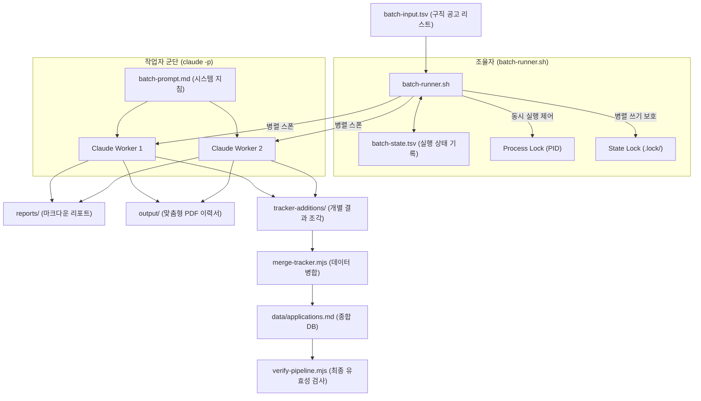

구인 구직 활동을 할 때 매력적인 채용 공고 수십 개를 한눈에 발견하더라도, 일일이 이력서를 튜닝하고 적합성을 분석하는 것은 대단히 큰 시간 비용이 듭니다. 

Career-Ops는 이를 해결하기 위해 **여러 채용 공고를 병렬로 띄워 무인(No-touch) 상태로 한 번에 대량 처리**하는 **배치 프로세싱 시스템(Batch Processing System)**을 제공합니다. 

이 시스템의 아키텍처와 구체적인 동작 흐름에 대해 정리해 드립니다.

---

## 1. 배치 프로세싱 시스템의 아키텍처 (Orchestrator / Worker)

이 시스템은 총지휘관 역할을 하는 **조율자(Orchestrator)**와 실제 두뇌 연산을 하는 **작업자(Worker)**가 역할을 명확히 분담하여 대량의 데이터를 안정적으로 제어합니다.

*   **조율자 ([batch/batch-runner.sh](file:///Users/kkh/Desktop/oss-analysis/artifacts/career-ops/batch/batch-runner.sh))**: 
    전체 파이프라인의 수동 입력 큐를 읽고, 동시 실행 프로세스를 생성(Spawn)하며, 충돌 방지를 위한 자원 락(Lock)을 관리하고, 완료 후 데이터를 마스터 데이터베이스에 안전하게 병합하는 역할을 하는 **Bash 셸 스크립트**입니다.
*   **작업자 ([batch/batch-prompt.md](file:///Users/kkh/Desktop/oss-analysis/artifacts/career-ops/batch/batch-prompt.md))**: 
    개별 Claude CLI 인스턴스에 주입되는 **독립형 마크다운 시스템 프롬프트**입니다. 외부 모드 파일 호출 없이 독자적으로 JD 분석, 아키타입 분류, 이력서 편집 방향성 지시, 결과 파일 생성 코드를 모두 내장하고 있는 제로-디펜던시(Zero-dependency) 설계 구조를 취하고 있습니다.

---

## 2. 배치 프로세싱의 단계별 데이터 라이프사이클

구인 공고 리스트를 준비해서 작동을 시작하면 시스템은 다음과 같은 흐름으로 무인 작동합니다.

### 1단계: 큐 스캔 및 락(Lock) 확보
*   조율자([batch/batch-runner.sh](file:///Users/kkh/Desktop/oss-analysis/artifacts/career-ops/batch/batch-runner.sh))가 구동되면, 먼저 중복 실행을 막기 위해 `batch-runner.pid` 락 파일을 생성합니다.
*   이후 입력 큐 파일인 [batch/batch-input.tsv](file:///Users/kkh/Desktop/oss-analysis/artifacts/career-ops/batch/batch-input.tsv)를 읽어 대기 상태인 공고 목록을 수집합니다.

### 2단계: 일련번호 선점 예약 (`next_report_num_unlocked`)
*   병렬 처리 환경에서 서로 다른 작업자가 동일한 보고서 파일 일련번호(예: `042`)를 쓰는 충돌을 방지하기 위해, 조율자가 [reports/](file:///Users/kkh/Desktop/oss-analysis/artifacts/career-ops/reports/) 디렉토리와 [batch/batch-state.tsv](file:///Users/kkh/Desktop/oss-analysis/artifacts/career-ops/batch/batch-state.tsv)를 실시간 스캔하여 다음 가용 번호를 미리 선점해 예약해 줍니다.

### 3단계: 작업자 프로세스 기동 (Parallel CLI Spawning)
*   사용자가 지정한 병렬 작업 수(`--parallel N`)에 맞춰 `claude -p` 에이전트 다수를 띄웁니다.
*   이때 각 작업자(Claude)에게는 예약된 번호, 날짜, 타깃 공고 URL 등이 플레이스홀더(`{{URL}}`, `{{REPORT_NUM}}` 등) 치환 방식을 통해 매핑되어 주입됩니다.

### 4단계: 작업자 내부의 6단계 분석 루틴 실행
각각의 개별 작업자는 주입받은 시스템 지침에 따라 아래의 일련 과정을 단독 수행합니다.
1.  **공고 수집 (JD Ingestion)**: 제공된 URL의 텍스트 콘텐츠를 가져옵니다.
2.  **직무 유형 감지 (Archetype Detection)**: JD 요구사항에 따라 6가지 아키타입 중 하나로 매핑합니다.
3.  **A-G 영역 분석**: 적합성 채점(1~5점) 및 면접용 STAR 스토리와 유령 공고 판별 보고서를 메모리에 생성합니다.
4.  **문서 출력**: 마크다운 리포트를 `reports/` 폴더에 쓰고, 백그라운드에서 `node generate-pdf.mjs`를 트리거하여 맞춤형 PDF 이력서를 [output/](file:///Users/kkh/Desktop/oss-analysis/artifacts/career-ops/output/) 폴더에 자동 생성합니다.
5.  **TSV 이력 작성**: 결과 요약을 임시 탭 구분(TSV) 파일 형태로 `batch/tracker-additions/` 디렉토리에 내보냅니다.
6.  **결과 JSON 반환**: 실행 성공 상태와 파일 경로 정보를 담은 JSON 데이터 구조를 `stdout`으로 최종 출력합니다.

### 5단계: 데이터 병합 및 정합성 검증
*   모든 병렬 작업자가 동작을 끝마치면, 조율자가 [merge-tracker.mjs](file:///Users/kkh/Desktop/oss-analysis/artifacts/career-ops/merge-tracker.mjs)를 가동하여 흩어진 개별 TSV 파일들을 종합 데이터베이스인 [data/applications.md](file:///Users/kkh/Desktop/oss-analysis/artifacts/career-ops/data/applications.md)에 자동 누적 정렬 및 병합합니다.
*   마지막으로 [verify-pipeline.mjs](file:///Users/kkh/Desktop/oss-analysis/artifacts/career-ops/verify-pipeline.mjs)를 가동해 데이터 결함이나 깨짐이 없는지 검사한 후 배치 작업을 종결합니다.

---

## 3. 예기치 못한 실패에 대응하는 안전 메커니즘

수십 개가 넘어가는 대용량 작업을 한꺼번에 병렬 실행할 때 발생할 수 있는 충돌 및 시스템 에러에 대응하기 위해 두 가지 보호막이 존재합니다.

*   **100% 이어서 하기 지원 (Resumability)**:
    컴퓨터 전원이 꺼지거나 에러로 인해 스크립트가 도중에 멈추더라도 걱정할 필요가 없습니다. [batch/batch-state.tsv](file:///Users/kkh/Desktop/oss-analysis/artifacts/career-ops/batch/batch-state.tsv) 파일에 처리 성공/실패 여부가 각 행마다 실시간 보존되기 때문에, 스크립트를 재실행하면 이미 완료(`completed`)된 포지션은 즉시 건너뛰고 처리되지 않은 항목이나 실패(`failed`)한 항목만 골라 작업을 다시 재개합니다.
*   **상태 락 디렉토리 (`.batch-state.lock/`)**:
    여러 작업자가 동시에 한 파일([batch/batch-state.tsv](file:///Users/kkh/Desktop/oss-analysis/artifacts/career-ops/batch/batch-state.tsv))을 편집하려고 시도할 때 파일 데이터가 깨지는 것을 막기 위해, 임시 디렉토리를 점유하는 방식의 잠금(Lock)을 구현하여 차례대로 대기하게 함으로써 다중 병렬 처리 시 발생할 수 있는 경쟁 상태(Race Condition)를 원천 차단합니다.