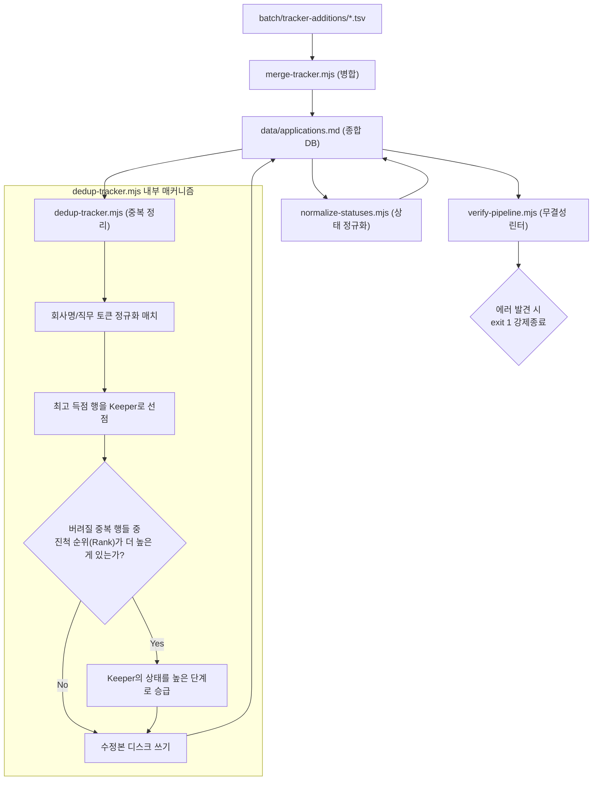

Career-Ops에서 **지원 이력을 저장하는 Flat-File 데이터베이스 아키텍처와 이를 유지/분석하는 데이터 레이어 스크립트 군**의 유기적 매커니즘을 상세히 설명해 드립니다.

# 🗄️ 데이터 파이프라인 및 지원 추적기(Tracker) 분석

Career-Ops는 무겁고 설치가 까다로운 RDBMS(관계형 데이터베이스) 대신, Git을 통해 이력을 쉽게 버전 관리할 수 있고 사람이 텍스트 에디터로 바로 읽고 고칠 수 있는 **텍스트 기반의 Flat-File 데이터베이스** 구조를 채택했습니다. 

이 데이터 레이어의 중심에는 [data/applications.md](file:///Users/kkh/Desktop/oss-analysis/artifacts/career-ops/data/applications.md) 마크다운 테이블 파일이 있으며, 일련의 Node.js 스크립트들이 이 텍스트 데이터의 무결성을 깨끗하게 유지해 줍니다.

---

## 1. 데이터베이스 스키마 및 상태 머신(State Machine)

### 📊 canonical 마크다운 테이블 구조 (9열)
마스터 파일인 [data/applications.md](file:///Users/kkh/Desktop/oss-analysis/artifacts/career-ops/data/applications.md) 테이블은 에이전트와 대시보드 UI 프로그램이 파싱할 수 있도록 아래의 고정된 9개 열 구조를 엄격히 준수합니다.

`| # (일련번호) | Date (변경일) | Company (회사) | Role (직무) | Score (점수) | Status (상태) | PDF (파일생성여부) | Report (보고서링크) | Notes (비고) |`

### 🔄 구직 단계 진척도 순위 (`STATUS_RANK`)
여러 중복 항목을 병합하거나 정렬할 때, 지원 단계의 전진 수준을 비교하기 위해 [templates/states.yml](file:///Users/kkh/Desktop/oss-analysis/artifacts/career-ops/templates/states.yml)에 명시된 대로 **상태별 진척도 우선순위(Rank)**가 코딩되어 있습니다.

`discarded`/`skip` (Rank 0) ➡️ `rejected` (Rank 1) ➡️ `evaluated` (Rank 2) ➡️ `applied` (Rank 3) ➡️ `responded` (Rank 4) ➡️ `interview` (Rank 5) ➡️ `offer` (Rank 6)

사용자가 수동으로 "enviada", "sent", "aplicado" 등 다국어나 동의어로 지원 상태를 적어도, 정규화 엔진이 알아서 표준 상태 명칭인 **`Applied`** 등으로 자동 교정합니다.

---

## 2. 데이터 유지 관리 스크립트 삼형제

텍스트 데이터베이스의 최대 단점인 "데이터 꼬임"이나 "중복 누적"을 막기 위해 아래의 자동 유지보수 도구들이 유기적으로 결합되어 실행됩니다.

### 1) [merge-tracker.mjs](file:///Users/kkh/Desktop/oss-analysis/artifacts/career-ops/merge-tracker.mjs) (신규 데이터 병합)
*   **역할**: 병렬 배치 워커가 내보낸 개별 TSV 파일들을 종합 이력표 상단(최신순 역순 정렬 규칙)에 안전하게 병합합니다.
*   **유연성**: 8열/9열 TSV 포맷뿐만 아니라 마크다운 파이프라인 형태도 자동 감지하며, `status`와 `score` 열이 뒤바뀌어 입력되어도 유효한 형식을 정규식으로 유추해 바로잡는 감지 로직이 탑재되어 있습니다.
*   **중복 검사 필터**: 회사명에서 특수문자를 지운 뒤(`normalizeCompany`), 직무명을 토큰화해 대조합니다. 이때 "Engineer" 같이 흔한 기본 단어가 아니라 **"SRE", "AI" 같이 의미가 변별되는 중요 단어(discriminating token) 매치율이 0.6 이상**이어야 동일 직무 중복으로 진단하여 엉뚱한 직무를 덮어쓰는 오류를 차단합니다.
*   **점수 기반 덮어쓰기**: 중복이 검출되었을 때, 새로 입력된 공고 분석 점수가 더 높을 때만 데이터를 업데이트합니다.

### 2) [dedup-tracker.mjs](file:///Users/kkh/Desktop/oss-analysis/artifacts/career-ops/dedup-tracker.mjs) (중복 제거 및 진척 상태 보존)
*   **역할**: 수동 편집과 대량 분석이 반복되면서 누적된 종합 데이터베이스의 중복 행들을 청소합니다.
*   **상태 강제 승급 (Status Promotion)**:
    이 스크립트는 단순히 중복 행 중 하나를 지우고 끝내지 않습니다.
    *   **예시**: 사용자가 이전에 `Evaluada (점수 4.5)` 상태였던 A기업 공고와, 실수로 중복 입력되어 면접까지 진행된 `Entrevista (점수 3.8)` 상태의 A기업 행이 공존한다고 가정해 봅시다.
    *   스크립트는 점수가 더 높은 `4.5`짜리 행을 보존대상(`keeper`)으로 지정하되, 지워질 행이 이미 면접(`Entrevista`) 단계까지 전진해 있으므로 **`keeper`의 최종 상태를 `Entrevista`로 강제 승급(Promotion)시킨 뒤 디스크에 저장**합니다. 점수와 진행률이라는 두 마리 토끼를 모두 살리는 정교한 알고리즘입니다.

### 3) [normalize-statuses.mjs](file:///Users/kkh/Desktop/oss-analysis/artifacts/career-ops/normalize-statuses.mjs) & [verify-pipeline.mjs](file:///Users/kkh/Desktop/oss-analysis/artifacts/career-ops/verify-pipeline.mjs) (정규화 및 최종 검증 린터)
*   **상태 정규화 (`normalize-statuses`)**: 텍스트 편집기에서 사람이 볼드체(`**`)나 임의의 날짜 꼬리표(예: "Rejected 2024")를 붙여놓아 TUI 대시보드 화면이 깨지는 버그를 예방하기 위해, 마크다운 볼드 기호를 걷어내고 표준 상태 문자열로 데이터를 정제합니다. "DUPLICADO" 등의 비표준 상태는 `Discarded`로 고치고 비고(Notes) 열로 기존 메시지를 이관시킵니다.
*   **무결성 린터 (`verify-pipeline`)**: 데이터를 절대 변형시키지 않고 오직 정합성만 감사(Linter)하여 경고(Warning)와 에러(Error)로 보고합니다.
    *   **검사 항목**: 컬럼 9개 구조 준수 여부, 점수 표기 규격 준수 여부, 아직 병합되지 않은 대기 TSV 잔여 여부, **보고서 링크(`reports/*.md`)가 깨지지 않고 디스크에 실제 파일로 존재하고 있는지 검증**.
    *   치명적 에러 검출 시 프로세스를 `exit 1`로 강제 종료하여, 잘못된 데이터가 소스 코드 형상에 커밋되거나 배포되는 것을 파이프라인 레벨에서 사전에 차단합니다.

---

## 3. 사후 데이터 분석 및 커뮤니케이션 제어 (Analytical Layer)

종합 데이터베이스에 지원 히스토리가 누적되면, 아래의 스크립트들이 작동해 구직 전략을 피드백해 줍니다.

### 📈 탈락 패턴 분석 ([analyze-patterns.mjs](file:///Users/kkh/Desktop/oss-analysis/artifacts/career-ops/analyze-patterns.mjs))
*   **동작**: [data/applications.md](file:///Users/kkh/Desktop/oss-analysis/artifacts/career-ops/data/applications.md)에서 탈락(`Rejected`, `Discarded`)이 기록된 행들의 링크를 타고 들어가 `reports/` 내의 A-F 블록 원본 내용을 깊이 파싱합니다.
*   **결과 도출**: 
    1.  내가 어떤 직무 아키타입(예: PM vs LLMOps)에서 탈락율이 높은지 통계화합니다.
    2.  글로벌 원격(Global remote)과 지역 제한 원격(Geo-restricted) 등 어떤 근무지 정책(Remote Policy)에서 유독 서류 탈락이 빈번했는지 규명합니다.
    3.  평가서의 Block B(Gaps) 테이블을 취합하여, 내 이력서에서 반복적으로 지적된 **"기술 스택 결함(Tech Stack Gaps)"**이 무엇인지 통계를 내어 보여줍니다.
*   **피드백**: 분석 결과를 마크다운 리포트로 자동 출력하고, 구직자가 쓸모없는 공고에 힘을 낭비하지 않도록 `portals.yml` 필터링 설정을 변경할 것을 추천합니다.

### ⏰ 후속 연락 만기 계산 ([followup-cadence.mjs](file:///Users/kkh/Desktop/oss-analysis/artifacts/career-ops/followup-cadence.mjs))
*   **동작**: 지원서에 기재된 날짜(Date)와 현재 상태(Status)를 기반으로 마지막 구직 활동으로부터 며칠이 지났는지 계산합니다.
*   **만기 판정**:
    *   **Applied**: 지원 후 7일이 경과하면 후속 메일 발송 대상으로 판정합니다. (최대 2회)
    *   **Responded / Interview**: 채용담당자의 메일 회신이나 인터뷰 완료 후 각각 1일, 3일의 만료 시간을 적용합니다.
*   **커뮤니케이션 지원**: 리포트에서 채용 담당자의 연락처 정보를 추출해 내어, 식상한 "just checking in" 같은 문구를 배제하고 내 강점을 리마인드하는 150자 내외의 **커스텀 후속 메일 초안을 자동으로 작성**해 줍니다. 발송을 마친 히스토리는 [data/follow-ups.md](file:///Users/kkh/Desktop/oss-analysis/artifacts/career-ops/data/follow-ups.md) 로그에 저장되어 중복 발송을 예방합니다.