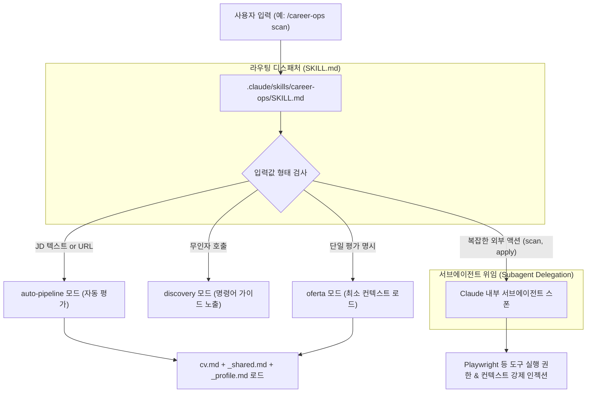
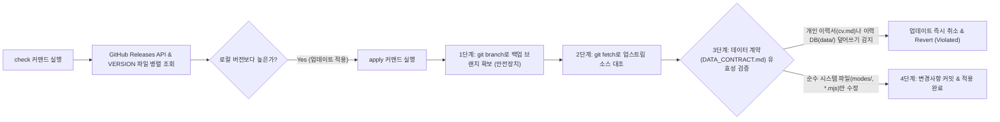

Career-Ops에서 **여러 AI 에이전트(Claude Code, Gemini CLI, Qwen 등)를 통합 지원하고 이들을 통제하는 멀티 에이전트 라우팅 및 시스템 업데이트 아키텍처**에 대해 설명해 드립니다.

---

# 🤖 멀티 에이전트 협업 및 도구 통합 레이어 분석

Career-Ops는 **Claude Code**에 최적화되어 있으나, 특정 AI 클라이언트에 종속되지 않는 툴 불가지론적(Tool-agnostic) 설계를 취하고 있습니다. 구직자가 터미널 CLI 환경이든 IDE 플러그인이든, 어떤 AI 에이전트를 사용하더라도 **동일한 구직 채점 규칙과 이력 데이터(SSOT)를 공유하며 동작하도록 설계**되었습니다.

---

## 1. 다중 에이전트 공통 라우팅 레이어 (AGENTS.md & SKILL.md)

다양한 LLM 엔진이 동일한 명령어 체계를 처리하도록 돕는 표준화된 중계 계층입니다.

### 1) 통합 디스패처 ([SKILL.md (Claude)](file:///Users/kkh/Desktop/oss-analysis/artifacts/career-ops/.claude/skills/career-ops/SKILL.md))
*   **역할**: `open agent skill standard` 표준을 준수하여 작성된 라우팅 허브입니다. 사용자가 입력한 인자값을 파싱해 최적의 스킬 마크다운 파일로 작업을 중계합니다.
*   **토큰 최적화 전략**: AI가 구동될 때 대화 메모리에 프로젝트의 모든 마크다운 지침을 집어넣으면 대화 비용이 폭증하고 성능이 저하됩니다. 디스패처는 **특정 명령어에 필요한 최소한의 컨텍스트(예: `oferta` 실행 시 `cv.md`와 `oferta.md`만 로드)**만 골라 에이전트 메모리에 적재합니다.
*   **서브에이전트 위임 (Subagent Delegation)**: 포털 스캔(`scan`)이나 주관식 지원서 작성(`apply`)과 같이 브라우저를 띄워 여러 번 핑퐁 대화를 거쳐야 하는 복잡한 작업은, 메인 대화창의 상태를 보호하기 위해 **내부 서브에이전트를 백그라운드에 별도로 띄워(Spawn) 컨텍스트를 주입한 뒤 작업을 위임**시킵니다.

### 2) 플랫폼 오버레이 ([CLAUDE.md](file:///Users/kkh/Desktop/oss-analysis/artifacts/career-ops/CLAUDE.md) / [GEMINI.md](file:///Users/kkh/Desktop/oss-analysis/artifacts/career-ops/GEMINI.md) / Qwen)
*   **역할**: 에이전트의 중심 Manifest 문서인 [AGENTS.md](file:///Users/kkh/Desktop/oss-analysis/artifacts/career-ops/AGENTS.md)를 상속(Import)받아 공통 데이터를 공유하면서도, 각 에이전트(Anthropic Claude, Google Gemini, Alibaba Qwen 등)의 프롬프트 특성에 맞춰 튜닝된 전용 오버레이 파일을 가동합니다.
*   마켓플레이스용 설정인 `.claude-plugin/plugin.json`을 통해 가상 브라우저 제어(Playwright) 및 파일 수정, 웹 검색 권한을 에이전트에게 정교하게 승인해 줍니다.

---

## 2. 무상태 경량 평가 엔진: [gemini-eval.mjs](file:///Users/kkh/Desktop/oss-analysis/artifacts/career-ops/gemini-eval.mjs)

비싸거나 토큰 한도가 타이트한 Claude CLI 대신, **구글의 무료 AI API(`gemini-2.5-flash`)를 활용해 대량의 공고를 무료로 빠르게 채점**하고 싶어 하는 사용자를 위한 대체 도구입니다.

*   **동작 방식**: 
    1.  [gemini-eval.mjs](file:///Users/kkh/Desktop/oss-analysis/artifacts/career-ops/gemini-eval.mjs)가 단독 Node.js CLI 형태로 구동됩니다.
    2.  로컬 하드디스크의 `cv.md`, [config/profile.yml](file:///Users/kkh/Desktop/oss-analysis/artifacts/career-ops/config/profile.yml), `modes/oferta.md` 및 `_shared.md` 파일을 동적으로 합쳐서 Gemini의 `systemPrompt`로 전송합니다.
    3.  이를 통해 에이전트 환경 없이도 Claude 파이프라인과 100% 동일한 채점 일관성(Block A-G 구조)을 유지합니다.
*   **무상태(Stateless) 단방향 평가**:
    Claude 에이전트와 달리 백그라운드에서 가상 크롬을 띄우거나 깃 명령어를 제어하지는 못하지만, 제공받은 JD 텍스트만을 기반으로 빠르게 1~5점 종합 평가서를 생성하고 `reports/` 디렉토리에 이력을 파일로 써주는 단순화된 무상태 변환에 고도로 최적화되어 있습니다.
*   **보안 장치 (Credential Scrubbing)**:
    API Studio에서 획득해 로컬 컴퓨터 `.env`에 설정해 둔 `GEMINI_API_KEY` 비밀키가 에러 발생 시 로그 콘솔에 노출되어 탈취당하는 것을 막기 위해 에러 스트링 클렌징 로직이 구현되어 있습니다.

---

## 3. 데이터 보존형 자동 시스템 업데이트 ([update-system.mjs](file:///Users/kkh/Desktop/oss-analysis/artifacts/career-ops/update-system.mjs))

채점 로직 마크다운이나 버그 수정 스크립트가 오픈소스 상에서 릴리즈되었을 때, **구직자의 소중한 개인 데이터(이력서, 이력 로그)는 완벽히 보존하고 시스템 영역만 안전하게 업데이트**하는 아키텍처입니다.

### 1) 데이터 계약 철저 이행 ([DATA_CONTRACT.md](file:///Users/kkh/Desktop/oss-analysis/artifacts/career-ops/DATA_CONTRACT.md))
*   **User Layer (수정 불가)**: 개인 이력서(`cv.md`), 인적 정보 설정([config/profile.yml](file:///Users/kkh/Desktop/oss-analysis/artifacts/career-ops/config/profile.yml)), 개인화 프로필(`modes/_profile.md`), 지원 이력 데이터베이스(`data/`), 생성된 결과 PDF 및 STAR 스토리 등은 시스템 업데이트 시 **절대로 쓰기/삭제가 금지**됩니다.
*   **System Layer (업데이트 대상)**: 채점 지침([modes/_shared.md](file:///Users/kkh/Desktop/oss-analysis/artifacts/career-ops/modes/_shared.md) 등), Node.js 유지보수 코드(`*.mjs`), TUI 대시보드 코드(`dashboard/`), 대량 분석 템플릿(`batch/`) 등은 안전하게 교체됩니다.

### 2) 원자적 깃(Git) 트랜잭션 업데이트 동작 구조
*   `check`: GitHub API와 VERSION 마크다운을 병렬(`Promise.allSettled`) 조회하여 로컬 소스 버전과 릴리즈를 실시간 비교합니다.
*   `apply`: 업데이트 도중 에러가 나거나 네트워크가 단절되어 이력이 깨지는 위험에 대비해, 실행 즉시 **로컬 Git 백업 브랜치를 자동으로 스냅샷 생성**합니다. 이후 업스트림 파일들을 교체하면서 만약 조금이라도 User Layer 파일이 오버라이트되는 낌새가 감지되면 **즉시 롤백을 단행하고 전체 과정을 중단(Abort)**합니다. 무사히 통과되면 시스템 영역만 업데이트 후 커밋합니다.
*   `rollback`: 업데이트 이후 에러가 발생하면, 앞서 생성해 둔 백업 브랜치 스냅샷으로 덮어씌워 컴퓨터를 업데이트 직전 상태로 완전히 돌려놓습니다.
*   `dismiss`: 릴리즈 버전을 무시하고 알림을 끄기 위한 비활성 마킹용 파일(`.update-dismissed`)을 생성합니다.