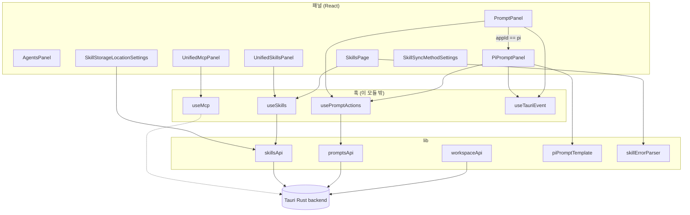
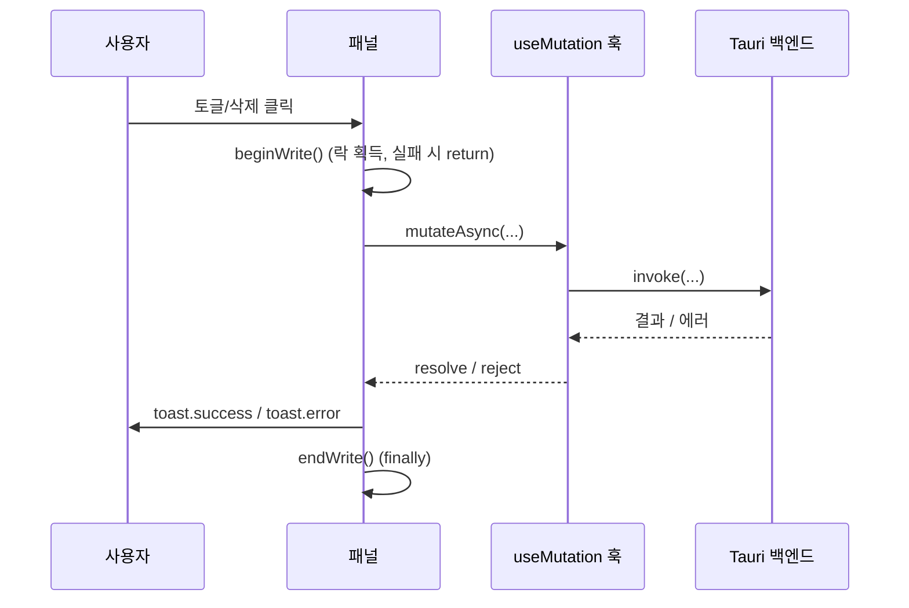
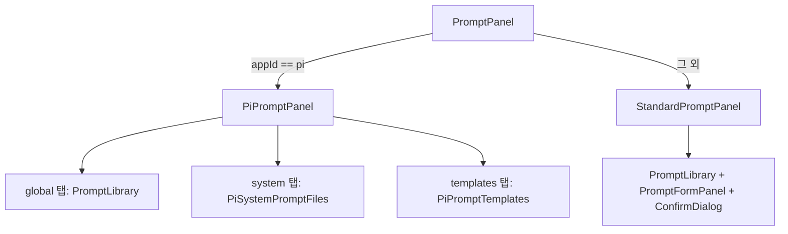
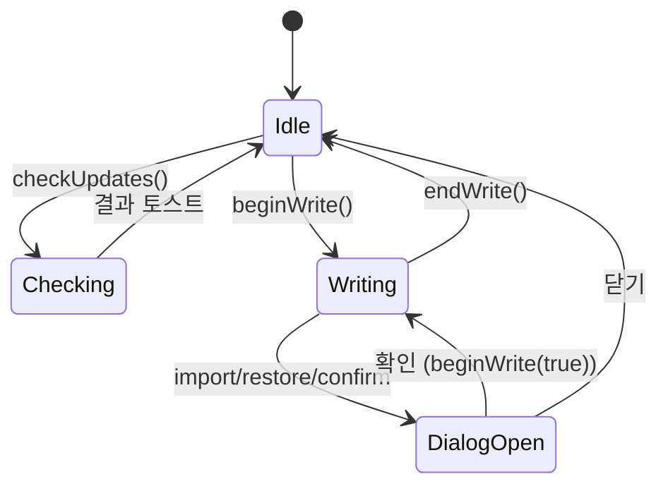
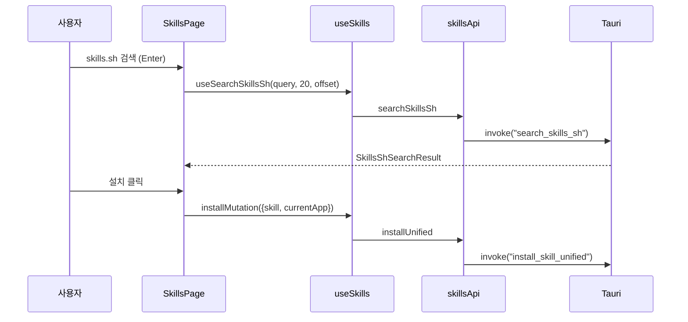
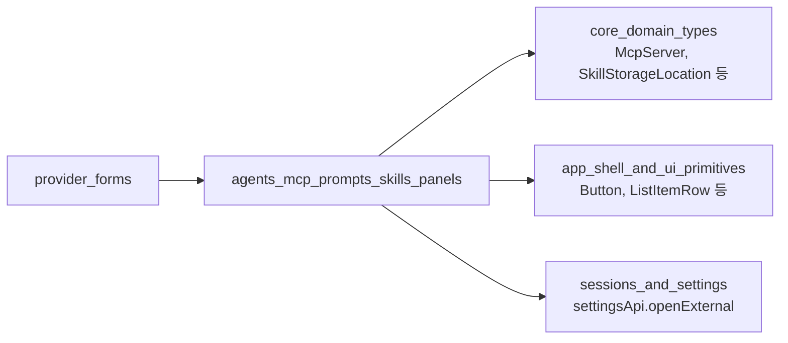

# agents_mcp_prompts_skills_panels 모듈

`agents_mcp_prompts_skills_panels`는 CC Switch 데스크톱 앱(Tauri + React)의 **워크스페이스 도구 관리 화면** 묶음이다. 여러 AI CLI 앱(Claude, Codex, Gemini, OpenCode, OpenClaw, Hermes, Pi 등)에 공통으로 적용되는 **MCP 서버, 프롬프트, Skills**를 한 곳에서 보고 켜고 끄고 편집하는 패널과, 이를 뒷받침하는 Tauri `invoke` API 래퍼·타입·유틸리티를 포함한다. `AgentsPanel`은 아직 "Coming Soon" 플레이스홀더다.

상위 모듈은 `workspace_tooling_and_preferences`이며, 형제 모듈은 [sessions_and_settings](sessions_and_settings.md)이다. 공용 타입·UI 프리미티브는 [core_domain_types](core_domain_types.md), [app_shell_and_ui_primitives](app_shell_and_ui_primitives.md)를 참조한다.

---

## 1. 구성 요소 한눈에 보기

| 영역 | 파일 | 핵심 심볼 | 역할 |
|---|---|---|---|
| Agents | `src/components/agents/AgentsPanel.tsx` | `AgentsPanelProps` | 정적 "Coming Soon" 화면 (상태·API 없음) |
| MCP | `src/components/mcp/UnifiedMcpPanel.tsx` | `UnifiedMcpPanelHandle` | 통합 MCP 서버 목록/앱별 토글/가져오기/삭제 |
| Prompts | `src/components/prompts/PromptPanel.tsx` | `PromptPanelHandle` | 앱별 프롬프트 라이브러리. `appId === "pi"`면 `PiPromptPanel`로 분기 |
| Prompts(Pi) | `src/components/prompts/PiPromptPanel.tsx` | `PiPromptPanelHandle` | Pi 전용 3탭(global / system / templates) |
| Skills 설치됨 | `src/components/skills/UnifiedSkillsPanel.tsx` | `UnifiedSkillsPanelHandle`, `SkillsCheckUpdatesState` | 설치된 Skill 관리, 업데이트, ZIP 설치, 백업 복원 |
| Skills 탐색 | `src/components/skills/SkillsPage.tsx` | `SkillsPageHandle` | 저장소 / skills.sh 검색 및 설치 |
| 설정 | `src/components/settings/SkillStorageLocationSettings.tsx`, `SkillSyncMethodSettings.tsx` | `...Props` | Skill 저장 위치 마이그레이션, symlink/copy 동기화 방식 |
| 유틸 | `src/lib/piPromptTemplate.ts` | `FrontmatterDocument`, `FrontmatterField`, `PiPromptTemplateSummary` | Pi 템플릿 frontmatter 파싱/수정 |
| 에러 | `src/lib/errors/skillErrorParser.ts` | `SkillError` | 백엔드 구조화 에러 → i18n 메시지 |
| API | `src/lib/api/skills.ts`, `prompts.ts`, `workspace.ts` | `skillsApi`, `promptsApi`, `workspaceApi` | Tauri `invoke` 래퍼와 DTO |
| 타입 | `src/types/omo.ts` | `OmoAgentDef`, `OmoCategoryDef`, `OmoLocalFileData` | oh-my-opencode(OMO) 에이전트/카테고리 정의 상수 |

---

## 2. 아키텍처

데이터 훅(`useMcp`, `usePromptActions`, `useSkills`)과 공통 컴포넌트(`AppCountBar`, `AppToggleGroup`, `ListItemRow`, `ManagementListSearch`, `ConfirmDialog`)는 이 모듈에 포함되지 않으며 import만 한다. (코드 확인: import 문)

### 공통 설계 패턴

세 패널(MCP, Prompt, Skills)은 동일한 **"imperative handle + 상호작용 잠금"** 패턴을 따른다.

1. **`forwardRef` + `useImperativeHandle`**: 상위 헤더의 버튼(추가, 가져오기, 새로고침 등)이 패널 동작을 호출한다.
   - `UnifiedMcpPanelHandle`: `openAdd`, `openImport`
   - `PromptPanelHandle` / `PiPromptPanelHandle`: `openAdd`
   - `UnifiedSkillsPanelHandle`: `openDiscovery`, `openImport`, `openInstallFromZip`, `openRestoreFromBackup`, `checkUpdates`
   - `SkillsPageHandle`: `refresh`, `openRepoManager`
2. **쓰기 잠금(`writeLockRef` + `writePending` state)**: ref는 동기적 중복 진입을 막고, state는 UI 비활성화를 렌더링한다. `beginWrite()` / `endWrite()` 쌍으로 사용.
3. **상위 통지 콜백**: `onInteractionBlockedChange`, `onNavigationBlockedChange`, `onPrimaryActionChange`, `onCheckUpdatesStateChange`로 부모(앱 셸)가 탭 이동·헤더 버튼을 막을 수 있게 한다. 언마운트 시 `false`로 리셋.
4. **토스트 + `String(error)`**: 오류는 `sonner` 토스트로 표시.

---

## 3. 컴포넌트 상세

### 3.1 AgentsPanel
`onOpenChange` prop만 받고 사용하지 않는 정적 컴포넌트. "Coming Soon" 카드를 렌더링한다. 실제 에이전트 관리 기능은 미구현. (코드 확인)

### 3.2 UnifiedMcpPanel
- 데이터: `useAllMcpServers()`가 `Record<id, McpServer>` 반환 ([core_domain_types](core_domain_types.md)의 `McpServer`).
- 뮤테이션: `useToggleMcpApp`, `useBulkToggleMcpApp`, `useDeleteMcpServer`, `useImportMcpFromApps`.
- **검색**: `getMcpSearchText`가 id, name, description, tags, `spec.type/command/args/cwd/url`, homepage/docs/source만 포함하는 **명시적 allow-list**. `env`, `headers`는 자격증명이 있을 수 있어 검색 텍스트에서 제외한다.
- **전체 토글**: `AppCountBar`가 전체 컬렉션을 요약하므로 검색 필터와 무관하게 전체 서버를 대상으로 `bulkToggle`. 이미 목표 상태인 서버는 제외하고, `result.failed`가 있으면 오류 토스트.
- 앱 목록은 `MCP_APP_IDS` (`src/config/appConfig`)로 결정, 카운트는 앱별 `server.apps[app]`.
- 항목(`UnifiedMcpListItem`)은 `mcpPresets`에서 docs/homepage/tags 폴백을 찾고, `settingsApi.openExternal`로 링크를 연다.
- 편집/추가는 `McpFormModal`, 삭제는 `ConfirmDialog`. 확인 대화상자 안의 `onConfirm`은 `beginWrite(true)`로 열린 대화상자를 허용한다.

### 3.3 PromptPanel / PiPromptPanel

**StandardPromptPanel**
- `usePromptActions(appId)`가 `prompts`, `loading`, `reload`, `savePrompt`, `deletePrompt`, `toggleEnabled` 제공.
- **외부 변경 동기화**: 라이브 파일은 외부에서 바뀔 수 있으므로 `open` 전환, 윈도우 `focus`, `prompt-imported` 커스텀 이벤트(해당 `app` 일치), Tauri 이벤트 `profile-applied`에서 `runExternalReload()`를 실행한다.
- **리로드 큐잉**: 쓰기 중이거나 오버레이(폼/대화상자)가 열려 있으면 `externalReloadQueuedRef`에 표시해 두었다가 `endWrite`/폼 닫기/취소 시 실행. `reloadRunGenerationRef`로 오래된 리로드 완료가 상태를 덮어쓰지 않도록 한다.
- 저장/삭제/토글이 `false`(재조회 실패)를 반환하면 리로드를 큐에 넣는다.
- `appId` 변경 시 검색어·폼·대화상자 상태 초기화.
- 헤더용 `onPrimaryActionChange("prompt")` 호출.

**PiPromptPanel**
- 탭: `PiPromptTab = "global" | "system" | "templates"`. `actionForTab`이 헤더 주 버튼 동작을 결정(`global`→`"prompt"`, `templates`→`"template"`, `system`→`null`).
- `openAdd`는 활성 탭에 따라 글로벌 프롬프트 폼 또는 `templatesRef.current?.openCreate()`.
- 현재 파일 내용이 있는데 활성 프롬프트가 없으면 "외부 AGENTS" 상태 문구를 표시 (`hasExternalPrompt`).
- 활성화된 프롬프트는 삭제 불가(`isDeleteDisabled`, "먼저 중지" 툴팁).
- `PiSystemPromptFiles`, `PiPromptTemplates`는 `./PiNativePromptResources`에 있다 (이 모듈 입력 외).

### 3.4 piPromptTemplate (frontmatter 유틸)
Pi 프롬프트 템플릿 마크다운의 YAML frontmatter(`---`)를 **경량 파싱**한다. 전체 YAML 파서 없이 최상위 `key: value` 필드만 처리.

| 함수 | 동작 |
|---|---|
| `getPiPromptTemplateDescription` | `description` 값 추출 |
| `stripPiPromptTemplateDescription` | `description` 필드(블록 스칼라 `\|`, `>` 포함) 제거. 다른 필드가 없으면 frontmatter 전체 제거 |
| `setPiPromptTemplateDescription` | 제거 후 `description: "<JSON 문자열>"`을 frontmatter 맨 앞에 삽입, 없으면 새로 생성 |
| `getPiPromptTemplateSummary` | `description`(140자 truncate, `…`)과 `argument-hint` 반환 → `PiPromptTemplateSummary` |

줄바꿈은 원문에 `\r\n`이 있으면 보존한다.

### 3.5 UnifiedSkillsPanel (설치된 Skills)
- 쿼리/뮤테이션 훅: `useInstalledSkills`, `useSkillBackups`, `useScanUnmanagedSkills({enabled:true})`(진입 시 자동 스캔), `useCheckSkillUpdates` 등.
- **앱 범위**: `currentApp === "pi"`이면 `SKILLS_APP_IDS` 전체, 아니면 `pi` 제외(`IMPORT_SKILLS_APP_IDS`)한 목록을 노출.
- **잠금 이중화**: `navigationBlocked`(쓰기/뮤테이션/대화상자)와 `interactionBlocked`(= navigationBlocked + 업데이트 확인 중)를 분리. `checkUpdatesLockRef`로 업데이트 확인과 쓰기가 동시에 실행되지 않게 한다.
- **업데이트**: `applicableSkillUpdates`는 실제 설치된 id만 필터. `handleUpdateAll`은 순차 실행하며 개별 실패는 토스트 후 계속 진행, 성공 개수 집계.
- **언인스톨 결과**: `SkillUninstallResult`의 `backupPath`, `preservedPiPath`, `piCleanupIncomplete`에 따라 success/warning 토스트 분기.
- **백업 복원 대화상자**(`RestoreSkillsDialog`): 삭제 후 성공/실패 모두 `refetchSkillBackups`로 재조회 — `remove_dir_all`이 부분 진행 후 오류를 낼 수 있기 때문(주석 근거). 재조회 결과에서 항목이 사라졌으면 stale 확인창을 닫는다.
- **가져오기 대화상자**(`ImportSkillsDialog`): `UnmanagedSkill.foundIn`을 기반으로 앱 선택 초기화. `openclaw`, `pi`는 기본 `false`.
- 검색: name, id, description, directory, repoOwner/repoName.

### 3.6 SkillsPage (탐색)
- 소스 전환: `SkillsPageSource = "repos" | "skillssh"`. 등록된 저장소가 0개이고 로딩 중이 아니면 자동으로 `skillssh` 표시(`effectiveSource`), 변경은 `onSourceChange`로 통지.
- `getSkillsPageHeaderActions(source)`가 소스별 헤더 액션(`refresh-repos`는 repos 전용, `manage-repos`는 공통)을 반환.
- **설치 여부 판정 키**: `directory(마지막 경로 세그먼트, / 와 \ 모두 처리):repoOwner:repoName` 소문자 조합.
- **skills.sh 검색**: 최소 2글자, `SKILLSSH_PAGE_SIZE = 20`, offset 증가로 "더 보기", 결과는 `accumulatedResults`에 누적(placeholder 데이터는 제외). 결과는 `toDiscoverableSkill`로 변환되어 동일한 설치 흐름(`useInstallSkill`)을 재사용.
- 설치 실패 시 `formatSkillError`로 구조화 메시지를 10초 토스트로 표시.
- 발견 패널에서 uninstall은 지원하지 않고 안내 토스트만 표시.
- 저장소 추가 후 `refetchDiscoverable`로 실제 발견된 skill 수를 보고.

### 3.7 Skill 설정 컴포넌트
- **SkillStorageLocationSettings**: `SkillStorageLocation`(`"cc_switch" | "unified"`) 선택. 설치된 Skill이 있으면 확인 대화상자 후 `skillsApi.migrateStorage(target)` 호출, `errors` 있으면 부분 성공 경고. 완료 시 `onMigrated(target)`.
- **SkillSyncMethodSettings**: `SkillSyncMethod`가 `"copy"`가 아니면(undefined/`"auto"` 포함) `symlink`로 표시. (`copy`/`symlink`만 선택 가능)

### 3.8 skillErrorParser
백엔드가 JSON 문자열(`{code, context, suggestion?}`)로 반환한 오류를 파싱한다 (`parseSkillError`). `formatSkillError`는 코드(`SKILL_NOT_FOUND`, `DOWNLOAD_TIMEOUT`, `ARCHIVE_TOO_LARGE`, `NO_SKILLS_IN_ZIP` 등)를 i18n 키로 매핑하고 suggestion을 덧붙인다. JSON이 아니면 원문 문자열을 그대로 설명으로 사용하고, 알 수 없는 코드는 `skills.error.unknownError`.

---

## 4. API 계층 (Tauri `invoke`)

### skillsApi (`src/lib/api/skills.ts`)
| 분류 | 메서드 → 커맨드 |
|---|---|
| 통합 관리 | `getInstalled`→`get_installed_skills`, `installUnified`→`install_skill_unified`, `uninstallUnified`→`uninstall_skill_unified`, `toggleApp`→`toggle_skill_app`, `scanUnmanaged`→`scan_unmanaged_skills`, `importFromApps`→`import_skills_from_apps`, `discoverAvailable`→`discover_available_skills`, `checkUpdates`→`check_skill_updates`, `updateSkill`→`update_skill`, `migrateStorage`→`migrate_skill_storage`, `searchSkillsSh`→`search_skills_sh` |
| 백업 | `getBackups`, `deleteBackup`, `restoreBackup` |
| 저장소 | `getRepos`, `addRepo`, `removeRepo` |
| ZIP | `openZipFileDialog`, `installFromZip`→`install_skills_from_zip` |
| 레거시 | `getAll`, `install`, `uninstall` (claude는 `get_skills`, 그 외는 `*_for_app`) |

주요 타입: `InstalledSkill`(id, directory, repoOwner/Name/Branch, `apps: SkillApps`, `contentHash`…), `DiscoverableSkill`, `UnmanagedSkill`, `ImportSkillSelection`, `SkillUpdateInfo`(`currentHash`/`remoteHash`), `SkillBackupEntry`, `SkillRepo`, `MigrationResult`, `SkillsShDiscoverableSkill`/`SkillsShSearchResult`.

### promptsApi (`src/lib/api/prompts.ts`)
- 일반: `get_prompts`, `upsert_prompt`, `delete_prompt`, `enable_prompt`, `import_prompt_from_file`, `get_current_prompt_file_content`.
- Pi 전용: 시스템 프롬프트 파일(`PiPromptFileKind = "system_override" | "system_append"`)과 템플릿(`list/upsert/delete_pi_prompt_template`). 쓰기/삭제는 모두 `expectedRevision`을 전달하는 **낙관적 동시성 제어**(`PiPromptFileSnapshot.revision`, `PiPromptTemplate.revision`) 방식이다. `upsertPiPromptTemplate`는 이름 변경을 위해 `originalSlug`를 받는다.

### workspaceApi (`src/lib/api/workspace.ts`)
워크스페이스 파일(`read/write_workspace_file`)과 일일 메모리 파일(`list/read/write/delete/search_daily_memory_files`), 디렉터리 열기를 제공. 타입은 `DailyMemoryFileInfo`, `DailyMemorySearchResult`. 이 모듈의 패널 파일에서 직접 사용하는 곳은 제공된 코드에는 없다 (미확인: 소비 컴포넌트).

---

## 5. OMO 타입 (`src/types/omo.ts`)
oh-my-opencode(OMO) 설정 UI에 쓰이는 정의 모음.
- `OmoAgentDef`(`key`, `display`, `descKey`, `tooltipKey`, `recommended`, `group: "main" | "sub"`), `OmoCategoryDef`, `OmoLocalFileData`(로컬 파일의 `agents`, `categories`, `otherFields`, `filePath`, `lastModified`).
- 상수: `OMO_BUILTIN_AGENTS`(Sisyphus, Hephaestus, Prometheus, Atlas 등), `OMO_BUILTIN_CATEGORIES`, `OMO_SLIM_BUILTIN_AGENTS`(Orchestrator, Oracle 등), 비활성화 가능 목록(`OMO_DISABLEABLE_*`, `OMO_SLIM_DISABLEABLE_*`), 기본 스키마 URL, JSON placeholder 문자열.
- `buildOmoProfilePreview(agents, categories, otherFieldsStr, {slim})`: agents/categories와 `otherFields` JSON을 합쳐 미리보기 객체 생성. slim이면 categories 제외, `otherFields` 파싱 실패는 무시. `buildOmoSlimProfilePreview`는 deprecated.
- OMO 폼 훅은 [provider_forms](provider_forms.md)의 `useOmoDraftState`, `useOmoModelSource`가 사용한다.

---

## 6. 모듈 간 의존 관계

- 설정 화면(`sessions_and_settings`)이 `SkillStorageLocationSettings`, `SkillSyncMethodSettings`를 호스팅할 것으로 추정(추론; 호스트 코드는 제공되지 않음).
- `profile-applied` Tauri 이벤트와 `prompt-imported` window 이벤트로 프로필 적용·딥링크 가져오기([sessions_and_settings](sessions_and_settings.md)의 `deeplink`/`profiles`)와 느슨하게 연결된다.

## 7. 유지보수 시 주의점
- 새 앱 ID 추가 시 `MCP_APP_IDS`/`SKILLS_APP_IDS`뿐 아니라 `enabledCounts` 초기 객체와 `ImportSkillsDialog` 기본값에 하드코딩된 앱 키도 갱신해야 한다 (현재 `mcode`, `pi` 등 일부는 불일치 가능: `ImportSkillsDialog`의 `AppToggleGroup` 폴백 객체는 `pi`/`mcode` 키가 없음).
- 쓰기 흐름은 반드시 `beginWrite`/`endWrite`(`finally`)로 감싸야 부모 잠금 통지가 어긋나지 않는다.
- MCP 검색 allow-list에 `env`/`headers`를 추가하지 말 것 (자격증명 노출 방지).
- Pi 프롬프트 파일 API는 revision 불일치 시 실패할 수 있으므로(백엔드 동작은 미확인) UI는 재조회 후 재시도 흐름을 유지해야 한다.
