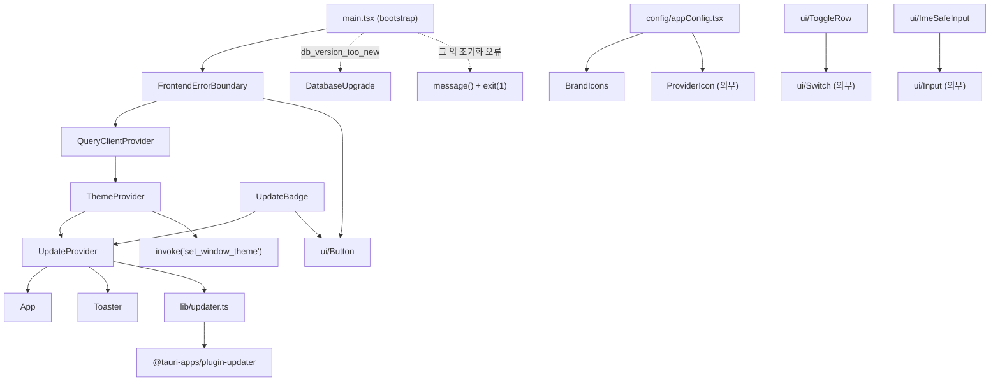
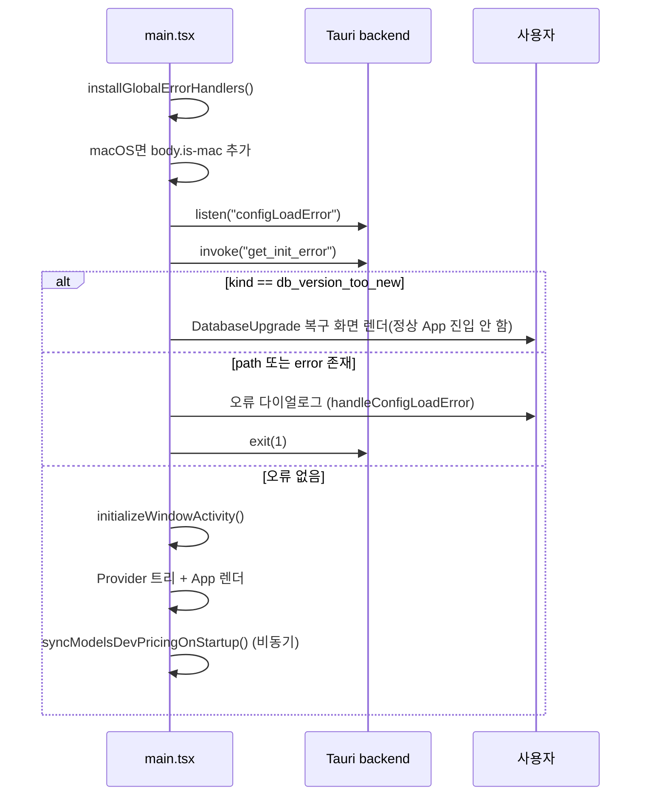
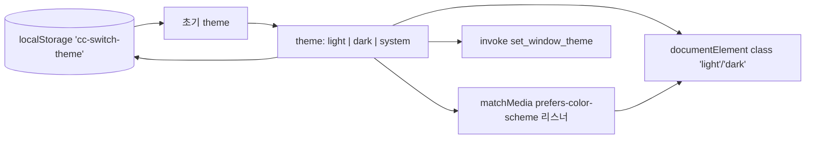
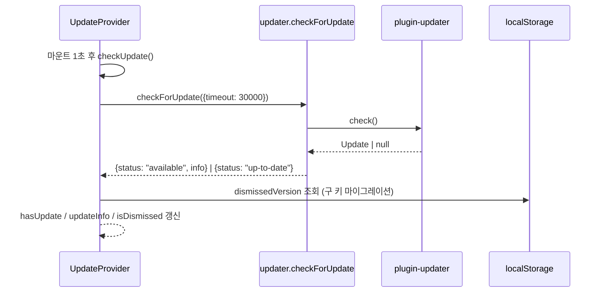
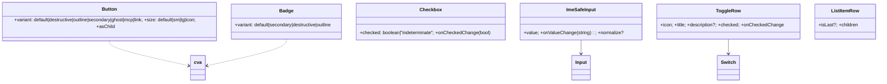

# app_shell_and_ui_primitives 모듈

`app_shell_and_ui_primitives`는 CC Switch(Tauri + React) 프런트엔드의 **앱 셸(부트스트랩, 에러 경계, 테마, 업데이트 알림)** 과 **재사용 UI 프리미티브(버튼, 배지, 체크박스, IME 안전 입력, 토글 행, 아이콘, Markdown 에디터)**, 그리고 앱 ID별 표시 설정(`APP_ICON_MAP`)과 버전 비교 유틸을 제공한다. 상위 모듈 `foundation_platform_and_build`의 자식이며, 형제 모듈은 [core_domain_types](core_domain_types.md)(`src/types.ts`)와 [build_ci_and_packaging](build_ci_and_packaging.md)이다.

## 1. 구성 요소 한눈에 보기

| 영역 | 파일 | 핵심 심볼 | 역할 |
|---|---|---|---|
| 부트스트랩 | `src/main.tsx` | `ConfigLoadErrorPayload`, `bootstrap()` | 초기화 오류 확인, Provider 트리 구성, 시작 시 models.dev 동기화 |
| 에러 경계 | `src/components/FrontendErrorBoundary.tsx` | `FrontendErrorBoundary` | React 렌더 오류 포착, 로그 기록, 재로드 UI |
| 테마 | `src/components/theme-provider.tsx` | `ThemeProvider`, `useTheme`, `ThemeContextValue` | light/dark/system, localStorage 저장, 네이티브 창 테마 동기화 |
| 업데이트 | `src/contexts/UpdateContext.tsx`, `src/lib/updater.ts`, `src/components/UpdateBadge.tsx` | `UpdateProvider`, `useUpdate`, `checkForUpdate`, `UpdateInfo`, `CheckOptions` | 앱 업데이트 확인·무시(dismiss) 상태·배지 |
| 버전 비교 | `src/lib/version.ts` | `compareVersions`, `isUpdateAvailable`, `ParsedVersion` | 경량 semver 비교(도구 버전 업데이트 판단) |
| 앱 설정 | `src/config/appConfig.tsx` | `AppConfig`, `APP_ICON_MAP`, `APP_IDS`, `*_APP_IDS`, `is*AppId` | 앱별 라벨/아이콘/스타일, 앱 분류 집합 |
| 아이콘 | `src/components/BrandIcons.tsx`, `src/types/icon.ts` | `ClaudeIcon`, `CodexIcon`, `GeminiIcon`, `OpenClawIcon`, `SkillsIcon`, `McpIcon`, `IconMetadata`, `IconPreset` | 브랜드 아이콘, 아이콘 메타데이터 타입 |
| UI 프리미티브 | `src/components/ui/{button,badge,checkbox,ime-safe-input,toggle-row}.tsx` | `Button`, `Badge`, `Checkbox`, `ImeSafeInput`, `ToggleRow` | 디자인 시스템 기본 부품 |
| 공통 | `src/components/common/ListItemRow.tsx`, `src/components/MarkdownEditor.tsx` | `ListItemRow`, `MarkdownEditor` | 목록 행 레이아웃, CodeMirror 기반 Markdown 편집기 |

> 참고: `Input`(`@/components/ui/input`), `Switch`(`@/components/ui/switch`), `Toaster`, `cn`(`@/lib/utils`), `ProviderIcon`, `reportFrontendError` 등은 이 모듈 밖에서 정의되며 여기서는 소비만 한다.

## 2. 아키텍처

핵심 설계 포인트:

- **Provider 순서**: `FrontendErrorBoundary`가 가장 바깥에 있어 하위 Provider/App의 렌더 오류까지 잡는다. `UpdateProvider`는 `ThemeProvider` 안쪽에서 `App`을 감싼다.
- **Tauri 의존성 격리**: `updater.ts`는 `@tauri-apps/plugin-updater`를 동적 `import()`하여 플러그인 부재 시 빌드 문제를 피한다. `ThemeProvider`의 `invoke` 실패는 무시(`console.debug`)하여 비 Tauri 환경에서도 동작한다.
- **프리미티브는 상태 비저장**: `Button`/`Badge`는 `class-variance-authority`(cva) 변형 + `cn`으로 스타일링하는 shadcn 스타일 컴포넌트이다(`components.json` 참조, [build_ci_and_packaging](build_ci_and_packaging.md)).

## 3. 부트스트랩 흐름 (`src/main.tsx`)

- `ConfigLoadErrorPayload { path?, error?, kind? }`: 백엔드 초기화 오류 payload. `kind === "db_version_too_new"`이면 앱 내 업그레이드 UI로 분기한다.
- 이벤트 경쟁(race)을 피하기 위해 `listen("configLoadError")`와 별도로 시작 직후 `get_init_error`를 **능동 조회**한다.
- 설정이 손상되면 취소 옵션 없이 `exit(1)` 한다. 설정 파일은 수정하지 않는다(코드 주석 기준).
- models.dev 가격 동기화는 렌더 이후 fire-and-forget이다. 성공(`!result.skipped`) 시 `["usage"]`, `MODELS_DEV_SYNC_CONFIG_QUERY_KEY` 쿼리를 무효화하고, 실패(오프라인 등)는 `reportFrontendError`만 남기고 시작을 막지 않는다. 자세한 사용량 처리는 [usage_tracking](usage_tracking.md) 참고.

## 4. FrontendErrorBoundary

`getDerivedStateFromError`로 `hasError`를 세우고 `componentDidCatch`에서 `reportFrontendError("react.error_boundary", error, componentStack)`를 호출한다. 오류 상태에서는 `role="alert"` 카드와 "재로드" 버튼(`window.location.reload()`)을 보여준다. 문구는 `i18n.t("errors.frontendCrashTitle" …)`에 중국어 `defaultValue`가 폴백으로 들어 있다.

## 5. ThemeProvider

- `theme`가 바뀔 때마다 (1) localStorage 저장, (2) `<html>` 클래스 교체, (3) system일 때 OS 변경 리스너, (4) 네이티브 타이틀바 테마 동기화 네 이펙트가 실행된다.
- `"system"`은 그대로 `"system"`을 백엔드에 전달해 Tauri가 OS 테마를 네이티브로 따르게 한다(그래야 WebView의 `prefers-color-scheme`이 실제 OS와 일치).
- `useTheme()`는 Provider 밖에서 호출하면 예외를 던진다. 같은 패턴이 `useUpdate()`에도 쓰인다.

## 6. 업데이트 서브시스템

- `UpdateInfo { currentVersion, availableVersion, notes?, pubDate? }`, `CheckOptions { timeout?, channel? }` (`UpdateChannel = "stable" | "beta"`; 현재 `checkForUpdate`는 `channel`을 사용하지 않음 — 코드 확인).
- `UpdateContextValue`: `hasUpdate`, `updateInfo`, `isChecking`, `error`, `isDismissed`, `dismissUpdate`, `checkUpdate`, `resetDismiss`.
- `isCheckingRef`로 중복 확인을 막는다(진행 중이면 `false` 반환). 오류 시 `error`를 설정하고 **다시 throw**하므로 호출자가 처리해야 한다(자동 확인은 `.catch(console.error)`).
- 무시한 버전은 `ccswitch:update:dismissedVersion`에 저장되고, 구 키 `dismissedUpdateVersion`은 읽을 때 마이그레이션 후 삭제된다.
- `UpdateBadge`: `hasUpdate && updateInfo`일 때만 녹색 아이콘 버튼을 렌더하고 아니면 `null`을 반환한다. (`isDismissed`는 배지 렌더에 사용되지 않음 — 코드 확인.)

### 버전 비교 (`src/lib/version.ts`)

문자열 `!==` 비교는 프리릴리스/`next` 태그처럼 로컬 버전이 `latest`보다 높은 경우 영구 오탐을 만든다. 그래서 `parseVersion`(`major.minor.patch[-pre]`) → `comparePre`(semver 규칙: 정식 > 프리릴리스, 숫자 < 비숫자, 길이가 긴 쪽이 큼) → `compareVersions`(파싱 불가 시 `0`) → `isUpdateAvailable(current, latest)`(`latest`가 **엄격히 크면** true)로 구성된다. `ParsedVersion`은 모듈 내부 인터페이스이다.

## 7. appConfig: 앱 ID 분류와 표시 설정

`AppConfig { label, icon, activeClass, badgeClass }`를 `APP_ICON_MAP: Record<AppId, AppConfig>`로 매핑한다. 앱 ID는 `claude, claude-desktop, codex, gemini, grokbuild, opencode, openclaw, hermes, pi, mcode` 10종이다.

| 집합 | 구성 | 의미 |
|---|---|---|
| `APP_IDS` / `DEFAULT_VISIBLE_APPS` | 전체 10종 / 전부 `true` | 기본 표시 앱 |
| `SKILLS_APP_IDS` | claude, codex, gemini, grokbuild, opencode, hermes, pi, mcode | Skills 패널 대상 |
| `PROXY_APP_IDS` (`ProxyAppId`) | claude, codex, gemini, grokbuild | 로컬 게이트웨이 + failover 데이터 플레인 보유 앱 — [proxy_and_failover](proxy_and_failover.md) |
| `STACK_APP_IDS` (`StackAppId`) | claude, codex | Stack 모드 지원(백엔드 `mode::stack::supports_stack`의 미러) |
| `ADDITIVE_APP_IDS` (`AdditiveAppId`) | mcode, opencode, openclaw, hermes, pi | 추가형 설정 앱 |
| `EDITOR_VIEW_APP_IDS` | claude, codex, gemini, grokbuild | 공급자 편집기가 "전환 후 설정 파일 모습"을 보여주는 앱(`usesEditorView`) — [provider_forms](provider_forms.md) |
| `MCP_APP_IDS` (`McpAppId`) | claude-desktop, openclaw, pi 제외 7종 | MCP 지원 앱 — [agents_mcp_prompts_skills_panels](agents_mcp_prompts_skills_panels.md) |

`isProxyAppId`, `isStackAppId`, `isAdditiveAppId`, `isMcpAppId`는 타입 가드이며, `getAppLabel(appId)`는 알 수 없는 ID에 ID 문자열을 그대로 돌려준다. 이 파일의 `AppConfig`는 `src/types.ts`의 동명 타입([core_domain_types](core_domain_types.md))과 **다른 타입**이므로 혼동에 주의한다.

## 8. UI 프리미티브

- **Button**: `forwardRef`, `asChild`이면 Radix `Slot`으로 렌더. `mcp` 변형(에메랄드)은 MCP 전용.
- **Badge**: `
` 기반 cva 컴포넌트, `badgeVariants`도 export.
- **Checkbox**: 네이티브 `<input type="checkbox">` 래퍼. `"indeterminate"`는 `useLayoutEffect`에서 DOM `indeterminate` 속성과 `aria-checked="mixed"`로 표현하고 `checked`는 `false`로 둔다. `onChange`와 `onCheckedChange`를 모두 호출한다. `CheckedState` 타입도 export.
- **ImeSafeInput**: IME 조합 중에는 로컬 `draft`만 갱신하고 `compositionend`(또는 조합 중 `blur`)에서 한 번만 `onValueChange`를 호출한다. `externalValueRef`로 낙관적 값 추적, 일부 엔진의 `compositionend` 후 중복 input 이벤트 억제, blur 시 부모 값과 재동기화를 수행한다. `normalize`로 커밋 값을 가공할 수 있다.
- **ToggleRow**: 아이콘 + 제목/설명 + `Switch`(`aria-label={title}`).
- **ListItemRow**: hover 하이라이트, `isLast`가 아니면 하단 구분선.
- **MarkdownEditor**: CodeMirror 6(`basicSetup`, `markdown()`, `oneDark`) 기반. `darkMode/readOnly/minHeight/maxHeight/placeholder`가 바뀌면 에디터를 재생성하고, 외부 `value` 변경은 별도 이펙트가 트랜잭션으로 반영한다(내용이 같으면 생략해 루프 방지). 읽기 전용에서는 커서/활성 줄 강조를 숨긴다. `onChange`는 의존성에 없으므로 최초 생성 시점의 콜백이 캡처된다(코드 확인 — 부모가 콜백을 바꾸면 반영 안 될 수 있음, 추론).
- **BrandIcons**: `ClaudeIcon`/`CodexIcon`/`GeminiIcon`/`OpenClawIcon`은 `@/icons/extracted/*.svg?url` ``(lazy), `CodexIcon`은 다크 모드에서 `brightness-0 invert`. `SkillsIcon`/`McpIcon`은 `currentColor` 인라인 SVG. 모두 `IconProps { size?, className? }`.
- **`src/types/icon.ts`**: `IconMetadata`(name, displayName, category, keywords, defaultColor?)와 `IconPreset`(이름→메타데이터 맵) 타입 선언. `ProviderIcon` 계열 소비자가 사용한다(추론).

## 9. 시스템 내 위치와 의존 관계

- 하위 소비자: 거의 모든 기능 모듈이 `Button`, `Badge`, `ToggleRow`, `ImeSafeInput`, `APP_ICON_MAP`을 사용한다 — 예: [provider_management_ui](provider_management_ui.md), [provider_forms](provider_forms.md), [sessions_and_settings](sessions_and_settings.md).
- 앱 ID 타입/`VisibleApps`는 [core_domain_types](core_domain_types.md)와 `@/lib/api/types`에서 가져온다.
- 빌드 도구(Vite, Vitest, `tsconfig`, `@/` alias 등)는 [build_ci_and_packaging](build_ci_and_packaging.md)에서 다룬다.

## 10. 유지보수 시 주의점

1. 새 앱을 추가하면 `AppId`, `APP_IDS`, `DEFAULT_VISIBLE_APPS`, `APP_ICON_MAP` 및 해당하는 분류 집합(`PROXY_/STACK_/ADDITIVE_/MCP_/SKILLS_APP_IDS`)을 함께 갱신해야 한다. `APP_ICON_MAP`은 `Record<AppId, …>`라 누락 시 컴파일 오류가 난다.
2. `STACK_APP_IDS`는 백엔드와 수동 미러링이므로 양쪽을 같이 수정한다.
3. 폼 입력에서 한글/일본어/중국어 IME 문제가 있으면 `Input` 대신 `ImeSafeInput`을 사용한다.
4. 업데이트 확인 실패는 throw되므로 새 호출부는 `try/catch`가 필요하다.
