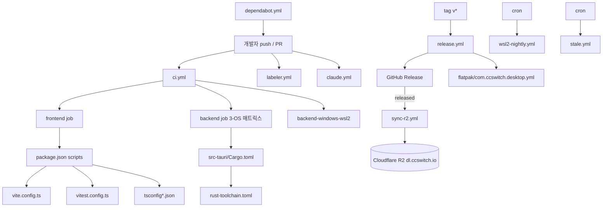
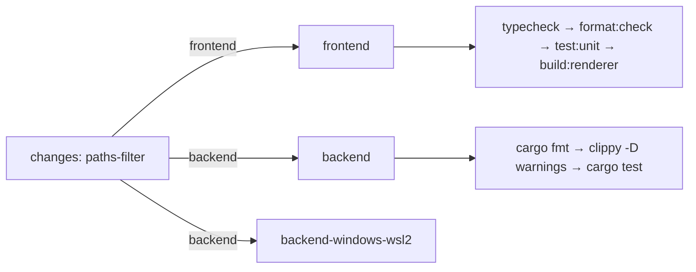
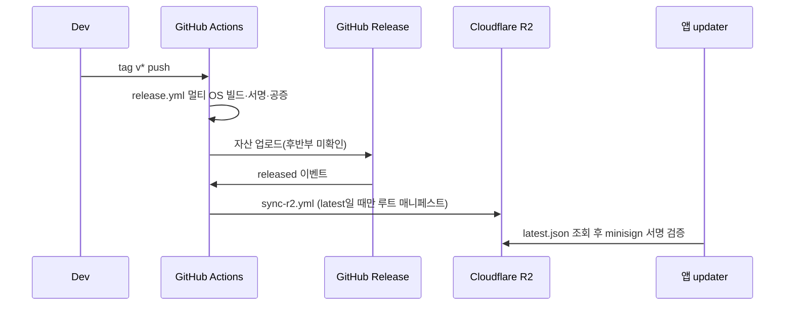

# build_ci_and_packaging 모듈

cc-switch(Tauri 2 + React + TypeScript 데스크톱 앱, `package.json` v3.20.4)의 **빌드 설정, 툴체인, CI/CD, 릴리스, 패키징**을 담당하는 설정 중심 모듈이다. 런타임 코드는 없고 YAML/JSON/TOML/TS 설정 파일로 구성된다. 앱 로직은 [core_domain_types](core_domain_types.md), [app_shell_and_ui_primitives](app_shell_and_ui_primitives.md) 등 상위 모듈 `foundation_platform_and_build`의 다른 하위 모듈을 참고한다.

> 검증 수준: 제공된 파일 내용 기준 **코드 확인**. `release.yml`은 앞 16KB만 제공되어 후반부(Windows/Linux 자산 정리, GitHub Release 업로드, `latest.json` 생성 등)는 **미확인**.

## 아키텍처 개요

## 구성요소별 기능

### 1. 프론트엔드 빌드·테스트 설정
| 파일 | 역할 |
|---|---|
| `package.json` | 스크립트: `dev`/`build`(`tauri dev`/`tauri build`), `dev:renderer`/`build:renderer`(vite), `typecheck`(`tsc --noEmit`), `format`/`format:check`(prettier, `src/**`), `test:unit`/`test:unit:watch`(vitest). `packageManager: pnpm@10.12.3` |
| `pnpm-workspace.yaml` | `packages: []`; 빌드 스크립트 허용(`@tailwindcss/oxide`, `esbuild`), `msw`는 무시 |
| `vite.config.ts` | `root: "src"`, 출력 `../dist`, 개발 포트 3000(strictPort), `@` → `src` alias, `envPrefix` `VITE_`/`TAURI_`, serve 시에만 `code-inspector-plugin` |
| `vitest.config.ts` | jsdom 환경, `{src,tests}/**/*.{test,spec}.*`, setup `tests/setupGlobals.ts`·`tests/setupTests.ts` |
| `tsconfig.json` / `tsconfig.node.json` | strict, ES2020, `@/*` 경로, `noEmit`; node용 설정은 `vite.config.ts`·`vitest.config.ts`만 포함(composite) |
| `components.json` | shadcn/ui 설정(style default, lucide, alias `@/components` 등) |

### 2. Rust/Tauri 백엔드 설정
- `src-tauri/Cargo.toml`: 크레이트 `cc-switch`(lib `cc_switch_lib`, `staticlib/cdylib/rlib`), `rust-version 1.85.0`, feature `test-hooks`. 주요 의존성: tauri 2 + 플러그인(updater, deep-link, single-instance 등), axum/hyper/reqwest(프록시), rusqlite(bundled), rquickjs. OS별 타깃 의존성(Linux `webkit2gtk`, Windows `winreg`/`windows-sys`, macOS `objc2`, Windows ARM64 `rquickjs` bindgen). release 프로파일: `lto=thin`, `opt-level="s"`, `strip=symbols`, `panic=unwind`.
- `rust-toolchain.toml`: 채널 `1.95`, rustfmt/clippy, minimal 프로파일.

### 3. CI 워크플로 (`.github/workflows`)

- `ci.yml`: PR/`main` push 트리거, `concurrency`로 중복 취소. `changes` 잡이 `dorny/paths-filter`로 프론트/백엔드 변경을 감지하고 PR에서는 해당 영역만 실행(main push는 항상 전체 실행하여 캐시 유지). `frontend`(Node 20, corepack pnpm, `--frozen-lockfile`), `backend`(ubuntu-22.04/windows/macos 매트릭스, Linux GTK/WebKit 의존성 설치, `dist` 플레이스홀더 생성). `backend-windows-wsl2`는 WSL2 홈(`\\wsl.localhost`)에서 `config::tests::atomic_write_replaces_existing_wsl_unc_file` 계약 테스트만 실행; 링커가 UNC TEMP를 못 쓰므로 네이티브 TEMP로 컴파일 후 바이너리를 직접 실행.
- `wsl2-nightly.yml`: 매일 cron으로 전체 백엔드 스위트를 WSL2 홈 대상으로 `--test-threads=1` 실행(50분+ 소요, timeout 90분).
- `claude.yml`: OWNER/MEMBER/COLLABORATOR가 `@claude`를 언급할 때 `claude-code-action`으로 **리뷰 전용**(편집 도구 차단) 실행. 고신뢰(80+) 이슈만 보고하도록 시스템 프롬프트 지정.
- `labeler.yml`: `pull_request_target`에서 `actions/labeler`로 라벨 동기화.
- `stale.yml`: 매일 이슈만 대상으로 60일 후 `stale`, 14일 후 종료(`security`,`performance` 라벨 제외, PR 제외).
- `dependabot.yml`: npm(`/`)·cargo(`/src-tauri`) 주간, github-actions 월간, 각각 그룹 업데이트와 `chore(deps)` 접두사.

### 4. 릴리스·배포
- `release.yml`: `v*` 태그 push 시 실행. 매트릭스: windows-2022, windows-11-arm, ubuntu-22.04(+arm), macos-14. 단계: Rust 타깃 추가 → Linux 시스템 의존성(`rpm`, `flatpak-builder` 포함) → pnpm 캐시 → Tauri 서명키 형식 정규화(`TAURI_SIGNING_PRIVATE_KEY`, 3가지 입력 형태 처리) → macOS 인증서 임포트(임시 keychain, Developer ID 자동 탐색) → 빌드(macOS `universal-apple-darwin`, 공증 최대 3회 재시도 / Windows ARM64는 `msi` / Linux `appimage,deb,rpm`) → macOS 자산 정리(stapler, tar.gz updater 산출물, zip, `create-dmg` 스타일 DMG, DMG 공증, codesign/spctl 검증). 이후 단계는 미확인.
- `sync-r2.yml`: Release가 `released`(프리릴리스 → 정식 승격 포함)가 될 때 또는 수동 `workflow_dispatch(tag)`로 Cloudflare R2에 미러링. 핵심 규칙:
  - 해당 태그가 GitHub `releases/latest`일 때만 루트 `manifest.json`/`latest.json`을 갱신하고 오래된 버전을 정리(`KEEP_VERSIONS=5`). 과거 태그 백필은 버전 디렉터리만 복원.
  - 공식 저장소(`farion1231/cc-switch`)에서 R2 시크릿이 없으면 의도적으로 실패(오래된 매니페스트가 updater를 막는 것을 방지).
  - 버전별 자산은 `immutable` 캐시, 루트 매니페스트는 `max-age=300`, 자산 업로드 후 매니페스트 업로드(중단 시 깨진 참조 방지), 업로드 직전 latest 재검증. `scripts/generate-download-manifest.mjs`, `scripts/rewrite-updater-manifest.mjs` 사용(스크립트 자체는 이 모듈 범위 밖). updater는 클라이언트에서 minisign 서명을 검증하므로 미러는 비신뢰.
  - `concurrency: sync-r2`, `queue: max`로 직렬화.
- `flatpak/com.ccswitch.desktop.yml`: GNOME 46 런타임, 트레이 지원용 `libayatana-*`/`libdbusmenu-gtk3`/`intltool` 모듈을 소스 빌드하고, CI가 만든 `cc-switch.deb`를 풀어 `/app`에 설치. 홈 디렉터리 전체 접근(`--filesystem=home`)을 부여(`~/.claude`, `~/.codex` 등 접근 목적; Flathub 배포 시 축소 필요하다고 주석에 명시).

## 데이터/실행 흐름 요약

## 관련 문서
- [core_domain_types](core_domain_types.md) — 앱 도메인 타입
- [app_shell_and_ui_primitives](app_shell_and_ui_primitives.md) — 앱 셸/UI, `src/lib/updater.ts`(업데이트 클라이언트)
- 이 모듈은 단일 성격의 설정 묶음이라 별도 하위 모듈 문서로 분리하지 않았다.
