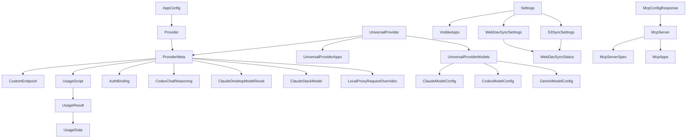
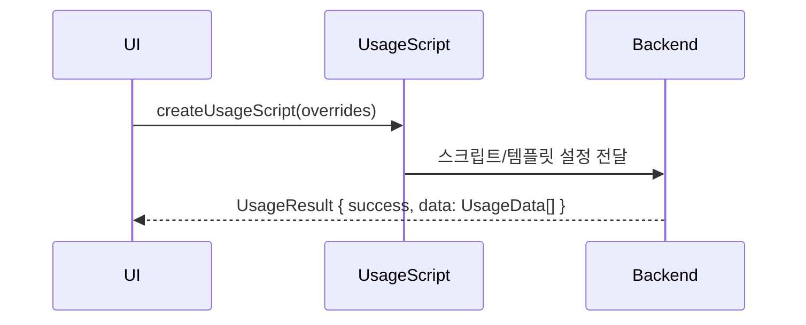
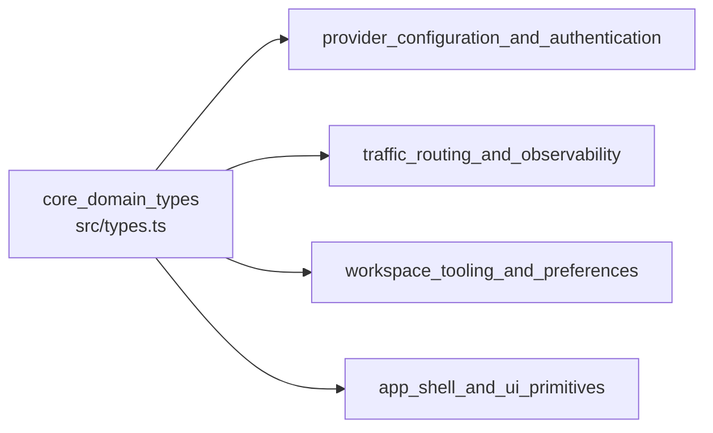

# core_domain_types 모듈

`core_domain_types`는 프론트엔드(React/TypeScript)와 Tauri 백엔드(Rust)가 공유하는 **도메인 데이터 계약**을 `src/types.ts` 한 파일에 모아 둔 모듈이다. 로직은 거의 없고(유일한 함수는 `createUsageScript`), 대부분 `interface`/`type` 선언이다. 상위 모듈 `foundation_platform_and_build`의 자식이며, 다른 모든 UI/API 모듈이 이 타입을 import한다.

## 1. 역할

- 공급자(Provider)와 그 메타데이터(`ProviderMeta`)의 형태 정의
- 앱 설정(`Settings`), 동기화(WebDAV/S3) 설정 정의
- MCP 서버, 세션, 용량 조회(Usage) 데이터 정의
- 앱별(OpenCode, OpenClaw, Hermes 등) 전용 설정 구조 정의
- 여러 앱이 공유하는 `UniversalProvider` 정의

> 주의: `ProviderMeta`는 주석상 백엔드와 필드명을 맞추기 위해 일부 snake_case(`custom_endpoints`, `usage_script`)를 유지하고, 나머지는 camelCase다. 이름 규칙이 혼재하므로 직렬화 경계에서 주의해야 한다. (코드 확인)

## 2. 구조 개요

## 3. 타입 그룹별 설명

### 3.1 공급자 핵심

| 타입 | 설명 |
|---|---|
| `Provider` | `id`, `name`, `settingsConfig`(앱별 live 설정; Claude는 settings.json, Codex는 `{auth, config}`), `category`, `sortIndex`, `meta`, `icon`, `inFailoverQueue` 등 |
| `ProviderCategory` | `official`, `cn_official`, `cloud_provider`, `aggregator`, `third_party`, `custom`, `omo`, `omo-slim` |
| `AppConfig` | `providers: Record<string, Provider>` + `current` |
| `CustomEndpoint` / `EndpointCandidate` | 사용자 정의 엔드포인트와 속도 테스트 후보 |
| `AuthBinding` | `source`(`provider_config` \| `managed_account`), `authProvider`, `accountId` |

`Provider.meta`는 `~/.cc-switch/config.json`에만 저장되고 live 설정에는 쓰이지 않는다고 주석에 명시돼 있다. (코드 확인)

### 3.2 ProviderMeta 주요 필드

- **API 형식**: `apiFormat` = `anthropic` / `openai_chat` / `openai_responses` / `gemini_native`. Anthropic 외 형식은 로컬 프록시에서 변환이 필요하다. `ClaudeApiFormat`, `CodexApiFormat`은 별도 유니온이다.
- **인증**: `authBinding`, `apiKeyField`(`ANTHROPIC_AUTH_TOKEN` \| `ANTHROPIC_API_KEY`), `githubAccountId`(구 필드, 호환용)
- **Codex 관련**: `codexChatReasoning`(`CodexChatReasoning`), `codexFastMode`, `promptCacheKey`, `promptCacheRouting`, `maxOutputTokens`, `impersonateClaudeCode`
- **로컬 프록시 전용**: `customUserAgent`, `localProxyRequestOverrides`(headers/body), `isFullUrl`
- **Claude Desktop**: `claudeDesktopMode`(`direct`/`proxy`), `claudeDesktopModelRoutes`
- **Stack 모드**: `stackModels`(`ClaudeStackModel[]`)
- **기타**: `commonConfigEnabled`, `endpointAutoSelect`, `isPartner`, `partnerPromotionKey`, `liveConfigManaged`, `providerType`

`CodexChatReasoning`은 `thinkingParam`, `effortParam`, `effortValueMode`(`passthrough`/`low_high`/`deepseek`/`openrouter`/`zen`), `outputFormat`을 가진다. 코드 주석에 따르면 `outputFormat`은 선언적 필드이며 현재 추출 로직은 이 값을 읽지 않는다. (코드 주석 기준)

`CodexCatalogModel`은 생성되는 Codex 모델 카탈로그의 항목(`model`, `displayName`, `contextWindow`, `baseInstructions`, `reasoningLevels`, `defaultReasoningLevel` 등)이다.

### 3.3 용량(Usage) 조회

- `UsageScript`: `enabled`, `language: "javascript"`, `code`, `timeout`, `templateType`, 인증 필드(`apiKey`, `accessToken`, `accessKeyId` 등), `autoQueryInterval`, `request`.
- `createUsageScript(overrides?)`: 기본값(`enabled: false`, `timeout: 10`, `autoQueryInterval: 5`)에 `overrides`를 얕게 병합한다. 이 모듈의 유일한 런타임 로직이다.
- `UsageResult`는 여러 플랜을 지원하도록 `UsageData[]`를 반환한다.
- `autoQueryInterval`과 `autoIntervalMinutes`는 동일한 의미의 별칭으로 중복 존재한다. (주석 기준)

### 3.4 Settings 및 동기화

`Settings`는 `~/.cc-switch/settings.json`에 저장되는 **기기 단위** 설정이며 DB 동기화 대상이 아니다.

- UI/동작: `showInTray`, `minimizeToTrayOnClose`, `launchOnStartup`, `silentStartup`, `language`(`en`/`zh`/`zh-TW`/`ja`), `visibleApps`(`VisibleApps`)
- 프록시/페일오버: `enableLocalProxy`, `enableStackMode`(주석상 `enableLocalProxy`와 택일), `enableFailoverToggle`, 각종 `*Confirmed` 플래그
- 디렉터리 오버라이드: `claudeConfigDir`, `codexConfigDir`, `geminiConfigDir`, `grokConfigDir`, `opencodeConfigDir`, `openclawConfigDir`, `hermesConfigDir`, `piConfigDir`
- 현재 공급자 ID: `currentProviderClaude` 등 (DB의 `is_current`보다 우선)
- Skill: `skillSyncMethod`(`auto`/`symlink`/`copy`), `skillStorageLocation`(`cc_switch`/`unified`)
- 동기화: `webdavSync`(`WebDavSyncSettings`), `s3Sync`(`S3SyncSettings`) — 둘 다 상태 타입으로 `WebDavSyncStatus`를 재사용
- 백업: `backupIntervalHours`, `backupRetainCount`
- `localMigrations`: Codex 히스토리 버킷 마이그레이션 완료 기록

`RemoteSnapshotInfo`는 원격 스냅샷을 내려받기 전 미리보기 정보(`deviceName`, `snapshotId`, `compatible`, `layout` 등)다. `WebDavSyncSettings.password`, `S3SyncSettings.secretAccessKey`는 자격 증명이므로 로그에 노출되지 않도록 다뤄야 한다 (추론).

### 3.5 MCP

- `McpServerSpec`: `type`(`stdio`/`http`/`sse`), `command`, `args`, `env`, `cwd`, `url`, `headers`, 그리고 임의 키 허용(index signature).
- `McpApps`: 서버를 켤 클라이언트 앱 플래그. `claude`, `codex`, `gemini`, `opencode`, `openclaw`, `hermes`는 필수이고 `mcode`, `claude-desktop`, `grokbuild`는 선택이다. `VisibleApps`와 달리 `pi`는 없다.
- `McpServer`: `id`, `name`, `server`, `apps`, 메타 필드. `enabled`는 v3.6.x 이전 호환용(deprecated).
- `McpStatus`, `McpConfigResponse`, `McpServersMap`.
- `OpenCodeMcpServerSpec`은 통합 포맷과 다르다(`command`가 배열, `env` 대신 `environment`, `type: local|remote`).

### 3.6 Universal Provider

하나의 설정(`baseUrl`, `apiKey`)을 Claude/Codex/Gemini에 공유한다. `apps`(`UniversalProviderApps`)로 대상을 고르고 `models`(`UniversalProviderModels`)로 앱별 모델(`ClaudeModelConfig`의 haiku/sonnet/opus 지정, `CodexModelConfig.reasoningEffort`, `GeminiModelConfig`)을 지정한다.

### 3.7 앱 전용 설정

| 앱 | 타입 |
|---|---|
| OpenCode | `OpenCodeProviderConfig`(`npm`, `options`, `models`), `OpenCodeModel`, `OpenCodeProviderOptions` |
| OpenClaw | `OpenClawProviderConfig`, `OpenClawModel`, `OpenClawAgentsDefaults`, `OpenClawDefaultModel`, `OpenClawModelCatalogEntry`, `OpenClawEnvConfig`, `OpenClawToolsConfig`, `OpenClawWriteOutcome`, `OpenClawHealthWarning` |
| Hermes | `HermesModelConfig`, `HermesMemoryLimits`, `HermesMemoryKind` |

`OpenClawAgentsDefaults`, `OpenClawToolsConfig`, `OpenClawEnvConfig`, `OpenCodeModel`은 index signature로 **알 수 없는 필드를 보존**하도록 설계되어 있다. 외부 설정 파일을 읽고 다시 쓸 때 데이터 손실을 막으려는 의도로 보인다 (추론).

### 3.8 세션

`SessionMeta`(`providerId`, `sessionId`, `title`, `projectDir`, `resumeCommand` 등)와 `SessionMessage`(`role`, `content`, `ts`).

## 4. 다른 모듈과의 관계

- 공급자 폼/프리셋/API 레이어는 `Provider`, `ProviderMeta`, `UniversalProvider` 등을 사용한다 → [provider_configuration_and_authentication](provider_configuration_and_authentication.md)
- 프록시/페일오버/사용량 화면은 `Provider.inFailoverQueue`, `UsageScript` 등에 의존한다. 단, 프록시/사용량 전용 타입은 `src/types/proxy.ts`, `src/types/usage.ts`에 별도로 있다 → [traffic_routing_and_observability](traffic_routing_and_observability.md)
- 설정/MCP/세션 UI는 `Settings`, `McpServer`, `SessionMeta`를 사용한다 → [workspace_tooling_and_preferences](workspace_tooling_and_preferences.md)
- 형제 모듈: [app_shell_and_ui_primitives](app_shell_and_ui_primitives.md), [build_ci_and_packaging](build_ci_and_packaging.md)

`src/types.ts`는 `./config/constants`에서 `TemplateType`을 type-only import한다. 따라서 `config`와의 순환 의존은 타입 수준에 한정된다.

## 5. 유지보수 주의사항

1. 백엔드(Rust) 구조체와 필드명이 일치해야 한다. 한쪽을 바꾸면 다른 쪽도 같이 수정한다 (주석 근거, 백엔드 코드는 미확인).
2. 옵셔널 필드를 추가할 때는 구버전 설정 파일과의 호환(예: `enabled` → `apps`)을 유지한다.
3. 새 앱을 지원하려면 `VisibleApps`, `McpApps`, `Settings`의 `*ConfigDir`를 함께 갱신해야 한다. 현재 `VisibleApps`와 `McpApps`의 키 집합이 서로 다르다.
4. 문서화되지 않은 상수·검증 규칙은 이 모듈에 없으며, 검증은 각 폼/백엔드가 담당한다.

검증 수준: 위 내용은 제공된 `src/types.ts` 소스를 기준으로 한 **코드 확인**이며, 백엔드 대응 구조와 타입 사용처 일부는 **추론/미확인**이다.
