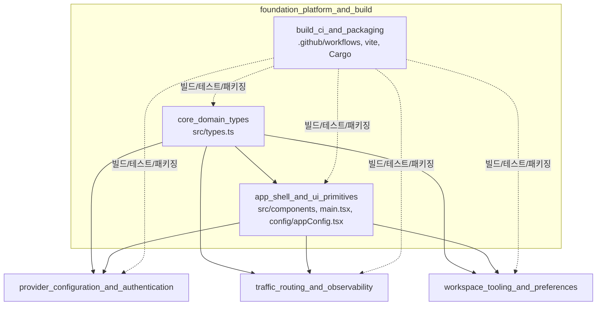
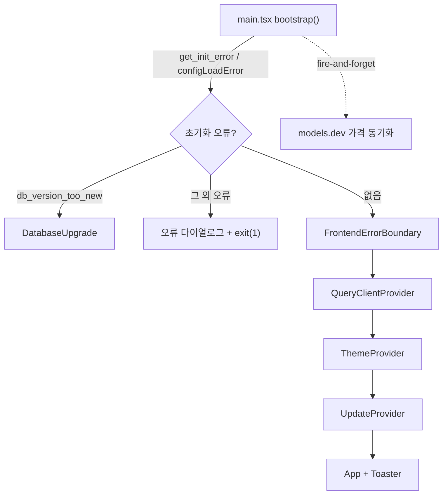
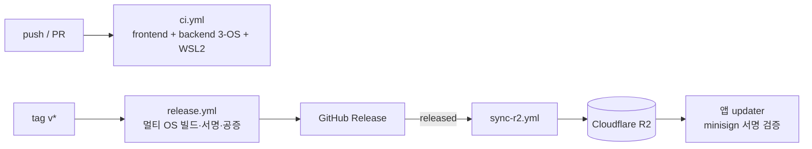

# foundation_platform_and_build 모듈 개요

## 1. 목적

`foundation_platform_and_build`는 CC Switch(Tauri 2 + React + TypeScript 데스크톱 앱)의 **기반 계층**이다. 기능 모듈 전체가 공통으로 쓰는 세 가지를 제공한다.

- **도메인 데이터 계약**: 프론트엔드와 Rust 백엔드가 공유하는 타입(`src/types.ts`)
- **앱 셸과 UI 프리미티브**: 부트스트랩, 에러 경계, 테마, 업데이트 알림, 재사용 컴포넌트, 앱 ID 분류 (`src/main.tsx`, `src/components`, `src/config/appConfig.tsx` 등)
- **빌드·CI·패키징**: Vite/Vitest/Cargo 설정, GitHub Actions, 릴리스, Cloudflare R2 미러, Flatpak (`.github/workflows` 등)

세 하위 모듈은 서로 느슨하게 연결된다. 타입과 UI 프리미티브는 런타임 코드이고, 빌드 모듈은 설정 파일 묶음이라 런타임 코드가 없다.

## 2. 아키텍처

### 2.1 모듈 구성과 상위 의존 관계

### 2.2 앱 셸 Provider 트리와 부트스트랩

### 2.3 빌드·릴리스 파이프라인

## 3. 하위 모듈 요약

### core_domain_types
`src/types.ts` 한 파일에 `Provider`/`ProviderMeta`, `Settings`, `McpServer`, `UniversalProvider`, 세션, 용량 조회(`UsageScript`) 타입을 모았다. 런타임 로직은 `createUsageScript`뿐이다. 주의할 점은 다음과 같다.
- 백엔드와 필드명을 맞추려고 snake_case와 camelCase가 섞여 있다.
- `VisibleApps`와 `McpApps`의 키 집합이 서로 다르다.
- `src/lib/api/types`에 있는 타입이나 `src/config/appConfig.tsx`의 `AppConfig`와 이름이 겹치지 않는지 확인해야 한다. 특히 `appConfig.tsx`의 `AppConfig`는 `types.ts`의 동명 타입과 다른 타입이다.

### app_shell_and_ui_primitives
- **셸**: `bootstrap()`이 백엔드 초기화 오류를 능동 조회한 뒤 Provider 트리를 구성한다. `FrontendErrorBoundary`가 가장 바깥에서 렌더 오류를 잡는다. `ThemeProvider`는 `localStorage`와 네이티브 창 테마를 동기화한다. `UpdateProvider`는 업데이트를 확인하고 무시한 버전을 기억한다.
- **유틸**: `compareVersions`/`isUpdateAvailable`이 경량 semver 비교를 한다.
- **앱 분류**: `APP_ICON_MAP`과 `PROXY_/STACK_/ADDITIVE_/MCP_/SKILLS_APP_IDS` 집합이 앱별 지원 범위를 정한다.
- **프리미티브**: `Button`, `Badge`, `Checkbox`, `ImeSafeInput`(IME 조합 안전 입력), `ToggleRow`, `ListItemRow`, `MarkdownEditor`(CodeMirror 6), `BrandIcons`.

### build_ci_and_packaging
- **프론트엔드 툴체인**: `package.json`(pnpm), `vite.config.ts`, `vitest.config.ts`, `tsconfig*.json`, `components.json`.
- **백엔드 툴체인**: `src-tauri/Cargo.toml`, `rust-toolchain.toml`.
- **CI**: `ci.yml`이 `paths-filter`로 변경된 영역만 실행한다. 이 외에 `wsl2-nightly.yml`, `claude.yml`(리뷰 전용), `labeler.yml`, `stale.yml`, `dependabot.yml`이 있다.
- **릴리스**: `release.yml`은 macOS 서명·공증과 Windows/Linux 패키징을 수행한다. `sync-r2.yml`은 최신 릴리스일 때만 루트 매니페스트를 갱신한다. `flatpak/com.ccswitch.desktop.yml`은 Flatpak 패키지를 만든다.

## 4. 핵심 설계 포인트와 주의사항

- **타입이 단일 계약이다.** 백엔드(Rust) 구조체와 필드명이 일치해야 하며, 새 앱을 추가하면 `types.ts`와 `appConfig.tsx`의 여러 집합을 함께 갱신해야 한다. 백엔드 대응 코드는 이 문서 범위에서 **미확인**이다.
- **Tauri 의존성을 격리한다.** `updater.ts`는 플러그인을 동적 import하고, `ThemeProvider`는 `invoke` 실패를 무시한다. 그래서 비 Tauri 환경에서도 동작한다.
- **업데이트 신뢰 모델이 있다.** R2 미러는 비신뢰이며, 클라이언트가 minisign 서명을 검증한다.
- **검증 수준**: 하위 문서 기준 **코드 확인**이다. 다만 `release.yml` 후반부, 즉 Windows/Linux 자산 정리와 Release 업로드 단계는 **미확인**이다.

## 5. 핵심 컴포넌트 문서 참조

| 하위 모듈 | 경로 | 문서 |
|---|---|---|
| `core_domain_types` | `src/types.ts` | [core_domain_types.md](core_domain_types.md) |
| `app_shell_and_ui_primitives` | `src/components` | [app_shell_and_ui_primitives.md](app_shell_and_ui_primitives.md) |
| `build_ci_and_packaging` | `.github/workflows` | [build_ci_and_packaging.md](build_ci_and_packaging.md) |

이 모듈을 사용하는 형제 모듈은 다음과 같다.
- `provider_configuration_and_authentication`
- `traffic_routing_and_observability`
- `workspace_tooling_and_preferences`