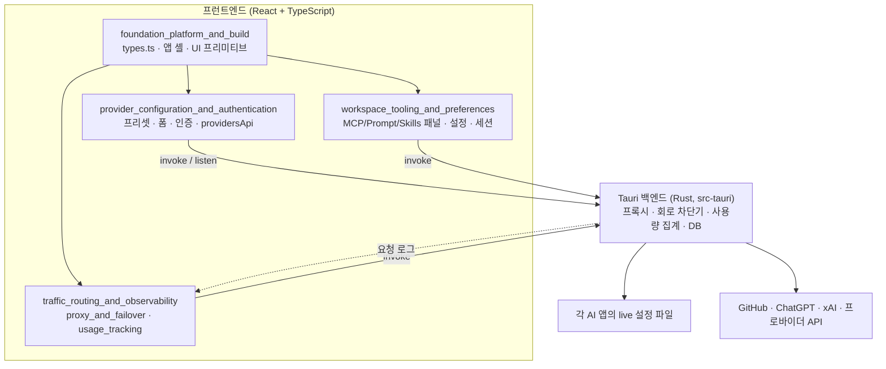
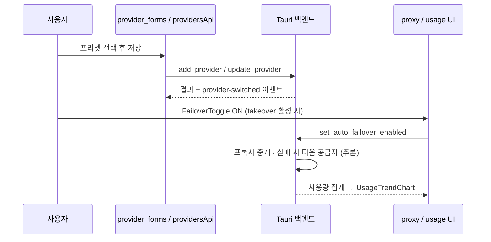

# cc-switch 개요

## 1. 목적

CC Switch는 **Tauri 2 + React + TypeScript 데스크톱 앱**이다. 여러 AI 코딩 CLI 앱(Claude Code, Claude Desktop, Codex, Gemini, Grok Build, OpenCode, OpenClaw, Hermes, Pi, MCode)의 설정을 한곳에서 관리한다. 주요 기능은 다음과 같다.

- **프로바이더 관리**: 프리셋 선택, 앱별 설정 변환 폼, 관리형 OAuth 로그인, 구독 쿼터 표시.
- **트래픽 라우팅과 관측**: 로컬 프록시 takeover, 자동 failover, 회로 차단기, 요청 로그·토큰·비용 추이 차트.
- **작업 환경 관리**: MCP 서버, 프롬프트, Skills, 세션 검색, 설정 가져오기/내보내기.

실제 프록시 서버, 회로 차단기, 사용량 집계, 설정 파일 쓰기는 Rust 백엔드(`src-tauri`)에 있다. 이 저장소 분석 문서가 다루는 범위는 주로 프런트엔드(`src`)이며, 프런트엔드는 Tauri `invoke`/`listen` 래퍼와 UI를 제공한다.

> 검증 수준: 이 개요는 CodeWiki 모듈 문서(분석 후보)를 종합한 것이다. 소스 코드와 직접 대조하지 않았다. 백엔드 동작은 **미확인**이다.

## 2. 전체 아키텍처

### 대표 흐름: 프로바이더 전환과 트래픽 관측

프로바이더 저장 단계는 문서 기준 코드 확인이다. 프록시 중계와 failover 동작은 UI 문구에서 도출한 **추론**이다.

## 3. 핵심 설계 포인트

- **타입이 단일 계약이다.** `src/types.ts`는 Rust 구조체와 필드명을 맞춘다. 그래서 snake_case와 camelCase가 섞여 있다.
- **`settingsConfig` 문자열이 SSOT다.** 폼 상태 훅이 이 문자열을 패치하고, 외부 변경은 역동기화한다.
- **앱별 프리셋이 독립이다.** 같은 공급자도 앱마다 별도 항목이다.
- **IPC 래퍼는 무상태다.** 캐싱과 재시도는 `src/lib/query/*` 훅이 맡는다.
- **프런트와 Rust 간 동기화 지점이 있다.** `CACHE_INCLUSIVE_APP_TYPES`, Coding Plan 정규식, Codex 예약 provider id 등은 양쪽을 함께 수정해야 한다.
- **Tauri 의존성을 격리한다.** 비 Tauri 환경에서도 동작하도록 플러그인을 동적 import한다.

## 4. 핵심 모듈 문서

| 모듈 | 경로 | 요약 | 문서 |
|---|---|---|---|
| `foundation_platform_and_build` | 루트, `src/types.ts`, `src/components`, `.github/workflows` | 도메인 타입, 앱 셸(Provider 트리, 에러 경계, 테마, 업데이트), UI 프리미티브, 빌드·CI·패키징 | [foundation_platform_and_build.md](foundation_platform_and_build.md) |
| `provider_configuration_and_authentication` | `src` | 프로바이더 UI, 폼, 프리셋·모델 카탈로그, 관리형 OAuth, IPC 래퍼 | [provider_configuration_and_authentication.md](provider_configuration_and_authentication.md) |
| `traffic_routing_and_observability` | `src/components` | 프록시 takeover, 자동 failover, 회로 차단기, 사용량 추적과 차트 | [traffic_routing_and_observability.md](traffic_routing_and_observability.md) |
| `workspace_tooling_and_preferences` | `src` | MCP/Prompt/Skills 패널, 설정 훅, 가져오기/내보내기, 세션 검색 | [workspace_tooling_and_preferences.md](workspace_tooling_and_preferences.md) |

하위 모듈 문서는 각 모듈 문서의 "핵심 컴포넌트 문서 참조" 표에서 찾을 수 있다. 예로 `core_domain_types.md`, `app_shell_and_ui_primitives.md`, `build_ci_and_packaging.md`, `provider_forms.md`, `proxy_and_failover.md`, `usage_tracking.md`, `sessions_and_settings.md`가 있다.

## 5. How it is built and run

- **빌드**: `pnpm`(`package.json`, `pnpm-workspace.yaml`)과 Vite(`vite.config.ts`)로 프런트엔드를 빌드한다. Rust는 `src-tauri/Cargo.toml`과 `rust-toolchain.toml`로 빌드하며, `pnpm tauri`로 구동한다.
- **테스트**: 프런트엔드는 Vitest(`vitest.config.ts`, `test:unit`), 백엔드는 `ci.yml`의 `backend`, `backend-windows-wsl2`, `frontend` job이 실행한다. 변경 영역만 실행하도록 `paths-filter`를 쓰며, `wsl2-nightly.yml`이 야간 전체 WSL2 테스트를 돌린다.
- **패키징·배포**: `release.yml`이 멀티 OS 빌드와 서명·공증을 수행해 GitHub Release를 만든다. `sync-r2.yml`이 Cloudflare R2에 미러링하고, 앱 updater가 minisign 서명을 검증한다. Linux는 `flatpak/com.ccswitch.desktop.yml`로 Flatpak을 만든다.
- **기타 자동화**: `claude.yml`, `labeler.yml`, `stale.yml`, `dependabot.yml`.

자세한 내용은 [foundation_platform_and_build.md](foundation_platform_and_build.md)와 [build_ci_and_packaging.md](build_ci_and_packaging.md)를 참고한다. `release.yml` 후반부(Windows/Linux 자산 정리, Release 업로드)는 문서에서 **미확인**으로 표시되어 있다.