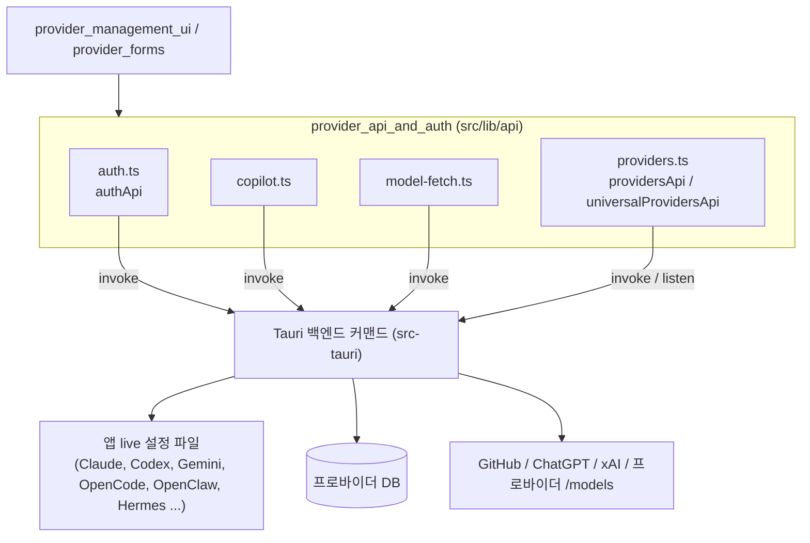
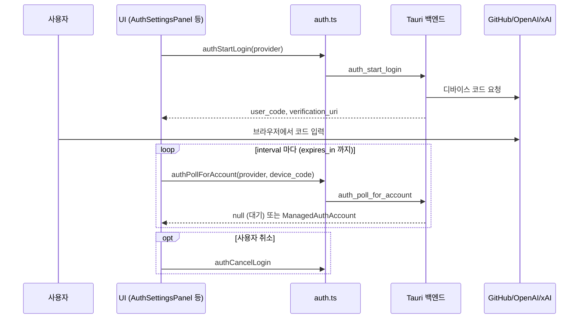
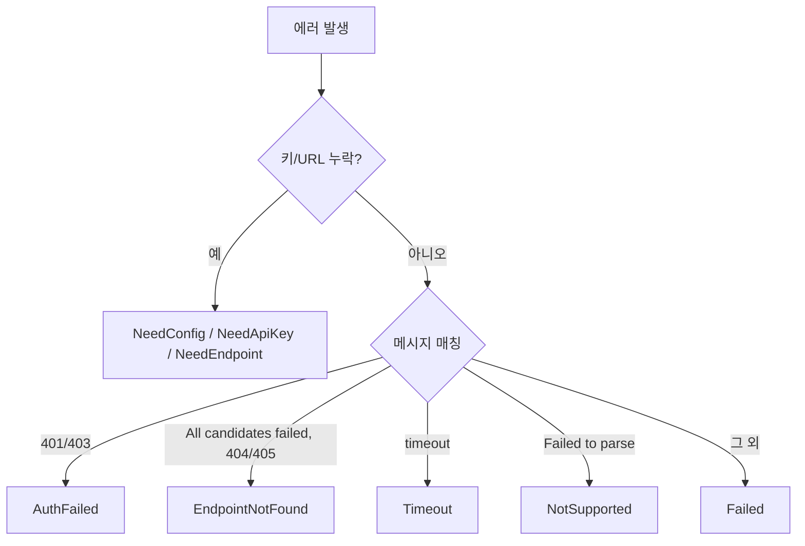
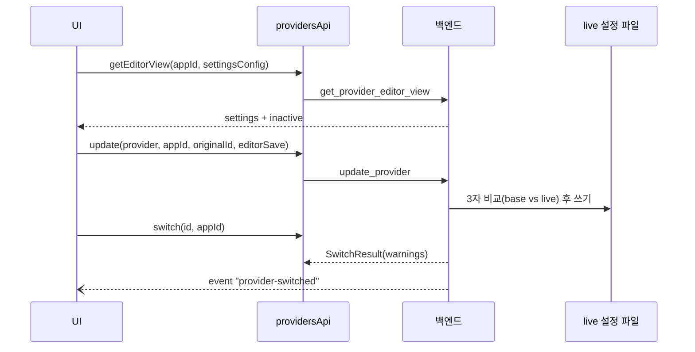

# provider_api_and_auth 모듈

## 개요

`provider_api_and_auth`는 React 프런트엔드가 Tauri 백엔드(Rust)의 **프로바이더 관리·OAuth 인증·모델 조회** 기능을 호출하는 얇은 IPC 래퍼 계층이다. 모든 함수는 `@tauri-apps/api/core`의 `invoke`(및 `listen`)를 통해 백엔드 커맨드로 위임하며, 비즈니스 로직은 거의 없다. 예외는 `showFetchModelsError`로, 에러 문자열을 i18n toast로 변환한다.

| 파일 | 역할 |
|---|---|
| `src/lib/api/auth.ts` | 통합 OAuth 계정 관리 (`github_copilot`, `codex_oauth`, `xai_oauth`) |
| `src/lib/api/copilot.ts` | GitHub Copilot 전용 레거시/다중 계정 API (토큰, 모델, 사용량) |
| `src/lib/api/model-fetch.ts` | 프로바이더별 사용 가능 모델 목록 조회 및 오류 toast |
| `src/lib/api/providers.ts` | 프로바이더 CRUD, 전환, 에디터 뷰, live 설정 import, Universal Provider |

## 아키텍처

## 컴포넌트 상세

### 1. `auth.ts` — 관리형 OAuth

타입:
- `ManagedAuthProvider`: `"github_copilot" | "codex_oauth" | "xai_oauth"`
- `ManagedAuthAccount`: `id`, `provider`, `login`, `avatar_url`, `authenticated_at`, `is_default`, `github_domain`. 재인증 플래그가 두 개 있다: Codex 전용 `reauth_required`(신원/워크스페이스 메타데이터 부족), xAI 전용 `requires_reauth`(refresh 자격 증명 무효).
- `ManagedAuthStatus`: `authenticated`, `default_account_id`, `migration_error`, `accounts`
- `ManagedAuthDeviceCodeResponse`: `device_code`, `user_code`, `verification_uri`, `expires_in`, `interval`
- 상수 `CODEX_OAUTH_DUPLICATE_ACCOUNT_ERROR = "codex_oauth_duplicate_account"` — 중복 계정 에러 식별용.

함수 → 백엔드 커맨드 매핑:

| 함수 | 커맨드 |
|---|---|
| `authStartLogin(provider, githubDomain?, targetAccountId?)` | `auth_start_login` |
| `authPollForAccount(provider, deviceCode, githubDomain?)` | `auth_poll_for_account` (대기 중이면 `null`) |
| `authCancelLogin` | `auth_cancel_login` |
| `authListAccounts` / `authGetStatus` | `auth_list_accounts` / `auth_get_status` |
| `authRemoveAccount` / `authSetDefaultAccount` | `auth_remove_account` / `auth_set_default_account` |
| `authLogout` | `auth_logout` |

선택 인자(`githubDomain`, `targetAccountId`)는 빈 값이면 `null`로 정규화되어 전달된다. `targetAccountId`는 기존 계정 재인증 용도로 보이나(추론), 정확한 의미는 백엔드 코드 미확인.

#### 디바이스 코드 로그인 흐름

### 2. `copilot.ts` — GitHub Copilot

`auth.ts`와 기능이 겹치는 Copilot 전용 API. 단일 계정 호환 함수(`copilotStartDeviceFlow`, `copilotPollForAuth`, `copilotGetAuthStatus`, `copilotLogout`, `copilotIsAuthenticated`, `copilotGetToken`, `copilotGetModels`, `copilotGetUsage`)와 다중 계정 함수(`copilotListAccounts`, `copilotPollForAccount`, `copilotRemoveAccount`, `copilotSetDefaultAccount`, `copilotGetTokenForAccount`, `copilotGetModelsForAccount`, `copilotGetUsageForAccount`)로 나뉜다.

타입: `GitHubAccount`(GHES 도메인 `github_domain` 포함), `CopilotAuthStatus`(`username`, `expires_at`은 하위 호환 필드), `CopilotDeviceCodeResponse`, `CopilotModel`, `CopilotUsageResponse` → `QuotaSnapshots`(`chat`, `completions`, `premium_interactions`) → `QuotaDetail`.

`copilotGetToken*`은 주석상 프록시 요청용 내부 함수다. 사용량 쿼리 훅은 [provider_management_ui](provider_management_ui.md)의 `src/lib/query/copilot.ts`가 사용한다.

### 3. `model-fetch.ts` — 모델 목록 조회

- `fetchModelsForConfig(baseUrl, apiKey, isFullUrl?, modelsUrl?, customUserAgent?, options?)` → `fetch_models_for_config`. OpenAI 호환 `GET /v1/models`; `modelsUrl`이 있으면 정확히 덮어쓰고, 없으면 백엔드가 baseURL 후보 목록을 순서대로 시도한다(`/anthropic` 같은 호환 서브패스를 벗겨내는 폴백 포함). OpenAI(`data[].id/owned_by`), Anthropic 호환(`data[].id`), 지푸(Zhipu) Responses(`models[].slug`) 형식을 지원한다고 문서화되어 있다. `ModelFetchOptions`: `apiFormat`, `requestHeaders`.
- `fetchCodexOauthModels(accountId?)` → `get_codex_oauth_models` (ChatGPT backend-api/codex, 일반 `/v1/models`와 비호환)
- `fetchXaiOauthModels(accountId?)` → `get_xai_oauth_models`
- `getOpenCodeModels()` → `get_opencode_models` (`OpenCodeModelRef { providerId, modelId }`)
- `showFetchModelsError(err, t, opts?)`: 사전 검사(키/URL 누락) 후 에러 문자열의 부분 일치(`HTTP 401/403`, `All candidates failed`, `HTTP 404/405`, `timeout`, `Failed to parse`)로 `providerForm.fetchModels*` i18n 키를 선택해 `sonner` toast를 띄운다. 문자열 매칭이므로 백엔드 에러 메시지 변경에 취약하다(추론).

### 4. `providers.ts` — 프로바이더 API

`providersApi` 주요 그룹 (`AppId`는 `./types`):

- **CRUD/조회**: `getAll`, `getCurrent`, `add`, `update`, `delete`, `updateSortOrder`(`ProviderSortUpdate`)
- **전환**: `switch` → `SwitchResult { warnings }`; `onSwitched`는 `provider-switched` 이벤트를 `listen`하여 `ProviderSwitchEvent { appType, providerId }`를 전달하고 `UnlistenFn`을 반환.
- **에디터 3자 비교**: `getEditorView`가 `ProviderEditorView { settings, inactive }`를 반환(전환 후 설정 파일 모습 + 전환에 반영되지 않는 `ProviderEditorInactiveField`). `add`/`update`는 `ProviderEditorSave { base, draft?, onConflict? }`를 함께 보낼 수 있으며, `EditorConflictPolicy`는 `"refuse" | "keepMine" | "keepTheirs"`로 편집 중 live 파일이 외부에서 바뀐 경우의 정책이다.
- **공식 프로바이더 보장/가져오기**: `importDefault`, `ensureClaudeDesktopOfficialProvider`, `ensureCodexOfficialProvider`, `ensureGrokBuildOfficialProvider`, `importClaudeDesktopFromClaude`
- **Claude Desktop**: `getClaudeDesktopStatus`(`ClaudeDesktopStatus`: direct/proxy 모드, base URL 불일치, 라우트 매핑 누락 등), `getClaudeDesktopDefaultRoutes`(`ClaudeDesktopDefaultRoute`)
- **누적(additive) 모드 앱 (OpenCode/OpenClaw/Hermes)**: `removeFromLiveConfig`(DB 삭제 없이 live에서만 제거), `get*LiveProviderIds`, `import*FromLive`
- **기타**: `updateTrayMenu`, `openTerminal(providerId, appId, {cwd})` — 현재 활성 여부와 무관하게 해당 프로바이더 설정으로 터미널 실행

`universalProvidersApi`: `getAll`, `get`, `upsert`, `delete`, `sync` — 하나의 정의를 여러 앱에 동기화하는 Universal Provider용.

## 설계 특징 및 주의점

- 이 모듈은 상태를 갖지 않는다. 캐싱·재시도는 [provider_management_ui](provider_management_ui.md)의 React Query 훅(`src/lib/query/*`)이 담당한다.
- `copilot.ts`와 `auth.ts`의 `github_copilot` 경로가 중복된다. 신규 코드는 `authApi` 사용이 일반적일 것으로 보이나(추론), 어느 쪽이 UI에서 실제 쓰이는지는 미확인.
- 인자 이름은 Tauri 규약상 camelCase로 전달되고 백엔드에서 snake_case로 매핑된다(`app`, `providerId`, `accountId` 등).
- 도메인 타입(`Provider`, `UniversalProvider`)은 [core_domain_types](core_domain_types.md)에 정의된다.

## 관련 모듈

- [provider_forms](provider_forms.md): 모델 조회·에디터 뷰를 호출하는 폼
- [provider_presets_and_model_catalog](provider_presets_and_model_catalog.md): 프리셋/모델 메타데이터
- [provider_management_ui](provider_management_ui.md): OAuth 패널, 쿼터 푸터, 쿼리 훅
- [proxy_and_failover](proxy_and_failover.md): Copilot/Codex 토큰을 사용하는 프록시

검증 수준: 제공된 4개 소스 파일은 **코드 확인**, 백엔드 커맨드 구현·실제 호출처는 **미확인**.
