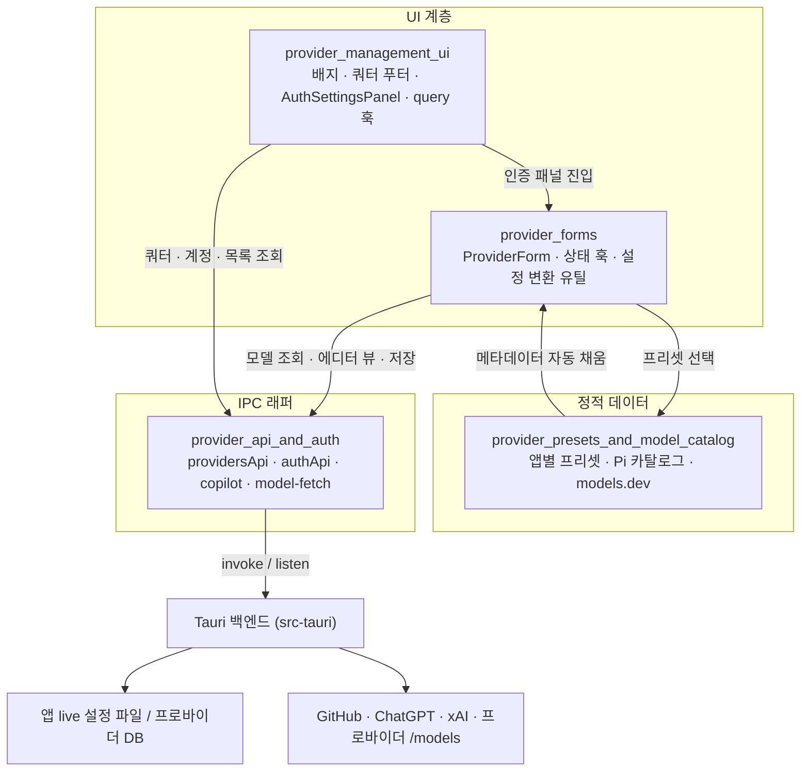
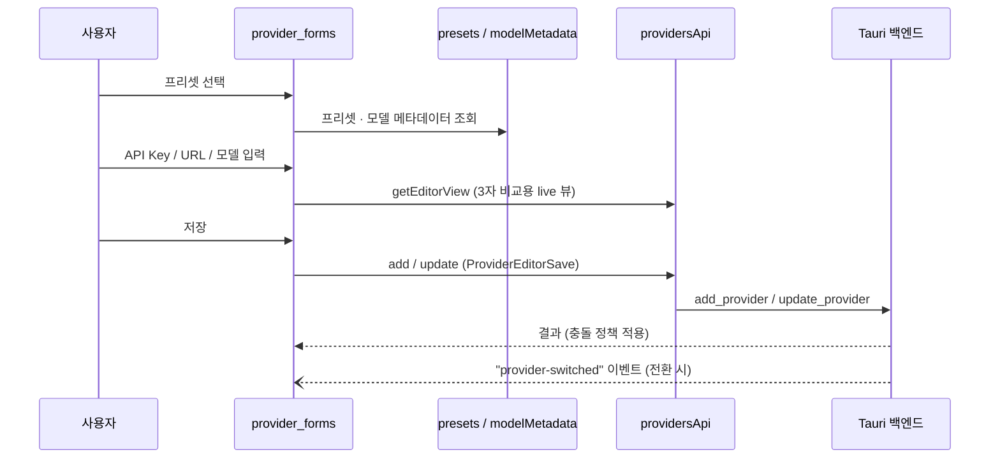

# provider_configuration_and_authentication 모듈 개요

## 1. 목적

cc-switch의 프런트엔드에서 **AI 코딩 앱(Claude Code, Claude Desktop, Codex, Gemini, Grok Build, OpenCode, OpenClaw, Hermes, Pi, MCode)이 쓰는 프로바이더를 정의하고, 편집하고, 인증하고, 상태를 보여주는 계층**이다. 아래 네 가지를 맡는다.

- 프리셋과 모델 카탈로그 같은 정적 데이터 제공
- 앱별 설정(JSON/TOML/env/YAML)으로 변환하는 추가·편집 폼
- 프로바이더 카드 주변의 상태 배지, 구독 쿼터, 인증 패널 UI
- Tauri 백엔드(`invoke`)에 대한 얇은 IPC 래퍼(프로바이더 CRUD, 전환, 관리형 OAuth, 모델 조회)

> 검증 수준: 이 개요는 하위 모듈 문서 4건을 읽고 정리한 것이다(문서 기준). 하위 문서는 각각 소스 코드를 직접 확인했다고 밝히고 있지만, 이 개요 작성 과정에서 `repos/cc-switch` 코드를 다시 열어 검증하지는 않았다. 백엔드(`src-tauri`) 커맨드 구현은 미확인이다.

## 2. 아키텍처

### 대표 흐름: 프로바이더 추가·저장

### 설계 포인트

- **settingsConfig 문자열이 단일 진실 원천(SSOT)**: 폼 상태 훅이 이 문자열을 패치하고, 외부 변경은 effect로 역동기화한다(`provider_forms`).
- **앱별 독립 프리셋**: 같은 공급자도 앱마다 별도 항목이다. Grok Build는 Codex에서 갈라져 나왔고, Pi는 다른 앱 프리셋을 import하지 않으며, MCode만 의도적으로 Pi에서 파생된다(`provider_presets_and_model_catalog`).
- **관리형 OAuth 3종**: `github_copilot`, `codex_oauth`, `xai_oauth`를 디바이스 코드 흐름으로 로그인한다. 쿼터 쿼리 키가 같아 프로바이더 카드와 인증 센터가 React Query 캐시를 공유한다.
- **Keep-last-good**: 일시 오류(5xx, 429, 네트워크)는 마지막 성공값을 최대 10분 유지하고, 인증이나 4xx 오류는 즉시 노출한다(`resolveDisplayUsage`).
- **IPC 계층은 무상태**: 캐싱과 재시도는 `src/lib/query/*` 훅이 맡는다.
- **프런트-백엔드 동기화 지점**: Coding Plan 정규식(`coding_plan.rs`), Codex 예약 provider id(`codex_config.rs`), Hermes 소스 상수(`hermes_config.rs`)는 Rust 쪽과 맞춰야 한다. 에러 문자열 매칭(`showFetchModelsError`, `isTransientUsageError`)도 백엔드 메시지에 의존한다.

## 3. 하위 모듈과 핵심 컴포넌트 문서

| 하위 모듈 | 경로 | 역할 | 문서 |
|---|---|---|---|
| provider_management_ui | `src/components/providers` | 상태 배지(`ProviderHealthBadge`, `ProviderStatusBadge`, `FailoverPriorityBadge`), OAuth 쿼터 푸터, `AuthSettingsPanel`, `useProvidersQuery`·`subscription.ts`·`copilot.ts` 훅 | [provider_management_ui.md](provider_management_ui.md) |
| provider_forms | `src/components/providers/forms` | `ProviderForm`/`ProviderFormFull`, `ClaudeDesktopProviderForm`, `ProviderPresetSelector`, 상태 훅(`hooks/`), `providerConfigUtils`, `requestOverrides` | [provider_forms.md](provider_forms.md) |
| provider_presets_and_model_catalog | `src/config`, `src/lib/modelsDev*.ts` | 앱별 프리셋, Pi 카탈로그·thinking 프로파일, `resolveModelMetadata`, models.dev 가격 동기화, `codingPlanProviders` | [provider_presets_and_model_catalog.md](provider_presets_and_model_catalog.md) |
| provider_api_and_auth | `src/lib/api` | `providersApi`/`universalProvidersApi`, `authApi`(관리형 OAuth), `copilot.ts`, `model-fetch.ts` | [provider_api_and_auth.md](provider_api_and_auth.md) |

## 4. 외부 모듈과의 관계

- 도메인 타입(`Provider`, `ProviderMeta`, `UniversalProvider`): [core_domain_types](core_domain_types.md)
- 헬스 상태, 서킷 브레이커, 페일오버 큐, Copilot/Codex 토큰을 쓰는 프록시: [proxy_and_failover](proxy_and_failover.md)
- 사용량 집계와 models.dev 가격 동기화 결과의 소비처: [usage_tracking](usage_tracking.md)

## 5. 알려진 주의점

- `copilot.ts`와 `auth.ts`의 `github_copilot` 경로가 중복된다. UI가 실제로 어느 쪽을 쓰는지는 미확인이다.
- `useProvidersQuery`가 오류를 삼켜 빈 목록을 반환하므로, 호출부에서 "로딩 실패"와 "프로바이더 없음"을 구분할 수 없다.
- `PresetEntry` 타입이 여러 파일에 중복 정의되어 있다.