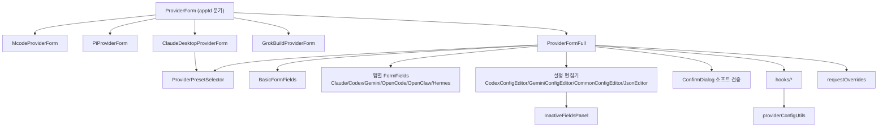
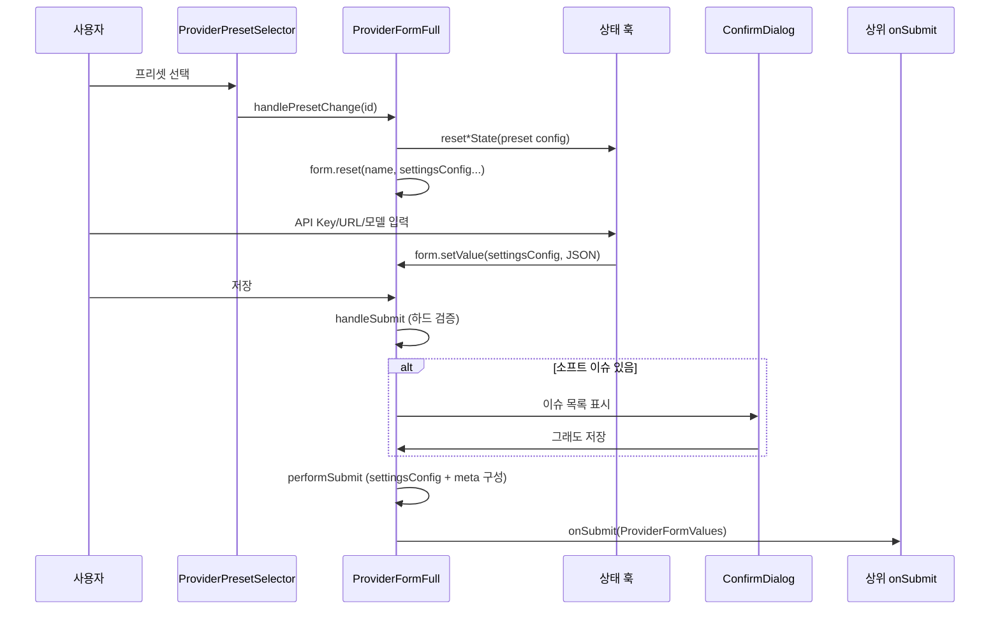

# provider_forms 모듈

`src/components/providers/forms/` 아래의 **공급자(Provider) 추가/편집 폼**과 그 상태 훅, 그리고 폼이 쓰는 설정 변환 유틸(`src/utils/providerConfigUtils.ts`, `grokBuildConfig.ts`, `deepLinkConfigPreview.ts`, `src/lib/requestOverrides.ts`)을 묶은 모듈이다. 사용자가 프리셋을 고르거나 직접 입력한 값을 앱별 `settingsConfig`(JSON/TOML/env)와 `ProviderMeta`로 변환해 상위(`onSubmit`)에 넘기는 것이 역할이다.

> 검증 수준: 아래 내용은 제공된 소스 코드를 읽고 정리한 것(코드 확인). 제공되지 않은 하위 컴포넌트(`ClaudeFormFields`, `CodexFormFields` 등)의 내부 동작은 미확인이며, 의도 서술은 `추론`으로 표시했다.

관련 모듈:
- 프리셋 데이터: [provider_presets_and_model_catalog](provider_presets_and_model_catalog.md)
- 공급자 API/인증: [provider_api_and_auth](provider_api_and_auth.md)
- 목록/상태 UI: [provider_management_ui](provider_management_ui.md)
- 도메인 타입(`Provider`, `ProviderMeta` 등): [core_domain_types](core_domain_types.md)

## 1. 아키텍처

`ProviderForm`은 얇은 라우터다. `appId`가 `mcode`/`pi`/`claude-desktop`/`grokbuild`이면 전용 폼으로 위임하고, 나머지(`claude`, `codex`, `gemini`, `opencode`, `openclaw`, `hermes`)는 `ProviderFormFull`이 처리한다. `ProviderFormFull`은 `claude-desktop`을 받으면 예외를 던진다.

## 2. 핵심 컴포넌트

### ProviderForm / ProviderFormFull (`ProviderForm.tsx`)
- 입력 `ProviderFormProps`: `appId`, `providerId`, `initialData`(편집 시), `onSubmit`, `onUniversalPresetSelect`, `onManageAuthAccounts`, `inactiveFields`, `claudeLiveBase`, `onEditorBaseChange` 등.
- `react-hook-form` + `zodResolver(providerSchema)`로 공통 필드(name, websiteUrl, notes, settingsConfig, icon, iconColor)를 관리하고, 앱별 상태는 훅이 별도로 들고 있다가 저장 시 합친다.
- **프리셋 목록**: `appId`에 따라 `providerPresets`(hidden 제외)/`codexProviderPresets`/… 를 `{id: "<app>-<index>", preset}`로 만든다.
- **저장 흐름**: `handleSubmit`(검증) → `performSubmit`(직렬화) → `onSubmit(payload)`.
  - *하드 오류*(toast 후 중단): 로컬 프록시 오버라이드 JSON 오류, providerKey 비어있음/형식(`^[a-z0-9]+(-[a-z0-9]+)*$`)/중복, OAuth 미로그인·계정 사용불가, OMO 기타 필드 JSON 오류.
  - *소프트 이슈*(`ConfirmDialog`로 “그래도 저장” 선택): 템플릿 값 미입력, 이름 비어있음, 비공식 공급자의 엔드포인트/API Key 누락, Stack 레이아웃에서 모델 0개. 확인 경로는 react-hook-form의 `isSubmitting`을 우회하므로 `isConfirmSubmitting`을 별도 추적한다.
- **settingsConfig 직렬화**: Codex는 `{auth, config(TOML), modelCatalog?}`, Gemini는 `{env, config}`, OMO는 `{agents, categories, otherFields}`, 그 외는 폼의 JSON 문자열 그대로.
- **ProviderMeta 구성**: `providerType`/`authBinding`(managed_account: `github_copilot`, `codex_oauth`, `xai_oauth`), `apiFormat`, `apiKeyField`, `isFullUrl`, `stackModels`, `codexChatReasoning`, `promptCacheRouting`, `customUserAgent`, `localProxyRequestOverrides`, `endpointAutoSelect` 등. 편집 모드에서는 `custom_endpoints`를 제거한다(백엔드가 엔드포인트 포함 update를 거부하므로 전용 명령 사용).
- **Stack 레이아웃**: 설정의 `enableStackMode`가 켜져 있고 Claude/Codex 비공식 공급자이면 간소화 패널(`variant="stack"`)을 쓰며 “전체 폼” 토글(`preferFullForm`)로 전환한다.
- `normalizeCodexCatalogModelsForSave`(중복 제거·숫자 정리·빈 값 제거)와 `normalizeCodexChatReasoningForSave`는 저장 전 정규화 함수다.

### ClaudeDesktopProviderForm (`ClaudeDesktopProviderForm.tsx`)
`ProviderFormFull`과 별개로 자체 상태를 가진 폼이다. 핵심 개념:
- **mode**: `direct`(공급자가 `claude-sonnet-*` 등 Claude 식별자를 직접 수용) vs `proxy`(모델 매핑). 관리형 OAuth 프리셋은 항상 `proxy`.
- **라우트 행(RouteRow)**: direct는 자유 목록, proxy는 `normalizeProxyRows`로 **Sonnet/Opus/Fable/Haiku 4슬롯 고정**. 빈 슬롯은 저장 시 첫 채워진 슬롯의 모델을 상속한다.
- `isClaudeSafeRoute`는 백엔드 `is_claude_safe_model_id`를 미러링(주석 근거)하며 `[1m]` 마커나 `claude-sonnet-` 같은 퇴화 값을 거부한다.
- 기본 라우트는 `providersApi.getClaudeDesktopDefaultRoutes()`를 react-query로 받아 `didSeedDefaultProxyRoutes` ref와 effect로 **한 번만** 채운다.
- 공식(official) 공급자는 빈 `env`와 모델 관련 meta 제거로 저장한다.
- 결과 `meta.claudeDesktopMode`, `claudeDesktopModelRoutes`, `authBinding`, `codexFastMode`를 채운다.

### ProviderPresetSelector (`ProviderPresetSelector.tsx`)
프리셋 버튼 그리드. 검색(Ctrl/Cmd+F, 캡처 단계에서 리스트의 동일 단축키 차단), A–Z 정렬 토글, 범용(Universal) 프리셋 진입점 제공. `PresetVisibilityOptions {query, sortMode, t}`를 받는 `getVisiblePresetEntries`는 필터 → 정렬 순수 함수이며, 기본 정렬은 **official → primePartner → partner → 나머지(이름순)** 이다(앞 세 그룹은 파일 순서 유지).

### InactiveFieldsPanel (`InactiveFieldsPanel.tsx`)
DB 행에는 저장돼 있지만 전환(switch) 시 live에 반영되지 않는 필드를 칩으로 보여준다. `action.kind`가 `add`면 편집기에 추가, `copy`면 값을 클립보드에 복사한다.

## 3. 상태 훅 (`hooks/`)

| 훅 | 책임 |
|---|---|
| `useProviderCategory` | 프리셋 id(`claude-3` 등)에서 category 추출. 편집 모드는 `initialCategory` 고정, `custom`이면 `"custom"` |
| `useApiKeyState` | JSON `settingsConfig` ↔ API Key 양방향 동기. official/cloud_provider는 필드를 새로 만들지 않음 |
| `useBaseUrlState` | Claude/Desktop(JSON env), Codex(TOML), Gemini(env) Base URL 동기. `isUpdatingRef`로 에코 루프 방지 |
| `useModelState` | `ANTHROPIC_*` 모델 env(Haiku/Sonnet/Opus/Fable/Subagent, `_NAME`)와 `[1M]` 마커. 폴백 체인은 런타임 매핑과 동일(fable→opus→default) |
| `useCodexConfigState` | `auth.json` + `config.toml` + 모델 카탈로그. `experimental_bearer_token` 폴백, `mapCodexCatalogModelForForm`(camel/snake 양식 모두 허용) |
| `useGeminiConfigState` | `.env` 문자열 ↔ env 객체, 설정 JSON 검증 |
| `useOpencodeFormState` / `useOpenclawFormState` / `useHermesFormState` | 앱별 필드를 로컬 state + `settingsConfig` JSON 패치로 동시 갱신. 기존 키 목록으로 중복 검사 |
| `useOmoDraftState` / `useOmoModelSource` | OMO(OpenCode 에이전트 설정) 초안과 모델 선택지(구성된 공급자 ∩ live id + 런타임 모델 + 프리셋 variant) |
| `useTemplateValues` | 프리셋 `${KEY}` 템플릿 값 입력 및 해당 경로만 부분 치환 |
| `useApiKeyLink` | API Key 발급 링크 표시 여부/URL(`apiKeyUrl` 우선)/파트너 정보 |
| `useSpeedTestEndpoints` | 속도 테스트 후보 = 현재 URL + 초기 데이터 URL + 프리셋 `endpointCandidates` (중복 제거, 말미 `/` 제거) |
| `useOpenClawModelOptions` | OpenClaw 공급자의 `providerId/modelId` 옵션 |

## 4. 유틸

- **`providerConfigUtils.ts`**: API Key get/set/has, `applyTemplateValues`, 그리고 Codex TOML의 줄 단위 편집기(`extract/setCodexBaseUrl`, `ModelName`, `WireApi`, `RemoteCompaction`, `experimental_bearer_token`, 최상위 정수 필드). `TomlSectionRange`/`TomlAssignmentMatch`가 섹션 범위·할당 위치를 나타낸다. 정규식 기반이라 TOML이 편집 중 깨져도 폴백 스캔으로 동작하며, 모델명은 `tomlBasicString`으로 이스케이프해 원격 `/models` 응답에 의한 TOML 주입을 막는다. `CODEX_RESERVED_MODEL_PROVIDER_IDS`는 백엔드 `codex_config.rs`와 동기화해야 한다(주석).
- **`grokBuildConfig.ts`**: `smol-toml`로 Grok Build `config.toml`을 parse/update/validate. `[models].default`가 가리키는 `[model.<profile>]` 테이블을 편집.
- **`deepLinkConfigPreview.ts`**: 딥링크 import 요청의 base64 설정을 디코드해 미리보기를 만들되 민감 키는 마스킹.
- **`requestOverrides.ts`**: 로컬 프록시 헤더/바디 오버라이드 JSON 검증. 헤더 이름은 RFC 9110 token, 보호 헤더(인증·hop-by-hop·트레이싱 등)는 거부, 바디의 `stream` 필드 금지.
- **`modelMetadataFill.ts`**: 모델 목록 선택 시 알려진 메타데이터(컨텍스트, 추론 레벨, 모달리티, 비용)를 앱별 행 형식으로 **빈 필드만** 채운다. Pi 전용 `thinkingLevelMap` 변환과 `PiProviderProtocol` 기반 호환성 판단 포함.

## 5. 데이터 흐름

핵심 패턴: **settingsConfig 문자열이 단일 진실 원천(SSOT)** 이고, 훅은 입력 시 이 문자열을 패치하며 외부 변경(프리셋·편집기)은 effect로 state에 역동기화한다. 에코 루프는 `isUpdatingRef`/`isUserEditingRef`로 막는다.

## 6. 유의점

- 동일한 `PresetEntry` 타입이 여러 파일에 중복 정의되어 있다(`ProviderForm`, `useTemplateValues`, `ProviderPresetSelector`의 `AnyPreset` 포함 버전).
- Codex/Gemini/Grok Build의 `onEditorBaseChange`/`useDraftEditorProjection`은 프리셋을 live 설정 위에 투영해 3-way 비교 기준(base)을 맞추기 위한 것(추론; 구현은 이 모듈 밖).
- 인증 계정 선택 UI(`CopilotAuthSection` 등)와 로그인 상태 훅은 [provider_api_and_auth](provider_api_and_auth.md) 쪽 API에 의존한다.
