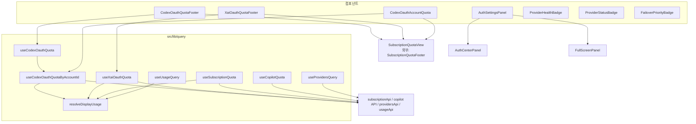
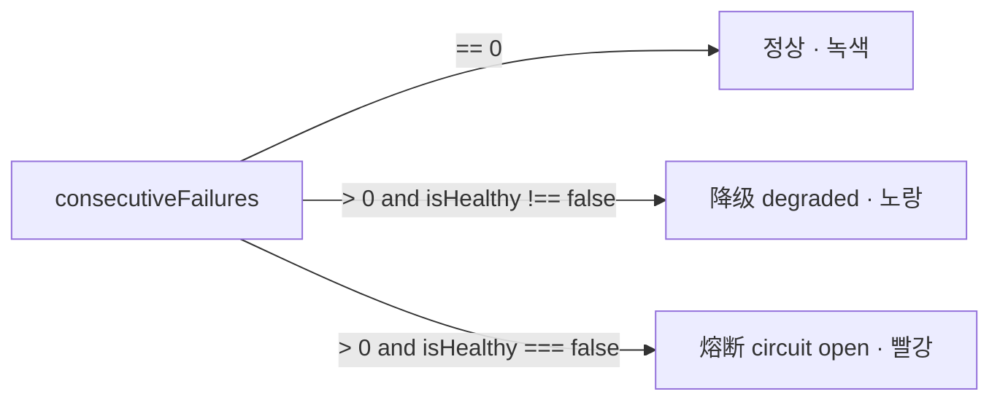
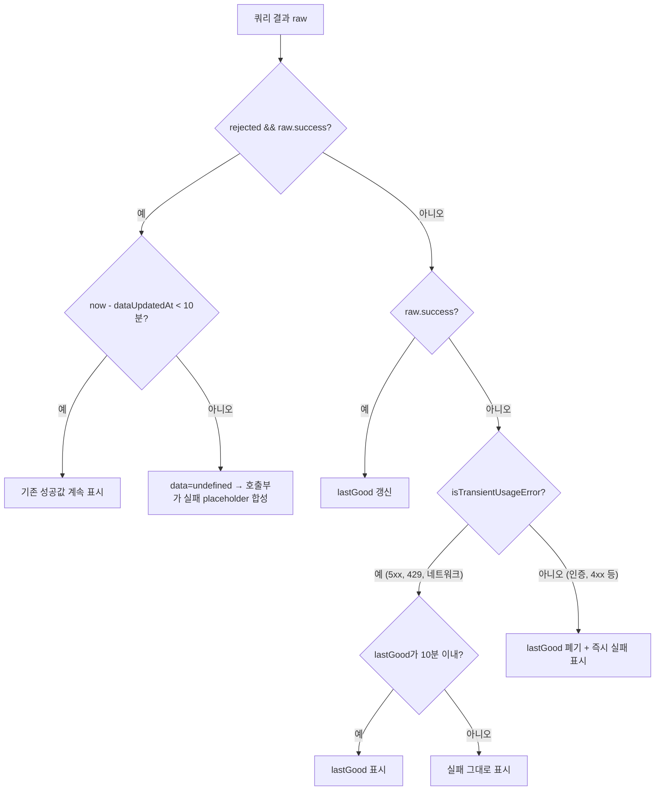
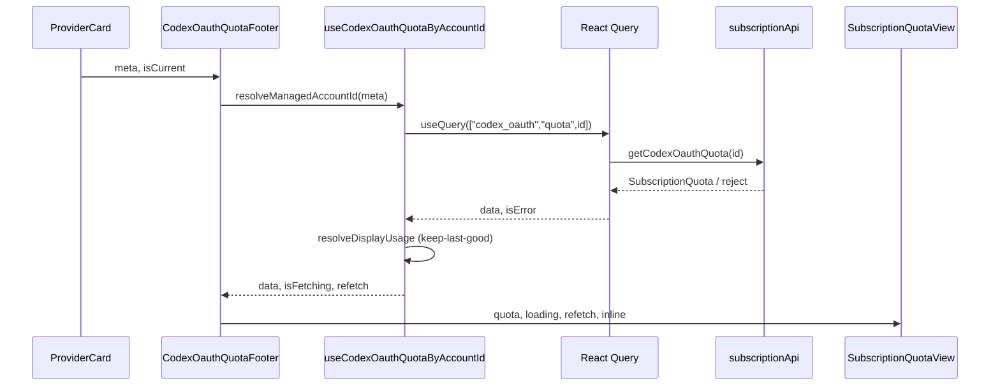

# provider_management_ui 모듈

## 1. 개요

`provider_management_ui`는 cc-switch 프런트엔드에서 **프로바이더 카드 주변의 상태 표시 · 구독 쿼터 표시 · 인증 패널 진입점**을 담당하는 모듈이다. 구성은 다음 세 축이다.

1. **상태 배지**: `ProviderHealthBadge`, `ProviderStatusBadge`, `FailoverPriorityBadge`
2. **OAuth 구독 쿼터 UI**: `CodexOauthQuotaFooter`, `XaiOauthQuotaFooter`, `CodexOauthAccountQuota` (공통 렌더러 `SubscriptionQuotaView`를 재사용)
3. **데이터 훅/타입**: `src/lib/query/queries.ts`, `subscription.ts`, `copilot.ts`, `src/types/subscription.ts`
4. **인증 패널 래퍼**: `AuthSettingsPanel` (`FullScreenPanel` + `AuthCenterPanel`)

상위 모듈은 `provider_configuration_and_authentication`이며, 같은 부모 아래 형제 모듈은 [provider_forms](provider_forms.md), [provider_presets_and_model_catalog](provider_presets_and_model_catalog.md), [provider_api_and_auth](provider_api_and_auth.md)이다.

> 검증 수준: 아래 내용은 제공된 소스 코드를 직접 읽고 작성했다(코드 확인). `SubscriptionQuotaView`, `AuthCenterPanel`, `subscriptionApi` 내부 구현은 이 모듈 범위 밖이라 미확인이다.

## 2. 아키텍처

핵심 설계: **세 개의 쿼터 컴포넌트는 데이터 소스만 다르고 렌더링은 모두 `SubscriptionQuotaView`에 위임**한다. 5가지 상태 × inline/expanded 레이아웃을 한 곳에서 처리하므로 카드와 인증 센터의 표시가 일치한다.

## 3. 컴포넌트

### 3.1 OAuth 쿼터 컴포넌트

| 컴포넌트 | 훅 | 자동 조회 | `appIdForExpiredHint` |
|---|---|---|---|
| `CodexOauthQuotaFooter` | `useCodexOauthQuota(meta, …)` | `isCurrent && autoQueryInterval > 0` (기본 5분) | `codex_oauth` |
| `XaiOauthQuotaFooter` | `useXaiOauthQuota(meta, …)` | `isCurrent` (5분 고정) | `xai_oauth` |
| `CodexOauthAccountQuota` | `useCodexOauthQuotaByAccountId(accountId, …)` | 없음(패널 열릴 때 1회, 수동 새로고침) | `codex_oauth` |

- `CodexOauthAccountQuota`는 최초 로딩(`loading && !quota`) 동안 `SubscriptionQuotaView`와 같은 형태(rounded-xl/border/bg-card)의 스피너 placeholder를 보여 레이아웃 점프를 막는다. 계정 헤더는 부모가 따로 렌더링한다.
- Footer 두 개는 `meta`(`ProviderMeta`)에서 `resolveManagedAccountId(meta, PROVIDER_TYPES.*)`로 계정 ID를 해석한다. 쿼리 키가 `["codex_oauth","quota", accountId ?? "default"]`로 동일해, 같은 계정에 바인딩된 프로바이더 카드와 계정 목록이 **React Query 캐시를 공유**한다. `accountId`가 null이면 `"default"`로 두어 백엔드가 기본 계정으로 fallback한다.

### 3.2 상태 배지

- `ProviderHealthBadge`: 위 규칙으로 `ProviderHealthStatus`(Healthy/Degraded/Failed)를 결정하고 i18n 키 `health.operational|degraded|circuitOpen`을 사용한다. 툴팁은 `health.consecutiveFailures`.
- `FailoverPriorityBadge`: 페일오버 큐 내 순위를 `P{priority}`로 표시 (`failover.priority.tooltip`). 큐 자체는 [proxy_and_failover](proxy_and_failover.md) 참고.
- `ProviderStatusBadge`: `label`, `tone`(`info|muted|success|warning|stack`), `title`을 받는 범용 배지. `title`이 있으면 `Tooltip`으로 감싸고 `tabIndex=0`으로 키보드 포커스를 허용한다(접근성). `ProviderStatusBadgeData`는 부모가 배지 목록을 데이터로 구성할 때 쓰는 형태.

### 3.3 `AuthSettingsPanel`

`target: ManagedAuthProvider | null`이 null이 아니면 `FullScreenPanel`(slide-from-right)을 열고 `AuthCenterPanel`에 `authScrollTarget`으로 전달해 해당 인증 섹션으로 스크롤시킨다. 즉 프로바이더 폼/카드에서 "로그인 필요" 같은 동작이 인증 센터의 특정 위치로 바로 이동하게 하는 얇은 래퍼다. 인증 API는 [provider_api_and_auth](provider_api_and_auth.md) 참고.

## 4. 데이터 레이어 (`src/lib/query`)

### 4.1 `useProvidersQuery`

- 키 `["providers", appId]`, `keepPreviousData`.
- `isProxyRunning`이면 10초마다 refetch → 백엔드 서킷 브레이커가 자동 비활성화한 대상이 UI에 반영된다.
- `getAll`/`getCurrent`를 각각 try/catch하여 한쪽 실패가 다른 쪽을 막지 않는다(실패 시 빈 값 + `console.error`).
- 정렬(`sortProviders`): `sortIndex` → `createdAt` → 이름(`zh-CN` localeCompare).

### 4.2 Keep-last-good 전략

사용량/쿼터 조회는 해외·서드파티 엔드포인트를 대상으로 하므로 일시 오류가 잦다. 이를 흡수하는 순수 함수가 `resolveDisplayUsage`이다.

- `KEEP_LAST_GOOD_MS` = 10분.
- `isTransientUsageError`는 **화이트리스트** 방식이다: 네트워크 문구(`network error`, `request failed`, `请求失败` 등)와 `HTTP <code>` 중 5xx/429만 일시적으로 본다. 인식되지 않은 오류는 확정적 실패로 간주해 즉시 노출한다(fail-safe). 백엔드 오류 문구와 동기화가 필요하다.
- 확정적 실패(인증/빈 키/4xx)는 `lastGood`를 비워, 이후 네트워크 오류가 낡은 쿼터를 되살리지 못하게 한다.
- 순수 함수(`now` 주입)라 테스트가 쉽다. 사용처는 `useUsageQuery`(스크립트 경로, `LastGoodUsage`)와 `subscription.ts`의 `useQuotaKeepLastGood`.

### 4.3 `subscription.ts`

| 훅 | 쿼리 키 | 비고 |
|---|---|---|
| `useSubscriptionQuota(appId, …)` | `subscriptionKeys.quota(appId)` | `claude/codex/gemini/grokbuild`만 활성화 (CLI 자격 증명 기반) |
| `useCodexOauthQuotaByAccountId` | `["codex_oauth","quota",id]` | 폴링 주기는 `max(분,1)*60s` |
| `useCodexOauthQuota` | 위와 동일 | `meta.authBinding`에서 계정 해석 후 위임 |
| `useXaiOauthQuota` | `["xai_oauth","quota",id]` | grok.com 과금 엔드포인트를 Grok Build와 공유 |

모든 훅은 `useQuotaKeepLastGood`로 감싼다. `scopeKey`(appId 또는 accountId)가 바뀌면 스냅샷을 폐기해 다른 계정의 쿼터가 새 계정의 오류를 가리지 않게 한다. reject되고 표시할 값이 없으면 `QUERY_REJECTED_PLACEHOLDER` 기반의 실패 객체를 합성해 "조회 실패 + 새로고침 버튼"이 항상 보이게 한다.

### 4.4 `copilot.ts`

`useCopilotQuota(accountId)`는 `copilotGetUsage[ForAccount]`의 `quota_snapshots.premium_interactions`로 `utilization = (entitlement - remaining) / entitlement * 100`을 계산해 단일 `premium` tier의 `CopilotQuota`로 변환한다. keep-last-good은 적용되지 않으며(코드 확인), 5분 폴링은 `autoQuery`일 때만 동작한다.

### 4.5 타입 (`src/types/subscription.ts`)

- `CredentialStatus`: `valid | expired | not_found | parse_error`
- `QuotaTier`: `name`, `utilization(0–100)`, `resetsAt`, 선택적 USD 사용량/한도/`planLabel`
- `ExtraUsage`: 추가 사용(월 한도, 사용 크레딧, 통화)
- `SubscriptionQuota`: 위를 묶은 조회 결과 (`success`, `error`, `queriedAt` 포함)

## 5. 쿼터 조회 시퀀스

## 6. 다른 모듈과의 관계

- 타입 `Provider`, `ProviderMeta`, `UsageResult`: [core_domain_types](core_domain_types.md)
- 폼에서 이 모듈의 배지/쿼터 컴포넌트와 인증 패널을 사용: [provider_forms](provider_forms.md)
- 헬스 상태/서킷 브레이커/페일오버 큐 데이터: [proxy_and_failover](proxy_and_failover.md), 사용량 집계: [usage_tracking](usage_tracking.md)
- 세션 쿼리(`useSessionsQuery`, `useSessionMessagesQuery`)와 `useSettingsQuery`는 `queries.ts`에 함께 있으나 성격상 [sessions_and_settings](sessions_and_settings.md)와 연관된다.

## 7. 유지보수 주의점

1. `isTransientUsageError`의 문자열 화이트리스트는 백엔드 오류 문구 변경 시 함께 갱신해야 한다.
2. 쿼터 쿼리 키(`codex_oauth`, `xai_oauth`)를 바꾸면 카드와 인증 센터 간 캐시 공유가 깨진다.
3. `useProvidersQuery`는 오류를 삼키므로(빈 목록 반환) 호출부에서 "로딩 실패"와 "프로바이더 없음"을 구분할 수 없다.
4. 일부 기본 문자열(`defaultValue`)이 중국어 — i18n 리소스가 누락되면 그대로 노출된다.
