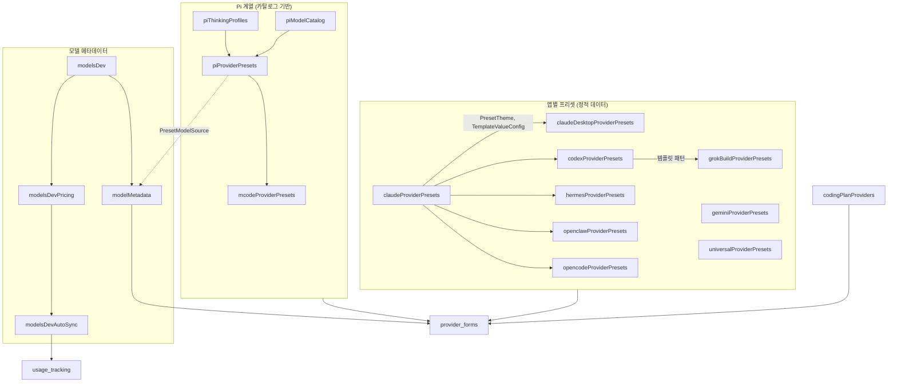
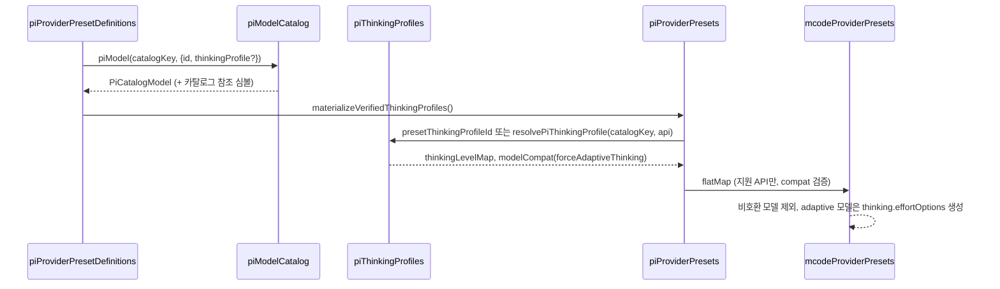
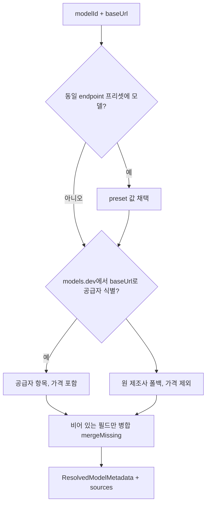

# provider_presets_and_model_catalog 모듈

## 개요

`provider_presets_and_model_catalog`는 CC Switch가 지원하는 각 앱(Claude Code, Claude Desktop, Codex, Gemini, Grok Build, Hermes, OpenClaw, OpenCode, Pi, MCode)의 **공급자(provider) 프리셋**과 **모델 카탈로그/메타데이터 조회 로직**을 모아 둔 정적 설정 모듈이다. 프리셋 목록은 파일 순서가 곧 UI 표시 순서(스폰서 → 비스폰서는 이름순)이며, 폼(`provider_forms`)이 프리셋을 선택하면 해당 앱의 설정 형식(JSON/TOML/YAML)으로 변환된다.

관련 모듈:
- 프리셋을 소비하는 UI: [provider_forms](provider_forms.md), [provider_management_ui](provider_management_ui.md)
- 모델 목록 조회/인증 API: [provider_api_and_auth](provider_api_and_auth.md)
- 도메인 타입(`ProviderCategory`, `OpenCodeModel`, `UniversalProvider`, `CodexCatalogModel` 등): [core_domain_types](core_domain_types.md)
- models.dev 가격 동기화 결과의 소비처: [usage_tracking](usage_tracking.md)
- 프록시/포맷 변환(`apiFormat`)의 실제 처리: [proxy_and_failover](proxy_and_failover.md)

## 구성 요소

| 파일 | 핵심 export | 역할 |
|---|---|---|
| `src/config/claudeProviderPresets.ts` | `ProviderPreset`, `PresetTheme`, `TemplateValueConfig`, `providerPresets` | Claude Code 프리셋. `settingsConfig.env`(`ANTHROPIC_*`)로 표현. 다른 프리셋 파일이 공용 타입(`PresetTheme`, `TemplateValueConfig`)을 여기서 가져옴 |
| `src/config/claudeDesktopProviderPresets.ts` | `ClaudeDesktopProviderPreset`, `ClaudeDesktopRoutePreset`, `CLAUDE_DESKTOP_ROLE_ROUTE_IDS` | `baseUrl` 최상위 + `modelRoutes`(Desktop 가시 모델 ID → 업스트림 모델) 형태. `mode: direct/proxy` |
| `src/config/codexProviderPresets.ts` | `CodexProviderPreset`, `generateThirdPartyAuth/Config`, `modelCatalog()` | `auth.json` + `config.toml` 문자열, `modelCatalog`, `codexChatReasoning` |
| `src/config/codexTemplates.ts` | `CodexTemplate`, `getCodexCustomTemplate` | 커스텀 공급자 기본 템플릿 |
| `src/config/geminiProviderPresets.ts` | `GeminiProviderPreset`, `getGeminiPresetByName/Url` | `GOOGLE_GEMINI_BASE_URL`/`GEMINI_MODEL` env |
| `src/config/grokBuildProviderPresets.ts` | `GrokBuildProviderPreset`, `grokBuildOfficialPreset` | Codex 스타일 TOML을 운반체로 사용, 기본 모델 `grok-4.5` |
| `src/config/hermesProviderPresets.ts` | `HermesProviderPreset`, `HermesModel`, `HermesSuggestedDefaults`, `hermesApiModes` | `custom_providers` YAML 항목, `api_mode` 명시, `_cc_source` 마커로 읽기전용 판별 |
| `src/config/openclawProviderPresets.ts` | `OpenClawProviderPreset`, `OpenClawSuggestedDefaults`, `rebaseOpenClawSuggestedDefaults` | `models.providers` 구조, 비용(USD/백만 토큰), 기본 모델 참조 재기반 |
| `src/config/opencodeProviderPresets.ts` | `OpenCodeProviderPreset`, `PresetModelVariant`, `OPENCODE_PRESET_MODEL_VARIANTS`, `getPresetModelDefaults` | npm 패키지(AI SDK)별 모델 변형/limit/modalities |
| `src/config/piModelCatalog.ts` | `piModelCatalog`, `PiModelCapabilities`, `PiCatalogModel`, `piModel()` | 검토된 모델 능력치의 단일 출처 |
| `src/config/piThinkingProfiles.ts` | `piThinkingProfiles`, `piThinkingBindings`, `resolvePiThinkingProfile` | thinking 레벨 맵(`PiThinkingLevelMap`) 프로파일과 (모델, API) 바인딩 |
| `src/config/piProviderPresets.ts` | `PiProviderPreset`, `piProviderPresets` | Pi 프리셋. 카탈로그 참조 + 사고 프로파일을 "materialize" |
| `src/config/mcodeProviderPresets.ts` | `McodeProviderPreset`, `mcodeProviderPresets` | Pi 프리셋에서 파생(호환 가능한 모델만) |
| `src/config/universalProviderPresets.ts` | `UniversalProviderPreset`, `createUniversalProviderFromPreset` | 통합 공급자(NewAPI/커스텀 게이트웨이): Claude·Codex·Gemini에 동시 적용 |
| `src/config/codingPlanProviders.ts` | `CodingPlanProviderEntry`, `detectCodingPlanProvider`, `injectCodingPlanUsageScript` | base_url 정규식 → Coding Plan 사용량 조회 자동 주입 |
| `src/lib/modelsDev.ts` | `ModelsDev*` 타입, `fetchModelsDev`, `modelsDevQueryOptions`, `normalizeModelsDevModelId` | models.dev 공개 데이터 fetch(15초 타임아웃, react-query 1시간 캐시) |
| `src/lib/modelMetadata.ts` | `KnownModelMetadata`, `ResolvedModelMetadata`, `resolveModelMetadata` | 폼에서 모델 선택 시 비어 있는 필드 자동 채움 |
| `src/lib/modelsDevPricing.ts` | `ModelsDevEntry`, `CommonFamilyRule`, `flattenModels`, `resolveModelsDevSelection`, `toModelPricing` | models.dev → 가격 테이블 변환 |
| `src/lib/modelsDevAutoSync.ts` | `ModelsDevSyncResult`, `syncModelsDevPricing(OnStartup)` | 가격 자동 동기화(6시간 간격) |

## 아키텍처

설계 포인트:
- **앱별 독립 유지**: Grok Build는 Codex 프리셋 스냅샷에서 출발했지만 이후 데이터 연동이 없다. Pi도 런타임에 다른 앱 프리셋을 import하지 않는다(주석에 명시). 반대로 MCode는 의도적으로 Pi에서 파생된다.
- **공통 필드**: `name/nameKey/websiteUrl/apiKeyUrl/category/isPartner/primePartner/partnerPromotionKey/endpointCandidates/icon/iconColor/theme`. `endpointCandidates`는 엔드포인트 관리·속도 테스트에 사용된다.
- **카테고리**: `official`, `cn_official`, `aggregator`, `third_party`, `cloud_provider`, `custom`(+ `omo`, `omo-slim`).

## 앱별 핵심 동작

### Claude Desktop 라우트 팩토리
Desktop 3P 검증은 역할 이름(`sonnet/opus/haiku/fable`)만 허용하므로 모든 routeId는 `CLAUDE_DESKTOP_ROLE_ROUTE_IDS`에서 파생한다.

| 팩토리 | 용도 |
|---|---|
| `passthroughRoutes(supports1m)` | Claude 계열 그대로 통과 (direct) |
| `mappedRoutes(s, o, h)` | 업스트림 ID가 다를 때 명시적 매핑 (예: `anthropic/claude-sonnet-5`) |
| `brandedRoutes(s, o, h, supports1m)` | 비‑Claude 모델: routeId는 Claude 역할, `labelOverride`에 실제 모델명. 동일 업스트림은 중복 제거 |

`supports1m`의 `[1m]`은 Desktop 로컬 표시이며 업스트림으로 전송되지 않는다. 모델 창이 1M 미만(예: qwen3.8 = 983616)이면 부여하지 않는다.

### Codex 프리셋
`generateThirdPartyConfig(name, baseUrl, model, {requiresOpenAiAuth})`가 `config.toml`을 생성한다. OAuth 프리셋은 `requiresOpenAiAuth:false`가 필수(키 없는 카드가 백엔드 안전장치에 거부됨). `apiFormat`이 `openai_responses`면 네이티브 직결, `openai_chat`이면 로컬 라우팅 변환이며 이때 `codexChatReasoning`(thinking/effort 파라미터 방언)과 `modelCatalog`(`reasoningLevels`, `contextWindow`, `inputModalities` 등)가 의미를 갖는다.

### Pi 계열 데이터 흐름

- `thinkingLevelMap`에서 **키 누락과 `null`은 다르다**(누락=Pi 기본, null=미지원). 빈 `{}`는 사용자의 "Pi 기본 사용" 선택용으로 예약되어 프로파일로 쓸 수 없다.
- MCode는 허용된 compat 키/enum(`MCODE_COMPAT_FLAGS`, `MCODE_COMPAT_ENUMS`)만 통과시키며, 프리셋 레벨 `compat`이 있거나 지원하지 않는 API면 해당 프리셋을 건너뛴다.

### 모델 메타데이터 해석 (`resolveModelMetadata`)

- `endpointKey()`: 호스트+경로로 정규화하되 말단 `v1/v4/v1beta`와 `chat/completions`, `responses`, `messages`만 제거. 그 외 경로가 다르면 다른 플랜으로 간주(예: `/zen/v1` vs `/zen/go/v1`).
- 우선순위: 동일 주소 프리셋 > models.dev 동일 공급자 > models.dev 원 제조사. 재판매 가격은 원가와 다르므로 원 제조사 폴백은 가격을 가져오지 않는다.
- `findByVendor`는 `canonical_model_id`가 가리키는 항목을 우선하며, 원 제조사가 둘 이상으로 모호하면 포기한다.
- `normalizeModelsDevModelId`: `vendor/` 접두사, `:variant`, `[1m]` 제거 후 소문자.

### models.dev 가격 동기화
`syncModelsDevPricing` → `fetchModelsDev` → `flattenModels`(텍스트 모델만, deprecated/오디오/이미지 제외) → `resolveModelsDevSelection`(명시 선택 + 패밀리별 최신 6개 상한의 "common" 규칙) → `toModelPricing`(정규화 ID 중복 제거) → `usageApi.updateModelPricingBatch`. 마지막 동기화 후 6시간 이내이거나 자동 동기화가 꺼져 있으면 `skipped`. 성공/실패는 `recordModelsDevSyncResult`로 저장되며, `syncModelsDevPricingOnStartup`은 렌더러당 1회만 실행된다.

### Coding Plan 자동 감지
`CODING_PLAN_PROVIDERS`(kimi, zhipu, zhipu_team, minimax, zenmux, volcengine, opencode_go)의 정규식이 백엔드 `coding_plan.rs::detect_provider`와 일치해야 한다. `injectCodingPlanUsageScript`는 `meta.usage_script`가 없을 때만 주입하며, Claude 외 앱은 OpenCode Go만 대상이다. `zhipu_team`은 base_url로 구분할 수 없어 자동 주입되지 않고 수동 선택만 가능하다.

### 통합 공급자와 OpenClaw 재기반
- `createUniversalProviderFromPreset`는 `deepClone`으로 기본 모델을 복사해 `UniversalProvider`를 만든다.
- OpenClaw의 기본 모델 참조는 `<provider-key>/<model-id>` 형식이라, 사용자가 실제 키를 정하면 `rebaseOpenClawSuggestedDefaults`가 `primary/fallbacks/modelCatalog` 키의 접두사를 교체한다.

## 유지보수 시 주의사항

1. 같은 공급자가 앱마다 별도 항목으로 존재한다(Kimi, 텐센트 Token Plan, QwenCloud 등). 엔드포인트·모델 변경 시 앱별 파일을 각각 확인한다. 주석에 "혼용 금지"로 표시된 리전/요금제(예: 볼케이노 `/api/plan` vs `/api/coding` vs `/api/v3`)는 후보에 섞지 않는다.
2. 프로토콜별 base URL 접미사(`/v1`, `/anthropic`, `/api/coding/paas/v4` 등)가 앱마다 다르다. 다른 앱 값을 복사하지 않는다.
3. Hermes의 `HERMES_PROVIDER_SOURCE_*` 상수는 Rust `hermes_config.rs`와 동기화되어야 한다.
4. Pi 카탈로그 값은 "검토된 값"만 사용한다. 새 모델은 `piModelCatalog`에 먼저 추가하고, 사고 레벨은 `piThinkingBindings`(범용) 또는 프리셋별 `thinkingProfile`(호스트 의존)로 지정한다.
5. 검증 수준: 위 내용은 제공된 소스 코드 기준(코드 확인)이며, 각 프리셋 주석에 적힌 실측·문서 근거는 미확인(추론 불가) 정보로 취급한다.
