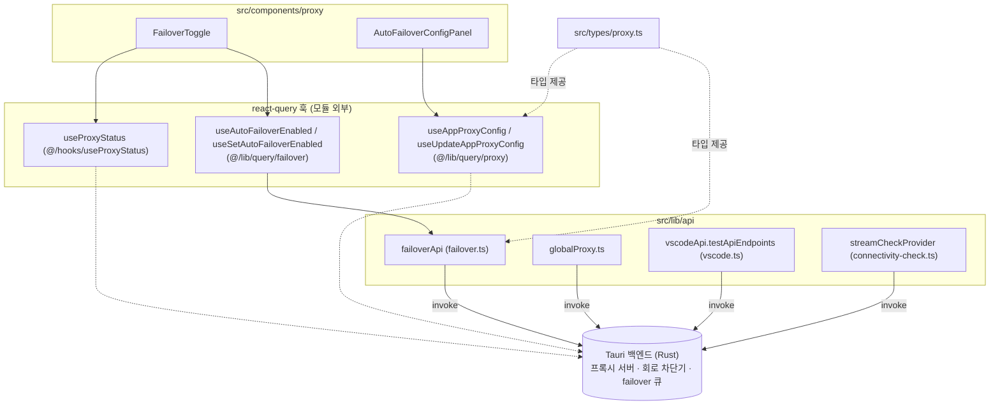
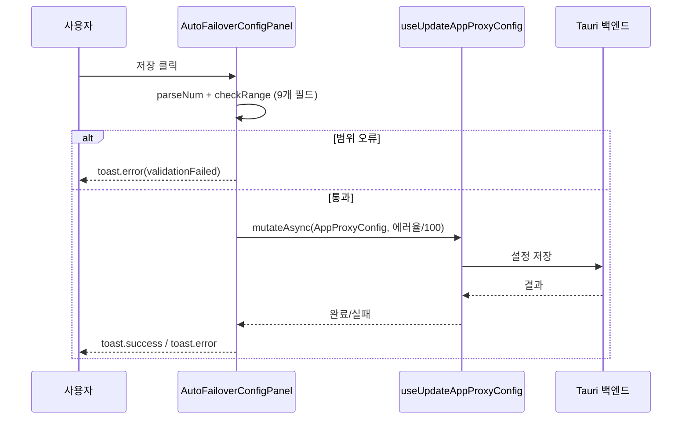
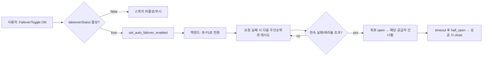

# proxy_and_failover 모듈

## 개요

`proxy_and_failover`는 CC Switch의 **로컬 프록시 / 자동 failover / 회로 차단기(circuit breaker) / 전역 아웃바운드 프록시 / 연결성 점검**의 프런트엔드 측 계약을 담은 모듈이다. 실제 프록시 서버와 회로 차단기 로직은 Rust(Tauri) 백엔드에 있고, 이 모듈은 다음을 제공한다.

- Tauri `invoke` 래퍼(`src/lib/api/*.ts`): 백엔드 커맨드 호출
- 도메인 타입(`src/types/proxy.ts`): 백엔드와 주고받는 데이터 모양
- UI(`src/components/proxy/*`): failover 토글, 자동 failover 설정 패널

> 검증 수준: 아래 내용은 제공된 코드 컴포넌트를 직접 읽은 **코드 확인**이다. Rust 백엔드 동작은 **미확인**이며, 해당 부분은 주석이나 UI 문구에서 **추론**한 것이다.

상위 모듈: `traffic_routing_and_observability`. 형제 모듈 [usage_tracking](usage_tracking.md)은 프록시가 기록한 요청/토큰 사용량을 다룬다. 공급자(Provider) 정의는 [provider_api_and_auth](provider_api_and_auth.md), [provider_management_ui](provider_management_ui.md), 공통 도메인 타입은 [core_domain_types](core_domain_types.md)를 참고한다.

## 아키텍처

`@/lib/query/*`, `@/hooks/useProxyStatus`는 이 모듈의 핵심 컴포넌트에 포함되지 않지만 UI가 의존한다(코드 확인: import 문).

## 컴포넌트 상세

### `FailoverToggle` (`src/components/proxy/FailoverToggle.tsx`)

메인 화면 헤더에 놓이는 스위치. props `FailoverToggleProps { className?, activeApp: ProxyAppId }`.

- 현재 상태: `useAutoFailoverEnabled(activeApp)`
- 변경: `useSetAutoFailoverEnabled().mutate({ appType, enabled })`
- **선행 조건**: `useProxyStatus().takeoverStatus[activeApp]`(해당 앱의 live config를 프록시가 takeover 했는지)가 `true`여야 한다. 아니면 스위치는 비활성화되고, `handleToggle`도 켜는 방향을 무시한다.
- 툴팁은 takeover 필요 / 활성(큐 우선순위 P1→P2…) / 비활성(켜면 P1로 즉시 전환) 세 가지 상태를 안내한다.

### `AutoFailoverConfigPanel` (`src/components/proxy/AutoFailoverConfigPanel.tsx`)

앱별(`appType`) failover 정책 편집 폼. props `AutoFailoverConfigPanelProps { appType: string, disabled? }`.

- 데이터: `useAppProxyConfig(appType)` → `AppProxyConfig`, 저장: `useUpdateAppProxyConfig().mutateAsync`
- 숫자 입력을 **문자열 상태**로 들고 있어 입력창을 완전히 비울 수 있다. 저장 시 `/^-?\d+$/`로 정수 파싱 후 범위 검증한다.
- `circuitErrorRateThreshold`는 UI에서 퍼센트(0–100), 저장 시 `/100`, 로드 시 `*100`으로 변환한다.
- 저장 시 `enabled`는 서버에서 받은 `config.enabled`를 그대로 유지하고, `autoFailoverEnabled` 등만 폼 값으로 덮어쓴다.

검증 범위(코드 확인):

| 필드 | 범위 | 기본(폼 초기값) |
|---|---|---|
| maxRetries | 0–10 | 3 |
| streamingFirstByteTimeout (초) | 1–120 | 60 |
| streamingIdleTimeout (초) | 0–600 (0=비활성) | 120 |
| nonStreamingTimeout (초) | 60–1200 | 600 |
| circuitFailureThreshold | 1–20 | 5 |
| circuitSuccessThreshold | 1–10 | 2 |
| circuitTimeoutSeconds | 0–300 | 60 |
| circuitErrorRateThreshold (%) | 0–100 | 50 |
| circuitMinRequests | 5–100 | 10 |

주의: `streamingIdleTimeout`의 힌트 문구는 "60–600초, 0은 비활성"이라 하지만 검증 코드는 0–600을 허용한다. 문구와 검증이 불일치한다(코드 확인).

### `failoverApi` (`src/lib/api/failover.ts`)

`invoke` 커맨드 매핑:

| 메서드 | Tauri 커맨드 |
|---|---|
| `getProviderHealth` | `get_provider_health` |
| `resetCircuitBreaker` | `reset_circuit_breaker` |
| `getCircuitBreakerConfig` / `updateCircuitBreakerConfig` | `get_circuit_breaker_config` / `update_circuit_breaker_config` |
| `getCircuitBreakerStats` | `get_circuit_breaker_stats` |
| `getFailoverQueue` | `get_failover_queue` |
| `getAvailableProvidersForFailover` | `get_available_providers_for_failover` |
| `addToFailoverQueue` / `removeFromFailoverQueue` | `add_to_failover_queue` / `remove_from_failover_queue` |
| `getAutoFailoverEnabled` / `setAutoFailoverEnabled` | `get_auto_failover_enabled` / `set_auto_failover_enabled` |

이 파일의 `Provider` 인터페이스는 큐에 추가 가능한 공급자 목록 응답용의 경량 타입(`settingsConfig: unknown`)이다. 전체 `Provider` 타입은 [core_domain_types](core_domain_types.md)에 있다.

### `globalProxy.ts`

앱이 외부 API로 나갈 때 쓰는 **전역 아웃바운드 프록시**(예: `http://127.0.0.1:7890`, `socks5://...`). 로컬 프록시 서버(takeover 대상)와는 다른 개념이다.

- `getGlobalProxyUrl` / `setGlobalProxyUrl(url)` (빈 문자열 = 직결, 오류는 `Error`로 정규화)
- `testProxyUrl` → `ProxyTestResult { success, latencyMs, error }`
- `getUpstreamProxyStatus` → `UpstreamProxyStatus { enabled, proxyUrl }`
- `scanLocalProxies` → `DetectedProxy[] { url, proxyType, port }`

### `vscode.ts`의 `EndpointLatencyResult`

`vscodeApi.testApiEndpoints(urls, { timeoutSecs })`가 반환하는 엔드포인트 지연 측정 결과(`url`, `latency|null`, `status?`, `error?`). 같은 파일에 커스텀 엔드포인트 CRUD, 설정 import/export, 파일 다이얼로그 래퍼도 있다(이름과 달리 VS Code 전용이 아님).

### `connectivity-check.ts`

`streamCheckProvider(appType, providerId)` → `StreamCheckResult { status: operational|degraded|failed, success, message, responseTimeMs?, httpStatus?, testedAt, retryCount }`. 파일 주석에 따르면 `base_url` 도달성만 확인하며 실제 LLM 요청을 보내지 않고 **failover 회로 차단기에도 영향을 주지 않는다**.

## 타입 (`src/types/proxy.ts`)

```mermaid
classDiagram
    class ProxyStatus { running; address; port; failover_count; active_targets }
    class ActiveTarget { app_type; provider_name; provider_id }
    class ProxyTakeoverStatus { claude; codex; gemini; opencode; openclaw; hermes ... }
    class AppProxyConfig { appType; enabled; autoFailoverEnabled; timeouts; circuit* }
    class GlobalProxyConfig { proxyEnabled; listenAddress; listenPort }
    class CircuitBreakerConfig { failureThreshold; successThreshold; timeoutSeconds; errorRateThreshold; minRequests }
    class CircuitBreakerStats { state; consecutiveFailures; totalRequests }
    class ProviderHealth { provider_id; is_healthy; consecutive_failures }
    class ProviderHealthWithStatus { status; circuitState }
    class FailoverQueueItem { providerId; providerName; sortIndex }
    class ProxyStack { active; members; notice; staleClients }
    ProxyStatus o-- ActiveTarget
    ProviderHealthWithStatus --|> ProviderHealth
    ProviderHealthWithStatus ..> CircuitBreakerStats : circuitState
    ProxyStack o-- ProxyStackMember
```

핵심 포인트:

- **회로 상태**: `CircuitState = "closed" | "open" | "half_open"`. UI 힌트에 따르면 연속 실패가 `failureThreshold`에 도달하거나 최소 요청 수(`minRequests`) 이상에서 에러율이 임계값을 넘으면 open, `timeoutSeconds` 후 half_open, `successThreshold`회 성공하면 close(UI 문구 기반 **추론**; 정확한 Rust 로직은 미확인).
- **프런트 계산 상태**: `ProviderHealthStatus`(`healthy/degraded/failed/unknown`)는 프런트에서 `ProviderHealth`에 덧붙이는 값이다.
- **필드 네이밍 혼재**: `ProxyConfig`, `ProxyStatus`, `ProviderHealth`는 snake_case, `CircuitBreakerConfig`, `AppProxyConfig`, `FailoverQueueItem`은 camelCase다. 백엔드 serde 설정 차이로 보이며(추론) 새 필드를 추가할 때 해당 타입의 규칙을 따라야 한다.
- **Stack 모드**: `ProxyStack`, `ProxyStackMember`, `ProxyStackNotice`, `CodexStaleClients`, `ProxyStackWriteError`, `CodexDaemonRestartOutcome`는 프록시 모드에서 여러 공급자의 모델 id를 클라이언트(특히 Codex)에 함께 게시하는 기능의 상태 타입이다. `route: true`인 멤버가 기본 라우팅 대상이며, Codex는 시작 시에만 모델 카탈로그를 읽으므로 `staleClients`로 재시작 필요 여부를 알린다.
- `ProxyTakeoverStatus`는 앱별 takeover 여부(`claude`, `claude-desktop?`, `codex`, `gemini`, `grokbuild`, `opencode`, `openclaw`, `hermes`).
- `ProxyUsageRecord`는 프록시가 남기는 요청 단위 기록 모양이며, 집계는 [usage_tracking](usage_tracking.md)에서 다룬다.

## 전체 흐름: 자동 failover 활성화

(E~I는 UI 문구와 API 이름에서 도출한 **추론**이다.)

## 사용 시 유의사항

- failover 큐 구성(`FailoverQueueItem`)은 공급자 목록 UI와 연계된다. 우선순위 배지는 [provider_management_ui](provider_management_ui.md)의 `FailoverPriorityBadge`, `ProviderHealthBadge`가 표시한다.
- `AutoFailoverConfigPanel`은 앱별 설정이고, `failoverApi.get/updateCircuitBreakerConfig`는 별도의 전역 `CircuitBreakerConfig`를 다룬다. 두 경로가 공존하는 이유(레거시 여부)는 **미확인**이다.
- UI 문자열의 기본값은 중국어이며 `react-i18next`의 `t(key, default)`로 번역된다.
- 빌드/테스트 설정(`package.json`, `vitest.config.ts`)은 [build_ci_and_packaging](build_ci_and_packaging.md)을 참고한다.
