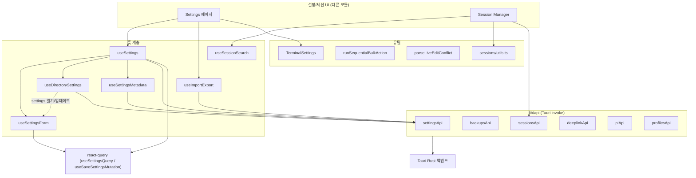
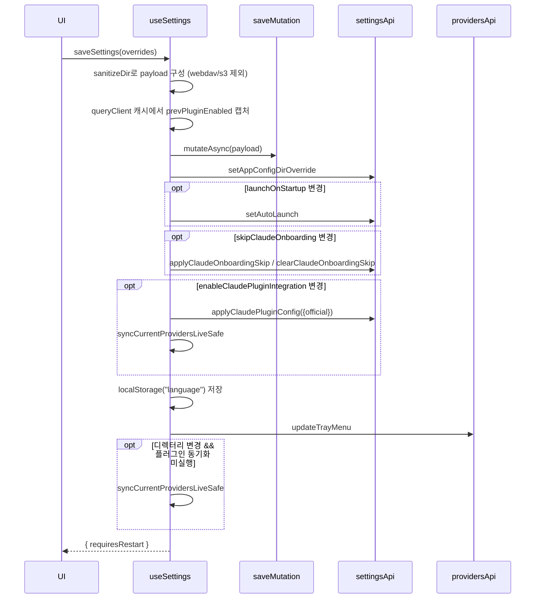
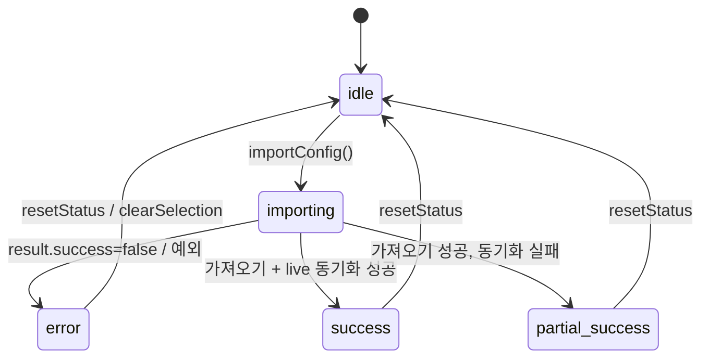

# sessions_and_settings 모듈

## 개요

`sessions_and_settings`는 cc-switch 프런트엔드(React + Tauri)에서 **(1) 앱 설정의 편집·저장·동기화**와 **(2) AI CLI 세션 목록/검색/표시 유틸**, 그리고 **(3) Tauri 백엔드 명령(`invoke`)을 감싸는 API 래퍼**를 담당하는 모듈이다. 상위 모듈은 `workspace_tooling_and_preferences`이며, 형제 모듈로 [agents_mcp_prompts_skills_panels](agents_mcp_prompts_skills_panels.md)이 있다.

핵심 구성:

| 영역 | 파일 | 역할 |
|---|---|---|
| 설정 훅 | `useSettings.ts`, `useSettingsForm.ts`, `useDirectorySettings.ts`, `useSettingsMetadata.ts` | 설정 폼 상태, 디렉터리 오버라이드, 메타데이터, 저장 오케스트레이션 |
| 가져오기/내보내기 | `useImportExport.ts` | SQL 백업 파일 import/export |
| 세션 | `sessions/utils.ts`, `useSessionSearch.ts`, `api/sessions.ts` | 세션 그룹화·표시·검색·삭제 |
| API 래퍼 | `api/settings.ts`, `api/deeplink.ts`, `api/pi.ts`, `api/profiles.ts` | Tauri 명령 호출 |
| UI/유틸 | `TerminalSettings.tsx`, `liveEditConflict.ts`, `sequentialBulkAction.ts`, `types/env.ts` | 터미널 선택, 편집 충돌 파싱, 순차 일괄 작업, 환경변수 충돌 타입 |

도메인 타입(`Settings`, `SessionMeta`, `SessionMessage`, `WebDavSyncSettings`, `S3SyncSettings` 등)은 [core_domain_types](core_domain_types.md)에 정의되어 있다.

## 아키텍처

## 설정 관리

### useSettings (조합 계층)

`useSettings`는 세 개의 하위 훅을 조합하고 저장 로직을 소유한다.

- `useSettingsForm`: react-query의 `useSettingsQuery()` 결과를 `SettingsFormState`(`language`가 `"zh" | "zh-TW" | "en" | "ja"`로 정규화된 형태)로 변환해 로컬 폼 상태로 보관한다. 기본값(`showInTray: true`, `minimizeToTrayOnClose: true` 등)을 채우고 디렉터리 문자열을 `sanitizeDir`로 정리한다. 언어 변경 시 `i18n.changeLanguage`와 동기화한다.
- `useDirectorySettings`: 앱별 설정 디렉터리(`claude`, `codex`, `gemini`, `grokbuild`, `opencode`, `openclaw`, `hermes`, `pi`)와 `appConfig`(`~/.cc-switch`) 오버라이드를 관리한다. 백엔드 `getConfigDir`와 Tauri `homeDir()` 기반 기본값을 병렬 로드하고, browse/reset/update 동작을 제공한다. `APP_DIRECTORY_META`가 앱별 기본 폴더의 단일 원천이다.
- `useSettingsMetadata`: `isPortable`(포터블 모드)과 `requiresRestart` 플래그를 관리한다.

### 저장 경로: autoSaveSettings vs saveSettings

| 구분 | `autoSaveSettings` | `saveSettings` |
|---|---|---|
| 용도 | General 탭의 즉시 저장 | Advanced 탭의 수동 저장 |
| `setAppConfigDirOverride` | 호출 안 함 | 호출 |
| 디렉터리 변경 후 live 동기화 | 하지 않음 | 변경 시 `syncCurrentProvidersLiveSafe` |
| Pi 디렉터리 변경 | - | `invalidatePiDirectoryCaches` |
| 반환 `requiresRestart` | 항상 `false` | 앱 설정 디렉터리 변경 여부 |

두 경로 모두 `webdavSync`, `s3Sync` 필드를 payload에서 제외한다(별도 `webdavSyncSaveSettings`/`s3SyncSaveSettings`로 저장). 공통 후처리는 다음과 같다.

주요 설계 포인트:

- `prevPluginEnabled`는 `useCallback` 클로저의 `data`가 아니라 `queryClient.getQueryData(["settings"])`에서 mutate 직전에 읽는다. 빠른 연속 토글 시의 race를 피하기 위함(코드 주석 확인).
- 시스템 연동 실패(자동 시작, 온보딩 스킵, 트레이 갱신)는 토스트/경고만 하고 저장 흐름을 중단하지 않는다. 저장 mutation 자체의 실패만 예외로 재throw한다.
- `resetSettings`는 서버 데이터로 폼을 되돌리고 언어를 초기값으로 복원하며 디렉터리 상태와 `requiresRestart`도 초기화한다.

## 설정 API 래퍼 (`api/settings.ts`)

`settingsApi`는 `invoke`를 감싸는 얇은 객체로, 기능별로 다음을 포함한다.

- 기본 설정: `get`, `save`, `restart`, `checkUpdates`, `installUpdateAndRestart`, `isPortable`
- 디렉터리/경로: `getConfigDir`, `pickDirectory`/`selectConfigDirectory`, `getAppConfigDirOverride`, `setAppConfigDirOverride`, `openConfigFolder`
- Claude 연동: `applyClaudePluginConfig`, `applyClaudeOnboardingSkip`, `clearClaudeOnboardingSkip`
- 파일 대화상자 및 import/export: `openFileDialog`, `saveFileDialog`, `importConfigFromFile`, `exportConfigToFile` (`ConfigTransferResult`)
- 원격 동기화: WebDAV(`webdav*`), S3(`s3*`) — 연결 테스트, 업로드/다운로드, 설정 저장, 원격 정보 조회. 비밀번호는 `preserveEmptyPassword`/`passwordTouched` 플래그로 처리
- 도구 관리: `getToolVersions`, `runToolLifecycleAction`, `probeToolInstallations` (`ToolInstallationReport`: 다중 설치 충돌 탐지와 업그레이드 명령 생성)
- 프록시 보정 설정: `RectifierConfig`, `OptimizerConfig`, `LogConfig`의 get/set
- Codex 통합 히스토리: `hasCodexUnifyHistoryBackup`, `restoreCodexUnifiedHistory` (`CodexUnifyHistoryRestoreResult`, `skippedReason`이 있으면 성공으로 보고하지 않음)
- 기타: `openExternal`은 `http`/`https` 스킴만 허용하도록 프런트에서 검증한다.

`backupsApi`는 DB 백업의 생성/목록/복원/이름변경/삭제(`BackupEntry`)를 제공한다.

## 가져오기/내보내기 (`useImportExport`)

- 가져오기 성공 직후 `onImportSuccess`를 먼저 호출한다(동기화 결과와 분리하여 UI가 항상 새로고침되도록, `setTimeout` 의존 회피).
- 이후 `syncCurrentProvidersLiveSafe`가 실패하면 `partial-success`로 표시하고 사용자에게 공급자를 다시 선택하도록 안내한다.
- 내보내기 기본 파일명은 `cc-switch-export-YYYYMMDD_HHmmss.sql`.

## 세션 관리

### 타입과 API

`SessionMeta`/`SessionMessage`는 [core_domain_types](core_domain_types.md)에 있다. `sessionsApi`는 `list_sessions`, `get_session_messages`, `delete_session`, `delete_sessions`(일괄, `DeleteSessionResult[]`), `launch_session_terminal`을 호출한다. 터미널 종류는 `TerminalSettings`에서 플랫폼(`isMac`/`isWindows`/`isLinux`)별 옵션으로 선택한다(macOS 기본 `terminal`, Windows `cmd`, Linux `gnome-terminal`).

### 검색 (`useSessionSearch`)

`providerFilter`로 먼저 세션을 거른 뒤, `sessionId`, `title`, `summary`, `projectDir`, `sourcePath`를 이어붙여 FlexSearch `Index({ tokenize: "full", resolution: 9 })`에 색인한다. 쿼리가 비어 있으면 `lastActiveAt ?? createdAt` 내림차순으로 정렬해 반환한다. 색인 대상은 메타데이터이며 메시지 본문은 포함하지 않는다.

### 표시 유틸 (`sessions/utils.ts`)

- 그룹화: `groupSessionsByProviderAndDirectory`는 `SessionProviderGroup`(provider별) → `SessionDirectoryGroup`(프로젝트 디렉터리별)의 2단계 구조를 만든다. 디렉터리 없는 세션은 `UNKNOWN_PROJECT_DIR_KEY` 그룹으로 묶인다.
- 식별: `getSessionKey` = `providerId:sessionId:sourcePath`.
- 포맷: `formatSessionTitle`(title → 디렉터리 basename → sessionId 앞 8자), `formatRelativeTime`(i18n 키 `sessionManager.*`), `getProviderIconName`, `getRoleTone`/`getRoleLabel`.
- Codex 프롬프트 처리: IDE가 주입한 `# Context from my IDE setup:` 메시지에서 **마지막** `## My request for Codex:` 섹션만 추출(`extractCodexPromptPreview`)하고, `AGENTS.md instructions`/`<environment_context>`/프롬프트 없는 IDE 컨텍스트는 목차에서 숨긴다(`shouldHideCodexMessageFromToc`). 요청 본문에 같은 헤딩이 반복되면 미리보기가 뒷부분으로 잘리는 trade-off가 코드 주석에 명시되어 있다.
- `highlightText`: 정규식 이스케이프 후 일치 구간을 `<mark>`로 감싼다.

## 기타 API 및 유틸

- `deeplinkApi` (`ccswitch://` 딥링크): `parseDeeplink` → `mergeDeeplinkConfig`(확인 대화상자용 설정 병합) → `importFromDeeplink`. 리소스는 `provider | prompt | mcp | skill`, 결과는 `ImportResult` 유니온(`McpImportResult` 포함).
- `piApi`: Pi 앱의 활성 공급자 상태(`PiCurrentState`), 사용량 스크립트 업데이트, 세션 탐색 가능 여부(`PiSessionDiscovery`).
- `profilesApi`: 프로필(프로젝트) 스냅샷 CRUD/적용. 범위는 `ProfileScope = "claude" | "claude-desktop" | "codex"`이며, 응답 필드는 camelCase(`claudeDesktop`), 명령 인자는 kebab-case라는 차이에 주의. `null` 슬롯(스냅샷 없음)과 빈 배열(비어 있음)을 구분한다.
- `parseLiveEditConflict`: 백엔드 `LIVE_EDIT_CONFLICT` JSON 에러를 `LiveEditConflict { keys }`로 파싱해, 편집 중 외부 프로그램이 변경한 키에 대해 사용자가 유지할 쪽을 고르게 한다.
- `runSequentialBulkAction`: 여러 앱 어댑터가 설정 파일 전체를 덮어쓰므로 병렬 쓰기를 피하고 순차 실행하며 `succeeded`/`failed`를 반환한다.
- `EnvConflict`/`BackupInfo` (`types/env.ts`): 시스템 환경변수 또는 파일 기반 충돌과 그 백업 정보 타입.

## 참고 사항

- `useDirectorySettings`의 `DirectoryAppId`는 `claude-desktop`, `mcode`를 제외한다.
- `useSettings.saveSettings`의 live 재동기화 조건에는 `piDirChanged`가 포함되지 않고(Pi는 캐시 무효화만 수행) 별도 처리된다. (코드 확인)
- 일부 사용자 메시지의 `defaultValue`는 중국어이며 i18n 키로 다국어 처리된다.
- 상위·인접 모듈: [provider_configuration_and_authentication](provider_configuration_and_authentication.md), [traffic_routing_and_observability](traffic_routing_and_observability.md), [foundation_platform_and_build](foundation_platform_and_build.md).
