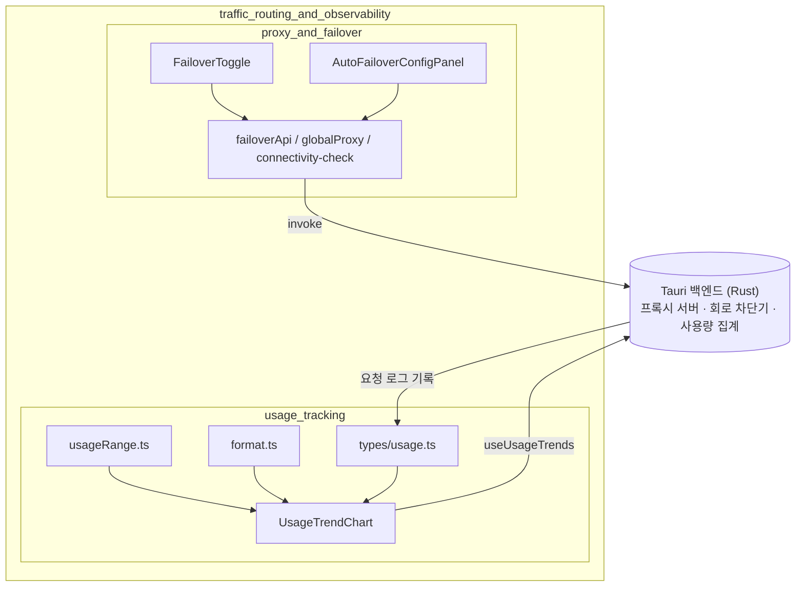
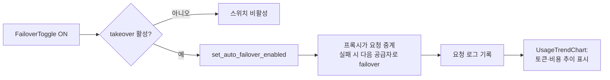

# traffic_routing_and_observability 모듈 개요

## 목적

`traffic_routing_and_observability`는 CC Switch에서 **AI API 트래픽을 어떻게 보내고(라우팅·failover), 그 결과를 어떻게 보여 주는가(사용량 관측)**를 담당하는 프런트엔드 모듈이다. 경로는 `src/components`이고, 하위 모듈은 둘이다.

| 하위 모듈 | 경로 | 역할 |
|---|---|---|
| `proxy_and_failover` | `src/components/proxy` | 로컬 프록시 takeover, 자동 failover 토글·정책 패널, 회로 차단기, 전역 아웃바운드 프록시, 연결성 점검 |
| `usage_tracking` | `src/components/usage` | 요청 로그·토큰·비용·지연시간의 타입, 시간 범위 계산, 포맷팅, 추이 차트 |

실제 프록시 서버, 회로 차단기, 사용량 집계는 Tauri(Rust) 백엔드에 있다. 이 모듈은 Tauri `invoke` 래퍼, 도메인 타입, UI만 제공한다.

> 검증 수준: 하위 문서에서 확인한 프런트엔드 구조는 **코드 확인**이다. Rust 백엔드 동작은 **미확인**이고, 회로 상태 전이와 failover 큐 동작은 UI 문구에서 도출한 **추론**이다.

## 아키텍처

두 하위 모듈은 직접 호출하지 않고 백엔드를 매개로 연결된다. 프록시가 요청을 중계하며 기록을 남기면(`ProxyUsageRecord`), `usage_tracking`이 그 기록의 집계 결과를 조회해 표시한다.

### 대표 흐름

D까지는 코드 확인이고, E~F는 API 이름과 UI 문구에 근거한 **추론**이다. G는 `UsageTrendChart` 코드에서 **코드 확인**했다.

## 하위 모듈 요약

### proxy_and_failover
- `FailoverToggle`은 해당 앱의 live config를 프록시가 takeover한 경우에만 켤 수 있다.
- `AutoFailoverConfigPanel`은 재시도 횟수, 스트리밍 타임아웃, 회로 차단기 임계값 9개 필드를 검증한 뒤 저장한다. 에러율은 UI에서 퍼센트, 저장 시 비율로 변환한다.
- `failoverApi`는 헬스, 회로 차단기, failover 큐 관련 Tauri 커맨드를 매핑한다.
- `globalProxy.ts`는 외부로 나가는 전역 프록시를 다루며, 로컬 프록시 서버와는 다른 개념이다.
- `connectivity-check.ts`는 `base_url` 도달성만 확인하며 회로 차단기에 영향을 주지 않는다.
- 주의: 필드 네이밍이 snake_case와 camelCase로 섞여 있다. `streamingIdleTimeout`은 힌트 문구와 검증 범위가 불일치한다.

### usage_tracking
- `types/usage.ts`는 `RequestLog`, 집계 타입, 필터, 캐시 정규화 규칙을 정의한다. Codex·Gemini·grokbuild 같은 OpenAI 계열은 입력 토큰에 캐시 읽기가 포함되므로 fresh input을 따로 계산한다.
- `usageRange.ts`는 프리셋이나 사용자 지정 범위를 unix 초 구간으로 변환한다.
- `format.ts`는 숫자, USD, TPS, 로케일별 토큰 표기를 처리한다.
- `UsageTrendChart.tsx`는 구간 길이에 따라 시간 단위와 일 단위로 전환하며 Recharts로 차트를 그린다.
- 주의: `CACHE_INCLUSIVE_APP_TYPES`는 Rust 쪽 값을 미러링하므로 함께 수정해야 한다(백엔드와의 동기화는 **미확인**).

## 핵심 컴포넌트 문서 참조

- [proxy_and_failover](/Users/kkh/Desktop/oss-analysis/artifacts/cc-switch/codewiki-r3/proxy_and_failover.md): 프록시·failover·회로 차단기 컴포넌트, API 매핑, 타입
- [usage_tracking](/Users/kkh/Desktop/oss-analysis/artifacts/cc-switch/codewiki-r3/usage_tracking.md): 사용량 타입, 범위 계산, 포맷팅, 추이 차트

관련 모듈: `provider_management_ui`(failover 우선순위·헬스 배지), `core_domain_types`(공통 타입, `UsageData`), `provider_api_and_auth`(공급자 API).