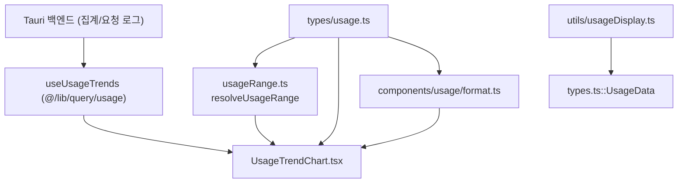
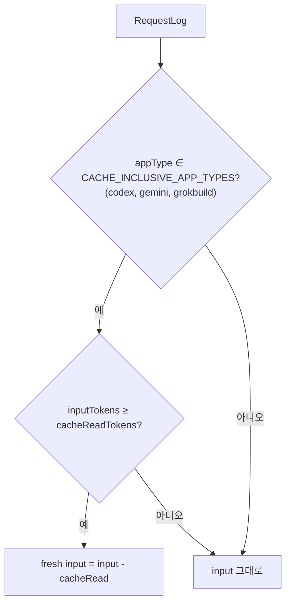
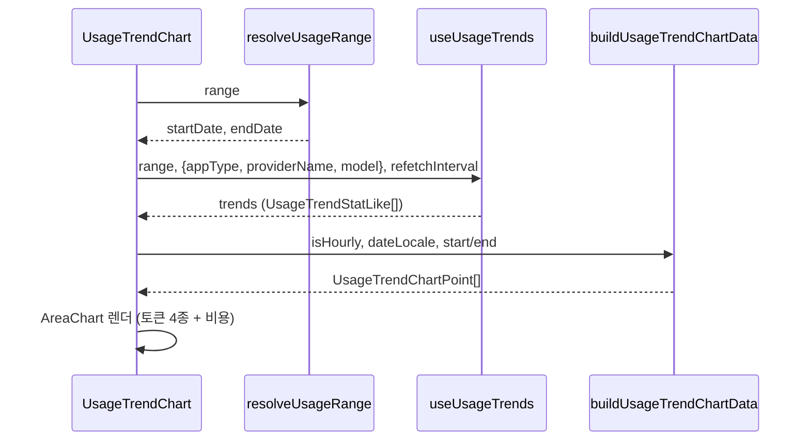

# usage_tracking 모듈

`usage_tracking`은 cc-switch 대시보드에서 **API 요청 사용량(토큰·비용·지연시간)을 표시하기 위한 프론트엔드 타입, 시간 범위 계산, 포맷팅, 추이 차트 로직**을 모은 모듈이다. 데이터 수집과 집계는 백엔드(Tauri/Rust)가 맡고, 이 모듈은 결과를 받아 정규화·표시한다. 상위 모듈은 `traffic_routing_and_observability`이며, 프록시 트래픽 자체는 [proxy_and_failover](proxy_and_failover.md)가 담당한다.

## 구성 요소 요약

| 파일 | 역할 | 핵심 심볼 |
|---|---|---|
| `src/types/usage.ts` | 사용량 도메인 타입과 캐시 정규화 규칙 | `RequestLog`, `UsageSummary`, `DailyStats`, `ProviderStats`, `ModelStats`, `UsageRangeSelection`, `UsageScopeFilters`, `ModelPricing`, `ModelsDevSyncConfig`, `SessionSyncResult` 등 |
| `src/lib/usageRange.ts` | 프리셋/사용자 지정 범위 → unix 초 구간 변환 | `ResolvedUsageRange`, `resolveUsageRange`, `getUsageRangePresetLabel` |
| `src/components/usage/format.ts` | 숫자·USD·TPS·로케일별 토큰 표기 | `I18nLike`, `OutputTokensPerSecondInput`, `fmtInt`, `fmtUsd`, `formatTokensShort`, `getOutputTokensPerSecond` |
| `src/components/usage/UsageTrendChart.tsx` | Recharts 기반 사용량 추이 차트 | `UsageTrendChartPoint`, `UsageTrendStatLike`, `buildUsageTrendChartData` |
| `src/utils/usageDisplay.ts` | 구독/스크립트 쿼터(`UsageData`)의 한 줄 요약 | `UsageSummaryLabels`, `formatUsageDataSummary` |

> 참고: `useUsageTrends`는 `@/lib/query/usage`에서 import된다. 해당 파일은 이번 코어 컴포넌트에 포함되지 않았으므로 내부 구현은 **미확인**이다. 아래 서술은 제공된 코드에서 확인되는 사용 방식에 한정한다.

## 아키텍처

- `types/usage.ts`는 의존성이 없는 최하위 계층이며 나머지 파일이 타입을 가져다 쓴다.
- `usageDisplay.ts`는 이 모듈의 `RequestLog` 계열이 아니라 [core_domain_types](core_domain_types.md)의 `UsageData`(프로바이더 사용량 스크립트 결과)를 다룬다. 프로바이더 쿼터 UI는 [provider_management_ui](provider_management_ui.md)에서 쓰인다.

## 핵심 타입과 규칙 (`src/types/usage.ts`)

- **RequestLog**: 요청 1건의 토큰 4종(input/output/cacheRead/cacheCreation), 비용 5종(문자열 decimal), `latencyMs`/`firstTokenMs`/`durationMs`, `statusCode`, `dataSource`를 담는다. `pricingModel`은 라우트 접관 + request 계가 모드에서 `model`과 다를 수 있다.
- **UsageSummary / UsageSummaryByApp / DailyStats / ProviderStats / ModelStats**: 백엔드 집계 결과 형태.
- **UsageRangeSelection**: `preset`(`today|1d|7d|14d|30d|custom`) + 사용자 지정 시작/종료. `liveEndTime`이 true면 종료 시각이 "지금"으로 해석된다.
- **UsageScopeFilters**: 대시보드 상단의 전역 필터(`appType`, `providerName`, `model`). `model`은 pricing_model 우선, 없으면 model로 매칭한다(코드 주석 기준).
- **AppType / KNOWN_APP_TYPES**: 대시보드 필터 대상 앱. `claude-desktop`은 의도적으로 제외되며 백엔드가 `claude`로 접는다(주석 기준, 백엔드 쪽은 미확인).

### 캐시 정규화

- OpenAI 계열 프로토콜은 `inputTokens`에 캐시 읽기가 포함되고 cache creation을 따로 보고하지 않는다. 그래서 `getFreshInputTokens`가 차감하고, UI는 cache creation을 0이 아닌 N/A로 표기해야 한다.
- `getCacheWriteAvailability(appTypes)`는 `ok | partial | na`를 반환한다. 전부 캐시 포함형이면 `na`, `pi`/`mcode`가 섞이거나 일부만 해당하면 `partial`, 빈 배열이면 `ok`.
- `isUnpricedUsage`: 2xx 응답에 토큰이 있는데 총비용이 0이고 `costMultiplier`가 0이 아니면 "가격 미설정"으로 판정한다.
- Rust의 `CACHE_INCLUSIVE_APP_TYPES`를 미러링한다고 주석에 명시되어 있다. 백엔드와 동기화 여부는 코드로 확인하지 않았다.

## 시간 범위 계산 (`usageRange.ts`)

`resolveUsageRange(selection, nowMs)`는 항상 `endDate = floor(now/1000)`에서 시작한다.

| preset | startDate |
|---|---|
| `today` | 로컬 자정 |
| `1d` | `endDate - 86400` |
| `7d`/`14d`/`30d` | N-1일 전 로컬 자정 (오늘 포함 N일) |
| `custom` | `customStartDate` (없으면 24시간 전); `liveEndTime`이면 종료=지금, 아니면 `customEndDate` |

## 차트 데이터 흐름 (`UsageTrendChart.tsx`)

- 구간 길이가 24시간 이하면 시간 단위(`isHourly`) 라벨을 쓰고, 아니면 일 단위. 구간이 여러 해에 걸치면 라벨에 2자리 연도를 붙인다.
- `xKey`는 원본 `stat.date` 문자열로, 연도가 달라도 MM/DD가 겹쳐 카테고리가 충돌하는 문제를 막는다. 틱 라벨은 `formatUsageTrendTickLabel`이 `xKey`로 조회한다(필터링된 틱 인덱스가 아님).
- 축: 왼쪽 `tokens`(compact 표기), 오른쪽 `cost`($). 비용은 점선, 토큰 4종은 영역 그래프.
- `refreshIntervalMs > 0`이면 `refetchInterval`로 자동 갱신한다.
- 순수 함수(`buildUsageTrendChartData`, `formatUsageTrendTickLabel`, `createUsageTrendTokenTickFormatter`, `formatUsageTrendTokenTickLabel`)는 단위 테스트를 위해 export되어 있다. 테스트 설정은 `vitest.config.ts` 참고.
- 일부 기본 문구(`t("usage.trends", "使用趋势")` 등)는 중국어 defaultValue이다. i18n 키가 없으면 중국어가 노출된다.

## 포맷팅 유틸 (`format.ts`)

- `parseFiniteNumber`: number/string을 유한 숫자로, 아니면 `null`. 모든 포맷터의 입력 방어선이다.
- `fmtInt`, `fmtUsd(value, digits)`: 파싱 실패 시 `"--"`.
- `getOutputTokensPerSecond`: 생성 시간 결정 순서는 `durationMs`(>0) → `latencyMs - firstTokenMs` → `latencyMs`. 생성 창이 `MIN_TPS_WINDOW_MS`(100ms) 미만이면 `null`이다. 릴레이 버퍼링이나 짧은 응답에서 전송 버스트가 속도로 오인되는 것을 막기 위함(코드 주석 기준).
- `formatOutputTokensPerSecond`: 1 이상은 정수, 미만은 소수 1자리.
- `getLocaleFromLanguage`: `zh-TW/zh-Hant/zh-HK/zh-MO` → `zh-TW`, 그 외 `zh*` → `zh-CN`, `ja*` → `ja-JP`, 나머지 `en-US`.
- `formatTokensShort`: 중국어·일본어는 万/亿(번체는 萬/億), 그 외는 K/M/B. 두 번째 인자 `compactDecimals`로 소수 자릿수(1|2)를 정한다. 대형 카드와 앱별 카드의 표기를 일치시키려는 목적이다.

## 쿼터 요약 (`usageDisplay.ts`)

`formatUsageDataSummary(data, labels)`는 `[planName] 사용 N% / 남음 X unit / extra` 형태의 문자열을 만든다. `isValid === false`면 `invalidMessage`(없으면 `labels.invalid`)를 반환한다. `unit === "%"`이고 `total === 100`이면 비율 재계산 없이 그대로 표기한다.

## 변경 시 주의점

- `CACHE_INCLUSIVE_APP_TYPES`에 앱을 추가하면 fresh input 계산과 cache-write 가용성 표시가 함께 바뀐다. 백엔드 화이트리스트와 같이 수정해야 한다.
- `AppType` 목록을 바꿀 때는 `claude-desktop` 접기 정책을 유지해야 한다.
- 새 preset을 추가하면 `resolveUsageRange`와 `getUsageRangePresetLabel`의 switch를 모두 갱신한다. 두 switch는 exhaustive 형태이므로 타입 오류로 누락을 잡을 수 있다.

## 관련 모듈

- [proxy_and_failover](proxy_and_failover.md): 사용량 로그를 만들어내는 프록시 트래픽과 `ProxyUsageRecord` 타입.
- [core_domain_types](core_domain_types.md): `UsageData`, `UsageScript`, `UsageResult`.
- [provider_management_ui](provider_management_ui.md): `useUsageQuery` 기반 프로바이더 쿼터 표시.
