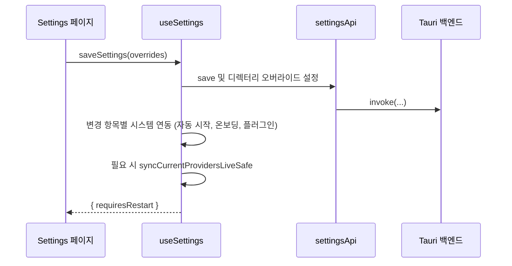

# workspace_tooling_and_preferences 모듈 개요

## 1. 목적

`workspace_tooling_and_preferences`는 CC Switch 데스크톱 앱(Tauri + React)에서 **사용자의 작업 환경**을 관리하는 프런트엔드 모듈이다. 크게 두 가지를 맡는다.

- **워크스페이스 도구 관리**: 여러 AI CLI 앱(Claude, Codex, Gemini, OpenCode, OpenClaw, Hermes, Pi 등)에 공통으로 적용되는 MCP 서버, 프롬프트, Skills를 한 곳에서 조회, 토글, 편집한다.
- **설정과 세션 관리**: 앱 설정의 편집, 저장, 동기화, 가져오기/내보내기를 처리한다. AI CLI 세션의 목록, 검색, 표시도 담당한다. 이를 위해 Tauri `invoke` API 래퍼(`settingsApi`, `sessionsApi`, `deeplinkApi`, `piApi`, `profilesApi` 등)를 둔다.

공용 도메인 타입은 `core_domain_types`, UI 프리미티브는 `app_shell_and_ui_primitives`를 참조한다. `AgentsPanel`은 아직 "Coming Soon" 플레이스홀더다.

## 2. 하위 모듈 구성

| 하위 모듈 | 경로 | 역할 | 문서 |
|---|---|---|---|
| `agents_mcp_prompts_skills_panels` | `src/components` | MCP, Prompt(Pi 포함), Skills 패널과 `skillsApi`, `promptsApi`, `workspaceApi`, OMO 타입 | [agents_mcp_prompts_skills_panels.md](agents_mcp_prompts_skills_panels.md) |
| `sessions_and_settings` | `src/hooks` | 설정 훅(`useSettings` 등), 가져오기/내보내기, 세션 검색과 유틸, 설정 API 래퍼 | [sessions_and_settings.md](sessions_and_settings.md) |

## 3. 전체 아키텍처

```mermaid
graph TD
    subgraph WT["workspace_tooling_and_preferences"]
        subgraph PANELS["agents_mcp_prompts_skills_panels"]
            MCP[UnifiedMcpPanel]
            PP[PromptPanel / PiPromptPanel]
            SK[UnifiedSkillsPanel / SkillsPage]
            AP[AgentsPanel]
            SKS[Skill 저장소/동기화 설정]
            PAPI[skillsApi / promptsApi / workspaceApi]
        end
        subgraph SETTINGS["sessions_and_settings"]
            US[useSettings]
            UIE[useImportExport]
            USS[useSessionSearch + sessions/utils]
            SAPI[settingsApi / sessionsApi / deeplinkApi / piApi / profilesApi]
        end
    end

    CORE[core_domain_types]
    UIP[app_shell_and_ui_primitives]
    BE[(Tauri Rust 백엔드)]

    MCP --> PAPI
    PP --> PAPI
    SK --> PAPI
    SKS --> PAPI
    US --> SAPI
    UIE --> SAPI
    USS --> SAPI
    PAPI --> BE
    SAPI --> BE

    PANELS --> CORE
    SETTINGS --> CORE
    PANELS --> UIP
    MCP -.settingsApi.openExternal.-> SAPI
    SKS -.호스팅 추정.-> US
    BE -.profile-applied / prompt-imported.-> PP
```

### 핵심 설계 패턴

- **패널 계층 (`agents_mcp_prompts_skills_panels`)**
  - 세 패널(MCP, Prompt, Skills)은 `forwardRef` + `useImperativeHandle`로 헤더 버튼 동작을 노출한다.
  - `beginWrite`/`endWrite` 쓰기 잠금을 쓰고, `onInteractionBlockedChange` 등으로 부모에 잠금 상태를 알린다.
  - Prompt 패널은 외부 파일 변경을 감지해 리로드한다. 쓰기 중이면 리로드를 큐잉한다.
  - MCP 검색은 `env`/`headers`를 제외한 allow-list만 사용한다. 자격증명 노출을 막기 위해서다.
- **설정 계층 (`sessions_and_settings`)**
  - `useSettings`가 `useSettingsForm`, `useDirectorySettings`, `useSettingsMetadata`를 조합한다.
  - 저장 경로는 두 가지다. `autoSaveSettings`는 General 탭의 즉시 저장이고, `saveSettings`는 Advanced 탭의 수동 저장이다. 후자는 디렉터리 변경 시 live 동기화를 수행한다.
  - 시스템 연동 실패는 경고만 하고 저장 흐름을 중단하지 않는다.
  - 가져오기(`useImportExport`)는 `success`, `partial_success`, `error`로 상태를 구분한다.
- **세션 계층**
  - 세션 메타데이터를 FlexSearch로 색인해 검색한다. 메시지 본문은 색인하지 않는다.
  - 세션은 provider, 프로젝트 디렉터리 순의 2단계로 그룹화한다.

### 대표 흐름: 설정 저장



## 4. 모듈 간 관계

- 두 하위 모듈은 `settingsApi.openExternal`로 연결된다. 설정 화면이 Skill 설정 컴포넌트를 호스팅할 것으로 추정한다(추론, 호스트 코드 미확인).
- Tauri 이벤트 `profile-applied`와 window 이벤트 `prompt-imported`가 프로필 적용과 딥링크 가져오기를 Prompt 패널의 리로드에 느슨하게 연결한다.
- 주변 모듈은 다음과 같다: `provider_configuration_and_authentication`, `traffic_routing_and_observability`, `foundation_platform_and_build`, `core_domain_types`, `app_shell_and_ui_primitives`.

## 5. 핵심 컴포넌트 문서 참조

- 패널, Skills/Prompts/MCP API, OMO 타입, 앱 ID 추가 시 유의점: [agents_mcp_prompts_skills_panels.md](agents_mcp_prompts_skills_panels.md)
- 설정 저장 로직, 설정 API 래퍼, 가져오기/내보내기, 세션 검색과 표시 유틸, 딥링크, 프로필 API: [sessions_and_settings.md](sessions_and_settings.md)

검증 수준: 위 내용은 하위 모듈 문서(CodeWiki 산출물, 분석 후보)를 종합한 것이다. 소스 코드와 직접 대조하지 않았으므로 호출 주체와 호스팅 관계는 코드로 재검증이 필요하다.