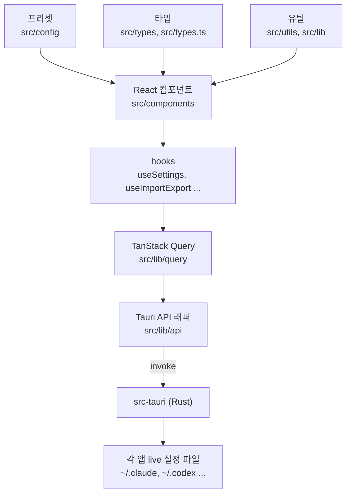
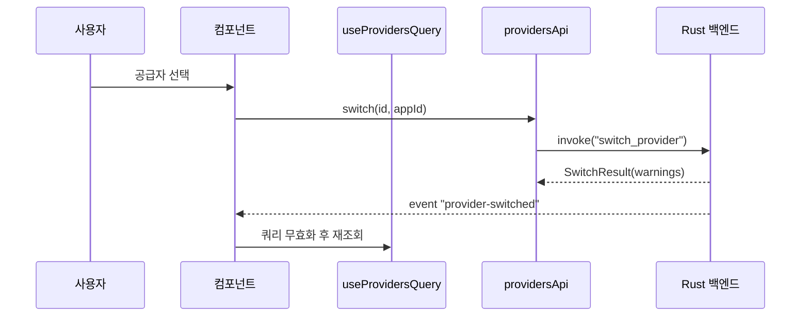

# cc-switch 모듈 문서

> 검증 수준: 제공된 소스 코드 발췌 기준(코드 확인). 모듈 트리의 컴포넌트 목록이 생략되었고 Rust 백엔드(`src-tauri`)는 제공되지 않아 **미확인**이다. 서브 모듈 문서는 생성하지 않았다.

## 1. 개요

CC Switch(`package.json` 기준 v3.20.4)는 Claude Code, Codex, Gemini CLI 등 여러 AI 코딩 CLI의 공급자(provider)·MCP·Skills·프롬프트 설정을 한 곳에서 전환하고 관리하는 **Tauri 2 데스크톱 앱**이다. 프런트엔드는 React 18 + TypeScript(Vite, `vite.config.ts`의 root는 `src`)이고, 백엔드(Rust, `src-tauri/Cargo.toml`)와는 `@tauri-apps/api`의 `invoke`로 통신한다.

## 2. 아키텍처

## 3. 기능 영역

| 영역 | 주요 파일 | 설명 |
|---|---|---|
| 도메인 타입 | `src/types.ts`, `src/types/usage.ts`, `src/types/proxy.ts`, `src/types/subscription.ts`, `src/types/env.ts` | `Provider`, `ProviderMeta`, `Settings`, `McpServer`, `UniversalProvider`, OpenCode/OpenClaw/Hermes 전용 설정, 사용량·프록시·구독 타입. `usage.ts`에는 캐시 정규화(`getFreshInputTokens`, `CACHE_INCLUSIVE_APP_TYPES`) 로직도 있다. |
| Tauri API 래퍼 | `src/lib/api/*.ts` (`providers`, `settings`, `skills`, `prompts`, `profiles`, `failover`, `globalProxy`, `copilot`, `auth`, `deeplink`, `workspace`, `connectivity-check`) | 모든 백엔드 명령을 `invoke`로 감싼다. 이벤트는 `listen("provider-switched")`. |
| 쿼리/상태 | `src/lib/query/queries.ts`, `copilot.ts` | `useProvidersQuery`(프록시 실행 중 10초 폴링), `useUsageQuery`. `resolveDisplayUsage`는 일시적 오류(5xx/429/네트워크) 시 마지막 성공값을 10분간 유지하고, 인증 오류 등 확정 오류는 즉시 노출한다. |
| 공급자 프리셋 | `src/config/claudeProviderPresets.ts`, `codexProviderPresets.ts`, `grokBuildProviderPresets.ts`, `opencodeProviderPresets.ts`, `openclawProviderPresets.ts`, `piModelCatalog.ts` | 공급자별 base URL·모델·엔드포인트 후보·카테고리(`official`/`cn_official`/`aggregator`/`third_party` 등) 템플릿. Codex 프리셋은 `modelCatalog`, `reasoningLevels`, `apiFormat`을 포함한다. |
| 모델 메타데이터 | `src/lib/modelsDev.ts`, `modelMetadata.ts`, `modelsDevPricing.ts`, `modelsDevAutoSync.ts` | models.dev 데이터를 받아 가격 동기화와 폼 자동 채움에 사용. 우선순위: 동일 엔드포인트 프리셋 → models.dev 동일 공급자 → 원 제작사 폴백(가격 제외). |
| 설정 TOML 유틸 | `src/utils/providerConfigUtils.ts` | Codex `config.toml`에서 `base_url`, `model`, `wire_api`, `experimental_bearer_token`을 줄 단위로 읽고 쓴다(`smol-toml` 파싱 실패 시 줄 스캔 폴백). 모델명은 TOML 인젝션 방지를 위해 이스케이프한다. |
| 설정 훅 | `src/hooks/useSettings.ts`, `useSettingsForm.ts`, `useDirectorySettings.ts`, `useImportExport.ts` | 설정 폼 상태, 앱별 설정 디렉터리 오버라이드, SQL 백업 import/export, 변경 후 live 설정 동기화. |
| 공급자 폼 | `src/components/providers/forms/*` | 앱별 폼 상태 훅(`useOpenclawFormState`, `useOpencodeFormState`, `useModelState`), Claude Desktop 폼(직접/프록시 모드, Sonnet/Opus/Fable/Haiku 4슬롯 라우팅), 프리셋 선택, 모델 메타데이터 자동 채움. |
| MCP/Skills/Prompts UI | `src/components/mcp/UnifiedMcpPanel.tsx`, `src/components/prompts/PromptPanel.tsx`, `src/lib/api/skills.ts` | 통합 MCP 서버 목록(앱별 토글, 일괄 토글, 검색 시 `env`/`headers` 제외), 프롬프트 패널(Pi는 별도 패널). |
| 프록시/페일오버 | `src/types/proxy.ts`, `src/lib/api/failover.ts`, `src/components/proxy/AutoFailoverConfigPanel.tsx` | 서킷 브레이커(`closed/open/half_open`), 페일오버 큐, 타임아웃 설정, Stack 모드. |
| 사용량 대시보드 | `src/components/usage/*`, `src/types/usage.ts` | 추세 차트(recharts), 포맷 유틸, 범위 선택(`UsageRangeSelection`). |
| 세션 | `src/hooks/useSessionSearch.ts`, `src/components/sessions/utils.ts` | FlexSearch 기반 세션 전문 검색, 공급자/디렉터리별 그룹화. |
| 앱 인프라 | `src/config/appConfig.tsx`, `src/components/theme-provider.tsx`, `FrontendErrorBoundary.tsx`, `src/lib/updater.ts` | 앱 ID 목록(`claude`, `claude-desktop`, `codex`, `gemini`, `grokbuild`, `opencode`, `openclaw`, `hermes`, `pi`, `mcode`)과 프록시/가산(additive)/MCP 지원 분류, 테마, 에러 경계, 업데이트 확인. |

## 4. 대표 흐름: 공급자 전환

(`providersApi.switch`, `onSwitched` 코드 확인. 백엔드 내부 동작은 미확인.)

## 5. 빌드·CI·배포

- 스크립트(`package.json`): `dev`/`build`는 `tauri`, `typecheck`는 `tsc --noEmit`, `test:unit`은 `vitest run`. 패키지 매니저는 pnpm.
- `.github/workflows/ci.yml`: 변경 영역(`frontend`/`backend`)을 감지해 프런트(타입체크·prettier·vitest·빌드)와 백엔드(rustfmt·clippy·test; ubuntu/windows/macos, Windows+WSL2 계약 테스트)를 실행.
- `wsl2-nightly.yml`: WSL2 홈에 대한 전체 백엔드 테스트를 야간 실행.
- `release.yml`: `v*` 태그에서 Windows(x64/arm64), Linux(x64/arm64), macOS 유니버설 빌드, Tauri 서명, Apple 공증.
- `sync-r2.yml`: 릴리스가 `released`가 되면 자산과 업데이터 매니페스트를 Cloudflare R2에 미러링. 해당 태그가 `releases/latest`일 때만 루트 매니페스트를 갱신·정리(최근 5개 버전 유지)하며, 공식 저장소에서 R2 시크릿이 없으면 실패한다.
- `labeler.yml`(PR 라벨링), `stale.yml`(60일 무활동 이슈 stale, 14일 후 종료).

## 6. 참고

- `tsconfig.json`: `@/*` → `src/*` 경로 별칭, `strict`와 `noUnused*` 활성.
- 이 모듈은 단일 앱(프런트엔드 중심)이라 별도 서브 모듈 문서는 만들지 않았다. 필요하면 위 표의 영역별로 분리할 수 있다.
