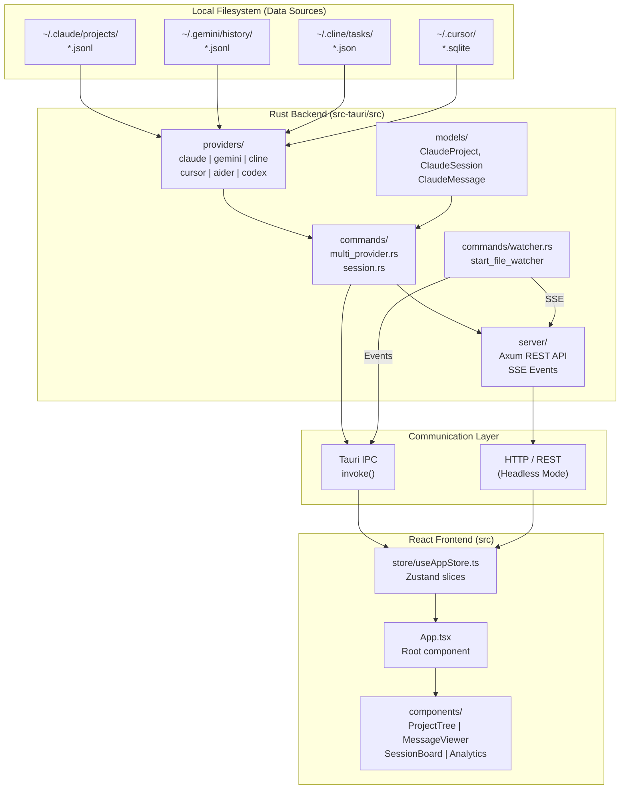
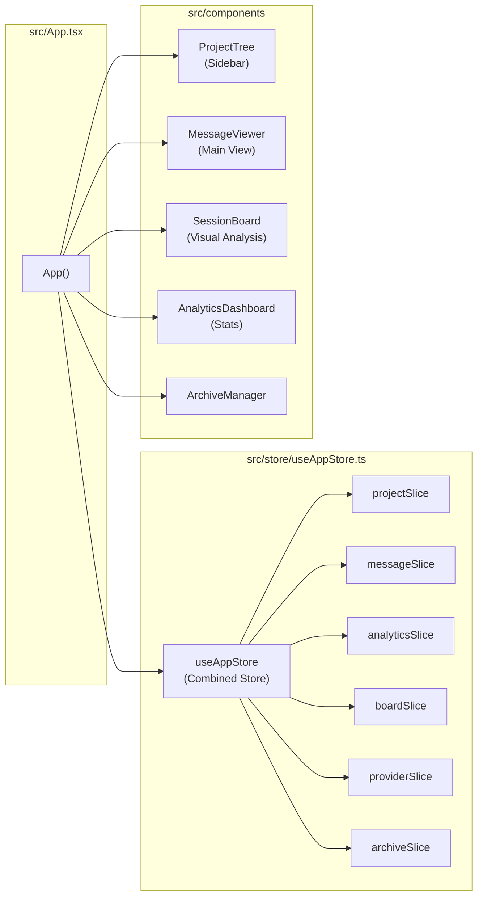

# Overview

<details>
<summary>Relevant source files</summary>

The following files were used as context for generating this wiki page:

- [CHANGELOG.md](CHANGELOG.md)
- [README.ja.md](README.ja.md)
- [README.ko.md](README.ko.md)
- [README.md](README.md)
- [README.zh-CN.md](README.zh-CN.md)
- [README.zh-TW.md](README.zh-TW.md)
- [docs/HOMEBREW.md](docs/HOMEBREW.md)
- [package.json](package.json)
- [src-tauri/Cargo.toml](src-tauri/Cargo.toml)
- [src-tauri/src/commands/mod.rs](src-tauri/src/commands/mod.rs)
- [src-tauri/src/lib.rs](src-tauri/src/lib.rs)
- [src-tauri/src/models.rs](src-tauri/src/models.rs)
- [src-tauri/tauri.conf.json](src-tauri/tauri.conf.json)
- [src/App.tsx](src/App.tsx)
- [src/components/MessageViewer.tsx](src/components/MessageViewer.tsx)
- [src/components/ProjectTree.tsx](src/components/ProjectTree.tsx)
- [src/hooks/index.ts](src/hooks/index.ts)
- [src/store/useAppStore.ts](src/store/useAppStore.ts)
- [src/test/ProjectTree.worktree.test.tsx](src/test/ProjectTree.worktree.test.tsx)
- [src/types/core/project.ts](src/types/core/project.ts)
- [src/types/index.ts](src/types/index.ts)

</details>


This page describes what Claude Code History Viewer is, what problem it solves, and how its technology stack is organized at a high level. For deeper coverage of individual systems, see the linked sub-pages throughout.

---

## Purpose

**Claude Code History Viewer (CCHV)** is a unified history viewer for AI coding assistants, operating as both an offline desktop application and a headless web server. It reads conversation histories stored on the local filesystem and presents them through a browsable, searchable, and analysable UI. No data leaves the user's machine [README.md:5-9]().

The application supports seven AI coding assistant providers:

| Provider | Default Data Path |
|---|---|
| **Claude Code** | `~/.claude/projects/` |
| **Gemini CLI** | `~/.gemini/history/` |
| **Codex CLI** | `~/.codex/sessions/` |
| **Cline** | `~/.cline/tasks/` |
| **Cursor** | `~/.cursor/` |
| **Aider** | Project directories |
| **OpenCode** | `~/.local/share/opencode/` |

Each provider stores its conversation data in specific formats (JSONL, SQLite, or JSON). The application reads these files directly through the Rust backend, which exposes structured data to the React frontend via the Tauri IPC bridge or an Axum-based HTTP REST API in server mode [README.md:68-78](), [src-tauri/Cargo.toml:60-66]().

For installation steps, see page [Installation and Setup](#1.1). For the full list of user-facing features, see page [Key Features](#1.2).

Sources: [README.md:1-10](), [README.md:68-78](), [src-tauri/src/lib.rs:185-189]()

---

## Technology Stack

**High-level stack by layer:**

| Layer | Technology | Role |
|---|---|---|
| Desktop runtime | Tauri v2 | Native app shell, IPC bridge, system plugins [src-tauri/tauri.conf.json:1-5]() |
| Headless Server | Axum | HTTP REST API and SSE events for remote access [src-tauri/Cargo.toml:60-66]() |
| Backend | Rust | Filesystem access, parsing, statistics, file watching [src-tauri/Cargo.toml:1-58]() |
| Frontend framework | React 19 + TypeScript | UI rendering and state management [package.json:58-67]() |
| Styling | Tailwind CSS | Utility-first styling [package.json:91-92]() |
| State management | Zustand | Global application store using slice pattern [src/store/useAppStore.ts:1-9]() |
| Build tool | Vite | Frontend bundling and dev server [package.json:95-96]() |
| Internationalization | i18next | 5-language support (en, ko, ja, zh-CN, zh-TW) [package.json:50-51]() |
| Command runner | `just` | Unified build and dev commands [src-tauri/tauri.conf.json:9-10]() |

The backend code lives under `src-tauri/` and the frontend under `src/`. The Rust crate is organised into modules including `commands`, `models`, `providers`, `server`, and `utils` [src-tauri/src/lib.rs:1-8]().

Sources: [package.json:1-116](), [src-tauri/Cargo.toml:1-165](), [src-tauri/src/lib.rs:1-8](), [src/store/useAppStore.ts:1-117]()

---

## Repository Layout

**Top-level directory structure:**

```
claude-code-history-viewer/
├── src/                    # React/TypeScript frontend
│   ├── App.tsx             # Root component
│   ├── components/         # UI components (ProjectTree, MessageViewer, etc.)
│   ├── store/              # Zustand store and slices
│   ├── hooks/              # Custom React hooks
│   ├── types/              # Shared TypeScript types
│   └── utils/              # Frontend utility functions
├── src-tauri/              # Rust backend (Tauri application & Server)
│   └── src/
│       ├── lib.rs          # Entry point and command registration
│       ├── commands/       # All Tauri command handlers
│       ├── models/         # Rust data model structs
│       ├── providers/      # Provider-specific read logic
│       ├── server/         # Axum server for headless mode
│       └── utils/          # Rust utility functions
├── justfile                # Build/dev command runner recipes
└── scripts/                # i18n and build scripts
```

Sources: [src-tauri/src/lib.rs:1-55](), [src/store/useAppStore.ts:1-117](), [src/App.tsx:1-21](), [package.json:14-17]()

---

## System Architecture Diagram

**Overall system topology mapping source data to rendered UI:**



Sources: [src-tauri/src/lib.rs:111-191](), [src/App.tsx:23-68](), [src/store/useAppStore.ts:101-117](), [src-tauri/src/commands/watcher.rs:48-48](), [src-tauri/Cargo.toml:60-66]()

---

## Frontend Component-to-Store Mapping

This diagram ties the major UI components to the code constructs that back them.

**Root component and state wiring:**



Sources: [src/App.tsx:24-68](), [src/store/useAppStore.ts:101-117](), [src/components/ProjectTree.tsx:3-3](), [src/store/useAppStore.ts:81-95]()

---

## Backend Command Modules

The Rust backend exposes functionality via Tauri commands (desktop) and REST endpoints (server). These are registered in [`src-tauri/src/lib.rs:111-191`]().

| Module (`src-tauri/src/commands/`) | Responsibility |
|---|---|
| `multi_provider.rs` | Provider detection, cross-provider project scanning and search |
| `session.rs` | Load sessions/messages, rename, search, and restore file edits |
| `stats.rs` | Token statistics and cost analysis for sessions and projects |
| `watcher.rs` | Real-time filesystem monitoring for live updates |
| `claude_settings.rs` | Management of Claude Code settings and MCP server configs |
| `metadata.rs` | Persistence of user metadata (grouping, hidden projects, custom names) |
| `archive.rs` | Management of session archives and exports |
| `wsl.rs` | Detection and scanning of projects within WSL distributions |

Sources: [src-tauri/src/lib.rs:12-55](), [src-tauri/src/lib.rs:111-191]()

---

## Data Model Overview

Core domain types are defined in `src/types/` and mirrored in the Rust `models` module.

| Type | Location | Description |
|---|---|---|
| `ClaudeProject` | `src/types/core/session.ts` | Project directory info, session count, and git metadata |
| `ClaudeSession` | `src/types/core/session.ts` | Metadata for a single conversation file |
| `ClaudeMessage` | `src/types/core/message.ts` | A single parsed message (User, Assistant, Tool, etc.) |
| `SessionTokenStats` | `src/types/stats.types.ts` | Token usage, cost, and model details |
| `BoardSessionData` | `src/types/board.types.ts` | Data structure for the multi-session Session Board |
| `UserMetadata` | `src/types/core/project.ts` | User preferences and persistent UI state |

Sources: [src/types/index.ts:15-38](), [src/types/index.ts:98-108](), [src/types/index.ts:194-209](), [src/types/index.ts:236-246]()

---

## Data Privacy

The application is **100% offline**. All data is read directly from the local filesystem. Even in server mode, the data remains on the host machine, and communication is secured via Bearer token authentication if configured [README.md:9-9](), [README.md:78-78]().

---

## Where to Go Next

| Topic | Page |
|---|---|
| Detailed architecture and IPC flow | [Architecture Overview](#2) |
| Frontend component hierarchy | [Frontend Architecture](#2.2) |
| Rust backend organisation | [Backend Architecture](#2.3) |
| End-to-end data flow | [Data Flow](#2.4) |
| Multi-provider system | [Multi-Provider System](#2.5) |
| Installation | [Installation and Setup](#1.1) |
| Feature list | [Key Features](#1.2) |
